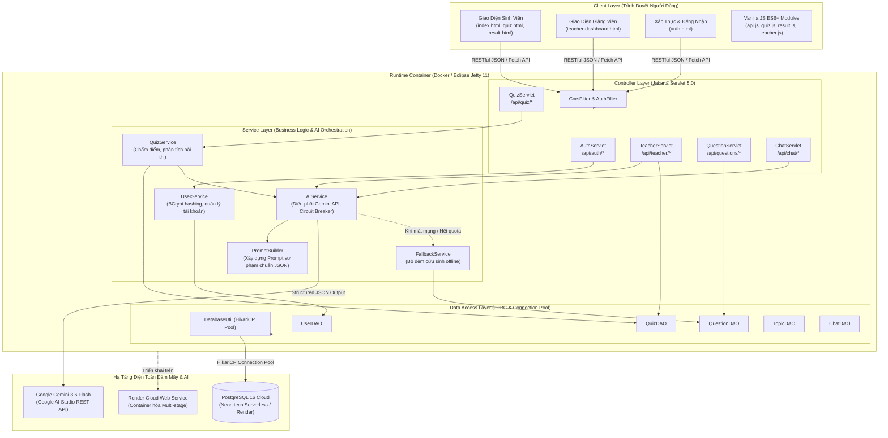
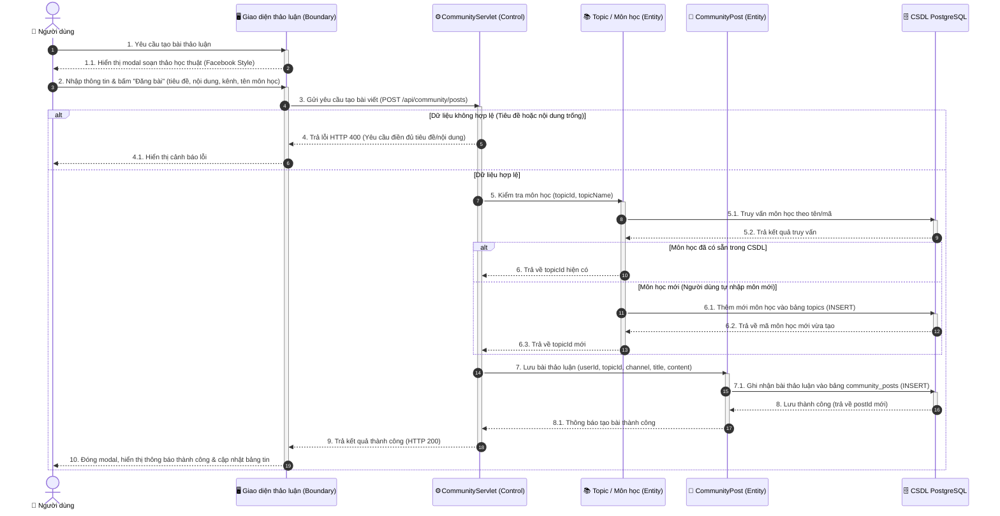
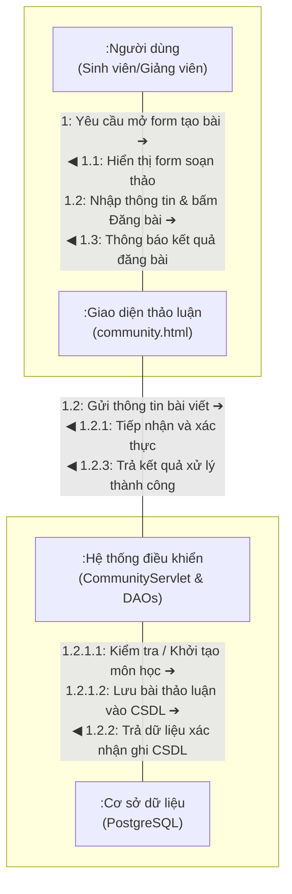

# TOAN BO MA NGUON DU AN - HE THONG HOC TAP THONG MINH (INTELLIGENT LMS)

> **Thoi gian tao file:** 2026-10-03 00:03:36
> **Tong so file:** 58
> **Muc dich:** Gom toan bo source code thanh 1 file duy nhat de gui cho ben thu ba xem xet, danh gia va gop y.

---

## MUC LUC CAC FILE

1. [pom.xml](#pom-xml)
2. [Dockerfile](#dockerfile)
3. [.dockerignore](#-dockerignore)
4. [.env.example](#-env-example)
5. [README.md](#readme-md)
6. [PROJECT_STATE.md](#project-state-md)
7. [src\main\resources\db\schema.sql](#src-main-resources-db-schema-sql)
8. [src\main\java\com\lms\model\ChatMessage.java](#src-main-java-com-lms-model-chatmessage-java)
9. [src\main\java\com\lms\model\CommunityComment.java](#src-main-java-com-lms-model-communitycomment-java)
10. [src\main\java\com\lms\model\CommunityPost.java](#src-main-java-com-lms-model-communitypost-java)
11. [src\main\java\com\lms\model\Question.java](#src-main-java-com-lms-model-question-java)
12. [src\main\java\com\lms\model\QuestionComment.java](#src-main-java-com-lms-model-questioncomment-java)
13. [src\main\java\com\lms\model\QuestionRating.java](#src-main-java-com-lms-model-questionrating-java)
14. [src\main\java\com\lms\model\QuizSession.java](#src-main-java-com-lms-model-quizsession-java)
15. [src\main\java\com\lms\model\RemedialLesson.java](#src-main-java-com-lms-model-remediallesson-java)
16. [src\main\java\com\lms\model\Topic.java](#src-main-java-com-lms-model-topic-java)
17. [src\main\java\com\lms\model\User.java](#src-main-java-com-lms-model-user-java)
18. [src\main\java\com\lms\model\UserAnswer.java](#src-main-java-com-lms-model-useranswer-java)
19. [src\main\java\com\lms\util\ConfigLoader.java](#src-main-java-com-lms-util-configloader-java)
20. [src\main\java\com\lms\util\JsonHelper.java](#src-main-java-com-lms-util-jsonhelper-java)
21. [src\main\java\com\lms\dao\ChatDAO.java](#src-main-java-com-lms-dao-chatdao-java)
22. [src\main\java\com\lms\dao\CommunityDAO.java](#src-main-java-com-lms-dao-communitydao-java)
23. [src\main\java\com\lms\dao\DatabaseUtil.java](#src-main-java-com-lms-dao-databaseutil-java)
24. [src\main\java\com\lms\dao\DiscussionDAO.java](#src-main-java-com-lms-dao-discussiondao-java)
25. [src\main\java\com\lms\dao\QuestionDAO.java](#src-main-java-com-lms-dao-questiondao-java)
26. [src\main\java\com\lms\dao\QuizDAO.java](#src-main-java-com-lms-dao-quizdao-java)
27. [src\main\java\com\lms\dao\TopicDAO.java](#src-main-java-com-lms-dao-topicdao-java)
28. [src\main\java\com\lms\dao\UserDAO.java](#src-main-java-com-lms-dao-userdao-java)
29. [src\main\java\com\lms\service\AIService.java](#src-main-java-com-lms-service-aiservice-java)
30. [src\main\java\com\lms\service\FallbackService.java](#src-main-java-com-lms-service-fallbackservice-java)
31. [src\main\java\com\lms\service\PromptBuilder.java](#src-main-java-com-lms-service-promptbuilder-java)
32. [src\main\java\com\lms\service\QuizService.java](#src-main-java-com-lms-service-quizservice-java)
33. [src\main\java\com\lms\service\UserService.java](#src-main-java-com-lms-service-userservice-java)
34. [src\main\java\com\lms\filter\AuthFilter.java](#src-main-java-com-lms-filter-authfilter-java)
35. [src\main\java\com\lms\filter\CorsFilter.java](#src-main-java-com-lms-filter-corsfilter-java)
36. [src\main\java\com\lms\servlet\AuthServlet.java](#src-main-java-com-lms-servlet-authservlet-java)
37. [src\main\java\com\lms\servlet\ChatServlet.java](#src-main-java-com-lms-servlet-chatservlet-java)
38. [src\main\java\com\lms\servlet\CommunityServlet.java](#src-main-java-com-lms-servlet-communityservlet-java)
39. [src\main\java\com\lms\servlet\DiscussionServlet.java](#src-main-java-com-lms-servlet-discussionservlet-java)
40. [src\main\java\com\lms\servlet\QuestionServlet.java](#src-main-java-com-lms-servlet-questionservlet-java)
41. [src\main\java\com\lms\servlet\QuizServlet.java](#src-main-java-com-lms-servlet-quizservlet-java)
42. [src\main\java\com\lms\servlet\TeacherServlet.java](#src-main-java-com-lms-servlet-teacherservlet-java)
43. [src\main\java\com\lms\servlet\TopicServlet.java](#src-main-java-com-lms-servlet-topicservlet-java)
44. [src\main\webapp\css\app.css](#src-main-webapp-css-app-css)
45. [src\main\webapp\js\api.js](#src-main-webapp-js-api-js)
46. [src\main\webapp\js\chat-widget.js](#src-main-webapp-js-chat-widget-js)
47. [src\main\webapp\js\community.js](#src-main-webapp-js-community-js)
48. [src\main\webapp\js\quiz.js](#src-main-webapp-js-quiz-js)
49. [src\main\webapp\js\result.js](#src-main-webapp-js-result-js)
50. [src\main\webapp\js\teacher.js](#src-main-webapp-js-teacher-js)
51. [src\main\webapp\js\ui.js](#src-main-webapp-js-ui-js)
52. [src\main\webapp\auth.html](#src-main-webapp-auth-html)
53. [src\main\webapp\community.html](#src-main-webapp-community-html)
54. [src\main\webapp\history.html](#src-main-webapp-history-html)
55. [src\main\webapp\index.html](#src-main-webapp-index-html)
56. [src\main\webapp\quiz.html](#src-main-webapp-quiz-html)
57. [src\main\webapp\result.html](#src-main-webapp-result-html)
58. [src\main\webapp\teacher-dashboard.html](#src-main-webapp-teacher-dashboard-html)

---

## pom.xml
<a id='pom-xml'></a>

``xml
<?xml version="1.0" encoding="UTF-8"?>
<project xmlns="http://maven.apache.org/POM/4.0.0"
         xmlns:xsi="http://www.w3.org/2001/XMLSchema-instance"
         xsi:schemaLocation="http://maven.apache.org/POM/4.0.0
                             http://maven.apache.org/xsd/maven-4.0.0.xsd">
    <modelVersion>4.0.0</modelVersion>

    <!-- ═══════════════════════════════════════════════════════════════════
         PROJECT METADATA
         ═══════════════════════════════════════════════════════════════════ -->
    <groupId>com.lms</groupId>
    <artifactId>intelligent-learning-system</artifactId>
    <version>1.0-SNAPSHOT</version>
    <packaging>war</packaging>

    <name>Hệ Thống Học Tập Thông Minh</name>
    <description>
        Intelligent Learning Management System with AI-powered error analysis,
        remedial lesson generation, and adaptive chatbot mentor.
    </description>

    <!-- ═══════════════════════════════════════════════════════════════════
         PROPERTIES
         Java 25 runtime, nhưng compile target 21 để tối đa tương thích.
         Jetty 11 (jakarta.servlet 5.0) thay cho Tomcat7 plugin (crash Java 25).
         ═══════════════════════════════════════════════════════════════════ -->
    <properties>
        <maven.compiler.source>17</maven.compiler.source>
        <maven.compiler.target>17</maven.compiler.target>
        <project.build.sourceEncoding>UTF-8</project.build.sourceEncoding>
        <project.reporting.outputEncoding>UTF-8</project.reporting.outputEncoding>
        <jetty.version>11.0.24</jetty.version>
    </properties>

    <!-- ═══════════════════════════════════════════════════════════════════
         DEPENDENCIES
         ═══════════════════════════════════════════════════════════════════ -->
    <dependencies>

        <!-- ─── Jakarta Servlet API 5.0 (Jetty 11 compatible) ─── -->
        <dependency>
            <groupId>jakarta.servlet</groupId>
            <artifactId>jakarta.servlet-api</artifactId>
            <version>5.0.0</version>
            <scope>provided</scope>
        </dependency>

        <!-- ─── PostgreSQL JDBC Driver (Neon.tech Cloud) ─── -->
        <dependency>
            <groupId>org.postgresql</groupId>
            <artifactId>postgresql</artifactId>
            <version>42.7.2</version>
        </dependency>

        <!-- ─── SQL Server JDBC Driver (Tương thích ngược) ─── -->
        <dependency>
            <groupId>com.microsoft.sqlserver</groupId>
            <artifactId>mssql-jdbc</artifactId>
            <version>12.8.1.jre11</version>
        </dependency>

        <!-- ─── HikariCP Connection Pool (hiệu năng cao) ─── -->
        <dependency>
            <groupId>com.zaxxer</groupId>
            <artifactId>HikariCP</artifactId>
            <version>6.2.1</version>
        </dependency>

        <!-- ─── Google Gemini AI SDK (chính thức) ─── -->
        <dependency>
            <groupId>com.google.genai</groupId>
            <artifactId>google-genai</artifactId>
            <version>1.64.0</version>
        </dependency>

        <!-- ─── Gson JSON Processing ─── -->
        <dependency>
            <groupId>com.google.code.gson</groupId>
            <artifactId>gson</artifactId>
            <version>2.12.1</version>
        </dependency>

        <!-- ─── SLF4J Simple Logger ─── -->
        <dependency>
            <groupId>org.slf4j</groupId>
            <artifactId>slf4j-simple</artifactId>
            <version>2.0.16</version>
        </dependency>

        <!-- ─── BCrypt Password Hashing ─── -->
        <dependency>
            <groupId>at.favre.lib</groupId>
            <artifactId>bcrypt</artifactId>
            <version>0.10.2</version>
        </dependency>

        <!-- ─── Dotenv for Java (đọc file .env) ─── -->
        <dependency>
            <groupId>io.github.cdimascio</groupId>
            <artifactId>dotenv-java</artifactId>
            <version>3.1.0</version>
        </dependency>

    </dependencies>

    <!-- ═══════════════════════════════════════════════════════════════════
         BUILD CONFIGURATION
         ═══════════════════════════════════════════════════════════════════ -->
    <build>
        <finalName>lms</finalName>

        <plugins>

            <!-- ─── Maven Compiler Plugin ─── -->
            <plugin>
                <groupId>org.apache.maven.plugins</groupId>
                <artifactId>maven-compiler-plugin</artifactId>
                <version>3.13.0</version>
                <configuration>
                    <release>17</release>
                    <encoding>UTF-8</encoding>
                </configuration>
            </plugin>

            <!-- ─── Maven WAR Plugin ─── -->
            <plugin>
                <groupId>org.apache.maven.plugins</groupId>
                <artifactId>maven-war-plugin</artifactId>
                <version>3.4.0</version>
                <configuration>
                    <failOnMissingWebXml>false</failOnMissingWebXml>
                </configuration>
            </plugin>

            <!-- ─── Jetty Maven Plugin (Dev Server) ───
                 Chạy: mvn jetty:run
                 Truy cập: http://localhost:8080
                 Auto-reload mỗi 5 giây khi file thay đổi.
                 ──────────────────────────────────────── -->
            <plugin>
                <groupId>org.eclipse.jetty</groupId>
                <artifactId>jetty-maven-plugin</artifactId>
                <version>${jetty.version}</version>
                <configuration>
                    <httpConnector>
                        <port>8080</port>
                    </httpConnector>
                    <webApp>
                        <contextPath>/</contextPath>
                    </webApp>
                    <scan>5</scan>
                </configuration>
            </plugin>

        </plugins>
    </build>

</project>

``

---

## Dockerfile
<a id='dockerfile'></a>

``text
# ═══════════════════════════════════════════════════════════════════════════════
# DOCKERFILE — Hệ Thống Học Tập Thông Minh (Intelligent LMS)
# Multi-stage build: Maven 3.9.6 + Temurin 17 -> Jetty 11 runtime
# ═══════════════════════════════════════════════════════════════════════════════

# Stage 1: Build file WAR bằng Maven
FROM maven:3.9.6-eclipse-temurin-17-alpine AS build
WORKDIR /app
COPY pom.xml .
COPY src ./src
RUN mvn clean package -DskipTests

# Stage 2: Chạy ứng dụng trên Jetty Web Server
FROM jetty:11-jre17-alpine
COPY --from=build /app/target/*.war /var/lib/jetty/webapps/ROOT.war
EXPOSE 8080
CMD ["java", "-jar", "/usr/local/jetty/start.jar"]

``

---

## .dockerignore
<a id='-dockerignore'></a>

``text
target/
.git/
.env
*.log
.idea/
.vscode/

``

---

## .env.example
<a id='-env-example'></a>

``text
# ═══════════════════════════════════════════════════════════
# Hệ Thống Học Tập Thông Minh — Environment Variables
# HƯỚNG DẪN: Copy file này thành file ".env" cùng thư mục và điền thông tin:
# Trên PowerShell: Copy-Item .env.example .env
# Trên Command Prompt: copy .env.example .env
# ═══════════════════════════════════════════════════════════

# ── CSDL PostgreSQL (Khuyên dùng Neon.tech Cloud / Render / Railway) ──
DB_URL=jdbc:postgresql://ep-mute-queen-b3xtkksd-pooler.c-4.ap-southeast-1.aws.neon.tech/lms_db?sslmode=require
DB_USERNAME=lms_db_owner
DB_PASSWORD=your_neon_password_here
DB_POOL_SIZE=10

# ── Tùy chọn 2: CSDL Microsoft SQL Server Local (nếu chạy local SSMS) ──
# DB_URL=jdbc:sqlserver://localhost:1433;databaseName=lms_db;trustServerCertificate=true;encrypt=true;
# DB_USERNAME=sa
# DB_PASSWORD=your_sql_password_here

# ── Google Gemini API (Tùy chọn) ──
# Lấy API Key miễn phí tại: https://aistudio.google.com
# (Nếu để trống, hệ thống sẽ tự động chuyển sang cơ chế ngoại tuyến Fallback Buffer ADR-008)
GEMINI_API_KEY=your_gemini_api_key_here
GEMINI_MODEL=gemini-3.6-flash

# ── Cổng chạy máy chủ Web (Jetty Web Server) ──
PORT=8080

``

---

## README.md
<a id='readme-md'></a>

``markdown
# 🎓 Hệ Thống Học Tập Thông Minh Tích Hợp AI (Intelligent LMS)

> **Đồ Án Cuối Kỳ — Môn Công Nghệ Phần Mềm (CNPM - CK)**  
> Nền tảng LMS hiện đại kết hợp Trí tuệ Nhân tạo thế hệ mới (**Google Gemini 3.6 Flash**), ứng dụng các lý thuyết sư phạm thực nghiệm: **Confidence Tagging** (Gắn nhãn độ tự tin), **Pedagogical Misconception Detection** (Chẩn đoán 4 nhóm lỗ hổng tư duy), **Adaptive Remediation Engine** (Động cơ củng cố kiến thức thích ứng) và **Teacher AI Co-Pilot Studio** (Studio trợ lý soạn đề & bài tập thông minh cho giảng viên).

---

## 🏛️ 1. Kiến Trúc Hệ Thống & Sự Liên Kết Công Nghệ (Architecture & Interconnections)

Hệ thống được thiết kế theo kiến trúc phân tầng chuẩn doanh nghiệp (**Layered Architecture / MVC - Service - DAO**), tối ưu hóa hiệu năng, tính mở rộng và khả năng phục hồi (Resilience):



---

## 🛠️ 2. Bảng Tổng Hợp Công Nghệ & Vai Trò (Tech Stack Specification)

| Thành Phần (Layer) | Công Nghệ Sử Dụng | Phiên Bản | Vai Trò & Lý Do Lựa Chọn |
|---|---|---|---|
| **Core Platform** | **Java (JDK)** | 17 LTS / 21 LTS | Nền tảng hướng đối tượng mạnh mẽ, an toàn kiểu dữ liệu, bảo mật bộ nhớ và hiệu năng xử lý cao. |
| **Web Server / Servlet Engine** | **Eclipse Jetty** | 11.0.24 | Nhẹ hơn Tomcat rất nhiều, thời gian khởi động < 2 giây, tương thích hoàn hảo với Java 17/21 và Jakarta EE 9. |
| **Servlet Specification** | **Jakarta Servlet & Filter** | 5.0.0 (`jakarta.*`) | Định tuyến RESTful API, kiểm soát phiên đăng nhập (`HttpSession`), lọc CORS và phân quyền vai trò (`AuthFilter`). |
| **Cơ Sở Dữ Liệu (Database)** | **PostgreSQL** | 16 (Neon.tech / Render) | CSDL quan hệ chuẩn ACID, lưu trữ JSON linh hoạt, điện toán Serverless trên Cloud, tự động co giãn kết nối. |
| **Connection Pooling** | **HikariCP** | 5.1.0 | Thư viện quản lý kết nối CSDL nhanh nhất thế giới Java, hạn chế quá tải tài nguyên và chống nghẽn kết nối. |
| **Trí Tuệ Nhân Tạo (Generative AI)** | **Google Gemini** | `gemini-3.6-flash` | Tốc độ suy luận tính bằng mili-giây, thông minh vượt trội, hỗ trợ sinh JSON có cấu trúc (`ResponseSchema`). |
| **Bảo Mật Mật Khẩu** | **jBCrypt** | 0.4.3 | Mã hóa mật khẩu một chiều với thuật toán Blowfish (Cost 12), chống tấn công vét cạn (Brute-force) và Rainbow table. |
| **Xử Lý JSON** | **Google Gson** | 2.10.1 | Chuyển đổi hai chiều POJO $\leftrightarrow$ JSON, cấu hình TypeAdapter cho `LocalDateTime` và định dạng UTF-8 chuẩn. |
| **Đóng Gói & Triển Khai (DevOps)** | **Docker (Multi-stage)** | Alpine Linux | Đóng gói tự động từ source code (`maven:3.9.6-alpine`) sang runtime image (`jetty:11-jre17-alpine`) siêu nhẹ (~180MB). |
| **Frontend UI / Styling** | **Vanilla JS, HTML5, CSS3, Bootstrap** | 5.3.3 | Không dùng framework nặng (React/Angular) để đảm bảo tốc độ tải trang cực nhanh (< 500ms), dễ bảo trì và mở rộng. |
| **Icons & Trực Quan Hóa** | **FontAwesome 6, SweetAlert2, Highlight.js, Marked.js, Canvas-Confetti** | Latest CDN | Hiển thị mã nguồn tô màu cú pháp chuẩn (One Dark), popup thông báo hiện đại và hiệu ứng pháo hoa củng cố thành tích. |

---

## ⚙️ 3. Nguyên Lý Hoạt Động Cốt Lõi (Core Operating Principles)

### 1. Nguyên Lý Gắn Nhãn Tự Tin (Confidence Tagging - ADR-009)
* **Vấn đề sư phạm:** Sinh viên làm trắc nghiệm thường có yếu tố may rủi (đoán mò). Nếu đoán bừa trúng đáp án đúng, các LMS truyền thống sẽ bỏ qua, khiến lỗ hổng kiến thức bị che giấu.
* **Giải pháp của hệ thống:**
  - Ở mỗi câu hỏi, sinh viên chủ động chọn: 🟢 **Chắc chắn (Certain)** hoặc 🟡 **Đoán mò (Guess)**.
  - Khi sinh viên chọn ĐÚNG nhưng với tâm thế **ĐOÁN MÒ**, thuật toán sẽ kích hoạt Gemini AI để tạo lời khuyên củng cố chuyên sâu, giải thích **tại sao đáp án đó đúng** và nguyên lý cốt lõi, giúp sinh viên thực sự làm chủ kiến thức thay vì dựa vào vận may.

### 2. Nguyên Lý Chẩn Đoán 4 Nhóm Lỗ Hổng Tư Duy (Pedagogical Misconceptions)
Hệ thống không chỉ chấm "Đúng/Sai" mà phân tích sâu bản chất nguyên nhân lỗi sai vào 4 nhóm nhận thức:
1. **`syntax_swap` (Nhầm lẫn cú pháp):** Nhầm lẫn toán tử (`==` vs `.equals()`), đặc tả ngôn ngữ, khai báo biến, thứ tự tham số.
2. **`boundary_blindness` (Mù điều kiện biên):** Bỏ quên trường hợp mảng rỗng, chỉ mục vượt quá giới hạn mảng (`IndexOutOfBounds`), kiểm tra giá trị `null` hoặc điều kiện dừng đệ quy.
3. **`mental_model_gap` (Lỗ hổng mô hình tư duy):** Hiểu sai cơ chế hướng đối tượng (OOP), đa hình, tham chiếu bộ nhớ Heap vs Stack, luồng vòng đời đối tượng.
4. **`logic_flaw` (Lỗi logic điều kiện):** Sai sót trong biểu thức Boolean phức tạp, phân nhánh `if-else` lồng nhau, điều kiện lặp vô tận.

### 3. Động Cơ Phục Hồi Kiến Thức Thích Ứng (Adaptive Remediation Engine)
* Sau khi nộp bài, mỗi câu làm sai hoặc đoán mò đều sinh ra một **Thẻ Bài Học Củng Cố Cá Nhân Hóa (AI Remedial Lesson)**.
* Sinh viên có thể nhấn nút **"Làm Bài Tập Phục Hồi"**: Hệ thống khởi tạo ngay một **Mini-Quiz 3 câu hỏi thích ứng** xoay quanh chính lỗ hổng vừa mắc phải.
* Khi hoàn thành tốt, hệ thống bắn hiệu ứng pháo hoa **Confetti** rực rỡ và cấp huy hiệu **"ĐÃ PHỤC HỒI KIẾN THỨC"**, đánh dấu sinh viên đã xóa bỏ thành công lỗ hổng tư duy đó.

### 4. Cơ Chế Bộ Đệm Dự Phòng Ngoại Tuyến (Dual Fallback & Smart FAQ Buffer - ADR-008)
* Hệ thống ứng dụng mô hình thiết kế **Circuit Breaker**:
  - `Ưu tiên 1`: Gọi **Gemini 3.6 Flash** với Structured JSON Schema.
  - `Ưu tiên 2 (Tự động chuyển tiếp)`: Nếu model 3.6 quá tải, hệ thống tự chuyển tiếp sang **Gemini 3.8 Flash**.
  - `Ưu tiên 3 (Cứu sinh ngoại tuyến)`: Nếu không có Internet hoặc hết hạn mức API, `FallbackService` tự động trích xuất các phân tích có sẵn trong CSDL và trả về ngay lập tức. **Người dùng không bao giờ gặp màn hình trắng hoặc lỗi 500!**

### 5. Studio Soạn Đề Tự Động & Trợ Lý Co-Pilot Dành Cho Giảng Viên (Teacher AI Co-Pilot)
* Giảng viên có toàn quyền:
  - Chọn chủ đề, mức độ khó (Dễ / Trung bình / Khó) và nhóm lỗ hổng tư duy mục tiêu.
  - Gemini AI tự động sinh bộ câu hỏi trắc nghiệm chuẩn sư phạm theo **Thang đo nhận thức Bloom (Bloom's Taxonomy)**.
  - Xem trước định dạng code chuẩn xác, tùy biến nội dung và **Import 1-Click** vào ngân hàng đề CSDL PostgreSQL.
  - Khung chat **AI Co-Pilot Sư Phạm** hỗ trợ giảng viên thiết kế kế hoạch bài giảng và ra đề thi phân hóa.

---

## 🔄 4. Sự Liên Kết & Luồng Dữ Liệu Thực Tế (Data Flow Walkthrough)

### 📌 Luồng 1: Sinh Viên Thi & Nhận Bài Học Thích Ứng
1. **Làm bài (`quiz.html`):** Sinh viên chọn đáp án + gắn thẻ độ tự tin (`CERTAIN` / `GUESS`). Tiến độ được `quiz.js` tự động lưu trữ phòng sự cố mất điện/reload (`Autosave LocalStorage`).
2. **Nộp bài (`POST /api/quiz/submit`):**
   - `QuizServlet` tiếp nhận danh sách đáp án, xác thực session người dùng.
   - `QuizService` lưu các câu trả lời vào bảng `user_answers` và cập nhật điểm số vào `quiz_sessions`.
   - `QuizService` lọc các câu sai hoặc đoán mò $\rightarrow$ chuyển qua `PromptBuilder` để đóng gói ngữ cảnh sư phạm $\rightarrow$ gửi đến `AIService`.
   - `AIService` gọi Gemini API bằng phương thức `generateContent` với schema JSON ép kiểu nghiêm ngặt.
   - Kết quả trả về được lưu trữ vào bảng `remedial_lessons`.
3. **Phân tích kết quả (`result.html`):** Hiển thị trực quan bảng điểm, danh sách bài học củng cố, phân tích nhận thức và nút kích hoạt Mini-Quiz phục hồi kiến thức.

### 📌 Luồng 2: Giảng Viên Soạn Đề Bằng AI Studio
1. Giảng viên mở `teacher-dashboard.html`, chọn Tab **"Trợ Lý AI Soạn Đề & Bài Tập"**.
2. Thiết lập cấu hình yêu cầu $\rightarrow$ gửi `POST /api/teacher/ai/generate`.
3. `TeacherServlet` kiểm tra phân quyền `TEACHER`/`ADMIN` $\rightarrow$ chuyển sang `AIService.generateQuestionsForTeacher(...)`.
4. Gemini AI sinh danh sách câu hỏi cấu trúc JSON gồm: nội dung Markdown, các phương án A/B/C/D, đáp án đúng, giải thích sư phạm, thẻ lỗ hổng tư duy mục tiêu.
5. Giao diện hiển thị danh sách câu hỏi trực quan $\rightarrow$ Giảng viên nhấn **"Lưu Vào Ngân Hàng Đề"** $\rightarrow$ gọi `QuestionDAO.createQuestion()` ghi thẳng vào CSDL PostgreSQL.

### 📌 Luồng 3: Cộng Đồng Học Tập & Thảo Luận Môn Học
1. Người học mở `community.html`, nhấn nút **"Đăng bài"** $\rightarrow$ mở modal soạn thảo học thuật (Facebook Style Composer).
2. Người học có thể chèn khối Code lập trình, Mẹo né bẫy nhận thức, Thử thách câu hỏi mini, hoặc Trích dẫn giáo trình, kèm chọn trạng thái học tập.
3. Người học chọn hoặc gõ tên môn học bất kỳ (Java OOP, CSDL, Toán rời rạc, AI...) $\rightarrow$ gửi `POST /api/community/posts`.
4. `CommunityServlet` tiếp nhận: Nếu môn học chưa có, tự động tạo mới vào bảng `topics`; lưu bài viết vào `community_posts` và phát hành lên bảng tin cộng đồng.

---

## 📐 5. Thiết Kế Hệ Thống Chi Tiết: Biểu Đồ Tuần Tự & Biểu Đồ Cộng Tác (Sequence & Collaboration Diagrams)

> Chi tiết phân tích đầy đủ và mã nguồn PlantUML tham khảo tại: [`SYSTEM_DIAGRAMS.md`](SYSTEM_DIAGRAMS.md).

### 5.1. Biểu Đồ Tuần Tự — Tạo Bài Thảo Luận Học Tập (Sequence Diagram)
*(Thiết kế theo mô hình phân tích chuẩn BCE: Actor $\rightarrow$ Boundary $\rightarrow$ Control $\rightarrow$ Entity $\rightarrow$ Database)*



### 5.2. Biểu Đồ Cộng Tác — Tạo Bài Thảo Luận Học Tập (Collaboration Diagram)
*(Bố cục 4 đỉnh đối tượng với các thông điệp có hướng và số thứ tự phân cấp y hệt Form Hình 2)*



---

## 🚀 6. Hướng Dẫn Cài Đặt & Khởi Chạy

### Cách 1: Khởi Chạy Siêu Tốc Bằng Docker (Khuyên Dùng)

```bash
# 1. Đóng gói Docker container
docker build -t lms-ai:latest .

# 2. Khởi chạy container gắn kèm biến môi trường
docker run -d -p 8080:8080 --env-file .env --name lms-app lms-ai:latest

# 3. Mở trình duyệt truy cập:
# http://localhost:8080/auth.html
```

---

### Cách 2: Chạy Trực Tiếp Bằng Maven Wrapper (Local)

#### Bước 1: Chuẩn Bị Môi Trường
- **JDK:** Phiên bản **Java 17 LTS hoặc Java 21 LTS** (Khuyên dùng Java 17).
- Không cần cài sẵn Maven (dự án đã có sẵn `mvnw.cmd`).

#### Bước 2: Cấu Hình Biến Môi Trường (`.env`)
Tạo file `.env` từ `.env.example` với các thông số kết nối CSDL Neon.tech PostgreSQL:
```ini
# CSDL PostgreSQL Cloud (Neon.tech / Render)
DB_URL=jdbc:postgresql://ep-mute-queen-b3xtkksd-pooler.c-4.ap-southeast-1.aws.neon.tech/lms_db?sslmode=require
DB_USERNAME=lms_db_owner
DB_PASSWORD=npg_r4vyIfJa9tSX
DB_POOL_SIZE=10

# Khóa Google Gemini API (Model thế hệ mới)
GEMINI_API_KEY=your_gemini_api_key_here
GEMINI_MODEL=gemini-3.6-flash

# Cổng lắng nghe
PORT=8080
```

> 💡 **TÍNH NĂNG AUTO-MIGRATION & AUTO-SEED:**  
> Lớp `DatabaseUtil` tích hợp cơ chế tự động dò tìm cấu trúc bảng. Nếu CSDL trống, hệ thống sẽ **tự động chạy `schema.sql`** và nạp 10 câu hỏi mẫu chất lượng cao mà bạn không cần phải cấu hình thủ công!

#### Bước 3: Khởi Động Máy Chủ
```powershell
# Trên Windows:
.\mvnw.cmd jetty:run

# Trên Linux / macOS:
./mvnw jetty:run
```

Truy cập: **`http://localhost:8080/auth.html`**

### Cách 3: Triển Khai Cloud & Cơ Chế Hoạt Động 24/7 (Zero Cold-Start)

Hệ thống đã được đóng gói và kiểm thử triển khai trên nền tảng đám mây:
1. **Cloud Web Service (Render):** Chạy trực tiếp từ `Dockerfile` liên kết tự động với repository GitHub.
2. **Serverless Database (Neon.tech PostgreSQL):** Lưu trữ CSDL quan hệ trên đám mây với tính năng Auto-Migration.
3. **Cơ Chế Giữ Thức 24/7 (UptimeRobot Keep-Alive):**
   - Render bản Free sẽ tự động ngủ sau 15 phút idle (gây trễ cold-start 30-50s).
   - Thiết lập monitor trên [UptimeRobot.com](https://uptimerobot.com) ping định kỳ **10 phút/lần** vào endpoint `https://cnpm-ck-intelligent-learning-system.onrender.com/auth.html`.
   - Kết quả: Web luôn thức 24/7, phản hồi dưới 1 giây mà vẫn nằm trọn trong hạn mức miễn phí 744/750 giờ/tháng của Render!

---

## 🔑 7. Danh Sách Tài Khoản Thử Nghiệm

| Vai Trò | Tên Đăng Nhập | Mật Khẩu | Điểm Đến | Đặc Quyền & Tính Năng Nổi Bật |
|:---:|:---:|:---:|:---:|---|
| 👩‍🏫 **Giảng Viên** | `giangvien01` | `demo123` | **Teacher Dashboard**<br>(`teacher-dashboard.html`) | • 4 Thẻ KPI thời gian thực.<br>• Quản lý ngân hàng câu hỏi (Thêm/Sửa/Xóa, Tìm kiếm realtime, Phân trang).<br>• AI Pedagogical Insight (Thống kê 4 nhóm lỗi sai).<br>• Studio Trợ Lý AI Soạn Đề & Khung Chat Co-Pilot. |
| 👨‍🎓 **Sinh Viên** | `sinhvien01` | `demo123` | **Trang Chủ Sinh Viên**<br>(`index.html`) | • Làm bài thi trắc nghiệm + Confidence Tagging.<br>• Tự động lưu bài dở dang (Autosave).<br>• Phân tích kết quả + Bài tập thích ứng (Mini-Quiz).<br>• Trò chuyện với Trợ Giảng AI 3 nhân cách.<br>• Diễn đàn học tập Facebook-style & né bẫy tư duy (`community.html`). |
| 🛡️ **Quản Trị Viên** | `admin` | `demo123` | **Teacher Dashboard** | Toàn quyền kiểm soát hệ thống và dữ liệu. |

---

## 📂 8. Cấu Trúc Mã Nguồn Dự Án (Project Structure)

```
Hệ thống học tập thông minh/
├── Dockerfile                         # Multi-stage Docker packaging (Maven Build -> Jetty 11 Runtime)
├── .dockerignore                      # Loại trừ các file rác khi build image
├── pom.xml                            # Quản lý dependency (Jetty 11, PostgreSQL, Gson, BCrypt...)
├── export_codebase.ps1                # Script tự động xuất toàn bộ mã nguồn ra FULL_CODEBASE.md
├── FULL_CODEBASE.md                   # File tổng hợp toàn bộ 58 file mã nguồn của dự án
├── PROJECT_STATE.md                   # Sổ tay ghi chép tiến độ kỹ thuật giữa các phiên
├── SYSTEM_DIAGRAMS.md                 # Tài liệu Biểu đồ tuần tự (Sequence) & Cộng tác (Collaboration)
├── REFACTOR_REPORT.md                 # Báo cáo kiểm toán bảo mật & khả năng phục hồi (Audit)
├── README.md                          # Tài liệu kiến trúc và hướng dẫn vận hành toàn diện
├── src/
│   └── main/
│       ├── java/com/lms/
│       │   ├── model/                 # POJO Models (User, Topic, Question, QuizSession, CommunityPost...)
│       │   ├── dao/                   # Data Access Objects (DatabaseUtil, UserDAO, QuizDAO, CommunityDAO...)
│       │   ├── service/               # Nghiệp vụ lõi (AIService, QuizService, UserService, PromptBuilder...)
│       │   ├── servlet/               # REST Controllers (AuthServlet, QuizServlet, CommunityServlet...)
│       │   ├── filter/                # Bộ lọc an ninh & phân quyền (CorsFilter, AuthFilter)
│       │   └── util/                  # Tiện ích bổ trợ (ConfigLoader, JsonHelper)
│       ├── resources/
│       │   └── db/schema.sql          # Kịch bản CSDL PostgreSQL (DDL, Indexes & Initial Data)
│       └── webapp/
│           ├── css/app.css            # Hệ thống CSS Design Tokens, Glassmorphism & Animations
│           ├── js/                    # Mã JavaScript hướng module
│           │   ├── api.js             # Transport layer: timeout, abort, retry, offline detection
│           │   ├── ui.js              # Presentation utility: safe markdown, sanitize HTML chống XSS
│           │   ├── community.js       # Diễn đàn học tập Facebook Style: Code, Bẫy tư duy, Quiz mini
│           │   ├── quiz.js            # Logic làm bài thi & Autosave
│           │   ├── result.js          # Logic kết quả & Adaptive Mini-Quiz
│           │   ├── teacher.js         # Logic Teacher Dashboard & Studio AI
│           │   └── chat-widget.js     # Trợ giảng AI đa nhân cách
│           ├── auth.html              # Màn hình Đăng nhập & Đăng ký (Toggle Password Eyes)
│           ├── community.html         # Diễn đàn thảo luận & cộng đồng học tập đa kênh
│           ├── index.html             # Cổng thông tin môn học & chọn chủ đề ôn luyện
│           ├── quiz.html              # Màn hình thi trắc nghiệm & Gắn nhãn tự tin
│           ├── result.html            # Báo cáo kết quả & Bài tập phục hồi thích ứng
│           ├── teacher-dashboard.html # Bảng điều khiển giảng viên & AI Soạn đề Studio
│           └── history.html           # Lịch sử làm bài & theo dõi tiến bộ học tập
```

---

## 👥 9. Thông Tin Đồ Án
- **Môn học:** Công Nghệ Phần Mềm (CNPM) — Học kỳ Cuối
- **Phiên bản:** 1.0-SNAPSHOT (Production Cloud Deployed on Render)
- **Bản quyền:** Đồ Án Nhóm Phát Triển LMS Thông Minh 2026.

---

## 🛡️ 10. Gói Cải Tiến Bảo Mật & Ổn Định (Refactor 2026-09-22)
- **API Transport Resilience:** `js/api.js` bổ sung timeout (10s), AbortController, bắt lỗi offline, `ApiError` có phân loại và retry có kiểm soát đối với phương thức `GET`.
- **Phòng chống IDOR (Object-Level Authorization):** `QuizServlet` và `QuizDAO` siết chặt quyền sở hữu, ngăn chặn sinh viên xem kết quả session của tài khoản khác.
- **Tính toàn vẹn bài thi (Submission Integrity):** Ngăn chặn gửi trùng câu hỏi, câu hỏi lệch topic, nộp lại session đã hoàn tất và thiếu câu trả lời.
- **Bảo mật Frontend & XSS Sanitization:** `js/ui.js` chuẩn hóa lọc và vô hiệu hóa các thẻ script, sự kiện độc hại trong cú pháp Markdown do người dùng hoặc AI sinh ra trước khi render vào DOM.
- **CORS Allowlist:** Loại bỏ wildcard reflection khi có credentials, cho phép chỉ định rõ danh sách domain được phép qua biến `CORS_ALLOWED_ORIGINS`.
- **Quyền tự do ngôn luận & Ẩn bài viết:** Diễn đàn cộng đồng chỉ cho phép chính chủ tác giả xóa bài viết; người dùng khác được cấp tính năng Ẩn bài viết khỏi bảng tin cá nhân (có thể phục hồi bất kỳ lúc nào).

``

---

## PROJECT_STATE.md
<a id='project-state-md'></a>

``markdown
# 📋 PROJECT_STATE.md — AI Context Ledger

> **Mục đích:** File này duy trì ngữ cảnh giữa các phiên làm việc. Cuối mỗi phiên, AI cập nhật file này để phiên sau bắt kịp ngay lập tức.

---

## Current Phase
**Giai đoạn 11 ✅ HOÀN THÀNH — Facebook-Style Academic Composer, Dynamic Topic Provisioning & Thiết Kế Biểu Đồ Tuần Tự / Cộng Tác Chuẩn BCE**

## Completed Milestones
- [x] **Phase 0:** Thiết lập nền móng kiến trúc, 12 ADRs, schema.sql 7 bảng 3NF cho SQL Server, pom.xml cấu hình Jetty 11 & Gemini SDK v1.64.0.
- [x] **Maven Wrapper:** Khởi tạo và tối ưu hóa `mvnw`, `mvnw.cmd`, `mvnw.ps1` hỗ trợ hoàn hảo thư mục có dấu tiếng Việt trên Windows.
- [x] **Phase 1 (Data Layer):**
  - Models POJO: `User`, `Topic`, `Question`, `QuizSession`, `UserAnswer` (có trường `confidenceLevel`), `RemedialLesson`, `ChatMessage`.
  - Utils: `ConfigLoader` (đọc `.env`), `JsonHelper` (Gson với UTF-8 và `LocalDateTime` adapter).
  - DAOs: `DatabaseUtil` (HikariCP connection pool), `UserDAO`, `TopicDAO`, `QuestionDAO`, `QuizDAO`, `ChatDAO`.
- [x] **Phase 2 (Service Layer & Controllers):**
  - Services: `UserService` (BCrypt cost 12), `QuizService` (chấm điểm, điều phối AI và lưu kết quả).
  - Filters: `CorsFilter` (CORS headers, preflight OPTIONS), `AuthFilter` (bảo vệ endpoint).
  - Servlets: `AuthServlet` (`/api/auth/*`), `TopicServlet` (`/api/topics/*`), `QuizServlet` (`/api/quiz/*`), `ChatServlet` (`/api/chat/*`).
- [x] **Phase 3 (AI Core & Fallback Buffer):**
  - `AIService`: Tích hợp Google Gemini API (`gemini-3.6-flash`), cấu hình structured JSON output.
  - `FallbackService`: Kích hoạt cơ chế ngoại tuyến (ADR-008 AI Fallback Buffer) từ giải thích gốc trong CSDL khi mất mạng hoặc chưa cấu hình API key.
  - `PromptBuilder`: Thiết kế prompt sư phạm phát hiện quan niệm sai lầm (`syntax_swap`, `boundary_blindness`, `mental_model_gap`, `logic_flaw`) và hỗ trợ Confidence Tagging.
- [x] **Phase 4 (Frontend UI & Chatbot Widget):**
  - `auth.html`: Đăng nhập & Đăng ký (hỗ trợ nhập sở thích cá nhân hóa).
  - `index.html`: Bảng điều khiển danh mục chủ đề học tập.
  - `quiz.html`: Giao diện thi trắc nghiệm kèm bộ chọn **Confidence Tagging** (Chắc chắn vs Đoán mò).
  - `result.html`: Trung tâm kết quả & Bài học củng cố cá nhân hóa do AI tạo.
  - `history.html`: Lịch sử các lần thi và thống kê điểm số.
  - `chat-widget.js`: Trợ giảng AI nổi đa nhân cách (Senior Dev, Peer Tutor, Professor) tích hợp trên toàn bộ trang.
- [x] **Phase 5A (Tối Ưu UI Quiz & Teacher Dashboard):**
  - UI Quiz: Sửa hover đáp án `#252a36`, viền `#6366f1`, transition `0.12s`, chữ luôn trắng `#fff`.
  - Định dạng Code: Tích hợp Marked.js + Highlight.js (Atom One Dark theme) tự động định dạng mã nguồn `pre`/`code` trong câu hỏi và bài học.
  - Phân quyền & Điều hướng: `AuthServlet` trả role, tự động chuyển hướng Giảng viên sang `teacher-dashboard.html`, chặn sinh viên truy cập.
  - Giao diện Giảng viên (`teacher-dashboard.html` & `js/teacher.js`): 4 Thẻ KPI, Quản lý ngân hàng câu hỏi, AI Pedagogical Insight.
  - Backend APIs: Bật `QuestionServlet.java` (`/api/questions`) và `TeacherServlet.java` (`/api/teacher/stats`).
- [x] **Phase 5B (Tối Ưu Chi Tiết UX & Adaptive Remediation):**
  - Tự động lưu tiến độ (Autosave Progress) vào `localStorage`, Fullscreen AI Loading Overlay, Guard Routes & SweetAlert2 Toasts.
  - Teacher Dashboard Nâng Cao (tìm kiếm realtime, phân trang 10 câu/trang).
  - Adaptive Remediation Engine (Mini-Quiz 3 câu, Confetti, huy hiệu "ĐÃ PHỤC HỒI KIẾN THỨC").
- [x] **Phase 6 (Chuyển Đổi PostgreSQL Neon.tech & Đóng Gói Docker & Deploy Cloud):**
  - `pom.xml`: Chuyển compile target sang Java 17 LTS, thêm `org.postgresql:postgresql:42.7.2`.
  - `DatabaseUtil.java`: Tự động nhận diện Driver (PostgreSQL/MSSQL), PL/pgSQL `DO $$` auto-migration, auto-seed từ `schema.sql` nếu CSDL trống.
  - DAOs (`QuestionDAO`, `QuizDAO`, `UserDAO`, `TopicDAO`, `ChatDAO`): Chuẩn hóa 100% dialect PostgreSQL và thay thế `getNString`/`setNString` sang `getString`/`setString`.
  - `schema.sql`: Chuẩn hóa PostgreSQL DDL (`SERIAL PRIMARY KEY`, `VARCHAR`, `TEXT`, `BOOLEAN`, UTF-8, sequence an toàn).
  - `Dockerfile` & `.dockerignore`: Multi-stage build (`maven:3.9.6-eclipse-temurin-17-alpine` -> `jetty:11-jre17-alpine` port 8080).
  - `AIService.java`: Nâng cấp model thế hệ mới `gemini-3.6-flash`, cơ chế tự động fallback giữa model `gemini-3.6-flash` và `gemini-3.8-flash`, chẩn đoán lỗi chi tiết và Smart Offline FAQ Fallback.
  - **Triển khai Cloud Production (Render + Neon.tech PostgreSQL):** Đã kiểm thử trực tiếp thành công 100% trên Render live URL `https://cnpm-ck-intelligent-learning-system.onrender.com` với API Key Google AI Studio. Trợ Giảng AI phản hồi mượt mà, phân tích sư phạm chuẩn xác!
- [x] **Phase 7 (Trợ Lý AI Giảng Viên — AI Question Studio & Teacher Co-Pilot):**
  - `PromptBuilder.java`: System prompts sư phạm chuyên gia đo lường khảo thí và tạo câu hỏi cấu trúc JSON theo thang Bloom.
  - `AIService.java`: Tích hợp `generateQuestionsForTeacher(...)` và `teacherChat(...)` với `gemini-3.6-flash` (fallback `gemini-3.8-flash`).
  - `TeacherServlet.java`: Mở các endpoints bảo mật `POST /api/teacher/ai/generate` và `POST /api/teacher/ai/chat` (chỉ cho phép `TEACHER` và `ADMIN`).
  - `teacher-dashboard.html`: Tab 3 "Trợ Lý AI Soạn Đề & Bài Tập" với Studio sinh đề phân hóa + Khung chat Co-Pilot Sư Phạm.
  - `js/teacher.js` & `js/api.js`: Tự động nạp chủ đề, render thẻ câu hỏi định dạng code Java (Highlight.js + Marked.js), 1-Click Import từng câu vào database PostgreSQL, Batch Import toàn bộ vào ngân hàng đề, mở Modal tùy biến câu hỏi trước khi lưu.
- [x] **Phase 8 (Tối Ưu Trải Nghiệm & Đồng Bộ Toàn Diện Tài Liệu /learn):**
  - `auth.html`: Tích hợp nút toggle con mắt (hiện / ẩn mật khẩu) cho cả form Đăng nhập và Đăng ký với CSS chuyên dụng `.toggle-password-btn`.
  - `teacher-dashboard.html` & `teacher.js`: Xóa nút "Soạn Bằng AI" dư thừa ở Tab 1 theo yêu cầu người dùng, tập trung toàn bộ nghiệp vụ AI vào Tab 3 Studio.
  - `QuizDAO.java`: Sửa lỗi cú pháp PostgreSQL (`ISNULL` -> `COALESCE`), bọc try-catch độc lập cho từng KPI để bảo đảm 4 thẻ số liệu trên Teacher Dashboard luôn hoạt động trơn tru.
  - `export_codebase.ps1` & `FULL_CODEBASE.md`: Tự động trích xuất toàn bộ 47 file mã nguồn của dự án thành 1 file duy nhất để phục vụ đánh giá, thẩm định từ bên thứ ba.
  - `README.md`: Nâng cấp toàn diện với sơ đồ kiến trúc Mermaid, bảng công nghệ chi tiết, nguyên lý sư phạm và luồng dữ liệu liên kết giữa các tầng.
  - Thiết lập đề xuất quy chuẩn `/learn` tự động đồng bộ 3 file tài liệu sau mỗi phiên thay đổi mã nguồn.
- [x] **Phase 9 (Nhánh Thử Nghiệm `refactor-experiment` — Security & Resilience Audit):**
  - Vá lỗ hổng IDOR/Object-level authorization tại `GET /api/quiz/session/{id}`.
  - Khóa tính toàn vẹn nộp bài thi (chống nộp 2 lần, chống trùng/thiếu câu hỏi, bọc kiểm tra topic).
  - Tầng vận chuyển mạng `js/api.js` nâng cao với timeout, AbortController, offline detection và safe retry; bổ sung `js/ui.js` xử lý safe Markdown/HTML sanitation chống XSS.
  - Sửa lỗi biên dịch `HttpServletResponse.SC_UNPROCESSABLE_ENTITY` (thay bằng `422` cho tương thích Jakarta Servlet 5.0).
  - Schema CSDL bổ sung Unique index `(session_id, question_id)` chống duplicate answers.
  - Giữ nguyên vẹn nhánh `main` để bảo toàn fallback production.
- [x] **Phase 10 (Hợp nhất nhánh `Web_enhancements` — Open Peer-Review Forum & Multi-Disciplinary Question Engine):**
  - Đăng ký đa vai trò (`student` / `teacher`), chuẩn hóa điểm số thang 10, động hóa môn học không giới hạn.
  - Bổ sung CSDL bảng `question_comments`, `question_ratings` và hệ thống đánh giá tín nhiệm câu hỏi.
- [x] **Phase 11 (Cộng Đồng Học Tập Facebook-Style, Chọn Môn Động Học Thuật & Thiết Kế Biểu Đồ):**
  - **Facebook-Style Academic Composer**: Thiết kế lại toàn diện modal tạo bài viết (`community.html`, `community.js`):
    - Cá nhân hóa tên và avatar tác giả: `[Tên] ơi, bạn đang thắc mắc hay muốn chia sẻ điều gì về bài học hôm nay?`
    - Bộ công cụ chuyên biệt cho học tập: 💻 Chèn khối Code (Java, Python, C++, SQL), 💡 Mẹo né bẫy nhận thức, 📊 Thử thách câu hỏi mini, 📖 Trích dẫn giáo trình/slide, 🏷️ Trạng thái học tập (🚀 Hào hứng, 🆘 Cần trợ giúp, 💡 Đã thông não, 🤯 Đau đầu vì bug, ☕ Cày đêm).
  - **Cải tiến chọn môn học**: Cho phép tự do nhập tên bất kỳ môn học nào bằng bàn phím + Gợi ý thông minh từ CSDL (`<datalist>`) + Dãy phím tắt chọn nhanh 1-chạm (Java OOP, CTDL & Giải Thuật, Toán Rời Rạc, CSDL SQL, Mạng Máy Tính). `CommunityServlet.java` tự động nhận diện và khởi tạo topic mới vào CSDL nếu chưa có.
  - **Quyền tự do ngôn luận & Ẩn bài viết**: Chỉ tác giả mới có quyền xóa bài; người dùng khác được cấp nút Ẩn bài viết khỏi bảng tin cá nhân (lưu `localStorage`) và có thể bấm "Hiện lại bài viết" bất kỳ lúc nào.
  - **Thêm `image/` vào `.gitignore`**: Untrack triệt để các file ảnh chụp màn hình khỏi git index.
  - **Tài liệu thiết kế `SYSTEM_DIAGRAMS.md` & `README.md`**: Xây dựng đầy đủ Biểu đồ tuần tự (Sequence Diagram) theo mô hình phân tích BCE (Actor $\rightarrow$ Boundary $\rightarrow$ Control $\rightarrow$ Entity $\rightarrow$ Database) kèm phân nhánh `alt`, và Biểu đồ cộng tác (Collaboration Diagram) chuẩn 4 đỉnh phân cấp y hệt form mẫu của người dùng.

## Pending Tasks (Các bước tiếp theo mở rộng)
- [ ] Export báo cáo thống kê kết quả học tập ra Excel/PDF cho Giảng viên.
- [ ] Tích hợp tính năng bình chọn Upvote/Downvote trực tiếp trên thẻ câu hỏi giao diện luyện tập.

---

## Architecture Decisions (ADR)

| # | Quyết định | Lý do |
|---|---|---|
| ADR-001 | MySQL → **SQL Server (SSMS)** | Tương thích hạ tầng local, HeidiSQL/SSMS quản lý |
| ADR-002 | `tomcat7-maven-plugin` → **Jetty 11** (`jetty-maven-plugin`) | Tomcat7 crash Java 25. Jetty 11 hỗ trợ Java 11+ |
| ADR-003 | `javax.servlet.*` → **`jakarta.servlet.*`** (Jakarta Servlet 5.0) | Jetty 11 yêu cầu Jakarta EE namespace |
| ADR-004 | Compiler target **Java 21** (runtime Java 25) | Java 21 = LTS gần nhất, tối đa tương thích |
| ADR-005 | Gemini SDK **ResponseSchema** (Structured Output) | Ép trả JSON nguyên bản, zero parse error |
| ADR-006 | **NVARCHAR(MAX/255)** cho mọi cột text | Unicode tiếng Việt |
| ADR-007 | **CHECK constraint** thay ENUM | SQL Server không có ENUM |
| ADR-008 | `explanation` trong `questions` = **AI Fallback Buffer** | Decoupling: hiển thị giải thích khi API offline |
| ADR-009 | `confidence_level` (CERTAIN/GUESS) trong `user_answers` | Confidence Tagging: AI củng cố câu đoán mò |
| ADR-010 | Gemini SDK **v1.64.0** (stable 07/2026) | Latest, hỗ trợ ResponseSchema + async |
| ADR-011 | **Template-First Policy** — Bootstrap 5 + Floating Chat Widget | Không viết UI from scratch; chỉ Data Binding |
| ADR-012 | CDN cho FontAwesome, SweetAlert2, Highlight.js, Marked.js | Nhẹ, không cài local, luôn cập nhật |
| ADR-013 | **Git Branching Strategy** (`main`, `refactor-experiment`, `Web_enhancements`) | Giữ nguyên vẹn `main` và audit `refactor-experiment`; tập trung toàn bộ cải tiến web vào `Web_enhancements` |
| ADR-014 | **24/7 Cloud Availability** (Render + UptimeRobot Keep-Alive) | Khắc phục Spin-down 15p của Render free tier, đảm bảo 744h/tháng luôn online tức thì |
| ADR-015 | **Universal Multi-Disciplinary Dynamic Topics** | Loại bỏ hardcode môn học, tự động sinh và liên kết Topic trong CSDL khi người dùng nhập bất kỳ chuyên ngành nào |
| ADR-016 | **Crowdsourced Credibility & Peer Review Model** | Bảng `question_ratings` và `question_comments` tạo cơ chế phản biện xã hội, thanh lọc ảo giác AI dựa trên trí tuệ đám đông |
| ADR-017 | **BCE Analytical Stereotypes for UML Diagrams** | Áp dụng chuẩn Boundary - Control - Entity trong Biểu đồ tuần tự và Biểu đồ cộng tác phục vụ báo cáo CNPM |

---

*Cập nhật lần cuối: 2026-09-30 (GMT+7)*


``

---

## src\main\resources\db\schema.sql
<a id='src-main-resources-db-schema-sql'></a>

``sql
-- ═══════════════════════════════════════════════════════════════════════════════
-- HỆ THỐNG HỌC TẬP THÔNG MINH — Database Schema (PostgreSQL / Neon.tech Cloud)
-- Chuẩn hóa 3NF | Hỗ trợ UTF-8 Unicode | CHECK constraints & SERIAL PRIMARY KEY
-- ═══════════════════════════════════════════════════════════════════════════════

-- ─────────────────────────────────────────────────────────────────────────────
-- BẢNG 1: USERS (Người dùng)
-- ─────────────────────────────────────────────────────────────────────────────
CREATE TABLE IF NOT EXISTS users (
    user_id         SERIAL PRIMARY KEY,
    username        VARCHAR(50)   NOT NULL UNIQUE,
    password_hash   VARCHAR(255)  NOT NULL,
    full_name       VARCHAR(100)  NOT NULL,
    email           VARCHAR(100)  NULL,
    role            VARCHAR(20)   NOT NULL DEFAULT 'student'
                    CONSTRAINT CK_users_role CHECK (role IN ('student', 'teacher', 'admin')),
    interests       TEXT          NULL,       -- JSON: sở thích để AI cá nhân hóa ẩn dụ
    created_at      TIMESTAMP     NOT NULL DEFAULT CURRENT_TIMESTAMP,
    updated_at      TIMESTAMP     NOT NULL DEFAULT CURRENT_TIMESTAMP
);

-- ─────────────────────────────────────────────────────────────────────────────
-- BẢNG 2: TOPICS (Chủ đề học tập)
-- ─────────────────────────────────────────────────────────────────────────────
CREATE TABLE IF NOT EXISTS topics (
    topic_id        SERIAL PRIMARY KEY,
    topic_name      VARCHAR(255)  NOT NULL,
    description     TEXT          NULL,
    parent_topic_id INT           NULL REFERENCES topics(topic_id),
    display_order   INT           NOT NULL DEFAULT 0,
    created_at      TIMESTAMP     NOT NULL DEFAULT CURRENT_TIMESTAMP
);

-- ─────────────────────────────────────────────────────────────────────────────
-- BẢNG 3: QUESTIONS (Ngân hàng câu hỏi)
-- Cột explanation = AI Fallback Buffer (khi Gemini API không khả dụng)
-- ─────────────────────────────────────────────────────────────────────────────
CREATE TABLE IF NOT EXISTS questions (
    question_id     SERIAL PRIMARY KEY,
    topic_id        INT           NOT NULL REFERENCES topics(topic_id),
    question_text   TEXT          NOT NULL,
    option_a        TEXT          NOT NULL,
    option_b        TEXT          NOT NULL,
    option_c        TEXT          NOT NULL,
    option_d        TEXT          NOT NULL,
    correct_answer  VARCHAR(1)    NOT NULL
                    CONSTRAINT CK_questions_answer CHECK (correct_answer IN ('A', 'B', 'C', 'D')),
    explanation     TEXT          NULL,       -- ★ AI Fallback Buffer: giải thích cơ bản khi API offline
    difficulty      VARCHAR(10)   NOT NULL DEFAULT 'medium'
                    CONSTRAINT CK_questions_difficulty CHECK (difficulty IN ('easy', 'medium', 'hard')),
    misconception_tag VARCHAR(50) NULL,       -- ★ Phân loại lỗi: syntax_swap, boundary_blindness, mental_model_gap, logic_flaw
    created_at      TIMESTAMP     NOT NULL DEFAULT CURRENT_TIMESTAMP
);

-- ─────────────────────────────────────────────────────────────────────────────
-- BẢNG 4: QUIZ_SESSIONS (Phiên làm bài)
-- ─────────────────────────────────────────────────────────────────────────────
CREATE TABLE IF NOT EXISTS quiz_sessions (
    session_id      SERIAL PRIMARY KEY,
    user_id         INT           NOT NULL REFERENCES users(user_id),
    topic_id        INT           NOT NULL REFERENCES topics(topic_id),
    total_questions INT           NOT NULL,
    correct_count   INT           NOT NULL DEFAULT 0,
    score           DOUBLE PRECISION NOT NULL DEFAULT 0.0,
    started_at      TIMESTAMP     NOT NULL DEFAULT CURRENT_TIMESTAMP,
    completed_at    TIMESTAMP     NULL
);

-- ─────────────────────────────────────────────────────────────────────────────
-- BẢNG 5: USER_ANSWERS (Câu trả lời của sinh viên)
-- ★ confidence_level: Luồng "Confidence Tagging"
--   CERTAIN = chắc chắn, GUESS = đoán mò
--   Nếu đúng nhưng GUESS → AI vẫn kích hoạt để củng cố kiến thức
-- ─────────────────────────────────────────────────────────────────────────────
CREATE TABLE IF NOT EXISTS user_answers (
    answer_id       SERIAL PRIMARY KEY,
    session_id      INT           NOT NULL REFERENCES quiz_sessions(session_id),
    question_id     INT           NOT NULL REFERENCES questions(question_id),
    user_answer     VARCHAR(1)    NOT NULL,
    is_correct      BOOLEAN       NOT NULL DEFAULT FALSE,
    confidence_level VARCHAR(10)  NOT NULL DEFAULT 'CERTAIN'
                    CONSTRAINT CK_user_answers_confidence CHECK (confidence_level IN ('CERTAIN', 'GUESS')),
    answered_at     TIMESTAMP     NOT NULL DEFAULT CURRENT_TIMESTAMP
);

-- ─────────────────────────────────────────────────────────────────────────────
-- BẢNG 6: REMEDIAL_LESSONS (Bài học củng cố do AI tạo)
-- Gắn liền với câu trả lời sai cụ thể → Nguyên tắc Persistence
-- ─────────────────────────────────────────────────────────────────────────────
CREATE TABLE IF NOT EXISTS remedial_lessons (
    lesson_id       SERIAL PRIMARY KEY,
    answer_id       INT           NOT NULL REFERENCES user_answers(answer_id),
    user_id         INT           NOT NULL REFERENCES users(user_id),
    error_reason    TEXT          NULL,       -- AI phân tích nguyên nhân sai
    lesson_content  TEXT          NULL,       -- Bài giảng ngắn do AI sinh ra
    practice_question TEXT        NULL,       -- JSON: câu hỏi luyện tập mới
    misconception_type VARCHAR(30) NULL
                    CONSTRAINT CK_remedial_misconception CHECK (
                        misconception_type IN ('syntax_swap', 'boundary_blindness', 'mental_model_gap', 'logic_flaw', 'other')
                    ),
    created_at      TIMESTAMP     NOT NULL DEFAULT CURRENT_TIMESTAMP
);

-- ─────────────────────────────────────────────────────────────────────────────
-- BẢNG 7: CHAT_HISTORY (Lịch sử trò chuyện với AI Chatbot)
-- ─────────────────────────────────────────────────────────────────────────────
CREATE TABLE IF NOT EXISTS chat_history (
    chat_id         SERIAL PRIMARY KEY,
    user_id         INT           NOT NULL REFERENCES users(user_id),
    session_id      INT           NULL REFERENCES quiz_sessions(session_id),
    user_message    TEXT          NOT NULL,
    ai_response     TEXT          NULL,
    persona         VARCHAR(20)   NOT NULL DEFAULT 'peer_tutor'
                    CONSTRAINT CK_chat_persona CHECK (
                        persona IN ('senior_dev', 'peer_tutor', 'professor')
                    ),
    created_at      TIMESTAMP     NOT NULL DEFAULT CURRENT_TIMESTAMP
);

-- ─────────────────────────────────────────────────────────────────────────────
-- INDEXES TỐI ƯU HIỆU NĂNG TRUY VẤN
-- ─────────────────────────────────────────────────────────────────────────────
CREATE INDEX IF NOT EXISTS IX_questions_topic      ON questions(topic_id);
CREATE INDEX IF NOT EXISTS IX_quiz_sessions_user   ON quiz_sessions(user_id);
CREATE INDEX IF NOT EXISTS IX_quiz_sessions_topic  ON quiz_sessions(topic_id);
CREATE INDEX IF NOT EXISTS IX_user_answers_session ON user_answers(session_id);
CREATE UNIQUE INDEX IF NOT EXISTS UQ_user_answers_session_question ON user_answers(session_id, question_id);
CREATE INDEX IF NOT EXISTS IX_remedial_user        ON remedial_lessons(user_id);
CREATE INDEX IF NOT EXISTS IX_chat_history_user    ON chat_history(user_id);
CREATE INDEX IF NOT EXISTS IX_chat_history_session ON chat_history(session_id);

-- ─────────────────────────────────────────────────────────────────────────────
-- BẢNG 8: QUESTION_COMMENTS (Bình luận & Thảo luận câu hỏi - Diễn đàn mở)
-- ─────────────────────────────────────────────────────────────────────────────
CREATE TABLE IF NOT EXISTS question_comments (
    comment_id        SERIAL PRIMARY KEY,
    question_id       INT           NOT NULL REFERENCES questions(question_id) ON DELETE CASCADE,
    user_id           INT           NOT NULL REFERENCES users(user_id) ON DELETE CASCADE,
    parent_comment_id INT           NULL REFERENCES question_comments(comment_id) ON DELETE CASCADE,
    content           TEXT          NOT NULL,
    created_at        TIMESTAMP     NOT NULL DEFAULT CURRENT_TIMESTAMP
);

-- ─────────────────────────────────────────────────────────────────────────────
-- BẢNG 9: QUESTION_RATINGS (Đánh giá độ tin cậy, Upvote / Downvote & Báo lỗi)
-- ─────────────────────────────────────────────────────────────────────────────
CREATE TABLE IF NOT EXISTS question_ratings (
    rating_id         SERIAL PRIMARY KEY,
    question_id       INT           NOT NULL REFERENCES questions(question_id) ON DELETE CASCADE,
    user_id           INT           NOT NULL REFERENCES users(user_id) ON DELETE CASCADE,
    rating_type       VARCHAR(20)   NOT NULL
                      CONSTRAINT CK_question_ratings_type CHECK (rating_type IN ('UPVOTE', 'DOWNVOTE', 'REPORT_ERROR')),
    report_reason     TEXT          NULL,
    created_at        TIMESTAMP     NOT NULL DEFAULT CURRENT_TIMESTAMP,
    CONSTRAINT UQ_question_user_rating UNIQUE (question_id, user_id)
);

CREATE INDEX IF NOT EXISTS IX_question_comments_qid ON question_comments(question_id);
CREATE INDEX IF NOT EXISTS IX_question_comments_uid ON question_comments(user_id);
CREATE INDEX IF NOT EXISTS IX_question_ratings_qid ON question_ratings(question_id);
CREATE INDEX IF NOT EXISTS IX_question_ratings_uid ON question_ratings(user_id);

-- ─────────────────────────────────────────────────────────────────────────────
-- BẢNG 10: COMMUNITY_POSTS (Diễn đàn & Bài viết cộng đồng học tập)
-- ─────────────────────────────────────────────────────────────────────────────
CREATE TABLE IF NOT EXISTS community_posts (
    post_id           SERIAL PRIMARY KEY,
    user_id           INT           NOT NULL REFERENCES users(user_id) ON DELETE CASCADE,
    topic_id          INT           NULL REFERENCES topics(topic_id) ON DELETE SET NULL,
    channel           VARCHAR(50)   NOT NULL DEFAULT 'general',
    title             VARCHAR(255)  NOT NULL,
    content           TEXT          NOT NULL,
    likes_count       INT           NOT NULL DEFAULT 0,
    comments_count    INT           NOT NULL DEFAULT 0,
    created_at        TIMESTAMP     NOT NULL DEFAULT CURRENT_TIMESTAMP,
    updated_at        TIMESTAMP     NOT NULL DEFAULT CURRENT_TIMESTAMP
);

-- ─────────────────────────────────────────────────────────────────────────────
-- BẢNG 11: COMMUNITY_POST_COMMENTS (Bình luận bài viết cộng đồng)
-- ─────────────────────────────────────────────────────────────────────────────
CREATE TABLE IF NOT EXISTS community_post_comments (
    comment_id        SERIAL PRIMARY KEY,
    post_id           INT           NOT NULL REFERENCES community_posts(post_id) ON DELETE CASCADE,
    user_id           INT           NOT NULL REFERENCES users(user_id) ON DELETE CASCADE,
    content           TEXT          NOT NULL,
    created_at        TIMESTAMP     NOT NULL DEFAULT CURRENT_TIMESTAMP
);

-- ─────────────────────────────────────────────────────────────────────────────
-- BẢNG 12: COMMUNITY_POST_LIKES (Thả tim bài viết cộng đồng)
-- ─────────────────────────────────────────────────────────────────────────────
CREATE TABLE IF NOT EXISTS community_post_likes (
    like_id           SERIAL PRIMARY KEY,
    post_id           INT           NOT NULL REFERENCES community_posts(post_id) ON DELETE CASCADE,
    user_id           INT           NOT NULL REFERENCES users(user_id) ON DELETE CASCADE,
    created_at        TIMESTAMP     NOT NULL DEFAULT CURRENT_TIMESTAMP,
    CONSTRAINT UQ_community_post_like UNIQUE (post_id, user_id)
);

CREATE INDEX IF NOT EXISTS IX_community_posts_channel ON community_posts(channel);
CREATE INDEX IF NOT EXISTS IX_community_posts_topic   ON community_posts(topic_id);
CREATE INDEX IF NOT EXISTS IX_community_posts_user    ON community_posts(user_id);
CREATE INDEX IF NOT EXISTS IX_community_comments_post ON community_post_comments(post_id);

-- ═══════════════════════════════════════════════════════════════════════════════
-- DỮ LIỆU MẪU KHỞI TẠO (SEED DATA)
-- ═══════════════════════════════════════════════════════════════════════════════

-- ── 1. Users mẫu (password: "demo123" - BCrypt cost 12) ──
INSERT INTO users (username, password_hash, full_name, email, role, interests)
VALUES (
    'sinhvien01',
    '$2a$12$d6StoKa670Vwar0ogOmb3uEZUysC5bS4lJB1fIaMkv0iSrfaukZ2i',
    'Nguyễn Văn An',
    'an.nguyen@student.edu.vn',
    'student',
    '{"hobbies": ["game RPG", "cafe", "coding"], "learning_style": "visual"}'
) ON CONFLICT (username) DO NOTHING;

INSERT INTO users (username, password_hash, full_name, email, role)
VALUES (
    'giangvien01',
    '$2a$12$d6StoKa670Vwar0ogOmb3uEZUysC5bS4lJB1fIaMkv0iSrfaukZ2i',
    'Trần Thị Mai',
    'mai.tran@teacher.edu.vn',
    'teacher'
) ON CONFLICT (username) DO NOTHING;

-- ── 2. Chủ đề học tập ──
INSERT INTO topics (topic_id, topic_name, description, display_order)
VALUES (
    1,
    'Lập trình hướng đối tượng Java (OOP)',
    'Các khái niệm cốt lõi: Lớp, Đối tượng, Kế thừa, Đa hình, Đóng gói, Trừu tượng hóa trong ngôn ngữ Java.',
    1
) ON CONFLICT (topic_id) DO NOTHING;

INSERT INTO topics (topic_id, topic_name, description, display_order)
VALUES (
    2,
    'Cấu trúc dữ liệu cơ bản',
    'Mảng, Danh sách liên kết, Stack, Queue, Cây nhị phân, Hash Table và các thuật toán liên quan.',
    2
) ON CONFLICT (topic_id) DO NOTHING;

-- Điều chỉnh Sequence topic_id sau khi insert id cố định
SELECT setval('topics_topic_id_seq', COALESCE((SELECT MAX(topic_id) FROM topics), 1));

-- ── 3. Ngân hàng câu hỏi mẫu ──

-- Câu 1 (Easy - OOP)
INSERT INTO questions (question_id, topic_id, question_text, option_a, option_b, option_c, option_d, correct_answer, explanation, difficulty, misconception_tag)
VALUES (1, 1,
    'Từ khóa nào được sử dụng để kế thừa một lớp trong Java?',
    'implements',
    'extends',
    'inherits',
    'super',
    'B',
    'Từ khóa "extends" dùng để kế thừa một lớp (class) trong Java. "implements" dùng để triển khai một interface, không phải kế thừa lớp. "inherits" không phải từ khóa Java. "super" dùng để gọi phương thức/constructor của lớp cha.',
    'easy',
    'syntax_swap'
) ON CONFLICT (question_id) DO NOTHING;

-- Câu 2 (Easy - OOP)
INSERT INTO questions (question_id, topic_id, question_text, option_a, option_b, option_c, option_d, correct_answer, explanation, difficulty, misconception_tag)
VALUES (2, 1,
    'Đâu KHÔNG phải là một tính chất của lập trình hướng đối tượng (OOP)?',
    'Tính kế thừa (Inheritance)',
    'Tính đa hình (Polymorphism)',
    'Tính lặp lại (Iteration)',
    'Tính đóng gói (Encapsulation)',
    'C',
    '4 tính chất của OOP gồm: Kế thừa, Đa hình, Đóng gói, và Trừu tượng hóa (Abstraction). "Tính lặp lại" (Iteration) là khái niệm trong vòng lặp, không phải đặc trưng OOP.',
    'easy',
    'mental_model_gap'
) ON CONFLICT (question_id) DO NOTHING;

-- Câu 3 (Medium - OOP)
INSERT INTO questions (question_id, topic_id, question_text, option_a, option_b, option_c, option_d, correct_answer, explanation, difficulty, misconception_tag)
VALUES (3, 1,
    'Khi một lớp con override (ghi đè) một phương thức của lớp cha, phạm vi truy cập của phương thức ghi đè phải:',
    'Bằng hoặc rộng hơn phạm vi của lớp cha',
    'Bằng hoặc hẹp hơn phạm vi của lớp cha',
    'Bắt buộc phải giống hệt lớp cha',
    'Không có quy tắc nào về phạm vi truy cập',
    'A',
    'Khi override phương thức, phạm vi truy cập (access modifier) phải bằng hoặc rộng hơn phạm vi của lớp cha. Ví dụ: nếu lớp cha dùng protected, lớp con có thể dùng protected hoặc public, nhưng KHÔNG được dùng private.',
    'medium',
    'boundary_blindness'
) ON CONFLICT (question_id) DO NOTHING;

-- Câu 4 (Medium - OOP)
INSERT INTO questions (question_id, topic_id, question_text, option_a, option_b, option_c, option_d, correct_answer, explanation, difficulty, misconception_tag)
VALUES (4, 1,
    'Trong Java, lớp trừu tượng (abstract class) khác với interface ở điểm nào?',
    'Abstract class có thể chứa phương thức có thân hàm (method body)',
    'Interface không thể khai báo hằng số (constant)',
    'Abstract class không hỗ trợ đa kế thừa, interface cũng không',
    'Cả abstract class và interface đều bắt buộc có constructor',
    'A',
    'Abstract class có thể chứa cả phương thức trừu tượng (abstract) lẫn phương thức cụ thể (có method body). Interface từ Java 8 cũng hỗ trợ default method, nhưng truyền thống chỉ chứa method signature. Interface hỗ trợ đa kế thừa, abstract class thì không.',
    'medium',
    'mental_model_gap'
) ON CONFLICT (question_id) DO NOTHING;

-- Câu 5 (Hard - OOP)
INSERT INTO questions (question_id, topic_id, question_text, option_a, option_b, option_c, option_d, correct_answer, explanation, difficulty, misconception_tag)
VALUES (5, 1,
    'Đoạn code sau sẽ in ra kết quả gì?
```java
class Animal { void sound() { System.out.print("Animal "); } }
class Dog extends Animal { void sound() { System.out.print("Dog "); } }
Animal a = new Dog(); a.sound();
```',
    'Animal',
    'Dog',
    'Animal Dog',
    'Lỗi biên dịch (Compile Error)',
    'B',
    'Đây là ví dụ về Runtime Polymorphism (đa hình lúc chạy). Biến "a" có kiểu tham chiếu là Animal nhưng đối tượng thực tế là Dog. Khi gọi a.sound(), JVM sẽ gọi phương thức sound() của đối tượng thực tế (Dog), in ra "Dog".',
    'hard',
    'mental_model_gap'
) ON CONFLICT (question_id) DO NOTHING;

-- Câu 6 (Easy - Cấu trúc dữ liệu)
INSERT INTO questions (question_id, topic_id, question_text, option_a, option_b, option_c, option_d, correct_answer, explanation, difficulty, misconception_tag)
VALUES (6, 2,
    'Cấu trúc dữ liệu Stack hoạt động theo nguyên tắc nào?',
    'FIFO (First In, First Out)',
    'LIFO (Last In, First Out)',
    'Random Access',
    'Priority-based',
    'B',
    'Stack (Ngăn xếp) hoạt động theo nguyên tắc LIFO - phần tử được thêm vào cuối cùng sẽ được lấy ra đầu tiên, giống như xếp chồng đĩa. FIFO là nguyên tắc của Queue (Hàng đợi).',
    'easy',
    'logic_flaw'
) ON CONFLICT (question_id) DO NOTHING;

-- Câu 7 (Easy - Cấu trúc dữ liệu)
INSERT INTO questions (question_id, topic_id, question_text, option_a, option_b, option_c, option_d, correct_answer, explanation, difficulty, misconception_tag)
VALUES (7, 2,
    'Độ phức tạp thời gian khi truy cập phần tử theo chỉ số (index) trong mảng (Array) là:',
    'O(n)',
    'O(log n)',
    'O(1)',
    'O(n²)',
    'C',
    'Mảng (Array) cho phép truy cập ngẫu nhiên (Random Access) với độ phức tạp O(1) vì các phần tử được lưu liên tiếp trong bộ nhớ. Chỉ cần tính: địa chỉ = base + index * kích_thước_phần_tử.',
    'easy',
    'boundary_blindness'
) ON CONFLICT (question_id) DO NOTHING;

-- Câu 8 (Medium - Cấu trúc dữ liệu)
INSERT INTO questions (question_id, topic_id, question_text, option_a, option_b, option_c, option_d, correct_answer, explanation, difficulty, misconception_tag)
VALUES (8, 2,
    'Trong Danh sách liên kết đơn (Singly Linked List), thao tác nào có độ phức tạp O(n)?',
    'Thêm phần tử vào đầu danh sách',
    'Xóa phần tử ở đầu danh sách',
    'Tìm kiếm một phần tử theo giá trị',
    'Lấy kích thước danh sách (nếu đã lưu biến size)',
    'C',
    'Tìm kiếm theo giá trị trong Linked List bắt buộc phải duyệt tuần tự từ đầu → cuối, tệ nhất duyệt hết n phần tử → O(n). Thêm/xóa ở đầu chỉ cần O(1) vì chỉ thay đổi con trỏ head.',
    'medium',
    'logic_flaw'
) ON CONFLICT (question_id) DO NOTHING;

-- Câu 9 (Medium - Cấu trúc dữ liệu)
INSERT INTO questions (question_id, topic_id, question_text, option_a, option_b, option_c, option_d, correct_answer, explanation, difficulty, misconception_tag)
VALUES (9, 2,
    'Hash Table xử lý xung đột (collision) bằng phương pháp nào sau đây?',
    'Binary Search',
    'Chaining (Nối chuỗi) hoặc Open Addressing',
    'Bubble Sort',
    'Breadth-First Search',
    'B',
    'Khi hai key khác nhau cho ra cùng một hash index (collision), hai phương pháp phổ biến để xử lý là: Chaining (mỗi slot chứa một danh sách liên kết) và Open Addressing (tìm slot trống tiếp theo theo quy tắc linear/quadratic probing).',
    'medium',
    'boundary_blindness'
) ON CONFLICT (question_id) DO NOTHING;

-- Câu 10 (Hard - Cấu trúc dữ liệu)
INSERT INTO questions (question_id, topic_id, question_text, option_a, option_b, option_c, option_d, correct_answer, explanation, difficulty, misconception_tag)
VALUES (10, 2,
    'Cho cây nhị phân tìm kiếm (BST) có các phần tử được chèn theo thứ tự: 50, 30, 70, 20, 40, 60, 80. Kết quả duyệt theo thứ tự giữa (In-order Traversal) là gì?',
    '50, 30, 20, 40, 70, 60, 80',
    '20, 30, 40, 50, 60, 70, 80',
    '20, 40, 30, 60, 80, 70, 50',
    '50, 30, 70, 20, 40, 60, 80',
    'B',
    'In-order Traversal của BST luôn cho kết quả là dãy số đã sắp xếp tăng dần. Quy tắc: duyệt cây con trái → gốc → cây con phải. Với BST trên: 20→30→40→50→60→70→80.',
    'hard',
    'syntax_swap'
) ON CONFLICT (question_id) DO NOTHING;

-- Điều chỉnh Sequence question_id sau khi insert id cố định
SELECT setval('questions_question_id_seq', COALESCE((SELECT MAX(question_id) FROM questions), 1));

``

---

## src\main\java\com\lms\model\ChatMessage.java
<a id='src-main-java-com-lms-model-chatmessage-java'></a>

``java
package com.lms.model;

import java.time.LocalDateTime;

/**
 * POJO đại diện bảng [chat_history] trong SQL Server.
 * Lưu lịch sử hội thoại giữa sinh viên và AI Chatbot đa nhân cách.
 */
public class ChatMessage {

    private int chatId;
    private int userId;
    private Integer sessionId;      // null nếu chat tự do (không gắn bài thi)
    private String userMessage;
    private String aiResponse;
    private String persona;          // senior_dev | peer_tutor | professor
    private LocalDateTime createdAt;

    // ── Constructors ──────────────────────────────────────────────────────

    public ChatMessage() {
        this.persona = "peer_tutor";   // Mặc định: Peer Tutor thân thiện
    }

    public ChatMessage(int userId, Integer sessionId, String userMessage, String aiResponse, String persona) {
        this.userId = userId;
        this.sessionId = sessionId;
        this.userMessage = userMessage;
        this.aiResponse = aiResponse;
        this.persona = persona != null ? persona : "peer_tutor";
    }

    // ── Getters & Setters ─────────────────────────────────────────────────

    public int getChatId() { return chatId; }
    public void setChatId(int chatId) { this.chatId = chatId; }

    public int getUserId() { return userId; }
    public void setUserId(int userId) { this.userId = userId; }

    public Integer getSessionId() { return sessionId; }
    public void setSessionId(Integer sessionId) { this.sessionId = sessionId; }

    public String getUserMessage() { return userMessage; }
    public void setUserMessage(String userMessage) { this.userMessage = userMessage; }

    public String getAiResponse() { return aiResponse; }
    public void setAiResponse(String aiResponse) { this.aiResponse = aiResponse; }

    public String getPersona() { return persona; }
    public void setPersona(String persona) { this.persona = persona; }

    public LocalDateTime getCreatedAt() { return createdAt; }
    public void setCreatedAt(LocalDateTime createdAt) { this.createdAt = createdAt; }
}

``

---

## src\main\java\com\lms\model\CommunityComment.java
<a id='src-main-java-com-lms-model-communitycomment-java'></a>

``java
package com.lms.model;

import java.sql.Timestamp;

/**
 * Model biểu diễn một bình luận bên dưới bài viết diễn đàn cộng đồng.
 */
public class CommunityComment {
    private int commentId;
    private int postId;
    private int userId;
    private String content;
    private Timestamp createdAt;

    // Thông tin người bình luận
    private String authorName;
    private String authorUsername;
    private String authorRole;

    public CommunityComment() {}

    public int getCommentId() { return commentId; }
    public void setCommentId(int commentId) { this.commentId = commentId; }

    public int getPostId() { return postId; }
    public void setPostId(int postId) { this.postId = postId; }

    public int getUserId() { return userId; }
    public void setUserId(int userId) { this.userId = userId; }

    public String getContent() { return content; }
    public void setContent(String content) { this.content = content; }

    public Timestamp getCreatedAt() { return createdAt; }
    public void setCreatedAt(Timestamp createdAt) { this.createdAt = createdAt; }

    public String getAuthorName() { return authorName; }
    public void setAuthorName(String authorName) { this.authorName = authorName; }

    public String getAuthorUsername() { return authorUsername; }
    public void setAuthorUsername(String authorUsername) { this.authorUsername = authorUsername; }

    public String getAuthorRole() { return authorRole; }
    public void setAuthorRole(String authorRole) { this.authorRole = authorRole; }
}

``

---

## src\main\java\com\lms\model\CommunityPost.java
<a id='src-main-java-com-lms-model-communitypost-java'></a>

``java
package com.lms.model;

import java.sql.Timestamp;

/**
 * Model biểu diễn một bài viết trên Diễn đàn / Không gian cộng đồng học tập.
 */
public class CommunityPost {
    private int postId;
    private int userId;
    private Integer topicId;
    private String topicName;
    private String channel; // 'general', 'qna', 'tips', 'showcase'
    private String title;
    private String content;
    private int likesCount;
    private int commentsCount;
    private boolean likedByMe;
    private Timestamp createdAt;
    private Timestamp updatedAt;

    // Thông tin người đăng (join từ bảng users)
    private String authorName;
    private String authorUsername;
    private String authorRole;

    public CommunityPost() {}

    public int getPostId() { return postId; }
    public void setPostId(int postId) { this.postId = postId; }

    public int getUserId() { return userId; }
    public void setUserId(int userId) { this.userId = userId; }

    public Integer getTopicId() { return topicId; }
    public void setTopicId(Integer topicId) { this.topicId = topicId; }

    public String getTopicName() { return topicName; }
    public void setTopicName(String topicName) { this.topicName = topicName; }

    public String getChannel() { return channel; }
    public void setChannel(String channel) { this.channel = channel; }

    public String getTitle() { return title; }
    public void setTitle(String title) { this.title = title; }

    public String getContent() { return content; }
    public void setContent(String content) { this.content = content; }

    public int getLikesCount() { return likesCount; }
    public void setLikesCount(int likesCount) { this.likesCount = likesCount; }

    public int getCommentsCount() { return commentsCount; }
    public void setCommentsCount(int commentsCount) { this.commentsCount = commentsCount; }

    public boolean isLikedByMe() { return likedByMe; }
    public void setLikedByMe(boolean likedByMe) { this.likedByMe = likedByMe; }

    public Timestamp getCreatedAt() { return createdAt; }
    public void setCreatedAt(Timestamp createdAt) { this.createdAt = createdAt; }

    public Timestamp getUpdatedAt() { return updatedAt; }
    public void setUpdatedAt(Timestamp updatedAt) { this.updatedAt = updatedAt; }

    public String getAuthorName() { return authorName; }
    public void setAuthorName(String authorName) { this.authorName = authorName; }

    public String getAuthorUsername() { return authorUsername; }
    public void setAuthorUsername(String authorUsername) { this.authorUsername = authorUsername; }

    public String getAuthorRole() { return authorRole; }
    public void setAuthorRole(String authorRole) { this.authorRole = authorRole; }
}

``

---

## src\main\java\com\lms\model\Question.java
<a id='src-main-java-com-lms-model-question-java'></a>

``java
package com.lms.model;

import java.time.LocalDateTime;

/**
 * POJO đại diện bảng [questions] trong SQL Server.
 * Ngân hàng câu hỏi trắc nghiệm 4 đáp án.
 * ★ Cột explanation = AI Fallback Buffer (giải thích cơ bản khi Gemini API offline).
 */
public class Question {

    private int questionId;
    private int topicId;
    private String questionText;
    private String optionA;
    private String optionB;
    private String optionC;
    private String optionD;
    private String correctAnswer;   // A | B | C | D
    private String explanation;      // ★ AI Fallback Buffer
    private String difficulty;       // easy | medium | hard
    private String misconceptionTag; // syntax_swap | boundary_blindness | mental_model_gap | logic_flaw
    private LocalDateTime createdAt;

    // ── Constructors ──────────────────────────────────────────────────────

    public Question() {}

    // ── Getters & Setters ─────────────────────────────────────────────────

    public int getQuestionId() { return questionId; }
    public void setQuestionId(int questionId) { this.questionId = questionId; }

    public int getTopicId() { return topicId; }
    public void setTopicId(int topicId) { this.topicId = topicId; }

    public String getQuestionText() { return questionText; }
    public void setQuestionText(String questionText) { this.questionText = questionText; }

    public String getOptionA() { return optionA; }
    public void setOptionA(String optionA) { this.optionA = optionA; }

    public String getOptionB() { return optionB; }
    public void setOptionB(String optionB) { this.optionB = optionB; }

    public String getOptionC() { return optionC; }
    public void setOptionC(String optionC) { this.optionC = optionC; }

    public String getOptionD() { return optionD; }
    public void setOptionD(String optionD) { this.optionD = optionD; }

    public String getCorrectAnswer() { return correctAnswer; }
    public void setCorrectAnswer(String correctAnswer) { this.correctAnswer = correctAnswer; }

    public String getExplanation() { return explanation; }
    public void setExplanation(String explanation) { this.explanation = explanation; }

    public String getDifficulty() { return difficulty; }
    public void setDifficulty(String difficulty) { this.difficulty = difficulty; }

    public String getMisconceptionTag() { return misconceptionTag; }
    public void setMisconceptionTag(String misconceptionTag) { this.misconceptionTag = misconceptionTag; }

    public LocalDateTime getCreatedAt() { return createdAt; }
    public void setCreatedAt(LocalDateTime createdAt) { this.createdAt = createdAt; }

    /**
     * Kiểm tra đáp án sinh viên có đúng không.
     */
    public boolean isCorrectAnswer(String answer) {
        return correctAnswer != null && correctAnswer.trim().equalsIgnoreCase(answer != null ? answer.trim() : "");
    }
}

``

---

## src\main\java\com\lms\model\QuestionComment.java
<a id='src-main-java-com-lms-model-questioncomment-java'></a>

``java
package com.lms.model;

import java.time.LocalDateTime;

/**
 * POJO đại diện bảng [question_comments] - Thảo luận và bình luận phản biện từng câu hỏi.
 */
public class QuestionComment {

    private int commentId;
    private int questionId;
    private int userId;
    private String username;
    private String userFullName;
    private String userRole;
    private Integer parentCommentId;
    private String content;
    private LocalDateTime createdAt;

    public QuestionComment() {}

    public QuestionComment(int questionId, int userId, Integer parentCommentId, String content) {
        this.questionId = questionId;
        this.userId = userId;
        this.parentCommentId = parentCommentId;
        this.content = content;
    }

    public int getCommentId() { return commentId; }
    public void setCommentId(int commentId) { this.commentId = commentId; }

    public int getQuestionId() { return questionId; }
    public void setQuestionId(int questionId) { this.questionId = questionId; }

    public int getUserId() { return userId; }
    public void setUserId(int userId) { this.userId = userId; }

    public String getUsername() { return username; }
    public void setUsername(String username) { this.username = username; }

    public String getUserFullName() { return userFullName; }
    public void setUserFullName(String userFullName) { this.userFullName = userFullName; }

    public String getUserRole() { return userRole; }
    public void setUserRole(String userRole) { this.userRole = userRole; }

    public Integer getParentCommentId() { return parentCommentId; }
    public void setParentCommentId(Integer parentCommentId) { this.parentCommentId = parentCommentId; }

    public String getContent() { return content; }
    public void setContent(String content) { this.content = content; }

    public LocalDateTime getCreatedAt() { return createdAt; }
    public void setCreatedAt(LocalDateTime createdAt) { this.createdAt = createdAt; }
}

``

---

## src\main\java\com\lms\model\QuestionRating.java
<a id='src-main-java-com-lms-model-questionrating-java'></a>

``java
package com.lms.model;

import java.time.LocalDateTime;

/**
 * POJO đại diện bảng [question_ratings] - Đánh giá độ tin cậy, Upvote / Downvote và Báo lỗi câu hỏi.
 */
public class QuestionRating {

    private int ratingId;
    private int questionId;
    private int userId;
    private String ratingType;   // UPVOTE | DOWNVOTE | REPORT_ERROR
    private String reportReason; // Lý do báo lỗi / ảo giác AI
    private LocalDateTime createdAt;

    public QuestionRating() {}

    public QuestionRating(int questionId, int userId, String ratingType, String reportReason) {
        this.questionId = questionId;
        this.userId = userId;
        this.ratingType = ratingType;
        this.reportReason = reportReason;
    }

    public int getRatingId() { return ratingId; }
    public void setRatingId(int ratingId) { this.ratingId = ratingId; }

    public int getQuestionId() { return questionId; }
    public void setQuestionId(int questionId) { this.questionId = questionId; }

    public int getUserId() { return userId; }
    public void setUserId(int userId) { this.userId = userId; }

    public String getRatingType() { return ratingType; }
    public void setRatingType(String ratingType) { this.ratingType = ratingType; }

    public String getReportReason() { return reportReason; }
    public void setReportReason(String reportReason) { this.reportReason = reportReason; }

    public LocalDateTime getCreatedAt() { return createdAt; }
    public void setCreatedAt(LocalDateTime createdAt) { this.createdAt = createdAt; }
}

``

---

## src\main\java\com\lms\model\QuizSession.java
<a id='src-main-java-com-lms-model-quizsession-java'></a>

``java
package com.lms.model;

import java.time.LocalDateTime;

/**
 * POJO đại diện bảng [quiz_sessions] trong SQL Server.
 * Một phiên làm bài trắc nghiệm của sinh viên.
 */
public class QuizSession {

    private int sessionId;
    private int userId;
    private int topicId;
    private int totalQuestions;
    private int correctCount;
    private double score;
    private LocalDateTime startedAt;
    private LocalDateTime completedAt;

    // ── Trường bổ sung (từ JOIN, không có trong bảng) ──
    private String topicName;

    // ── Constructors ──────────────────────────────────────────────────────

    public QuizSession() {}

    public QuizSession(int userId, int topicId, int totalQuestions) {
        this.userId = userId;
        this.topicId = topicId;
        this.totalQuestions = totalQuestions;
    }

    // ── Getters & Setters ─────────────────────────────────────────────────

    public int getSessionId() { return sessionId; }
    public void setSessionId(int sessionId) { this.sessionId = sessionId; }

    public int getUserId() { return userId; }
    public void setUserId(int userId) { this.userId = userId; }

    public int getTopicId() { return topicId; }
    public void setTopicId(int topicId) { this.topicId = topicId; }

    public int getTotalQuestions() { return totalQuestions; }
    public void setTotalQuestions(int totalQuestions) { this.totalQuestions = totalQuestions; }

    public int getCorrectCount() { return correctCount; }
    public void setCorrectCount(int correctCount) { this.correctCount = correctCount; }

    public double getScore() { return score; }
    public void setScore(double score) { this.score = score; }

    public LocalDateTime getStartedAt() { return startedAt; }
    public void setStartedAt(LocalDateTime startedAt) { this.startedAt = startedAt; }

    public LocalDateTime getCompletedAt() { return completedAt; }
    public void setCompletedAt(LocalDateTime completedAt) { this.completedAt = completedAt; }

    public String getTopicName() { return topicName; }
    public void setTopicName(String topicName) { this.topicName = topicName; }

    /**
     * Tính điểm phần trăm.
     */
    public double calculateScore() {
        if (totalQuestions == 0) return 0.0;
        return (double) correctCount / totalQuestions * 100.0;
    }
}

``

---

## src\main\java\com\lms\model\RemedialLesson.java
<a id='src-main-java-com-lms-model-remediallesson-java'></a>

``java
package com.lms.model;

import java.time.LocalDateTime;

/**
 * POJO đại diện bảng [remedial_lessons] trong SQL Server.
 * Bài học củng cố do AI (hoặc Fallback Buffer) tạo ra,
 * gắn liền với câu trả lời sai cụ thể → Nguyên tắc Persistence.
 */
public class RemedialLesson {

    private int lessonId;
    private int answerId;           // FK → user_answers
    private int userId;             // FK → users
    private String errorReason;      // AI phân tích nguyên nhân sai
    private String lessonContent;    // Bài giảng ngắn do AI sinh ra
    private String practiceQuestion; // JSON: câu hỏi luyện tập mới
    private String misconceptionType; // syntax_swap | boundary_blindness | mental_model_gap | other
    private LocalDateTime createdAt;

    // ── Flag đánh dấu nguồn ──
    private boolean fromFallback;    // true = từ Fallback Buffer, false = từ Gemini AI

    // ── Constructors ──────────────────────────────────────────────────────

    public RemedialLesson() {}

    // ── Getters & Setters ─────────────────────────────────────────────────

    public int getLessonId() { return lessonId; }
    public void setLessonId(int lessonId) { this.lessonId = lessonId; }

    public int getAnswerId() { return answerId; }
    public void setAnswerId(int answerId) { this.answerId = answerId; }

    public int getUserId() { return userId; }
    public void setUserId(int userId) { this.userId = userId; }

    public String getErrorReason() { return errorReason; }
    public void setErrorReason(String errorReason) { this.errorReason = errorReason; }

    public String getLessonContent() { return lessonContent; }
    public void setLessonContent(String lessonContent) { this.lessonContent = lessonContent; }

    public String getPracticeQuestion() { return practiceQuestion; }
    public void setPracticeQuestion(String practiceQuestion) { this.practiceQuestion = practiceQuestion; }

    public String getMisconceptionType() { return misconceptionType; }
    public void setMisconceptionType(String misconceptionType) { this.misconceptionType = misconceptionType; }

    public LocalDateTime getCreatedAt() { return createdAt; }
    public void setCreatedAt(LocalDateTime createdAt) { this.createdAt = createdAt; }

    public boolean isFromFallback() { return fromFallback; }
    public void setFromFallback(boolean fromFallback) { this.fromFallback = fromFallback; }
}

``

---

## src\main\java\com\lms\model\Topic.java
<a id='src-main-java-com-lms-model-topic-java'></a>

``java
package com.lms.model;

import java.time.LocalDateTime;

/**
 * POJO đại diện bảng [topics] trong SQL Server.
 * Chủ đề học tập (có thể phân cấp qua parentTopicId).
 */
public class Topic {

    private int topicId;
    private String topicName;
    private String description;
    private Integer parentTopicId;   // null nếu là chủ đề gốc
    private int displayOrder;
    private LocalDateTime createdAt;

    // ── Constructors ──────────────────────────────────────────────────────

    public Topic() {}

    public Topic(String topicName, String description, int displayOrder) {
        this.topicName = topicName;
        this.description = description;
        this.displayOrder = displayOrder;
    }

    // ── Getters & Setters ─────────────────────────────────────────────────

    public int getTopicId() { return topicId; }
    public void setTopicId(int topicId) { this.topicId = topicId; }

    public String getTopicName() { return topicName; }
    public void setTopicName(String topicName) { this.topicName = topicName; }

    public String getDescription() { return description; }
    public void setDescription(String description) { this.description = description; }

    public Integer getParentTopicId() { return parentTopicId; }
    public void setParentTopicId(Integer parentTopicId) { this.parentTopicId = parentTopicId; }

    public int getDisplayOrder() { return displayOrder; }
    public void setDisplayOrder(int displayOrder) { this.displayOrder = displayOrder; }

    public LocalDateTime getCreatedAt() { return createdAt; }
    public void setCreatedAt(LocalDateTime createdAt) { this.createdAt = createdAt; }
}

``

---

## src\main\java\com\lms\model\User.java
<a id='src-main-java-com-lms-model-user-java'></a>

``java
package com.lms.model;

import java.time.LocalDateTime;

/**
 * POJO đại diện bảng [users] trong SQL Server.
 * Lưu thông tin tài khoản sinh viên / giảng viên / admin.
 */
public class User {

    private int userId;
    private String username;
    private String passwordHash;
    private String fullName;
    private String email;
    private String role;          // student | teacher | admin
    private String interests;     // JSON: sở thích để AI cá nhân hóa ẩn dụ
    private LocalDateTime createdAt;
    private LocalDateTime updatedAt;

    // ── Constructors ──────────────────────────────────────────────────────

    public User() {}

    public User(String username, String passwordHash, String fullName, String email, String role) {
        this.username = username;
        this.passwordHash = passwordHash;
        this.fullName = fullName;
        this.email = email;
        this.role = role;
    }

    // ── Getters & Setters ─────────────────────────────────────────────────

    public int getUserId() { return userId; }
    public void setUserId(int userId) { this.userId = userId; }

    public String getUsername() { return username; }
    public void setUsername(String username) { this.username = username; }

    public String getPasswordHash() { return passwordHash; }
    public void setPasswordHash(String passwordHash) { this.passwordHash = passwordHash; }

    public String getFullName() { return fullName; }
    public void setFullName(String fullName) { this.fullName = fullName; }

    public String getEmail() { return email; }
    public void setEmail(String email) { this.email = email; }

    public String getRole() { return role; }
    public void setRole(String role) { this.role = role; }

    public String getInterests() { return interests; }
    public void setInterests(String interests) { this.interests = interests; }

    public LocalDateTime getCreatedAt() { return createdAt; }
    public void setCreatedAt(LocalDateTime createdAt) { this.createdAt = createdAt; }

    public LocalDateTime getUpdatedAt() { return updatedAt; }
    public void setUpdatedAt(LocalDateTime updatedAt) { this.updatedAt = updatedAt; }
}

``

---

## src\main\java\com\lms\model\UserAnswer.java
<a id='src-main-java-com-lms-model-useranswer-java'></a>

``java
package com.lms.model;

import java.time.LocalDateTime;

/**
 * POJO đại diện bảng [user_answers] trong SQL Server.
 * ★ Chứa trường confidenceLevel (CERTAIN / GUESS) cho Confidence Tagging.
 *   Nếu câu đúng + GUESS → AI vẫn kích hoạt để củng cố kiến thức.
 */
public class UserAnswer {

    private int answerId;
    private int sessionId;
    private int questionId;
    private String userAnswer;        // A | B | C | D
    private boolean correct;
    private String confidenceLevel;   // ★ CERTAIN | GUESS
    private LocalDateTime answeredAt;

    // ── Constructors ──────────────────────────────────────────────────────

    public UserAnswer() {
        this.confidenceLevel = "CERTAIN";   // Mặc định: chắc chắn
    }

    public UserAnswer(int sessionId, int questionId, String userAnswer, boolean correct, String confidenceLevel) {
        this.sessionId = sessionId;
        this.questionId = questionId;
        this.userAnswer = userAnswer;
        this.correct = correct;
        this.confidenceLevel = confidenceLevel != null ? confidenceLevel : "CERTAIN";
    }

    // ── Getters & Setters ─────────────────────────────────────────────────

    public int getAnswerId() { return answerId; }
    public void setAnswerId(int answerId) { this.answerId = answerId; }

    public int getSessionId() { return sessionId; }
    public void setSessionId(int sessionId) { this.sessionId = sessionId; }

    public int getQuestionId() { return questionId; }
    public void setQuestionId(int questionId) { this.questionId = questionId; }

    public String getUserAnswer() { return userAnswer; }
    public void setUserAnswer(String userAnswer) { this.userAnswer = userAnswer; }

    public boolean isCorrect() { return correct; }
    public void setCorrect(boolean correct) { this.correct = correct; }

    public String getConfidenceLevel() { return confidenceLevel; }
    public void setConfidenceLevel(String confidenceLevel) { this.confidenceLevel = confidenceLevel; }

    public LocalDateTime getAnsweredAt() { return answeredAt; }
    public void setAnsweredAt(LocalDateTime answeredAt) { this.answeredAt = answeredAt; }

    /**
     * ★ Kiểm tra xem câu trả lời này có cần AI phân tích không.
     * Cần AI khi: SAI, hoặc ĐÚNG nhưng GUESS (đoán mò).
     */
    public boolean needsAIAnalysis() {
        return !correct || "GUESS".equalsIgnoreCase(confidenceLevel);
    }
}

``

---

## src\main\java\com\lms\util\ConfigLoader.java
<a id='src-main-java-com-lms-util-configloader-java'></a>

``java
package com.lms.util;

import io.github.cdimascio.dotenv.Dotenv;

/**
 * Đọc biến cấu hình từ file .env ở thư mục gốc dự án.
 * Sử dụng thư viện dotenv-java.
 *
 * Ưu tiên: System Environment Variable > .env file > defaultValue
 */
public class ConfigLoader {

    private static final Dotenv dotenv;

    static {
        Dotenv d = null;
        String userDir = System.getProperty("user.dir", ".");
        String[] candidateDirs = {
            userDir,
            userDir + java.io.File.separator + "Hệ thống học tập thông minh",
            ".",
            "Hệ thống học tập thông minh",
            ".."
        };

        for (String dir : candidateDirs) {
            try {
                java.io.File envFile = new java.io.File(dir, ".env");
                if (envFile.exists() && envFile.isFile()) {
                    d = Dotenv.configure()
                            .directory(envFile.getParent())
                            .ignoreIfMissing()
                            .load();
                    System.out.println("[ConfigLoader] ✅ Đã tải file .env từ: " + envFile.getAbsolutePath());
                    break;
                }
            } catch (Exception ignored) {}
        }

        if (d == null) {
            d = Dotenv.configure().ignoreIfMissing().load();
        }
        dotenv = d;
    }

    /**
     * Lấy giá trị biến cấu hình.
     * @param key Tên biến (ví dụ: GEMINI_API_KEY)
     * @return Giá trị hoặc null nếu không tìm thấy
     */
    public static String get(String key) {
        // Ưu tiên biến môi trường hệ thống trước
        String envValue = System.getenv(key);
        if (envValue != null && !envValue.isBlank()) {
            return envValue;
        }
        return dotenv.get(key);
    }

    /**
     * Lấy giá trị biến cấu hình với giá trị mặc định.
     * @param key          Tên biến
     * @param defaultValue Giá trị mặc định nếu không tìm thấy
     * @return Giá trị hoặc defaultValue
     */
    public static String get(String key, String defaultValue) {
        String value = get(key);
        return (value != null && !value.isBlank()) ? value : defaultValue;
    }

    /**
     * Lấy giá trị kiểu int.
     */
    public static int getInt(String key, int defaultValue) {
        try {
            return Integer.parseInt(get(key, String.valueOf(defaultValue)));
        } catch (NumberFormatException e) {
            return defaultValue;
        }
    }
}

``

---

## src\main\java\com\lms\util\JsonHelper.java
<a id='src-main-java-com-lms-util-jsonhelper-java'></a>

``java
package com.lms.util;

import com.google.gson.*;
import jakarta.servlet.http.HttpServletRequest;

import java.io.BufferedReader;
import java.io.IOException;
import java.time.LocalDateTime;
import java.time.format.DateTimeFormatter;

/**
 * Tiện ích xử lý JSON bằng Gson cho Jakarta Servlet và AI responses.
 * Tương thích tiếng Việt UTF-8 và Java 8+ LocalDateTime.
 */
public class JsonHelper {

    private static final int MAX_JSON_BODY_CHARS = 262_144;

    private static final DateTimeFormatter ISO_FORMATTER = DateTimeFormatter.ISO_LOCAL_DATE_TIME;

    private static final Gson gson = new GsonBuilder()
            .registerTypeAdapter(LocalDateTime.class, (JsonSerializer<LocalDateTime>) (src, typeOfSrc, context) ->
                    new JsonPrimitive(src != null ? src.format(ISO_FORMATTER) : ""))
            .registerTypeAdapter(LocalDateTime.class, (JsonDeserializer<LocalDateTime>) (json, typeOfT, context) ->
                    json != null && !json.getAsString().isEmpty() ? LocalDateTime.parse(json.getAsString(), ISO_FORMATTER) : null)
            .disableHtmlEscaping()       // Giữ nguyên ký tự tiếng Việt
            .create();

    public static Gson getGson() {
        return gson;
    }

    public static String toJson(Object obj) {
        return gson.toJson(obj);
    }

    public static <T> T fromJson(String json, Class<T> clazz) {
        return gson.fromJson(json, clazz);
    }

    public static JsonObject parseObject(String json) {
        return JsonParser.parseString(json).getAsJsonObject();
    }

    /**
     * Đọc JSON body từ HttpServletRequest thành JsonObject.
     */
    public static JsonObject parseRequestBody(HttpServletRequest req) {
        try {
            StringBuilder sb = new StringBuilder();
            try (BufferedReader reader = req.getReader()) {
                String line;
                while ((line = reader.readLine()) != null) {
                    sb.append(line);
                    if (sb.length() > MAX_JSON_BODY_CHARS) {
                        throw new JsonSyntaxException("Request body exceeds allowed size");
                    }
                }
            }
            String content = sb.toString().trim();
            if (content.isEmpty()) {
                return null;
            }
            JsonElement elem = JsonParser.parseString(content);
            return elem.isJsonObject() ? elem.getAsJsonObject() : null;
        } catch (IOException | JsonSyntaxException e) {
            System.err.println("[JsonHelper] Lỗi parse JSON body: " + e.getMessage());
            return null;
        }
    }

    /**
     * Tạo response thành công (chỉ có message).
     */
    public static String success(String message) {
        JsonObject res = new JsonObject();
        res.addProperty("status", "success");
        res.addProperty("message", message);
        return gson.toJson(res);
    }

    /**
     * Tạo response thành công với data mặc định.
     */
    public static String success(Object data) {
        return success("Thành công", data);
    }

    /**
     * Tạo response thành công kèm data.
     */
    public static String success(String message, Object data) {
        JsonObject res = new JsonObject();
        res.addProperty("status", "success");
        res.addProperty("message", message);
        if (data != null) {
            res.add("data", gson.toJsonTree(data));
        }
        return gson.toJson(res);
    }

    /**
     * Tạo response lỗi.
     */
    public static String error(String message) {
        JsonObject res = new JsonObject();
        res.addProperty("status", "error");
        res.addProperty("message", message);
        return gson.toJson(res);
    }

    // Aliases cho tương thích ngược
    public static String successResponse(Object data) {
        return success("Thành công", data);
    }

    public static String successResponse(String message, Object data) {
        return success(message, data);
    }

    public static String errorResponse(String message) {
        return error(message);
    }
}

``

---

## src\main\java\com\lms\dao\ChatDAO.java
<a id='src-main-java-com-lms-dao-chatdao-java'></a>

``java
package com.lms.dao;

import com.lms.model.ChatMessage;

import java.sql.*;
import java.util.ArrayList;
import java.util.List;

/**
 * Data Access Object cho bảng [chat_history].
 * Lưu và truy xuất lịch sử trò chuyện với AI Chatbot đa nhân cách.
 */
public class ChatDAO {

    /**
     * Lưu một tin nhắn chat (cả user_message và ai_response).
     */
    public void saveMessage(ChatMessage message) {
        String sql = "INSERT INTO chat_history (user_id, session_id, user_message, ai_response, persona) "
                   + "VALUES (?, ?, ?, ?, ?)";
        try (Connection conn = DatabaseUtil.getConnection();
             PreparedStatement ps = conn.prepareStatement(sql)) {
            ps.setInt(1, message.getUserId());
            if (message.getSessionId() != null) {
                ps.setInt(2, message.getSessionId());
            } else {
                ps.setNull(2, Types.INTEGER);
            }
            ps.setString(3, message.getUserMessage());
            ps.setString(4, message.getAiResponse());
            ps.setString(5, message.getPersona() != null ? message.getPersona() : "peer_tutor");
            ps.executeUpdate();
        } catch (SQLException e) {
            e.printStackTrace();
        }
    }

    /**
     * Lấy lịch sử chat theo phiên thi (ngữ cảnh bài làm cụ thể).
     */
    public List<ChatMessage> getHistoryBySession(int sessionId) {
        List<ChatMessage> messages = new ArrayList<>();
        String sql = "SELECT * FROM chat_history WHERE session_id = ? ORDER BY created_at ASC";
        try (Connection conn = DatabaseUtil.getConnection();
             PreparedStatement ps = conn.prepareStatement(sql)) {
            ps.setInt(1, sessionId);
            try (ResultSet rs = ps.executeQuery()) {
                while (rs.next()) {
                    messages.add(mapChatMessage(rs));
                }
            }
        } catch (SQLException e) {
            e.printStackTrace();
        }
        return messages;
    }

    /**
     * Lấy N tin nhắn gần nhất của user (cho context chatbot).
     * Dùng LIMIT theo chuẩn PostgreSQL / ANSI SQL.
     */
    public List<ChatMessage> getRecentByUser(int userId, int limit) {
        List<ChatMessage> messages = new ArrayList<>();
        String sql = "SELECT * FROM chat_history WHERE user_id = ? ORDER BY created_at DESC LIMIT ?";
        try (Connection conn = DatabaseUtil.getConnection();
             PreparedStatement ps = conn.prepareStatement(sql)) {
            ps.setInt(1, userId);
            ps.setInt(2, limit);
            try (ResultSet rs = ps.executeQuery()) {
                while (rs.next()) {
                    messages.add(mapChatMessage(rs));
                }
            }
        } catch (SQLException e) {
            e.printStackTrace();
        }
        // Đảo ngược để hiển thị đúng thứ tự thời gian (cũ → mới)
        java.util.Collections.reverse(messages);
        return messages;
    }

    /**
     * Đếm tổng số tin nhắn chat của user.
     */
    public int countByUser(int userId) {
        String sql = "SELECT COUNT(*) FROM chat_history WHERE user_id = ?";
        try (Connection conn = DatabaseUtil.getConnection();
             PreparedStatement ps = conn.prepareStatement(sql)) {
            ps.setInt(1, userId);
            try (ResultSet rs = ps.executeQuery()) {
                if (rs.next()) {
                    return rs.getInt(1);
                }
            }
        } catch (SQLException e) {
            e.printStackTrace();
        }
        return 0;
    }

    // ── Private Mapper ────────────────────────────────────────────────────

    private ChatMessage mapChatMessage(ResultSet rs) throws SQLException {
        ChatMessage m = new ChatMessage();
        m.setChatId(rs.getInt("chat_id"));
        m.setUserId(rs.getInt("user_id"));
        int sessionId = rs.getInt("session_id");
        m.setSessionId(rs.wasNull() ? null : sessionId);
        m.setUserMessage(rs.getString("user_message"));
        m.setAiResponse(rs.getString("ai_response"));
        m.setPersona(rs.getString("persona"));
        Timestamp createdAt = rs.getTimestamp("created_at");
        m.setCreatedAt(createdAt != null ? createdAt.toLocalDateTime() : null);
        return m;
    }
}

``

---

## src\main\java\com\lms\dao\CommunityDAO.java
<a id='src-main-java-com-lms-dao-communitydao-java'></a>

``java
package com.lms.dao;

import com.lms.model.CommunityComment;
import com.lms.model.CommunityPost;

import java.sql.*;
import java.util.ArrayList;
import java.util.HashMap;
import java.util.List;
import java.util.Map;

/**
 * Data Access Object quản lý Diễn đàn & Không gian cộng đồng học tập (Community Forum Feed).
 */
public class CommunityDAO {

    /**
     * Lấy danh sách bài viết theo bộ lọc kênh (channel) hoặc môn học (topicId).
     */
    public List<CommunityPost> listPosts(String channel, Integer topicId, int limit, int offset, Integer currentUserId) throws SQLException {
        List<CommunityPost> list = new ArrayList<>();
        StringBuilder sql = new StringBuilder();
        sql.append("SELECT p.post_id, p.user_id, p.topic_id, p.channel, p.title, p.content, ")
           .append("       p.likes_count, p.comments_count, p.created_at, p.updated_at, ")
           .append("       u.full_name AS author_name, u.username AS author_username, u.role AS author_role, ")
           .append("       t.topic_name, ")
           .append("       CASE WHEN pl.like_id IS NOT NULL THEN TRUE ELSE FALSE END AS is_liked_by_me ")
           .append("FROM community_posts p ")
           .append("JOIN users u ON p.user_id = u.user_id ")
           .append("LEFT JOIN topics t ON p.topic_id = t.topic_id ")
           .append("LEFT JOIN community_post_likes pl ON p.post_id = pl.post_id AND pl.user_id = ? ")
           .append("WHERE 1=1 ");

        List<Object> params = new ArrayList<>();
        params.add(currentUserId != null ? currentUserId : -1);

        if (channel != null && !channel.trim().isEmpty() && !channel.equalsIgnoreCase("all")) {
            sql.append("AND p.channel = ? ");
            params.add(channel.trim().toLowerCase());
        }

        if (topicId != null && topicId > 0) {
            sql.append("AND p.topic_id = ? ");
            params.add(topicId);
        }

        sql.append("ORDER BY p.created_at DESC LIMIT ? OFFSET ?");
        params.add(Math.max(1, limit));
        params.add(Math.max(0, offset));

        try (Connection conn = DatabaseUtil.getConnection();
             PreparedStatement ps = conn.prepareStatement(sql.toString())) {

            for (int i = 0; i < params.size(); i++) {
                ps.setObject(i + 1, params.get(i));
            }

            try (ResultSet rs = ps.executeQuery()) {
                while (rs.next()) {
                    CommunityPost p = mapPostRow(rs);
                    list.add(p);
                }
            }
        }
        return list;
    }

    /**
     * Lấy chi tiết một bài viết theo ID.
     */
    public CommunityPost getPostById(int postId, Integer currentUserId) throws SQLException {
        String sql = "SELECT p.post_id, p.user_id, p.topic_id, p.channel, p.title, p.content, "
                + "       p.likes_count, p.comments_count, p.created_at, p.updated_at, "
                + "       u.full_name AS author_name, u.username AS author_username, u.role AS author_role, "
                + "       t.topic_name, "
                + "       CASE WHEN pl.like_id IS NOT NULL THEN TRUE ELSE FALSE END AS is_liked_by_me "
                + "FROM community_posts p "
                + "JOIN users u ON p.user_id = u.user_id "
                + "LEFT JOIN topics t ON p.topic_id = t.topic_id "
                + "LEFT JOIN community_post_likes pl ON p.post_id = pl.post_id AND pl.user_id = ? "
                + "WHERE p.post_id = ?";

        try (Connection conn = DatabaseUtil.getConnection();
             PreparedStatement ps = conn.prepareStatement(sql)) {

            ps.setObject(1, currentUserId != null ? currentUserId : -1);
            ps.setInt(2, postId);

            try (ResultSet rs = ps.executeQuery()) {
                if (rs.next()) {
                    return mapPostRow(rs);
                }
            }
        }
        return null;
    }

    /**
     * Tạo một bài viết thảo luận mới.
     */
    public int createPost(int userId, Integer topicId, String channel, String title, String content) throws SQLException {
        String sql = "INSERT INTO community_posts (user_id, topic_id, channel, title, content, likes_count, comments_count, created_at, updated_at) "
                + "VALUES (?, ?, ?, ?, ?, 0, 0, CURRENT_TIMESTAMP, CURRENT_TIMESTAMP)";

        try (Connection conn = DatabaseUtil.getConnection();
             PreparedStatement ps = conn.prepareStatement(sql, Statement.RETURN_GENERATED_KEYS)) {

            ps.setInt(1, userId);
            if (topicId != null && topicId > 0) {
                ps.setInt(2, topicId);
            } else {
                ps.setNull(2, Types.INTEGER);
            }
            ps.setString(3, (channel != null && !channel.trim().isEmpty()) ? channel.trim().toLowerCase() : "general");
            ps.setString(4, title);
            ps.setString(5, content);

            ps.executeUpdate();
            try (ResultSet rs = ps.getGeneratedKeys()) {
                if (rs.next()) {
                    return rs.getInt(1);
                }
            }
        }
        return 0;
    }

    /**
     * Xóa bài viết (Chỉ tác giả hoặc Giảng viên/Admin).
    /**
     * Xóa bài viết (Chỉ chính chủ / tác giả mới được quyền xóa bài viết của mình).
     */
    public boolean deletePost(int postId, int userId) throws SQLException {
        String sql = "DELETE FROM community_posts WHERE post_id = ? AND user_id = ?";
        try (Connection conn = DatabaseUtil.getConnection();
             PreparedStatement ps = conn.prepareStatement(sql)) {
            ps.setInt(1, postId);
            ps.setInt(2, userId);
            return ps.executeUpdate() > 0;
        }
    }

    /**
     * Thả tim / Bỏ thả tim (Toggle Like) bài viết.
     * @return Map chứa { "liked": boolean, "likesCount": int }
     */
    public Map<String, Object> toggleLike(int postId, int userId) throws SQLException {
        Map<String, Object> result = new HashMap<>();

        try (Connection conn = DatabaseUtil.getConnection()) {
            conn.setAutoCommit(false);
            try {
                // Kiểm tra đã like chưa
                boolean alreadyLiked = false;
                try (PreparedStatement checkPs = conn.prepareStatement("SELECT 1 FROM community_post_likes WHERE post_id = ? AND user_id = ?")) {
                    checkPs.setInt(1, postId);
                    checkPs.setInt(2, userId);
                    try (ResultSet rs = checkPs.executeQuery()) {
                        alreadyLiked = rs.next();
                    }
                }

                if (alreadyLiked) {
                    // Unlike
                    try (PreparedStatement delPs = conn.prepareStatement("DELETE FROM community_post_likes WHERE post_id = ? AND user_id = ?")) {
                        delPs.setInt(1, postId);
                        delPs.setInt(2, userId);
                        delPs.executeUpdate();
                    }
                    try (PreparedStatement decPs = conn.prepareStatement("UPDATE community_posts SET likes_count = GREATEST(likes_count - 1, 0) WHERE post_id = ?")) {
                        decPs.setInt(1, postId);
                        decPs.executeUpdate();
                    }
                    result.put("liked", false);
                } else {
                    // Like
                    try (PreparedStatement insPs = conn.prepareStatement("INSERT INTO community_post_likes (post_id, user_id) VALUES (?, ?)")) {
                        insPs.setInt(1, postId);
                        insPs.setInt(2, userId);
                        insPs.executeUpdate();
                    }
                    try (PreparedStatement incPs = conn.prepareStatement("UPDATE community_posts SET likes_count = likes_count + 1 WHERE post_id = ?")) {
                        incPs.setInt(1, postId);
                        incPs.executeUpdate();
                    }
                    result.put("liked", true);
                }

                // Lấy likesCount mới nhất
                int currentLikes = 0;
                try (PreparedStatement countPs = conn.prepareStatement("SELECT likes_count FROM community_posts WHERE post_id = ?")) {
                    countPs.setInt(1, postId);
                    try (ResultSet rs = countPs.executeQuery()) {
                        if (rs.next()) currentLikes = rs.getInt(1);
                    }
                }

                conn.commit();
                result.put("likesCount", currentLikes);
                return result;

            } catch (Exception ex) {
                conn.rollback();
                throw ex;
            } finally {
                conn.setAutoCommit(true);
            }
        }
    }

    /**
     * Lấy danh sách bình luận của bài viết.
     */
    public List<CommunityComment> listComments(int postId) throws SQLException {
        List<CommunityComment> list = new ArrayList<>();
        String sql = "SELECT c.comment_id, c.post_id, c.user_id, c.content, c.created_at, "
                + "       u.full_name AS author_name, u.username AS author_username, u.role AS author_role "
                + "FROM community_post_comments c "
                + "JOIN users u ON c.user_id = u.user_id "
                + "WHERE c.post_id = ? "
                + "ORDER BY c.created_at ASC";

        try (Connection conn = DatabaseUtil.getConnection();
             PreparedStatement ps = conn.prepareStatement(sql)) {

            ps.setInt(1, postId);
            try (ResultSet rs = ps.executeQuery()) {
                while (rs.next()) {
                    CommunityComment c = new CommunityComment();
                    c.setCommentId(rs.getInt("comment_id"));
                    c.setPostId(rs.getInt("post_id"));
                    c.setUserId(rs.getInt("user_id"));
                    c.setContent(rs.getString("content"));
                    c.setCreatedAt(rs.getTimestamp("created_at"));
                    c.setAuthorName(rs.getString("author_name"));
                    c.setAuthorUsername(rs.getString("author_username"));
                    c.setAuthorRole(rs.getString("author_role"));
                    list.add(c);
                }
            }
        }
        return list;
    }

    /**
     * Thêm bình luận vào bài viết.
     */
    public int createComment(int postId, int userId, String content) throws SQLException {
        String sql = "INSERT INTO community_post_comments (post_id, user_id, content, created_at) "
                + "VALUES (?, ?, ?, CURRENT_TIMESTAMP)";

        try (Connection conn = DatabaseUtil.getConnection()) {
            conn.setAutoCommit(false);
            try {
                int commentId = 0;
                try (PreparedStatement ps = conn.prepareStatement(sql, Statement.RETURN_GENERATED_KEYS)) {
                    ps.setInt(1, postId);
                    ps.setInt(2, userId);
                    ps.setString(3, content);
                    ps.executeUpdate();
                    try (ResultSet rs = ps.getGeneratedKeys()) {
                        if (rs.next()) commentId = rs.getInt(1);
                    }
                }

                // Tăng comments_count của bài viết
                try (PreparedStatement incPs = conn.prepareStatement("UPDATE community_posts SET comments_count = comments_count + 1 WHERE post_id = ?")) {
                    incPs.setInt(1, postId);
                    incPs.executeUpdate();
                }

                conn.commit();
                return commentId;
            } catch (Exception ex) {
                conn.rollback();
                throw ex;
            } finally {
                conn.setAutoCommit(true);
            }
        }
    }

    /**
     * Xóa bình luận.
     */
    public boolean deleteComment(int commentId, int postId, int userId, boolean isAdminOrTeacher) throws SQLException {
        String sql = isAdminOrTeacher
                ? "DELETE FROM community_post_comments WHERE comment_id = ?"
                : "DELETE FROM community_post_comments WHERE comment_id = ? AND user_id = ?";

        try (Connection conn = DatabaseUtil.getConnection()) {
            conn.setAutoCommit(false);
            try {
                int affected;
                try (PreparedStatement ps = conn.prepareStatement(sql)) {
                    ps.setInt(1, commentId);
                    if (!isAdminOrTeacher) ps.setInt(2, userId);
                    affected = ps.executeUpdate();
                }

                if (affected > 0) {
                    try (PreparedStatement decPs = conn.prepareStatement("UPDATE community_posts SET comments_count = GREATEST(comments_count - 1, 0) WHERE post_id = ?")) {
                        decPs.setInt(1, postId);
                        decPs.executeUpdate();
                    }
                }

                conn.commit();
                return affected > 0;
            } catch (Exception ex) {
                conn.rollback();
                throw ex;
            } finally {
                conn.setAutoCommit(true);
            }
        }
    }

    /**
     * Thống kê cộng đồng: tổng bài viết, tổng thảo luận, thành viên tích cực.
     */
    public Map<String, Object> getCommunityStats() throws SQLException {
        Map<String, Object> stats = new HashMap<>();
        String sql = "SELECT "
                + "  (SELECT COUNT(*) FROM community_posts) AS total_posts, "
                + "  (SELECT COUNT(*) FROM community_post_comments) AS total_comments, "
                + "  (SELECT COUNT(DISTINCT user_id) FROM community_posts) AS total_creators";

        try (Connection conn = DatabaseUtil.getConnection();
             PreparedStatement ps = conn.prepareStatement(sql);
             ResultSet rs = ps.executeQuery()) {

            if (rs.next()) {
                stats.put("totalPosts", rs.getInt("total_posts"));
                stats.put("totalComments", rs.getInt("total_comments"));
                stats.put("totalCreators", rs.getInt("total_creators"));
            }
        }
        return stats;
    }

    private CommunityPost mapPostRow(ResultSet rs) throws SQLException {
        CommunityPost p = new CommunityPost();
        p.setPostId(rs.getInt("post_id"));
        p.setUserId(rs.getInt("user_id"));
        int topicId = rs.getInt("topic_id");
        p.setTopicId(rs.wasNull() ? null : topicId);
        p.setChannel(rs.getString("channel"));
        p.setTitle(rs.getString("title"));
        p.setContent(rs.getString("content"));
        p.setLikesCount(rs.getInt("likes_count"));
        p.setCommentsCount(rs.getInt("comments_count"));
        p.setCreatedAt(rs.getTimestamp("created_at"));
        p.setUpdatedAt(rs.getTimestamp("updated_at"));
        p.setAuthorName(rs.getString("author_name"));
        p.setAuthorUsername(rs.getString("author_username"));
        p.setAuthorRole(rs.getString("author_role"));
        p.setTopicName(rs.getString("topic_name"));
        p.setLikedByMe(rs.getBoolean("is_liked_by_me"));
        return p;
    }
}

``

---

## src\main\java\com\lms\dao\DatabaseUtil.java
<a id='src-main-java-com-lms-dao-databaseutil-java'></a>

``java
package com.lms.dao;

import com.lms.util.ConfigLoader;
import com.zaxxer.hikari.HikariConfig;
import com.zaxxer.hikari.HikariDataSource;

import java.sql.Connection;
import java.sql.SQLException;
import java.sql.Statement;

/**
 * Quản lý Connection Pool kết nối SQL Server bằng HikariCP.
 * Đọc cấu hình từ .env thông qua ConfigLoader.
 *
 * Connection String mặc định:
 *   jdbc:sqlserver://localhost:1433;databaseName=lms_db;trustServerCertificate=true;encrypt=true
 */
public class DatabaseUtil {

    private static HikariDataSource dataSource;

    static {
        try {
            HikariConfig config = new HikariConfig();

            // ── Tự động nhận diện Driver: PostgreSQL (Neon.tech) hoặc SQL Server ──
            String dbUrl = ConfigLoader.get("DB_URL",
                    "jdbc:postgresql://ep-mute-queen-b3xtkksd-pooler.c-4.ap-southeast-1.aws.neon.tech/lms_db?sslmode=require");
            String username = ConfigLoader.get("DB_USERNAME", "lms_db_owner");
            String password = ConfigLoader.get("DB_PASSWORD", "npg_r4vyIfJa9tSX");

            if (dbUrl.contains("postgresql")) {
                Class.forName("org.postgresql.Driver");
                config.setDriverClassName("org.postgresql.Driver");
            } else {
                Class.forName("com.microsoft.sqlserver.jdbc.SQLServerDriver");
                config.setDriverClassName("com.microsoft.sqlserver.jdbc.SQLServerDriver");
            }

            // ── Connection String từ .env ──
            config.setJdbcUrl(dbUrl);
            config.setUsername(username);
            config.setPassword(password);

            // ── Pool Settings ──
            config.setMaximumPoolSize(ConfigLoader.getInt("DB_POOL_SIZE", 10));
            config.setMinimumIdle(2);
            config.setIdleTimeout(300_000);       // 5 phút
            config.setConnectionTimeout(20_000);  // 20 giây
            config.setMaxLifetime(1_200_000);     // 20 phút

            // ── Performance Optimizations ──
            config.addDataSourceProperty("cachePrepStmts", "true");
            config.addDataSourceProperty("prepStmtCacheSize", "250");
            config.addDataSourceProperty("prepStmtCacheSqlLimit", "2048");

            // ── Pool Name (hiển thị trong log) ──
            config.setPoolName("LMS-HikariPool");

            dataSource = new HikariDataSource(config);

            System.out.println("[DatabaseUtil] ✅ HikariCP Pool khởi tạo thành công: " + config.getJdbcUrl());

            // Tự động kiểm tra và nâng cấp/khởi tạo schema nếu cần
            checkAndInitializeSchema();

        } catch (Exception e) {
            System.err.println("[DatabaseUtil] ❌ Lỗi khởi tạo HikariCP Pool!");
            e.printStackTrace();
        }
    }

    /**
     * Tự động khởi tạo schema.sql nếu CSDL hoàn toàn mới,
     * sau đó kiểm tra và nâng cấp schema (Auto-Migration).
     */
    private static void checkAndInitializeSchema() {
        try (Connection conn = dataSource.getConnection();
             Statement stmt = conn.createStatement()) {

            String dbProductName = conn.getMetaData().getDatabaseProductName().toLowerCase();
            boolean isPostgres = dbProductName.contains("postgres");

            boolean tablesExist = false;
            String checkTableSql = isPostgres
                    ? "SELECT 1 FROM information_schema.tables WHERE table_name = 'topics'"
                    : "SELECT 1 FROM sys.tables WHERE name = 'topics'";

            try (var rs = stmt.executeQuery(checkTableSql)) {
                if (rs.next()) {
                    tablesExist = true;
                }
            }

            if (!tablesExist) {
                System.out.println("[DatabaseUtil] 📦 CSDL mới chưa có bảng. Đang tự động nạp cấu trúc từ schema.sql...");
                try (var in = DatabaseUtil.class.getResourceAsStream("/db/schema.sql")) {
                    if (in != null) {
                        String fullSql = new String(in.readAllBytes(), java.nio.charset.StandardCharsets.UTF_8);
                        stmt.execute(fullSql);
                        System.out.println("[DatabaseUtil] 🎉 Tự động nạp CSDL thành công từ schema.sql!");
                    }
                }
            }

            // Tiếp tục chạy auto-migration nếu cần
            checkAndMigrateSchema();

        } catch (Exception e) {
            System.err.println("[DatabaseUtil] ⚠️ Cảnh báo khởi tạo CSDL: " + e.getMessage());
        }
    }

    /**
     * Tự động kiểm tra và thêm cột [misconception_tag] nếu CSDL chưa có.
     * Hỗ trợ PostgreSQL (Neon.tech) và SQL Server.
     */
    private static void checkAndMigrateSchema() {
        try (Connection conn = dataSource.getConnection();
             Statement stmt = conn.createStatement()) {

            String dbProductName = conn.getMetaData().getDatabaseProductName().toLowerCase();

            if (dbProductName.contains("postgres")) {
                // PostgreSQL / Neon.tech migration
                String pgCheckColumnSql = "DO $$ "
                        + "BEGIN "
                        + "    IF EXISTS (SELECT 1 FROM information_schema.tables WHERE table_name='questions') THEN "
                        + "        IF NOT EXISTS ( "
                        + "            SELECT 1 FROM information_schema.columns "
                        + "            WHERE table_name='questions' AND column_name='misconception_tag' "
                        + "        ) THEN "
                        + "            ALTER TABLE questions ADD COLUMN misconception_tag VARCHAR(50); "
                        + "        END IF; "
                        + "    END IF; "
                        + "END $$;";

                String pgSeedTagsSql = "UPDATE questions SET misconception_tag = CASE (question_id % 4) "
                        + "    WHEN 0 THEN 'syntax_swap' "
                        + "    WHEN 1 THEN 'boundary_blindness' "
                        + "    WHEN 2 THEN 'mental_model_gap' "
                        + "    ELSE 'logic_flaw' END "
                        + "WHERE misconception_tag IS NULL";

                stmt.execute(pgCheckColumnSql);
                try {
                    stmt.execute(pgSeedTagsSql);
                } catch (Exception ignored) {}

                // PostgreSQL: Bảng thảo luận & bình luận câu hỏi (Forum)
                stmt.execute("CREATE TABLE IF NOT EXISTS question_comments ("
                        + "comment_id SERIAL PRIMARY KEY, "
                        + "question_id INT NOT NULL REFERENCES questions(question_id) ON DELETE CASCADE, "
                        + "user_id INT NOT NULL REFERENCES users(user_id) ON DELETE CASCADE, "
                        + "parent_comment_id INT NULL REFERENCES question_comments(comment_id) ON DELETE CASCADE, "
                        + "content TEXT NOT NULL, "
                        + "created_at TIMESTAMP NOT NULL DEFAULT CURRENT_TIMESTAMP"
                        + ");");

                // PostgreSQL: Bảng đánh giá độ tin cậy / Upvote / Báo lỗi
                stmt.execute("CREATE TABLE IF NOT EXISTS question_ratings ("
                        + "rating_id SERIAL PRIMARY KEY, "
                        + "question_id INT NOT NULL REFERENCES questions(question_id) ON DELETE CASCADE, "
                        + "user_id INT NOT NULL REFERENCES users(user_id) ON DELETE CASCADE, "
                        + "rating_type VARCHAR(20) NOT NULL, "
                        + "report_reason TEXT NULL, "
                        + "created_at TIMESTAMP NOT NULL DEFAULT CURRENT_TIMESTAMP, "
                        + "CONSTRAINT UQ_question_user_rating UNIQUE (question_id, user_id)"
                        + ");");

                // PostgreSQL: Bảng Diễn Đàn & Không Gian Cộng Đồng Học Tập (Discord / Facebook style)
                stmt.execute("CREATE TABLE IF NOT EXISTS community_posts ("
                        + "post_id SERIAL PRIMARY KEY, "
                        + "user_id INT NOT NULL REFERENCES users(user_id) ON DELETE CASCADE, "
                        + "topic_id INT NULL REFERENCES topics(topic_id) ON DELETE SET NULL, "
                        + "channel VARCHAR(50) NOT NULL DEFAULT 'general', "
                        + "title VARCHAR(255) NOT NULL, "
                        + "content TEXT NOT NULL, "
                        + "likes_count INT NOT NULL DEFAULT 0, "
                        + "comments_count INT NOT NULL DEFAULT 0, "
                        + "created_at TIMESTAMP NOT NULL DEFAULT CURRENT_TIMESTAMP, "
                        + "updated_at TIMESTAMP NOT NULL DEFAULT CURRENT_TIMESTAMP"
                        + ");");

                stmt.execute("CREATE TABLE IF NOT EXISTS community_post_comments ("
                        + "comment_id SERIAL PRIMARY KEY, "
                        + "post_id INT NOT NULL REFERENCES community_posts(post_id) ON DELETE CASCADE, "
                        + "user_id INT NOT NULL REFERENCES users(user_id) ON DELETE CASCADE, "
                        + "content TEXT NOT NULL, "
                        + "created_at TIMESTAMP NOT NULL DEFAULT CURRENT_TIMESTAMP"
                        + ");");

                stmt.execute("CREATE TABLE IF NOT EXISTS community_post_likes ("
                        + "like_id SERIAL PRIMARY KEY, "
                        + "post_id INT NOT NULL REFERENCES community_posts(post_id) ON DELETE CASCADE, "
                        + "user_id INT NOT NULL REFERENCES users(user_id) ON DELETE CASCADE, "
                        + "created_at TIMESTAMP NOT NULL DEFAULT CURRENT_TIMESTAMP, "
                        + "CONSTRAINT UQ_community_post_like UNIQUE (post_id, user_id)"
                        + ");");

                // Seed bài viết mẫu nếu bảng mới được tạo
                try (var countRs = stmt.executeQuery("SELECT COUNT(*) FROM community_posts")) {
                    if (countRs.next() && countRs.getInt(1) == 0) {
                        stmt.execute("INSERT INTO community_posts (user_id, topic_id, channel, title, content, likes_count, comments_count) "
                                + "SELECT u.user_id, 1, 'tips', 'Kinh nghiệm né bẫy Boundary Blindness khi viết vòng lặp For trong Java', "
                                + "'Chào mọi người, khi làm trắc nghiệm dạng biên mảng [i <= array.length] các bạn nhớ chú ý mảng trong Java bắt đầu từ 0 đến length - 1. Nếu dùng <= sẽ vướng lỗi ArrayIndexOutOfBoundsException kinh điển!', 5, 1 "
                                + "FROM users u WHERE u.role = 'teacher' LIMIT 1;");

                        stmt.execute("INSERT INTO community_posts (user_id, topic_id, channel, title, content, likes_count, comments_count) "
                                + "SELECT u.user_id, 1, 'qna', 'Phân biệt giữa Interface và Abstract Class khi nào nên dùng cái nào?', "
                                + "'Mình đang làm bài tập lớn phần hướng đối tượng, theo các bạn khi thiết kế kiến trúc đa tầng (Clean Architecture), tầng Repository nên dùng Interface hay Abstract class thì linh hoạt hơn cho unit test?', 3, 0 "
                                + "FROM users u WHERE u.role = 'student' LIMIT 1;");
                    }
                } catch (Exception ignored) {}

                System.out.println("[DatabaseUtil] ✅ PostgreSQL Auto-Migration: Cột [misconception_tag] và bảng [question_comments, community_posts] đã sẵn sàng!");

            } else {
                // SQL Server migration
                String checkColumnSql = "IF NOT EXISTS (\n"
                        + "    SELECT * FROM sys.columns \n"
                        + "    WHERE object_id = OBJECT_ID('questions') AND name = 'misconception_tag'\n"
                        + ")\n"
                        + "BEGIN\n"
                        + "    ALTER TABLE questions ADD misconception_tag NVARCHAR(50) NULL;\n"
                        + "END";

                String seedTagsSql = "UPDATE questions SET misconception_tag = CASE (question_id % 4) "
                        + "    WHEN 0 THEN N'syntax_swap' "
                        + "    WHEN 1 THEN N'boundary_blindness' "
                        + "    WHEN 2 THEN N'mental_model_gap' "
                        + "    ELSE N'logic_flaw' END "
                        + "WHERE misconception_tag IS NULL";

                String checkConstraintSql = "IF EXISTS (SELECT * FROM sys.check_constraints WHERE name = 'CK_user_answers_answer')\n"
                        + "BEGIN\n"
                        + "    ALTER TABLE user_answers DROP CONSTRAINT CK_user_answers_answer;\n"
                        + "    ALTER TABLE user_answers ADD CONSTRAINT CK_user_answers_answer CHECK (user_answer IN (N'A', N'B', N'C', N'D', N'', N' '));\n"
                        + "END";

                String sqlServerDiscussionTables = "IF NOT EXISTS (SELECT * FROM sys.tables WHERE name = 'question_comments')\n"
                        + "BEGIN\n"
                        + "    CREATE TABLE question_comments (\n"
                        + "        comment_id INT IDENTITY(1,1) PRIMARY KEY,\n"
                        + "        question_id INT NOT NULL FOREIGN KEY REFERENCES questions(question_id) ON DELETE CASCADE,\n"
                        + "        user_id INT NOT NULL FOREIGN KEY REFERENCES users(user_id) ON DELETE CASCADE,\n"
                        + "        parent_comment_id INT NULL FOREIGN KEY REFERENCES question_comments(comment_id),\n"
                        + "        content NVARCHAR(MAX) NOT NULL,\n"
                        + "        created_at DATETIME DEFAULT GETDATE()\n"
                        + "    );\n"
                        + "END;\n"
                        + "IF NOT EXISTS (SELECT * FROM sys.tables WHERE name = 'question_ratings')\n"
                        + "BEGIN\n"
                        + "    CREATE TABLE question_ratings (\n"
                        + "        rating_id INT IDENTITY(1,1) PRIMARY KEY,\n"
                        + "        question_id INT NOT NULL FOREIGN KEY REFERENCES questions(question_id) ON DELETE CASCADE,\n"
                        + "        user_id INT NOT NULL FOREIGN KEY REFERENCES users(user_id) ON DELETE CASCADE,\n"
                        + "        rating_type VARCHAR(20) NOT NULL,\n"
                        + "        report_reason NVARCHAR(MAX) NULL,\n"
                        + "        created_at DATETIME DEFAULT GETDATE(),\n"
                        + "        CONSTRAINT UQ_question_user_rating UNIQUE (question_id, user_id)\n"
                        + "    );\n"
                        + "END;";

                stmt.execute(checkColumnSql);
                stmt.execute(seedTagsSql);
                try {
                    stmt.execute(checkConstraintSql);
                } catch (Exception ignored) {}
                try {
                    stmt.execute(sqlServerDiscussionTables);
                } catch (Exception ignored) {}
                System.out.println("[DatabaseUtil] ✅ SQL Server Auto-Migration: Cột [misconception_tag] và bảng [question_comments, question_ratings] đã sẵn sàng!");
            }
        } catch (Exception e) {
            System.err.println("[DatabaseUtil] ⚠️ Cảnh báo Auto-Migration: " + e.getMessage());
        }
    }

    /**
     * Lấy một Connection từ pool. PHẢI đóng sau khi dùng (try-with-resources).
     */
    public static Connection getConnection() throws SQLException {
        if (dataSource == null) {
            throw new SQLException("DataSource chưa được khởi tạo. Kiểm tra cấu hình .env và SQL Server.");
        }
        return dataSource.getConnection();
    }

    /**
     * Kiểm tra pool còn hoạt động không.
     */
    public static boolean isHealthy() {
        return dataSource != null && !dataSource.isClosed();
    }

    /**
     * Đóng pool khi ứng dụng shutdown.
     */
    public static void close() {
        if (dataSource != null && !dataSource.isClosed()) {
            dataSource.close();
            System.out.println("[DatabaseUtil] 🔒 HikariCP Pool đã đóng.");
        }
    }
}

``

---

## src\main\java\com\lms\dao\DiscussionDAO.java
<a id='src-main-java-com-lms-dao-discussiondao-java'></a>

``java
package com.lms.dao;

import com.lms.model.QuestionComment;
import com.lms.model.QuestionRating;

import java.sql.*;
import java.util.*;

/**
 * Data Access Object quản lý Diễn đàn thảo luận và Hệ thống tín nhiệm / Báo lỗi câu hỏi.
 */
public class DiscussionDAO {

    /**
     * Thêm bình luận mới vào câu hỏi.
     */
    public int addComment(QuestionComment comment) {
        String sql = "INSERT INTO question_comments (question_id, user_id, parent_comment_id, content) VALUES (?, ?, ?, ?)";
        try (Connection conn = DatabaseUtil.getConnection();
             PreparedStatement ps = conn.prepareStatement(sql, Statement.RETURN_GENERATED_KEYS)) {

            ps.setInt(1, comment.getQuestionId());
            ps.setInt(2, comment.getUserId());
            if (comment.getParentCommentId() != null && comment.getParentCommentId() > 0) {
                ps.setInt(3, comment.getParentCommentId());
            } else {
                ps.setNull(3, Types.INTEGER);
            }
            ps.setString(4, comment.getContent());

            int affected = ps.executeUpdate();
            if (affected > 0) {
                try (ResultSet rs = ps.getGeneratedKeys()) {
                    if (rs.next()) {
                        int id = rs.getInt(1);
                        comment.setCommentId(id);
                        return id;
                    }
                }
            }
        } catch (SQLException e) {
            e.printStackTrace();
        }
        return -1;
    }

    /**
     * Lấy toàn bộ bình luận của 1 câu hỏi, kèm thông tin người gửi (họ tên, username, role).
     */
    public List<QuestionComment> getCommentsByQuestion(int questionId) {
        List<QuestionComment> list = new ArrayList<>();
        String sql = "SELECT c.comment_id, c.question_id, c.user_id, c.parent_comment_id, c.content, c.created_at, "
                + "       u.username, u.full_name, u.role "
                + "FROM question_comments c "
                + "JOIN users u ON c.user_id = u.user_id "
                + "WHERE c.question_id = ? "
                + "ORDER BY c.created_at ASC";

        try (Connection conn = DatabaseUtil.getConnection();
             PreparedStatement ps = conn.prepareStatement(sql)) {

            ps.setInt(1, questionId);
            try (ResultSet rs = ps.executeQuery()) {
                while (rs.next()) {
                    QuestionComment qc = new QuestionComment();
                    qc.setCommentId(rs.getInt("comment_id"));
                    qc.setQuestionId(rs.getInt("question_id"));
                    qc.setUserId(rs.getInt("user_id"));

                    int parentId = rs.getInt("parent_comment_id");
                    qc.setParentCommentId(rs.wasNull() ? null : parentId);

                    qc.setContent(rs.getString("content"));
                    Timestamp ts = rs.getTimestamp("created_at");
                    if (ts != null) {
                        qc.setCreatedAt(ts.toLocalDateTime());
                    }
                    qc.setUsername(rs.getString("username"));
                    qc.setUserFullName(rs.getString("full_name"));
                    qc.setUserRole(rs.getString("role"));

                    list.add(qc);
                }
            }
        } catch (SQLException e) {
            e.printStackTrace();
        }
        return list;
    }

    /**
     * Xóa bình luận nếu là tác giả hoặc admin/teacher.
     */
    public boolean deleteComment(int commentId, int userId, boolean isPrivileged) {
        String sql = isPrivileged
                ? "DELETE FROM question_comments WHERE comment_id = ?"
                : "DELETE FROM question_comments WHERE comment_id = ? AND user_id = ?";

        try (Connection conn = DatabaseUtil.getConnection();
             PreparedStatement ps = conn.prepareStatement(sql)) {

            ps.setInt(1, commentId);
            if (!isPrivileged) {
                ps.setInt(2, userId);
            }
            return ps.executeUpdate() > 0;
        } catch (SQLException e) {
            e.printStackTrace();
            return false;
        }
    }

    /**
     * Đánh giá độ tin cậy (UPVOTE, DOWNVOTE, REPORT_ERROR).
     * Tương thích cả PostgreSQL lẫn SQL Server bằng cách kiểm tra trước.
     */
    public boolean rateQuestion(int questionId, int userId, String ratingType, String reportReason) {
        String checkSql = "SELECT rating_id, rating_type FROM question_ratings WHERE question_id = ? AND user_id = ?";
        try (Connection conn = DatabaseUtil.getConnection();
             PreparedStatement checkPs = conn.prepareStatement(checkSql)) {

            checkPs.setInt(1, questionId);
            checkPs.setInt(2, userId);
            try (ResultSet rs = checkPs.executeQuery()) {
                if (rs.next()) {
                    int existingId = rs.getInt("rating_id");
                    String oldType = rs.getString("rating_type");

                    // Nếu click lại cùng loại vote (UPVOTE / DOWNVOTE) thì hủy vote (toggle)
                    if (oldType.equalsIgnoreCase(ratingType) && !"REPORT_ERROR".equalsIgnoreCase(ratingType)) {
                        String delSql = "DELETE FROM question_ratings WHERE rating_id = ?";
                        try (PreparedStatement delPs = conn.prepareStatement(delSql)) {
                            delPs.setInt(1, existingId);
                            return delPs.executeUpdate() > 0;
                        }
                    } else {
                        // Cập nhật rating mới
                        String updateSql = "UPDATE question_ratings SET rating_type = ?, report_reason = ?, created_at = CURRENT_TIMESTAMP WHERE rating_id = ?";
                        try (PreparedStatement updPs = conn.prepareStatement(updateSql)) {
                            updPs.setString(1, ratingType);
                            updPs.setString(2, reportReason);
                            updPs.setInt(3, existingId);
                            return updPs.executeUpdate() > 0;
                        }
                    }
                } else {
                    // Thêm mới
                    String insertSql = "INSERT INTO question_ratings (question_id, user_id, rating_type, report_reason) VALUES (?, ?, ?, ?)";
                    try (PreparedStatement insPs = conn.prepareStatement(insertSql)) {
                        insPs.setInt(1, questionId);
                        insPs.setInt(2, userId);
                        insPs.setString(3, ratingType);
                        insPs.setString(4, reportReason);
                        return insPs.executeUpdate() > 0;
                    }
                }
            }
        } catch (SQLException e) {
            e.printStackTrace();
            return false;
        }
    }

    /**
     * Lấy trạng thái vote của người dùng hiện tại đối với câu hỏi.
     */
    public Optional<QuestionRating> getUserRating(int questionId, int userId) {
        String sql = "SELECT rating_id, question_id, user_id, rating_type, report_reason, created_at "
                + "FROM question_ratings WHERE question_id = ? AND user_id = ?";

        try (Connection conn = DatabaseUtil.getConnection();
             PreparedStatement ps = conn.prepareStatement(sql)) {

            ps.setInt(1, questionId);
            ps.setInt(2, userId);
            try (ResultSet rs = ps.executeQuery()) {
                if (rs.next()) {
                    QuestionRating r = new QuestionRating();
                    r.setRatingId(rs.getInt("rating_id"));
                    r.setQuestionId(rs.getInt("question_id"));
                    r.setUserId(rs.getInt("user_id"));
                    r.setRatingType(rs.getString("rating_type"));
                    r.setReportReason(rs.getString("report_reason"));
                    Timestamp ts = rs.getTimestamp("created_at");
                    if (ts != null) r.setCreatedAt(ts.toLocalDateTime());
                    return Optional.of(r);
                }
            }
        } catch (SQLException e) {
            e.printStackTrace();
        }
        return Optional.empty();
    }

    /**
     * Thống kê độ tín nhiệm của câu hỏi (Upvotes, Downvotes, Báo lỗi, % Điểm tín nhiệm).
     */
    public Map<String, Object> getQuestionCredibility(int questionId) {
        Map<String, Object> stats = new HashMap<>();
        String sql = "SELECT rating_type, COUNT(*) as cnt FROM question_ratings WHERE question_id = ? GROUP BY rating_type";

        int upvotes = 0;
        int downvotes = 0;
        int reports = 0;

        try (Connection conn = DatabaseUtil.getConnection();
             PreparedStatement ps = conn.prepareStatement(sql)) {

            ps.setInt(1, questionId);
            try (ResultSet rs = ps.executeQuery()) {
                while (rs.next()) {
                    String type = rs.getString("rating_type");
                    int count = rs.getInt("cnt");
                    if ("UPVOTE".equalsIgnoreCase(type)) upvotes = count;
                    else if ("DOWNVOTE".equalsIgnoreCase(type)) downvotes = count;
                    else if ("REPORT_ERROR".equalsIgnoreCase(type)) reports = count;
                }
            }

            stats.put("upvotes", upvotes);
            stats.put("downvotes", downvotes);
            stats.put("reports", reports);

            int totalVotes = upvotes + downvotes;
            double scorePercent = 100.0;
            if (totalVotes > 0) {
                scorePercent = ((double) upvotes / totalVotes) * 100.0;
            }
            stats.put("scorePercent", Math.round(scorePercent * 10.0) / 10.0);

            // Lấy danh sách báo lỗi gần nhất
            if (reports > 0) {
                String repSql = "SELECT r.report_reason, r.created_at, u.username, u.full_name "
                        + "FROM question_ratings r JOIN users u ON r.user_id = u.user_id "
                        + "WHERE r.question_id = ? AND r.rating_type = 'REPORT_ERROR' AND r.report_reason IS NOT NULL "
                        + "ORDER BY r.created_at DESC LIMIT 5";
                List<Map<String, String>> reportList = new ArrayList<>();
                try (PreparedStatement repPs = conn.prepareStatement(repSql)) {
                    repPs.setInt(1, questionId);
                    try (ResultSet repRs = repPs.executeQuery()) {
                        while (repRs.next()) {
                            Map<String, String> rep = new HashMap<>();
                            rep.put("reporter", repRs.getString("full_name") + " (" + repRs.getString("username") + ")");
                            rep.put("reason", repRs.getString("report_reason"));
                            rep.put("time", String.valueOf(repRs.getTimestamp("created_at")));
                            reportList.add(rep);
                        }
                    }
                }
                stats.put("recentReports", reportList);
            } else {
                stats.put("recentReports", Collections.emptyList());
            }

        } catch (SQLException e) {
            e.printStackTrace();
        }
        return stats;
    }

    /**
     * Danh sách các câu hỏi bị cộng đồng báo lỗi (để Giảng viên/Kiểm duyệt viên rà soát).
     */
    public List<Map<String, Object>> getReportedQuestions(int limit) {
        List<Map<String, Object>> list = new ArrayList<>();
        String sql = "SELECT q.question_id, q.question_text, q.topic_id, t.topic_name, COUNT(r.rating_id) AS report_count "
                + "FROM questions q "
                + "JOIN topics t ON q.topic_id = t.topic_id "
                + "JOIN question_ratings r ON q.question_id = r.question_id "
                + "WHERE r.rating_type = 'REPORT_ERROR' "
                + "GROUP BY q.question_id, q.question_text, q.topic_id, t.topic_name "
                + "ORDER BY report_count DESC "
                + "LIMIT ?";

        try (Connection conn = DatabaseUtil.getConnection();
             PreparedStatement ps = conn.prepareStatement(sql)) {

            ps.setInt(1, Math.max(limit, 1));
            try (ResultSet rs = ps.executeQuery()) {
                while (rs.next()) {
                    Map<String, Object> map = new HashMap<>();
                    map.put("questionId", rs.getInt("question_id"));
                    map.put("questionText", rs.getString("question_text"));
                    map.put("topicId", rs.getInt("topic_id"));
                    map.put("topicName", rs.getString("topic_name"));
                    map.put("reportCount", rs.getInt("report_count"));
                    list.add(map);
                }
            }
        } catch (SQLException e) {
            e.printStackTrace();
        }
        return list;
    }
}

``

---

## src\main\java\com\lms\dao\QuestionDAO.java
<a id='src-main-java-com-lms-dao-questiondao-java'></a>

``java
package com.lms.dao;

import com.lms.model.Question;

import java.sql.*;
import java.util.ArrayList;
import java.util.HashMap;
import java.util.List;
import java.util.Map;
import java.util.Optional;

/**
 * Data Access Object cho bảng [questions].
 * Hỗ trợ: lấy câu hỏi theo topic, tìm theo ID.
 * ★ getExplanation() — AI Fallback Buffer khi Gemini API offline.
 */
public class QuestionDAO {

    /**
     * Lấy tất cả câu hỏi theo chủ đề.
     */
    public List<Question> findByTopicId(int topicId) {
        List<Question> questions = new ArrayList<>();
        String sql = "SELECT * FROM questions WHERE topic_id = ? ORDER BY question_id";
        try (Connection conn = DatabaseUtil.getConnection();
             PreparedStatement ps = conn.prepareStatement(sql)) {
            ps.setInt(1, topicId);
            try (ResultSet rs = ps.executeQuery()) {
                while (rs.next()) {
                    questions.add(mapQuestion(rs));
                }
            }
        } catch (SQLException e) {
            e.printStackTrace();
        }
        return questions;
    }

    /**
     * Tìm câu hỏi theo ID.
     */
    public Optional<Question> findById(int questionId) {
        String sql = "SELECT * FROM questions WHERE question_id = ?";
        try (Connection conn = DatabaseUtil.getConnection();
             PreparedStatement ps = conn.prepareStatement(sql)) {
            ps.setInt(1, questionId);
            try (ResultSet rs = ps.executeQuery()) {
                if (rs.next()) {
                    return Optional.of(mapQuestion(rs));
                }
            }
        } catch (SQLException e) {
            e.printStackTrace();
        }
        return Optional.empty();
    }

    /**
     * ★ AI Fallback Buffer — Lấy explanation từ DB khi Gemini API không khả dụng.
     * Trả về giải thích cơ bản đã được lưu sẵn trong ngân hàng câu hỏi.
     *
     * @param questionId ID câu hỏi cần lấy giải thích
     * @return Chuỗi explanation hoặc null nếu không có
     */
    public String getExplanation(int questionId) {
        String sql = "SELECT explanation FROM questions WHERE question_id = ?";
        try (Connection conn = DatabaseUtil.getConnection();
             PreparedStatement ps = conn.prepareStatement(sql)) {
            ps.setInt(1, questionId);
            try (ResultSet rs = ps.executeQuery()) {
                if (rs.next()) {
                    return rs.getString("explanation");
                }
            }
        } catch (SQLException e) {
            e.printStackTrace();
        }
        return null;
    }

    /**
     * ★ Batch Fallback — Lấy explanation cho nhiều câu hỏi cùng lúc.
     * @param questionIds Danh sách ID câu hỏi
     * @return Map: questionId → explanation
     */
    public Map<Integer, String> getExplanations(List<Integer> questionIds) {
        Map<Integer, String> result = new HashMap<>();
        if (questionIds == null || questionIds.isEmpty()) return result;

        // Xây dựng IN clause động
        StringBuilder placeholders = new StringBuilder();
        for (int i = 0; i < questionIds.size(); i++) {
            if (i > 0) placeholders.append(",");
            placeholders.append("?");
        }

        String sql = "SELECT question_id, explanation FROM questions WHERE question_id IN (" + placeholders + ")";
        try (Connection conn = DatabaseUtil.getConnection();
             PreparedStatement ps = conn.prepareStatement(sql)) {
            for (int i = 0; i < questionIds.size(); i++) {
                ps.setInt(i + 1, questionIds.get(i));
            }
            try (ResultSet rs = ps.executeQuery()) {
                while (rs.next()) {
                    result.put(rs.getInt("question_id"), rs.getString("explanation"));
                }
            }
        } catch (SQLException e) {
            e.printStackTrace();
        }
        return result;
    }

    /**
     * Lấy danh sách tất cả câu hỏi, có thể lọc theo topicId (null hoặc <= 0 để lấy tất cả).
     */
    public List<Question> findAll(Integer topicId) {
        List<Question> questions = new ArrayList<>();
        String sql = (topicId != null && topicId > 0)
                ? "SELECT * FROM questions WHERE topic_id = ? ORDER BY question_id DESC"
                : "SELECT * FROM questions ORDER BY question_id DESC";
        try (Connection conn = DatabaseUtil.getConnection();
             PreparedStatement ps = conn.prepareStatement(sql)) {
            if (topicId != null && topicId > 0) {
                ps.setInt(1, topicId);
            }
            try (ResultSet rs = ps.executeQuery()) {
                while (rs.next()) {
                    questions.add(mapQuestion(rs));
                }
            }
        } catch (SQLException e) {
            e.printStackTrace();
        }
        return questions;
    }

    /**
     * Đếm tổng số câu hỏi trong ngân hàng đề.
     */
    public int countAll() {
        String sql = "SELECT COUNT(*) FROM questions";
        try (Connection conn = DatabaseUtil.getConnection();
             PreparedStatement ps = conn.prepareStatement(sql);
             ResultSet rs = ps.executeQuery()) {
            if (rs.next()) {
                return rs.getInt(1);
            }
        } catch (SQLException e) {
            e.printStackTrace();
        }
        return 0;
    }

    /**
     * Tạo câu hỏi mới trong CSDL.
     * @return ID câu hỏi vừa tạo, hoặc -1 nếu thất bại
     */
    public int create(Question q) {
        String sql = "INSERT INTO questions (topic_id, question_text, option_a, option_b, option_c, option_d, correct_answer, explanation, difficulty, misconception_tag) "
                   + "VALUES (?, ?, ?, ?, ?, ?, ?, ?, ?, ?)";
        try (Connection conn = DatabaseUtil.getConnection();
             PreparedStatement ps = conn.prepareStatement(sql, Statement.RETURN_GENERATED_KEYS)) {
            ps.setInt(1, q.getTopicId());
            ps.setString(2, q.getQuestionText());
            ps.setString(3, q.getOptionA());
            ps.setString(4, q.getOptionB());
            ps.setString(5, q.getOptionC());
            ps.setString(6, q.getOptionD());
            ps.setString(7, q.getCorrectAnswer());
            ps.setString(8, q.getExplanation());
            ps.setString(9, q.getDifficulty() != null ? q.getDifficulty() : "medium");
            ps.setString(10, q.getMisconceptionTag());

            int affected = ps.executeUpdate();
            if (affected > 0) {
                try (ResultSet rs = ps.getGeneratedKeys()) {
                    if (rs.next()) {
                        return rs.getInt(1);
                    }
                }
            }
        } catch (SQLException e) {
            e.printStackTrace();
        }
        return -1;
    }

    /**
     * Cập nhật thông tin câu hỏi.
     */
    public boolean update(Question q) {
        String sql = "UPDATE questions SET topic_id = ?, question_text = ?, option_a = ?, option_b = ?, "
                   + "option_c = ?, option_d = ?, correct_answer = ?, explanation = ?, difficulty = ?, misconception_tag = ? "
                   + "WHERE question_id = ?";
        try (Connection conn = DatabaseUtil.getConnection();
             PreparedStatement ps = conn.prepareStatement(sql)) {
            ps.setInt(1, q.getTopicId());
            ps.setString(2, q.getQuestionText());
            ps.setString(3, q.getOptionA());
            ps.setString(4, q.getOptionB());
            ps.setString(5, q.getOptionC());
            ps.setString(6, q.getOptionD());
            ps.setString(7, q.getCorrectAnswer());
            ps.setString(8, q.getExplanation());
            ps.setString(9, q.getDifficulty() != null ? q.getDifficulty() : "medium");
            ps.setString(10, q.getMisconceptionTag());
            ps.setInt(11, q.getQuestionId());

            return ps.executeUpdate() > 0;
        } catch (SQLException e) {
            e.printStackTrace();
        }
        return false;
    }

    /**
     * Lấy danh sách câu hỏi luyện tập thích ứng theo chủ đề và loại lỗi tư duy.
     * Tự động fallback nếu chủ đề chưa có đủ câu hỏi đúng tag.
     */
    public List<Question> findRemediationQuestions(int topicId, String misconceptionTag, int limit) {
        List<Question> questions = new ArrayList<>();
        int maxLimit = (limit > 0) ? limit : 3;

        // 1. Ưu tiên: Câu hỏi cùng chủ đề + đúng loại lỗi tư duy
        String sql1 = "SELECT * FROM questions WHERE topic_id = ? AND misconception_tag = ? ORDER BY question_id ASC LIMIT ?";
        try (Connection conn = DatabaseUtil.getConnection();
             PreparedStatement ps = conn.prepareStatement(sql1)) {
            ps.setInt(1, topicId);
            ps.setString(2, misconceptionTag);
            ps.setInt(3, maxLimit);
            try (ResultSet rs = ps.executeQuery()) {
                while (rs.next()) {
                    questions.add(mapQuestion(rs));
                }
            }
        } catch (SQLException e) {
            e.printStackTrace();
        }

        // 2. Fallback 1: Nếu chưa đủ, tìm câu hỏi đúng misconception_tag ở các chủ đề khác
        if (questions.size() < maxLimit && misconceptionTag != null) {
            List<Integer> existingIds = new ArrayList<>();
            for (Question q : questions) existingIds.add(q.getQuestionId());

            String sql2 = "SELECT * FROM questions WHERE misconception_tag = ? ORDER BY question_id ASC LIMIT ?";
            try (Connection conn = DatabaseUtil.getConnection();
                 PreparedStatement ps = conn.prepareStatement(sql2)) {
                ps.setString(1, misconceptionTag);
                ps.setInt(2, maxLimit);
                try (ResultSet rs = ps.executeQuery()) {
                    while (rs.next() && questions.size() < maxLimit) {
                        int qId = rs.getInt("question_id");
                        if (!existingIds.contains(qId)) {
                            questions.add(mapQuestion(rs));
                            existingIds.add(qId);
                        }
                    }
                }
            } catch (SQLException e) {
                e.printStackTrace();
            }
        }

        // 3. Fallback 2: Nếu vẫn chưa đủ, lấy câu hỏi bất kỳ cùng chủ đề
        if (questions.size() < maxLimit) {
            List<Integer> existingIds = new ArrayList<>();
            for (Question q : questions) existingIds.add(q.getQuestionId());

            String sql3 = "SELECT * FROM questions WHERE topic_id = ? ORDER BY question_id ASC LIMIT ?";
            try (Connection conn = DatabaseUtil.getConnection();
                 PreparedStatement ps = conn.prepareStatement(sql3)) {
                ps.setInt(1, topicId);
                ps.setInt(2, maxLimit);
                try (ResultSet rs = ps.executeQuery()) {
                    while (rs.next() && questions.size() < maxLimit) {
                        int qId = rs.getInt("question_id");
                        if (!existingIds.contains(qId)) {
                            questions.add(mapQuestion(rs));
                            existingIds.add(qId);
                        }
                    }
                }
            } catch (SQLException e) {
                e.printStackTrace();
            }
        }

        return questions;
    }

    /**
     * Xóa câu hỏi cùng dữ liệu liên kết (dọn dẹp cascade an toàn trong transaction).
     */
    public boolean delete(int questionId) {
        String deleteLessonsSql = "DELETE FROM remedial_lessons WHERE answer_id IN (SELECT answer_id FROM user_answers WHERE question_id = ?)";
        String deleteAnswersSql = "DELETE FROM user_answers WHERE question_id = ?";
        String deleteQuestionSql = "DELETE FROM questions WHERE question_id = ?";

        try (Connection conn = DatabaseUtil.getConnection()) {
            conn.setAutoCommit(false);
            try (PreparedStatement ps1 = conn.prepareStatement(deleteLessonsSql);
                 PreparedStatement ps2 = conn.prepareStatement(deleteAnswersSql);
                 PreparedStatement ps3 = conn.prepareStatement(deleteQuestionSql)) {
                
                ps1.setInt(1, questionId);
                ps1.executeUpdate();

                ps2.setInt(1, questionId);
                ps2.executeUpdate();

                ps3.setInt(1, questionId);
                int affected = ps3.executeUpdate();

                conn.commit();
                return affected > 0;
            } catch (SQLException ex) {
                conn.rollback();
                ex.printStackTrace();
            } finally {
                conn.setAutoCommit(true);
            }
        } catch (SQLException e) {
            e.printStackTrace();
        }
        return false;
    }

    // ── Private Mapper ────────────────────────────────────────────────────

    private Question mapQuestion(ResultSet rs) throws SQLException {
        Question q = new Question();
        q.setQuestionId(rs.getInt("question_id"));
        q.setTopicId(rs.getInt("topic_id"));
        q.setQuestionText(rs.getString("question_text"));
        q.setOptionA(rs.getString("option_a"));
        q.setOptionB(rs.getString("option_b"));
        q.setOptionC(rs.getString("option_c"));
        q.setOptionD(rs.getString("option_d"));
        String answer = rs.getString("correct_answer");
        q.setCorrectAnswer(answer != null ? answer.trim() : null);
        q.setExplanation(rs.getString("explanation"));
        String diff = rs.getString("difficulty");
        q.setDifficulty(diff != null ? diff.trim() : null);
        try {
            String tag = rs.getString("misconception_tag");
            q.setMisconceptionTag(tag != null ? tag.trim() : null);
        } catch (SQLException ignored) {}
        Timestamp createdAt = rs.getTimestamp("created_at");
        q.setCreatedAt(createdAt != null ? createdAt.toLocalDateTime() : null);
        return q;
    }
}

``

---

## src\main\java\com\lms\dao\QuizDAO.java
<a id='src-main-java-com-lms-dao-quizdao-java'></a>

``java
package com.lms.dao;

import com.lms.model.QuizSession;
import com.lms.model.RemedialLesson;
import com.lms.model.UserAnswer;

import java.sql.*;
import java.util.ArrayList;
import java.util.HashMap;
import java.util.List;
import java.util.Map;

/**
 * Data Access Object cho bảng [quiz_sessions], [user_answers], [remedial_lessons].
 * Xử lý toàn bộ luồng: tạo phiên → lưu đáp án (+ confidence) → lưu bài học AI.
 */
public class QuizDAO {

    // ═══════════════════════════════════════════════════════════════════════
    //  QUIZ SESSIONS
    // ═══════════════════════════════════════════════════════════════════════

    /**
     * Tạo phiên làm bài mới. Trả về session_id.
     */
    public int createSession(QuizSession session) {
        String sql = "INSERT INTO quiz_sessions (user_id, topic_id, total_questions) VALUES (?, ?, ?)";
        try (Connection conn = DatabaseUtil.getConnection();
             PreparedStatement ps = conn.prepareStatement(sql, Statement.RETURN_GENERATED_KEYS)) {
            ps.setInt(1, session.getUserId());
            ps.setInt(2, session.getTopicId());
            ps.setInt(3, session.getTotalQuestions());
            ps.executeUpdate();

            try (ResultSet keys = ps.getGeneratedKeys()) {
                if (keys.next()) {
                    return keys.getInt(1);
                }
            }
        } catch (SQLException e) {
            e.printStackTrace();
        }
        return -1;
    }

    /**
     * Hoàn thành phiên: cập nhật điểm và thời gian kết thúc.
     */
    public void completeSession(int sessionId, int correctCount, double score) {
        String sql = "UPDATE quiz_sessions SET correct_count = ?, score = ?, completed_at = CURRENT_TIMESTAMP "
                   + "WHERE session_id = ?";
        try (Connection conn = DatabaseUtil.getConnection();
             PreparedStatement ps = conn.prepareStatement(sql)) {
            ps.setInt(1, correctCount);
            ps.setDouble(2, score);
            ps.setInt(3, sessionId);
            ps.executeUpdate();
        } catch (SQLException e) {
            e.printStackTrace();
        }
    }

    /**
     * Lấy lịch sử làm bài của sinh viên (JOIN topic_name).
     */
    public List<QuizSession> getHistoryByUser(int userId) {
        List<QuizSession> sessions = new ArrayList<>();
        String sql = "SELECT qs.*, t.topic_name FROM quiz_sessions qs "
                   + "JOIN topics t ON qs.topic_id = t.topic_id "
                   + "WHERE qs.user_id = ? ORDER BY qs.started_at DESC";
        try (Connection conn = DatabaseUtil.getConnection();
             PreparedStatement ps = conn.prepareStatement(sql)) {
            ps.setInt(1, userId);
            try (ResultSet rs = ps.executeQuery()) {
                while (rs.next()) {
                    QuizSession s = mapQuizSession(rs);
                    s.setTopicName(rs.getString("topic_name"));
                    sessions.add(s);
                }
            }
        } catch (SQLException e) {
            e.printStackTrace();
        }
        return sessions;
    }

    /** Return the session only when it belongs to the requested user. */
    public QuizSession findSessionForUser(int sessionId, int userId) {
        String sql = "SELECT qs.*, t.topic_name FROM quiz_sessions qs JOIN topics t ON qs.topic_id=t.topic_id WHERE qs.session_id=? AND qs.user_id=?";
        try (Connection conn = DatabaseUtil.getConnection(); PreparedStatement ps = conn.prepareStatement(sql)) {
            ps.setInt(1, sessionId); ps.setInt(2, userId);
            try (ResultSet rs = ps.executeQuery()) {
                if (rs.next()) { QuizSession session = mapQuizSession(rs); session.setTopicName(rs.getString("topic_name")); return session; }
            }
        } catch (SQLException e) { throw new IllegalStateException("Không thể truy vấn phiên làm bài.", e); }
        return null;
    }

    public boolean questionBelongsToTopic(int questionId, int topicId) {
        String sql = "SELECT 1 FROM questions WHERE question_id=? AND topic_id=?";
        try (Connection conn = DatabaseUtil.getConnection(); PreparedStatement ps = conn.prepareStatement(sql)) {
            ps.setInt(1, questionId); ps.setInt(2, topicId);
            try (ResultSet rs = ps.executeQuery()) { return rs.next(); }
        } catch (SQLException e) { throw new IllegalStateException("Không thể xác minh câu hỏi.", e); }
    }

    public int countAnswersBySession(int sessionId) {
        String sql = "SELECT COUNT(*) FROM user_answers WHERE session_id=?";
        try (Connection conn = DatabaseUtil.getConnection(); PreparedStatement ps = conn.prepareStatement(sql)) {
            ps.setInt(1, sessionId); try (ResultSet rs = ps.executeQuery()) { return rs.next() ? rs.getInt(1) : 0; }
        } catch (SQLException e) { throw new IllegalStateException("Không thể kiểm tra trạng thái bài làm.", e); }
    }

    // ═══════════════════════════════════════════════════════════════════════
    //  USER ANSWERS (+ Confidence Tagging)
    // ═══════════════════════════════════════════════════════════════════════

    /**
     * Lưu một đáp án của sinh viên. Trả về answer_id.
     * ★ Bao gồm confidence_level (CERTAIN / GUESS).
     */
    public int saveAnswer(UserAnswer answer) {
        String sql = "INSERT INTO user_answers (session_id, question_id, user_answer, is_correct, confidence_level) "
                   + "VALUES (?, ?, ?, ?, ?)";
        try (Connection conn = DatabaseUtil.getConnection();
             PreparedStatement ps = conn.prepareStatement(sql, Statement.RETURN_GENERATED_KEYS)) {
            ps.setInt(1, answer.getSessionId());
            ps.setInt(2, answer.getQuestionId());
            ps.setString(3, answer.getUserAnswer());
            ps.setBoolean(4, answer.isCorrect());
            ps.setString(5, answer.getConfidenceLevel() != null ? answer.getConfidenceLevel() : "CERTAIN");
            ps.executeUpdate();

            try (ResultSet keys = ps.getGeneratedKeys()) {
                if (keys.next()) {
                    return keys.getInt(1);
                }
            }
        } catch (SQLException e) {
            e.printStackTrace();
        }
        return -1;
    }

    /**
     * Lấy tất cả đáp án trong một phiên.
     */
    public List<UserAnswer> getAnswersBySession(int sessionId) {
        List<UserAnswer> answers = new ArrayList<>();
        String sql = "SELECT * FROM user_answers WHERE session_id = ? ORDER BY answer_id";
        try (Connection conn = DatabaseUtil.getConnection();
             PreparedStatement ps = conn.prepareStatement(sql)) {
            ps.setInt(1, sessionId);
            try (ResultSet rs = ps.executeQuery()) {
                while (rs.next()) {
                    answers.add(mapUserAnswer(rs));
                }
            }
        } catch (SQLException e) {
            e.printStackTrace();
        }
        return answers;
    }

    /**
     * ★ Lấy các câu trả lời cần AI phân tích:
     *   - Câu SAI
     *   - Câu ĐÚNG nhưng confidence = GUESS
     */
    public List<UserAnswer> getAnswersNeedingAI(int sessionId) {
        List<UserAnswer> answers = new ArrayList<>();
        String sql = "SELECT * FROM user_answers WHERE session_id = ? "
                   + "AND (NOT is_correct OR confidence_level = 'GUESS') "
                   + "ORDER BY answer_id";
        try (Connection conn = DatabaseUtil.getConnection();
             PreparedStatement ps = conn.prepareStatement(sql)) {
            ps.setInt(1, sessionId);
            try (ResultSet rs = ps.executeQuery()) {
                while (rs.next()) {
                    answers.add(mapUserAnswer(rs));
                }
            }
        } catch (SQLException e) {
            e.printStackTrace();
        }
        return answers;
    }

    // ═══════════════════════════════════════════════════════════════════════
    //  REMEDIAL LESSONS (Bài học củng cố AI)
    // ═══════════════════════════════════════════════════════════════════════

    /**
     * Lưu bài học củng cố do AI (hoặc Fallback) tạo ra.
     */
    public void saveRemedialLesson(RemedialLesson lesson) {
        String sql = "INSERT INTO remedial_lessons (answer_id, user_id, error_reason, lesson_content, "
                   + "practice_question, misconception_type) VALUES (?, ?, ?, ?, ?, ?)";
        try (Connection conn = DatabaseUtil.getConnection();
             PreparedStatement ps = conn.prepareStatement(sql)) {
            ps.setInt(1, lesson.getAnswerId());
            ps.setInt(2, lesson.getUserId());
            ps.setString(3, lesson.getErrorReason());
            ps.setString(4, lesson.getLessonContent());
            ps.setString(5, lesson.getPracticeQuestion());
            ps.setString(6, lesson.getMisconceptionType());
            ps.executeUpdate();
        } catch (SQLException e) {
            e.printStackTrace();
        }
    }

    /**
     * Lấy bài học củng cố theo phiên thi (JOIN qua user_answers).
     */
    public List<RemedialLesson> getRemedialLessonsBySession(int sessionId) {
        List<RemedialLesson> lessons = new ArrayList<>();
        String sql = "SELECT rl.* FROM remedial_lessons rl "
                   + "JOIN user_answers ua ON rl.answer_id = ua.answer_id "
                   + "WHERE ua.session_id = ? ORDER BY rl.lesson_id";
        try (Connection conn = DatabaseUtil.getConnection();
             PreparedStatement ps = conn.prepareStatement(sql)) {
            ps.setInt(1, sessionId);
            try (ResultSet rs = ps.executeQuery()) {
                while (rs.next()) {
                    lessons.add(mapRemedialLesson(rs));
                }
            }
        } catch (SQLException e) {
            e.printStackTrace();
        }
        return lessons;
    }

    // ═══════════════════════════════════════════════════════════════════════
    //  TEACHER DASHBOARD ANALYTICS
    // ═══════════════════════════════════════════════════════════════════════

    /**
     * Lấy 4 chỉ số KPI quan trọng cho Giảng viên:
     * - totalStudents: số sinh viên đã làm bài
     * - totalQuestions: tổng số câu hỏi trong ngân hàng
     * - averageScore: điểm trung bình toàn hệ thống (thang 10)
     * - guessRate: tỷ lệ chọn đáp án kiểu GUESS (đoán mò %)
     */
    public Map<String, Object> getTeacherKPIs() {
        Map<String, Object> kpis = new HashMap<>();
        kpis.put("totalStudents", 0);
        kpis.put("totalQuestions", 0);
        kpis.put("averageScore", 0.0);
        kpis.put("guessRate", 0.0);

        // 1. Tổng sinh viên đã làm bài & Điểm trung bình
        String sqlSessions = "SELECT COUNT(DISTINCT user_id) AS total_students, "
                           + "       COALESCE(AVG(score), 0.0) AS avg_score "
                           + "FROM quiz_sessions WHERE completed_at IS NOT NULL";
        
        // 2. Tổng số câu hỏi trong ngân hàng
        String sqlQuestions = "SELECT COUNT(*) AS total_questions FROM questions";

        // 3. Tỷ lệ đoán mò (GUESS rate %)
        String sqlGuess = "SELECT COALESCE(CAST(SUM(CASE WHEN confidence_level = 'GUESS' THEN 1.0 ELSE 0.0 END) * 100.0 "
                        + "       / NULLIF(COUNT(*), 0) AS DOUBLE PRECISION), 0.0) AS guess_rate "
                        + "FROM user_answers";

        try (Connection conn = DatabaseUtil.getConnection()) {
            // Query 1: Sessions
            try (PreparedStatement ps1 = conn.prepareStatement(sqlSessions);
                 ResultSet rs1 = ps1.executeQuery()) {
                if (rs1.next()) {
                    kpis.put("totalStudents", rs1.getInt("total_students"));
                    double rawAvg = rs1.getDouble("avg_score");
                    // Chuẩn hóa về thang 10: nếu dữ liệu cũ tính theo thang 100 (> 10.0), chia cho 10
                    double avgScore10 = rawAvg > 10.0 ? (rawAvg / 10.0) : rawAvg;
                    kpis.put("averageScore", Math.round(avgScore10 * 10.0) / 10.0);
                }
            } catch (SQLException e) {
                System.err.println("[QuizDAO] Lỗi truy vấn KPI sessions: " + e.getMessage());
            }

            // Query 2: Questions & Topics
            try (PreparedStatement ps2 = conn.prepareStatement(sqlQuestions);
                 ResultSet rs2 = ps2.executeQuery()) {
                if (rs2.next()) {
                    kpis.put("totalQuestions", rs2.getInt("total_questions"));
                }
            } catch (SQLException e) {
                System.err.println("[QuizDAO] Lỗi truy vấn KPI questions: " + e.getMessage());
            }

            try (PreparedStatement psTopics = conn.prepareStatement("SELECT COUNT(*) AS total_topics FROM topics");
                 ResultSet rsTopics = psTopics.executeQuery()) {
                if (rsTopics.next()) {
                    kpis.put("totalTopics", rsTopics.getInt("total_topics"));
                }
            } catch (SQLException e) {
                kpis.put("totalTopics", 0);
            }

            // Query 3: Guess Rate
            try (PreparedStatement ps3 = conn.prepareStatement(sqlGuess);
                 ResultSet rs3 = ps3.executeQuery()) {
                if (rs3.next()) {
                    double guessRate = Math.round(rs3.getDouble("guess_rate") * 10.0) / 10.0;
                    kpis.put("guessRate", guessRate);
                }
            } catch (SQLException e) {
                System.err.println("[QuizDAO] Lỗi truy vấn KPI guess: " + e.getMessage());
            }
        } catch (SQLException e) {
            e.printStackTrace();
        }
        return kpis;
    }

    /**
     * Thống kê tỷ lệ các loại sai lầm phổ biến từ bảng remedial_lessons.
     * 4 nhóm chính: syntax_swap, boundary_blindness, mental_model_gap, logic_flaw/other.
     */
    public Map<String, Integer> getMisconceptionStats() {
        Map<String, Integer> stats = new HashMap<>();
        stats.put("syntax_swap", 0);
        stats.put("boundary_blindness", 0);
        stats.put("mental_model_gap", 0);
        stats.put("logic_flaw", 0);
        stats.put("other", 0);

        String sql = "SELECT misconception_type, COUNT(*) AS count_val FROM remedial_lessons "
                   + "GROUP BY misconception_type";
        try (Connection conn = DatabaseUtil.getConnection();
             PreparedStatement ps = conn.prepareStatement(sql);
             ResultSet rs = ps.executeQuery()) {
            while (rs.next()) {
                String type = rs.getString("misconception_type");
                int count = rs.getInt("count_val");
                if (type != null) {
                    type = type.trim();
                    stats.put(type, count);
                }
            }
        } catch (SQLException e) {
            e.printStackTrace();
        }
        return stats;
    }

    /**
     * Lấy danh sách các bài nộp gần đây nhất kèm thông tin sinh viên và chủ đề.
     */
    public List<Map<String, Object>> getRecentSessions(int limit) {
        List<Map<String, Object>> list = new ArrayList<>();
        String sql = "SELECT qs.session_id, qs.user_id, qs.topic_id, qs.total_questions, "
                   + "       qs.correct_count, qs.score, qs.started_at, qs.completed_at, "
                   + "       u.full_name, u.username, t.topic_name "
                   + "FROM quiz_sessions qs "
                   + "JOIN users u ON qs.user_id = u.user_id "
                   + "JOIN topics t ON qs.topic_id = t.topic_id "
                   + "WHERE qs.completed_at IS NOT NULL "
                   + "ORDER BY qs.completed_at DESC "
                   + "LIMIT ?";
        try (Connection conn = DatabaseUtil.getConnection();
             PreparedStatement ps = conn.prepareStatement(sql)) {
            ps.setInt(1, limit > 0 ? limit : 20);
            try (ResultSet rs = ps.executeQuery()) {
                while (rs.next()) {
                    Map<String, Object> item = new HashMap<>();
                    item.put("sessionId", rs.getInt("session_id"));
                    item.put("userId", rs.getInt("user_id"));
                    item.put("studentName", rs.getString("full_name"));
                    item.put("username", rs.getString("username"));
                    item.put("topicName", rs.getString("topic_name"));
                    item.put("totalQuestions", rs.getInt("total_questions"));
                    item.put("correctCount", rs.getInt("correct_count"));
                    double rawScore = rs.getDouble("score");
                    double score10 = rawScore > 10.0 ? (rawScore / 10.0) : rawScore;
                    item.put("score", Math.round(score10 * 10.0) / 10.0);
                    Timestamp completedAt = rs.getTimestamp("completed_at");
                    item.put("completedAt", completedAt != null ? completedAt.toString() : "");
                    list.add(item);
                }
            }
        } catch (SQLException e) {
            e.printStackTrace();
        }
        return list;
    }

    // ═══════════════════════════════════════════════════════════════════════
    //  PRIVATE MAPPERS
    // ═══════════════════════════════════════════════════════════════════════

    private QuizSession mapQuizSession(ResultSet rs) throws SQLException {
        QuizSession s = new QuizSession();
        s.setSessionId(rs.getInt("session_id"));
        s.setUserId(rs.getInt("user_id"));
        s.setTopicId(rs.getInt("topic_id"));
        s.setTotalQuestions(rs.getInt("total_questions"));
        s.setCorrectCount(rs.getInt("correct_count"));
        s.setScore(rs.getDouble("score"));
        Timestamp startedAt = rs.getTimestamp("started_at");
        s.setStartedAt(startedAt != null ? startedAt.toLocalDateTime() : null);
        Timestamp completedAt = rs.getTimestamp("completed_at");
        s.setCompletedAt(completedAt != null ? completedAt.toLocalDateTime() : null);
        return s;
    }

    private UserAnswer mapUserAnswer(ResultSet rs) throws SQLException {
        UserAnswer a = new UserAnswer();
        a.setAnswerId(rs.getInt("answer_id"));
        a.setSessionId(rs.getInt("session_id"));
        a.setQuestionId(rs.getInt("question_id"));
        String answer = rs.getString("user_answer");
        a.setUserAnswer(answer != null ? answer.trim() : null);
        a.setCorrect(rs.getBoolean("is_correct"));
        String confidence = rs.getString("confidence_level");
        a.setConfidenceLevel(confidence != null ? confidence.trim() : "CERTAIN");
        Timestamp answeredAt = rs.getTimestamp("answered_at");
        a.setAnsweredAt(answeredAt != null ? answeredAt.toLocalDateTime() : null);
        return a;
    }

    private RemedialLesson mapRemedialLesson(ResultSet rs) throws SQLException {
        RemedialLesson l = new RemedialLesson();
        l.setLessonId(rs.getInt("lesson_id"));
        l.setAnswerId(rs.getInt("answer_id"));
        l.setUserId(rs.getInt("user_id"));
        l.setErrorReason(rs.getString("error_reason"));
        l.setLessonContent(rs.getString("lesson_content"));
        l.setPracticeQuestion(rs.getString("practice_question"));
        l.setMisconceptionType(rs.getString("misconception_type"));
        Timestamp createdAt = rs.getTimestamp("created_at");
        l.setCreatedAt(createdAt != null ? createdAt.toLocalDateTime() : null);
        return l;
    }
}

``

---

## src\main\java\com\lms\dao\TopicDAO.java
<a id='src-main-java-com-lms-dao-topicdao-java'></a>

``java
package com.lms.dao;

import com.lms.model.Topic;

import java.sql.*;
import java.util.ArrayList;
import java.util.List;
import java.util.Optional;

/**
 * Data Access Object cho bảng [topics].
 * Hỗ trợ: lấy danh sách chủ đề, tìm theo ID.
 */
public class TopicDAO {

    /**
     * Lấy tất cả chủ đề, sắp xếp theo display_order.
     */
    public List<Topic> findAll() {
        List<Topic> topics = new ArrayList<>();
        String sql = "SELECT * FROM topics ORDER BY display_order ASC";
        try (Connection conn = DatabaseUtil.getConnection();
             PreparedStatement ps = conn.prepareStatement(sql);
             ResultSet rs = ps.executeQuery()) {
            while (rs.next()) {
                topics.add(mapTopic(rs));
            }
        } catch (SQLException e) {
            e.printStackTrace();
        }
        return topics;
    }

    /**
     * Tìm chủ đề theo ID.
     */
    public Optional<Topic> findById(int topicId) {
        String sql = "SELECT * FROM topics WHERE topic_id = ?";
        try (Connection conn = DatabaseUtil.getConnection();
             PreparedStatement ps = conn.prepareStatement(sql)) {
            ps.setInt(1, topicId);
            try (ResultSet rs = ps.executeQuery()) {
                if (rs.next()) {
                    return Optional.of(mapTopic(rs));
                }
            }
        } catch (SQLException e) {
            e.printStackTrace();
        }
        return Optional.empty();
    }

    /**
     * Tìm chủ đề theo tên (case-insensitive).
     */
    public Optional<Topic> findByName(String topicName) {
        if (topicName == null || topicName.isBlank()) return Optional.empty();
        String sql = "SELECT * FROM topics WHERE LOWER(topic_name) = LOWER(?) LIMIT 1";
        try (Connection conn = DatabaseUtil.getConnection();
             PreparedStatement ps = conn.prepareStatement(sql)) {
            ps.setString(1, topicName.trim());
            try (ResultSet rs = ps.executeQuery()) {
                if (rs.next()) {
                    return Optional.of(mapTopic(rs));
                }
            }
        } catch (SQLException e) {
            e.printStackTrace();
        }
        return Optional.empty();
    }

    /**
     * Tạo chủ đề / môn học mới.
     */
    public Topic create(Topic topic) {
        String sql = "INSERT INTO topics (topic_name, description, parent_topic_id, display_order) "
                   + "VALUES (?, ?, ?, ?) RETURNING topic_id, created_at";
        try (Connection conn = DatabaseUtil.getConnection();
             PreparedStatement ps = conn.prepareStatement(sql)) {
            ps.setString(1, topic.getTopicName().trim());
            ps.setString(2, topic.getDescription());
            if (topic.getParentTopicId() != null) {
                ps.setInt(3, topic.getParentTopicId());
            } else {
                ps.setNull(3, Types.INTEGER);
            }
            ps.setInt(4, topic.getDisplayOrder() > 0 ? topic.getDisplayOrder() : 99);
            try (ResultSet rs = ps.executeQuery()) {
                if (rs.next()) {
                    topic.setTopicId(rs.getInt("topic_id"));
                    Timestamp ca = rs.getTimestamp("created_at");
                    topic.setCreatedAt(ca != null ? ca.toLocalDateTime() : null);
                    return topic;
                }
            }
        } catch (SQLException e) {
            e.printStackTrace();
        }
        return topic;
    }

    /**
     * Tìm chủ đề theo tên hoặc tự động tạo mới nếu chưa tồn tại.
     */
    public Topic findOrCreate(String topicName, String description) {
        Optional<Topic> existing = findByName(topicName);
        if (existing.isPresent()) {
            return existing.get();
        }
        Topic newTopic = new Topic();
        newTopic.setTopicName(topicName.trim());
        newTopic.setDescription(description != null ? description : "Chủ đề do người dùng khởi tạo");
        newTopic.setDisplayOrder(99);
        return create(newTopic);
    }

    /**
     * Đếm số câu hỏi thuộc về một chủ đề.
     */
    public int countQuestions(int topicId) {
        String sql = "SELECT COUNT(*) FROM questions WHERE topic_id = ?";
        try (Connection conn = DatabaseUtil.getConnection();
             PreparedStatement ps = conn.prepareStatement(sql)) {
            ps.setInt(1, topicId);
            try (ResultSet rs = ps.executeQuery()) {
                if (rs.next()) {
                    return rs.getInt(1);
                }
            }
        } catch (SQLException e) {
            e.printStackTrace();
        }
        return 0;
    }

    // ── Private Mapper ────────────────────────────────────────────────────

    private Topic mapTopic(ResultSet rs) throws SQLException {
        Topic t = new Topic();
        t.setTopicId(rs.getInt("topic_id"));
        t.setTopicName(rs.getString("topic_name"));
        t.setDescription(rs.getString("description"));
        int parentId = rs.getInt("parent_topic_id");
        t.setParentTopicId(rs.wasNull() ? null : parentId);
        t.setDisplayOrder(rs.getInt("display_order"));
        Timestamp createdAt = rs.getTimestamp("created_at");
        t.setCreatedAt(createdAt != null ? createdAt.toLocalDateTime() : null);
        return t;
    }
}

``

---

## src\main\java\com\lms\dao\UserDAO.java
<a id='src-main-java-com-lms-dao-userdao-java'></a>

``java
package com.lms.dao;

import com.lms.model.User;

import java.sql.*;
import java.util.Optional;

/**
 * Data Access Object cho bảng [users].
 * Hỗ trợ: đăng nhập, đăng ký, tìm kiếm user.
 */
public class UserDAO {

    /**
     * Tìm user theo username (dùng cho đăng nhập).
     */
    public Optional<User> findByUsername(String username) {
        String sql = "SELECT * FROM users WHERE username = ?";
        try (Connection conn = DatabaseUtil.getConnection();
             PreparedStatement ps = conn.prepareStatement(sql)) {
            ps.setString(1, username);
            try (ResultSet rs = ps.executeQuery()) {
                if (rs.next()) {
                    return Optional.of(mapUser(rs));
                }
            }
        } catch (SQLException e) {
            e.printStackTrace();
        }
        return Optional.empty();
    }

    /**
     * Tìm user theo ID.
     */
    public Optional<User> findById(int userId) {
        String sql = "SELECT * FROM users WHERE user_id = ?";
        try (Connection conn = DatabaseUtil.getConnection();
             PreparedStatement ps = conn.prepareStatement(sql)) {
            ps.setInt(1, userId);
            try (ResultSet rs = ps.executeQuery()) {
                if (rs.next()) {
                    return Optional.of(mapUser(rs));
                }
            }
        } catch (SQLException e) {
            e.printStackTrace();
        }
        return Optional.empty();
    }

    /**
     * Tạo user mới (đăng ký). Trả về user với userId đã được gán.
     */
    public User create(User user) {
        String sql = "INSERT INTO users (username, password_hash, full_name, email, role, interests) "
                   + "VALUES (?, ?, ?, ?, ?, ?)";
        try (Connection conn = DatabaseUtil.getConnection();
             PreparedStatement ps = conn.prepareStatement(sql, Statement.RETURN_GENERATED_KEYS)) {
            ps.setString(1, user.getUsername());
            ps.setString(2, user.getPasswordHash());
            ps.setString(3, user.getFullName());
            ps.setString(4, user.getEmail());
            ps.setString(5, user.getRole() != null ? user.getRole() : "student");
            ps.setString(6, user.getInterests());
            ps.executeUpdate();

            try (ResultSet keys = ps.getGeneratedKeys()) {
                if (keys.next()) {
                    user.setUserId(keys.getInt(1));
                }
            }
        } catch (SQLException e) {
            e.printStackTrace();
        }
        return user;
    }

    /**
     * Kiểm tra username đã tồn tại chưa.
     */
    public boolean existsByUsername(String username) {
        String sql = "SELECT COUNT(1) FROM users WHERE username = ?";
        try (Connection conn = DatabaseUtil.getConnection();
             PreparedStatement ps = conn.prepareStatement(sql)) {
            ps.setString(1, username);
            try (ResultSet rs = ps.executeQuery()) {
                if (rs.next()) {
                    return rs.getInt(1) > 0;
                }
            }
        } catch (SQLException e) {
            e.printStackTrace();
        }
        return false;
    }

    /**
     * Cập nhật thông tin user (interests, full_name, email).
     */
    public void update(User user) {
        String sql = "UPDATE users SET full_name = ?, email = ?, interests = ?, updated_at = CURRENT_TIMESTAMP "
                   + "WHERE user_id = ?";
        try (Connection conn = DatabaseUtil.getConnection();
             PreparedStatement ps = conn.prepareStatement(sql)) {
            ps.setString(1, user.getFullName());
            ps.setString(2, user.getEmail());
            ps.setString(3, user.getInterests());
            ps.setInt(4, user.getUserId());
            ps.executeUpdate();
        } catch (SQLException e) {
            e.printStackTrace();
        }
    }

    // ── Private Mapper ────────────────────────────────────────────────────

    private User mapUser(ResultSet rs) throws SQLException {
        User u = new User();
        u.setUserId(rs.getInt("user_id"));
        u.setUsername(rs.getString("username"));
        u.setPasswordHash(rs.getString("password_hash"));
        u.setFullName(rs.getString("full_name"));
        u.setEmail(rs.getString("email"));
        u.setRole(rs.getString("role"));
        u.setInterests(rs.getString("interests"));
        Timestamp createdAt = rs.getTimestamp("created_at");
        u.setCreatedAt(createdAt != null ? createdAt.toLocalDateTime() : null);
        Timestamp updatedAt = rs.getTimestamp("updated_at");
        u.setUpdatedAt(updatedAt != null ? updatedAt.toLocalDateTime() : null);
        return u;
    }
}

``

---

## src\main\java\com\lms\service\AIService.java
<a id='src-main-java-com-lms-service-aiservice-java'></a>

``java
package com.lms.service;

import com.google.genai.Client;
import com.google.genai.types.Content;
import com.google.genai.types.GenerateContentConfig;
import com.google.genai.types.GenerateContentResponse;
import com.google.genai.types.Part;
import com.google.gson.JsonArray;
import com.google.gson.JsonElement;
import com.google.gson.JsonObject;
import com.google.gson.JsonParser;
import com.lms.model.Question;
import com.lms.model.RemedialLesson;
import com.lms.model.UserAnswer;
import com.lms.util.ConfigLoader;

import java.util.ArrayList;
import java.util.HashMap;
import java.util.List;
import java.util.Map;

/**
 * Service tích hợp Google Gemini API chính thức (gemini-3.6-flash).
 * Đạt chuẩn ADR-005 (ResponseSchema structured JSON) và ADR-008 (AI Fallback Buffer).
 */
public class AIService {

    private static final String MODEL_NAME = getEffectiveModel();
    private static final String FALLBACK_MODEL = getEffectiveFallbackModel();
    private final Client client;
    private final boolean isConfigured;

    private static String getEffectiveModel() {
        String model = ConfigLoader.get("GEMINI_MODEL", "gemini-2.5-flash").trim();
        if (model.isEmpty() || model.contains("3.6") || model.contains("3.8")) {
            return "gemini-2.5-flash";
        }
        return model;
    }

    private static String getEffectiveFallbackModel() {
        return MODEL_NAME.contains("2.5") ? "gemini-1.5-flash" : "gemini-2.5-flash";
    }

    public AIService() {
        String apiKey = ConfigLoader.get("GEMINI_API_KEY", "").trim();
        if (isValidApiKey(apiKey)) {
            Client c = null;
            try {
                c = Client.builder().apiKey(apiKey).build();
            } catch (Exception e) {
                System.err.println("[AIService] ⚠️ Không thể khởi tạo Gemini Client: " + e.getMessage());
            }
            this.client = c;
            this.isConfigured = (this.client != null);
            if (this.isConfigured) {
                System.out.println("[AIService] 🚀 Google Gemini API đã sẵn sàng với model: " + MODEL_NAME);
            }
        } else {
            this.client = null;
            this.isConfigured = false;
            System.out.println("[AIService] ℹ️ GEMINI_API_KEY chưa hợp lệ hoặc đang để trống. Hệ thống tự động kích hoạt Fallback Buffer (ADR-008).");
        }
    }

    /**
     * Kiểm tra tính hợp lệ của API Key để tránh lỗi OkHttp header hoặc dùng nhầm text placeholder.
     */
    public static boolean isValidApiKey(String key) {
        if (key == null || key.isBlank()) {
            return false;
        }
        // Tránh lỗi OkHttp "Unexpected char at in x-goog-api-key value" khi có ký tự có dấu/tiếng Việt
        for (int i = 0; i < key.length(); i++) {
            if (key.charAt(i) > 127) {
                return false;
            }
        }
        // Kiểm tra placeholder thông dụng
        String lower = key.toLowerCase();
        if (lower.contains("your_") || lower.contains("placeholder") || lower.contains("dán_")
                || lower.contains("dan_") || lower.contains("api_key") || lower.contains("here")) {
            return false;
        }
        // API Key chuẩn của Google AI Studio thường có ít nhất 20 ký tự (AIzaSy...)
        return key.length() >= 20;
    }

    /**
     * Phân tích câu hỏi bị sai hoặc câu hỏi đoán mò ('GUESS') và sinh bài học củng cố.
     */
    public RemedialLesson analyzeError(Question question, UserAnswer userAnswer, String userInterests) {
        if (!isConfigured) {
            return FallbackService.generateFallbackLesson(question, userAnswer);
        }

        try {
            String prompt = PromptBuilder.buildErrorAnalysisPrompt(question, userAnswer, userInterests);
            String systemInstruction = PromptBuilder.getPedagogicalSystemInstruction();

            GenerateContentConfig config = GenerateContentConfig.builder()
                    .systemInstruction(Content.fromParts(Part.fromText(systemInstruction)))
                    .responseMimeType("application/json")
                    .temperature(0.4f)
                    .build();

            GenerateContentResponse response;
            try {
                response = client.models.generateContent(MODEL_NAME, prompt, config);
            } catch (Exception modelErr) {
                String fallbackModel = FALLBACK_MODEL;
                response = client.models.generateContent(fallbackModel, prompt, config);
            }

            String jsonText = response.text();
            if (jsonText != null && !jsonText.isBlank()) {
                JsonObject obj = JsonParser.parseString(jsonText).getAsJsonObject();
                RemedialLesson lesson = new RemedialLesson();
                lesson.setAnswerId(userAnswer.getAnswerId());
                lesson.setErrorReason(obj.has("error_reason") ? obj.get("error_reason").getAsString() : "Lỗi phân tích cú pháp hoặc quan niệm");
                lesson.setLessonContent(obj.has("lesson_content") ? obj.get("lesson_content").getAsString() : question.getExplanation());
                lesson.setPracticeQuestion(obj.has("practice_question") ? obj.get("practice_question").getAsString() : "");
                lesson.setMisconceptionType(obj.has("misconception_type") ? obj.get("misconception_type").getAsString() : "mental_model_gap");
                return lesson;
            }
        } catch (Exception e) {
            System.err.println("[AIService] ❌ Gọi Gemini API phân tích lỗi thất bại: " + e.getMessage());
            System.out.println("[AIService] 🔄 Kích hoạt FallbackService (ADR-008)...");
        }

        return FallbackService.generateFallbackLesson(question, userAnswer);
    }

    /**
     * Chatbot trợ giảng giải đáp thắc mắc của sinh viên.
     */
    public String chat(String userMessage, String persona, String context) {
        if (!isConfigured) {
            return "Xin chào! Hiện tại hệ thống đang chạy ở chế độ ngoại tuyến (Offline Fallback — chưa cấu hình GEMINI_API_KEY hợp lệ). "
                 + "Bạn có thể vào trang Google AI Studio (aistudio.google.com) tạo API Key miễn phí và cấu hình vào hệ thống để trò chuyện trực tiếp cùng Trợ Giảng AI nhé!";
        }

        try {
            String systemInstruction = PromptBuilder.getChatbotSystemInstruction(persona);
            String fullPrompt = (context != null && !context.isBlank() ? "Ngữ cảnh bài học: " + context + "\n\n" : "")
                              + "Câu hỏi của sinh viên: " + userMessage;

            GenerateContentConfig config = GenerateContentConfig.builder()
                    .systemInstruction(Content.fromParts(Part.fromText(systemInstruction)))
                    .temperature(0.7f)
                    .build();

            GenerateContentResponse response;
            try {
                response = client.models.generateContent(MODEL_NAME, fullPrompt, config);
            } catch (Exception modelErr) {
                String fallbackModel = FALLBACK_MODEL;
                response = client.models.generateContent(fallbackModel, fullPrompt, config);
            }

            return response.text();
        } catch (Exception e) {
            System.err.println("[AIService] ❌ Gọi Gemini Chat thất bại: " + e.getMessage());
            String errorMsg = e.getMessage() != null ? e.getMessage().toLowerCase() : "";

            if (errorMsg.contains("403") || errorMsg.contains("permission_denied") || errorMsg.contains("denied access")) {
                return "⚠️ **Lỗi xác thực API Key (403 Permission Denied)**:\n"
                     + "Google thông báo dự án của API Key này đã bị từ chối truy cập (*Your project has been denied access*).\n\n"
                     + "👉 **Nguyên nhân & Cách khắc phục:**\n"
                     + "- Key hiện tại không có quyền gọi Generative Language API hoặc dự án Google Cloud đã bị khóa/vô hiệu hóa.\n"
                     + "- Bạn hãy truy cập [Google AI Studio (aistudio.google.com)](https://aistudio.google.com), dùng một tài khoản Gmail cá nhân khác và bấm **Create API key** $\\rightarrow$ **Create in new project**.\n"
                     + "- Sau đó vào Render $\\rightarrow$ **Environment** $\\rightarrow$ Cập nhật lại biến `GEMINI_API_KEY` nhé!";
            } else if (errorMsg.contains("404") || errorMsg.contains("not found")) {
                return "⚠️ **Lỗi Model không tồn tại (404 Not Found)**:\n"
                     + "Model `" + MODEL_NAME + "` không khả dụng trên tài khoản Google của bạn. Vui lòng kiểm tra lại biến `GEMINI_MODEL` (khuyên dùng `gemini-3.6-flash`) trên Render!";
            } else if (errorMsg.contains("429") || errorMsg.contains("resource_exhausted") || errorMsg.contains("quota")) {
                return "⏳ **Hết hạn mức yêu cầu (429 Quota Exceeded)**:\n"
                     + "API Key đã vượt quá số lượt gọi miễn phí trong phút của Google. Bạn vui lòng chờ 1-2 phút rồi thử lại nhé!";
            }

            // Fallback trả lời hướng dẫn sử dụng nếu hỏi về hệ thống
            if (userMessage != null && (userMessage.toLowerCase().contains("cách sử dụng") || userMessage.toLowerCase().contains("hướng dẫn") || userMessage.toLowerCase().contains("help"))) {
                return "📖 **Hướng dẫn sử dụng Hệ Thống Học Tập Thông Minh (LMS AI):**\n"
                     + "1. **Làm bài thi trắc nghiệm:** Vào trang chủ, chọn chủ đề (OOP Java, Cấu trúc dữ liệu,...).\n"
                     + "2. **Confidence Tagging (Đoán mò vs Chắc chắn):** Khi chọn đáp án, hãy đánh dấu mức độ tự tin. Nếu đoán mò đúng, AI vẫn sẽ củng cố kiến thức cho bạn!\n"
                     + "3. **Chẩn đoán sai sót & Adaptive Remediation:** Sau khi nộp bài, hệ thống sẽ chẩn đoán lỗ hổng tư duy và cung cấp Mini-Quiz 3 câu để bạn ôn luyện phục hồi ngay lập tức.\n"
                     + "4. **Trợ giảng AI:** Luôn sẵn sàng giải đáp thắc mắc lý thuyết và bài tập 24/7 (khi đã cấu hình API Key hợp lệ).";
            }

            return "Hệ thống AI đang bận hoặc gặp sự cố kết nối dịch vụ. Bạn vui lòng kiểm tra lại GEMINI_API_KEY hoặc thử lại sau giây lát nhé!";
        }
    }

    public boolean isConfigured() {
        return isConfigured;
    }

    /**
     * Dành cho Giảng viên / Admin: Tự động sinh danh sách câu hỏi trắc nghiệm chất lượng cao.
     */
    public List<Map<String, Object>> generateQuestionsForTeacher(String topicName, String difficulty, String misconceptionTag, int count, String promptHint) {
        List<Map<String, Object>> questionsList = new ArrayList<>();
        if (!isConfigured) {
            System.err.println("[AIService] ⚠️ Chưa cấu hình GEMINI_API_KEY để sinh câu hỏi.");
            return questionsList;
        }

        try {
            String prompt = PromptBuilder.buildTeacherQuestionGenPrompt(topicName, difficulty, misconceptionTag, count, promptHint);
            String systemInstruction = PromptBuilder.getTeacherCoPilotInstruction();

            GenerateContentConfig config = GenerateContentConfig.builder()
                    .systemInstruction(Content.fromParts(Part.fromText(systemInstruction)))
                    .responseMimeType("application/json")
                    .temperature(0.5f)
                    .build();

            GenerateContentResponse response;
            try {
                response = client.models.generateContent(MODEL_NAME, prompt, config);
            } catch (Exception modelErr) {
                String fallbackModel = FALLBACK_MODEL;
                response = client.models.generateContent(fallbackModel, prompt, config);
            }

            String jsonText = response.text();
            if (jsonText != null && !jsonText.isBlank()) {
                JsonArray arr = JsonParser.parseString(jsonText).getAsJsonArray();
                for (JsonElement el : arr) {
                    if (el.isJsonObject()) {
                        JsonObject obj = el.getAsJsonObject();
                        Map<String, Object> map = new HashMap<>();
                        map.put("questionText", obj.has("question_text") ? obj.get("question_text").getAsString() : "");
                        map.put("optionA", obj.has("option_a") ? obj.get("option_a").getAsString() : "");
                        map.put("optionB", obj.has("option_b") ? obj.get("option_b").getAsString() : "");
                        map.put("optionC", obj.has("option_c") ? obj.get("option_c").getAsString() : "");
                        map.put("optionD", obj.has("option_d") ? obj.get("option_d").getAsString() : "");
                        map.put("correctAnswer", obj.has("correct_answer") ? obj.get("correct_answer").getAsString().toUpperCase() : "A");
                        map.put("explanation", obj.has("explanation") ? obj.get("explanation").getAsString() : "");
                        map.put("difficulty", obj.has("difficulty") ? obj.get("difficulty").getAsString().toLowerCase() : (difficulty != null ? difficulty : "medium"));
                        map.put("misconceptionTag", obj.has("misconception_tag") ? obj.get("misconception_tag").getAsString().toLowerCase() : "mental_model_gap");
                        questionsList.add(map);
                    }
                }
            }
        } catch (Exception e) {
            System.err.println("[AIService] ❌ Gọi Gemini sinh câu hỏi thất bại: " + e.getMessage());
            e.printStackTrace();
        }

        return questionsList;
    }

    /**
     * Dành cho Giảng viên / Admin: Chatbot tư vấn sư phạm và thiết kế bài thi.
     */
    public String teacherChat(String userMessage, String context) {
        if (!isConfigured) {
            return "Xin chào Thầy/Cô! Hiện tại hệ thống đang ở chế độ ngoại tuyến do chưa cấu hình GEMINI_API_KEY hợp lệ. "
                 + "Vui lòng cấu hình API Key để kích hoạt Trợ Lý AI Co-Pilot hỗ trợ soạn đề.";
        }

        try {
            String systemInstruction = PromptBuilder.getTeacherCoPilotInstruction();
            String fullPrompt = (context != null && !context.isBlank() ? "Ngữ cảnh / Dữ liệu liên quan:\n" + context + "\n\n" : "")
                              + "Yêu cầu của Giảng viên: " + userMessage;

            GenerateContentConfig config = GenerateContentConfig.builder()
                    .systemInstruction(Content.fromParts(Part.fromText(systemInstruction)))
                    .temperature(0.7f)
                    .build();

            GenerateContentResponse response;
            try {
                response = client.models.generateContent(MODEL_NAME, fullPrompt, config);
            } catch (Exception modelErr) {
                String fallbackModel = FALLBACK_MODEL;
                response = client.models.generateContent(fallbackModel, fullPrompt, config);
            }

            return response.text();
        } catch (Exception e) {
            System.err.println("[AIService] ❌ Gọi Teacher Chat thất bại: " + e.getMessage());
            return "Trợ lý AI tạm thời gặp sự cố kết nối (" + e.getMessage() + "). Thầy/Cô vui lòng thử lại sau giây lát nhé!";
        }
    }

    /**
     * Gợi ý danh sách bẫy tư duy (Misconceptions) dựa trên môn học/chủ đề nhập từ bàn phím.
     */
    public List<Map<String, String>> suggestMisconceptions(String topicName) {
        List<Map<String, String>> list = new ArrayList<>();
        if (!isConfigured) {
            // Fallback khi offline hoặc chưa có API key
            list.add(createMisconceptionItem("syntax_or_term_swap", "Nhầm lẫn thuật ngữ / công thức", "Nhầm các khái niệm hoặc công thức tương đồng trong " + topicName));
            list.add(createMisconceptionItem("boundary_blindness", "Bỏ quên điều kiện biên / ngoại lệ", "Không xét trường hợp bằng 0, giá trị âm hoặc cực trị"));
            list.add(createMisconceptionItem("mental_model_gap", "Lỗ hổng mô hình bản chất", "Hiểu sai cơ chế vận hành căn bản của " + topicName));
            list.add(createMisconceptionItem("logic_flaw", "Suy luận logic sai chiều", "Đảo ngược nguyên nhân kết quả hoặc điều kiện cần và đủ"));
            return list;
        }

        try {
            String prompt = PromptBuilder.buildSuggestMisconceptionsPrompt(topicName);
            String systemInstruction = PromptBuilder.getTeacherCoPilotInstruction();

            GenerateContentConfig config = GenerateContentConfig.builder()
                    .systemInstruction(Content.fromParts(Part.fromText(systemInstruction)))
                    .responseMimeType("application/json")
                    .temperature(0.4f)
                    .build();

            GenerateContentResponse response;
            try {
                response = client.models.generateContent(MODEL_NAME, prompt, config);
            } catch (Exception modelErr) {
                String fallbackModel = FALLBACK_MODEL;
                response = client.models.generateContent(fallbackModel, prompt, config);
            }

            String jsonText = cleanJsonText(response.text());
            if (jsonText != null && !jsonText.isBlank()) {
                JsonArray arr = JsonParser.parseString(jsonText).getAsJsonArray();
                for (JsonElement el : arr) {
                    if (el.isJsonObject()) {
                        JsonObject obj = el.getAsJsonObject();
                        String tag = obj.has("tag") ? obj.get("tag").getAsString() : "general_trap";
                        String label = obj.has("label") ? obj.get("label").getAsString() : tag;
                        String desc = obj.has("description") ? obj.get("description").getAsString() : "";
                        list.add(createMisconceptionItem(tag, label, desc));
                    }
                }
            }
        } catch (Exception e) {
            System.err.println("[AIService] ⚠️ Lỗi gợi ý bẫy tư duy: " + e.getMessage());
            list.add(createMisconceptionItem("syntax_or_term_swap", "Nhầm lẫn thuật ngữ / công thức", "Nhầm các khái niệm tương đồng"));
            list.add(createMisconceptionItem("boundary_blindness", "Bỏ quên điều kiện biên / ngoại lệ", "Quên trường hợp ngoại vi"));
            list.add(createMisconceptionItem("mental_model_gap", "Lỗ hổng mô hình bản chất", "Hiểu sai nguyên lý nền tảng"));
            list.add(createMisconceptionItem("logic_flaw", "Suy luận logic sai chiều", "Lỗi lập luận điều kiện"));
        }

        return list;
    }

    /**
     * Thẩm định môn học/chủ đề do người dùng nhập từ bàn phím.
     */
    public Map<String, Object> validateTopic(String topicName) {
        Map<String, Object> result = new HashMap<>();
        result.put("topicName", topicName);

        if (!isConfigured) {
            result.put("isValid", true);
            result.put("field", "Đa ngành / Tổng hợp");
            result.put("clarity", "high");
            result.put("feedback", "Chủ đề '" + topicName + "' hợp lệ và sẵn sàng để tạo câu hỏi trắc nghiệm.");
            result.put("suggestedSubtopics", List.of("Kiến thức nền tảng", "Ứng dụng thực tiễn", "Các bài toán nâng cao"));
            return result;
        }

        try {
            String prompt = PromptBuilder.buildValidateTopicPrompt(topicName);
            String systemInstruction = PromptBuilder.getTeacherCoPilotInstruction();

            GenerateContentConfig config = GenerateContentConfig.builder()
                    .systemInstruction(Content.fromParts(Part.fromText(systemInstruction)))
                    .responseMimeType("application/json")
                    .temperature(0.3f)
                    .build();

            GenerateContentResponse response;
            try {
                response = client.models.generateContent(MODEL_NAME, prompt, config);
            } catch (Exception modelErr) {
                String fallbackModel = FALLBACK_MODEL;
                response = client.models.generateContent(fallbackModel, prompt, config);
            }

            String jsonText = cleanJsonText(response.text());
            if (jsonText != null && !jsonText.isBlank()) {
                JsonObject obj = JsonParser.parseString(jsonText).getAsJsonObject();
                result.put("isValid", obj.has("isValid") ? obj.get("isValid").getAsBoolean() : true);
                result.put("field", obj.has("field") ? obj.get("field").getAsString() : "Tổng Hợp");
                result.put("clarity", obj.has("clarity") ? obj.get("clarity").getAsString() : "medium");
                result.put("feedback", obj.has("feedback") ? obj.get("feedback").getAsString() : "Chủ đề hợp lệ.");

                List<String> subtopics = new ArrayList<>();
                if (obj.has("suggestedSubtopics") && obj.get("suggestedSubtopics").isJsonArray()) {
                    for (JsonElement sub : obj.getAsJsonArray("suggestedSubtopics")) {
                        subtopics.add(sub.getAsString());
                    }
                }
                result.put("suggestedSubtopics", subtopics);
                return result;
            }
        } catch (Exception e) {
            System.err.println("[AIService] ⚠️ Lỗi thẩm định chủ đề: " + e.getMessage());
        }

        result.put("isValid", true);
        result.put("field", "Đa ngành");
        result.put("clarity", "high");
        result.put("feedback", "Chủ đề '" + topicName + "' đã được ghi nhận vào hệ thống.");
        result.put("suggestedSubtopics", List.of());
        return result;
    }

    /**
     * Thẩm định tính sư phạm của bẫy tư duy do người dùng nhập từ bàn phím.
     */
    public Map<String, Object> validateMisconception(String topicName, String misconception) {
        Map<String, Object> result = new HashMap<>();
        result.put("misconception", misconception);

        if (!isConfigured) {
            result.put("isValid", true);
            result.put("feedback", "Bẫy tư duy '" + misconception + "' có tính phân hóa phù hợp với chủ đề " + topicName + ".");
            result.put("distractorTip", "Nên đưa bẫy tư duy này vào phương án B hoặc C để tăng độ tinh tế.");
            return result;
        }

        try {
            String prompt = PromptBuilder.buildValidateMisconceptionPrompt(topicName, misconception);
            String systemInstruction = PromptBuilder.getTeacherCoPilotInstruction();

            GenerateContentConfig config = GenerateContentConfig.builder()
                    .systemInstruction(Content.fromParts(Part.fromText(systemInstruction)))
                    .responseMimeType("application/json")
                    .temperature(0.3f)
                    .build();

            GenerateContentResponse response;
            try {
                response = client.models.generateContent(MODEL_NAME, prompt, config);
            } catch (Exception modelErr) {
                String fallbackModel = FALLBACK_MODEL;
                response = client.models.generateContent(fallbackModel, prompt, config);
            }

            String jsonText = cleanJsonText(response.text());
            if (jsonText != null && !jsonText.isBlank()) {
                JsonObject obj = JsonParser.parseString(jsonText).getAsJsonObject();
                result.put("isValid", obj.has("isValid") ? obj.get("isValid").getAsBoolean() : true);
                result.put("feedback", obj.has("feedback") ? obj.get("feedback").getAsString() : "Bẫy nhận thức hợp lệ.");
                result.put("distractorTip", obj.has("distractorTip") ? obj.get("distractorTip").getAsString() : "Đưa vào phương án nhiễu.");
                return result;
            }
        } catch (Exception e) {
            System.err.println("[AIService] ⚠️ Lỗi thẩm định bẫy tư duy: " + e.getMessage());
        }

        result.put("isValid", true);
        result.put("feedback", "Bẫy tư duy '" + misconception + "' phù hợp để thiết kế câu hỏi trắc nghiệm.");
        result.put("distractorTip", "Hãy giải thích rõ sai lầm này trong phần giải thích bài học.");
        return result;
    }

    /**
     * Hỗ trợ Giảng viên soạn thảo nhanh câu hỏi: tự động sinh 4 phương án, đáp án đúng và giải thích từ ý tưởng thô.
     */
    public Map<String, Object> assistQuestionDraft(String topicName, String questionPrompt, String difficulty) {
        Map<String, Object> result = new HashMap<>();
        if (!isConfigured) {
            result.put("questionText", questionPrompt);
            result.put("optionA", "Phương án đúng theo lý thuyết chuẩn");
            result.put("optionB", "Phương án sai đánh vào bẫy tư duy phổ biến");
            result.put("optionC", "Phương án sai do nhầm lẫn điều kiện biên");
            result.put("optionD", "Phương án sai do tính toán sai hoặc hiểu lầm thuật ngữ");
            result.put("correctAnswer", "A");
            result.put("explanation", "Giải thích chuẩn sư phạm: Phương án A đúng vì tuân thủ đúng nguyên lý cơ bản.");
            result.put("misconceptionTag", "mental_model_gap");
            return result;
        }

        try {
            String prompt = PromptBuilder.buildAssistQuestionPrompt(topicName, questionPrompt, difficulty);
            String systemInstruction = PromptBuilder.getTeacherCoPilotInstruction();

            GenerateContentConfig config = GenerateContentConfig.builder()
                    .systemInstruction(Content.fromParts(Part.fromText(systemInstruction)))
                    .responseMimeType("application/json")
                    .temperature(0.4f)
                    .build();

            GenerateContentResponse response;
            try {
                response = client.models.generateContent(MODEL_NAME, prompt, config);
            } catch (Exception modelErr) {
                String fallbackModel = FALLBACK_MODEL;
                response = client.models.generateContent(fallbackModel, prompt, config);
            }

            String jsonText = cleanJsonText(response.text());
            if (jsonText != null && !jsonText.isBlank()) {
                JsonObject obj = JsonParser.parseString(jsonText).getAsJsonObject();
                result.put("questionText", obj.has("question_text") ? obj.get("question_text").getAsString() : questionPrompt);
                result.put("optionA", obj.has("option_a") ? obj.get("option_a").getAsString() : "");
                result.put("optionB", obj.has("option_b") ? obj.get("option_b").getAsString() : "");
                result.put("optionC", obj.has("option_c") ? obj.get("option_c").getAsString() : "");
                result.put("optionD", obj.has("option_d") ? obj.get("option_d").getAsString() : "");
                result.put("correctAnswer", obj.has("correct_answer") ? obj.get("correct_answer").getAsString().toUpperCase() : "A");
                result.put("explanation", obj.has("explanation") ? obj.get("explanation").getAsString() : "");
                result.put("misconceptionTag", obj.has("misconception_tag") ? obj.get("misconception_tag").getAsString() : "mental_model_gap");
                return result;
            }
        } catch (Exception e) {
            System.err.println("[AIService] ⚠️ Lỗi hỗ trợ soạn câu hỏi: " + e.getMessage());
        }

        result.put("questionText", questionPrompt);
        result.put("optionA", "Phương án A");
        result.put("optionB", "Phương án B");
        result.put("optionC", "Phương án C");
        result.put("optionD", "Phương án D");
        result.put("correctAnswer", "A");
        result.put("explanation", "Lời giải thích sư phạm chi tiết.");
        result.put("misconceptionTag", "logic_flaw");
        return result;
    }

    private static Map<String, String> createMisconceptionItem(String tag, String label, String desc) {
        Map<String, String> item = new HashMap<>();
        item.put("tag", tag);
        item.put("label", label);
        item.put("description", desc);
        return item;
    }

    private static String cleanJsonText(String text) {
        if (text == null) return "";
        String s = text.trim();
        if (s.startsWith("```json")) {
            s = s.substring(7);
        } else if (s.startsWith("```")) {
            s = s.substring(3);
        }
        if (s.endsWith("```")) {
            s = s.substring(0, s.length() - 3);
        }
        return s.trim();
    }
}

``

---

## src\main\java\com\lms\service\FallbackService.java
<a id='src-main-java-com-lms-service-fallbackservice-java'></a>

``java
package com.lms.service;

import com.lms.model.Question;
import com.lms.model.RemedialLesson;
import com.lms.model.UserAnswer;

/**
 * Service dự phòng (ADR-008 AI Fallback Buffer).
 * Đảm bảo hệ thống vẫn hoạt động liền mạch ngay cả khi mất mạng,
 * hết quota Gemini API hoặc chưa cấu hình API Key.
 */
public class FallbackService {

    /**
     * Tạo bài học củng cố nội bộ từ dữ liệu câu hỏi đã có trong CSDL.
     */
    public static RemedialLesson generateFallbackLesson(Question question, UserAnswer userAnswer) {
        RemedialLesson lesson = new RemedialLesson();
        lesson.setAnswerId(userAnswer.getAnswerId());

        boolean isGuess = "GUESS".equalsIgnoreCase(userAnswer.getConfidenceLevel());
        String selected = userAnswer.getUserAnswer();
        String correct = question.getCorrectAnswer();
        String explanation = question.getExplanation() != null && !question.getExplanation().isBlank()
                ? question.getExplanation()
                : "Vui lòng xem lại lý thuyết cốt lõi của bài học này.";

        if (userAnswer.isCorrect() && isGuess) {
            lesson.setErrorReason("Bạn đã chọn đúng đáp án (" + correct + ") nhưng với mức độ tự tin là 'ĐOÁN MÒ'.");
            lesson.setLessonContent(
                    "### 💡 Củng Cố Kiến Thức Phân Vân\n\n"
                    + "Bạn đã có trực giác tốt khi chọn đáp án **" + correct + "**! "
                    + "Tuy nhiên, để tự tin 100% trong kỳ thi thực tế, hãy nắm vững nguyên lý sau:\n\n"
                    + "> " + explanation + "\n\n"
                    + "Hãy ghi nhớ các từ khóa quan trọng và kiểm tra lại câu hỏi tương tự."
            );
            lesson.setPracticeQuestion(
                    "Theo bạn, điều kiện tiên quyết nào làm cho phương án " + correct + " luôn đúng trong trường hợp này?\n"
                    + "A. Dựa vào cú pháp đặc tả ngôn ngữ\n"
                    + "B. Do quy tắc quản lý bộ nhớ\n"
                    + "C. Cả A và B đều đúng (Đáp án gợi ý: C)\n"
                    + "D. Không có quy tắc nào"
            );
            lesson.setMisconceptionType("mental_model_gap");
        } else {
            lesson.setErrorReason("Bạn đã chọn phương án (" + selected + ") thay vì đáp án đúng (" + correct + ").");
            lesson.setLessonContent(
                    "### 📖 Phân Tích & Hướng Dẫn Ôn Tập\n\n"
                    + "Khi gặp câu hỏi này, việc chọn nhầm phương án **" + selected + "** thường do chưa phân biệt rõ các khái niệm liên quan.\n\n"
                    + "**Giải thích chuẩn từ giảng viên:**\n"
                    + "> " + explanation + "\n\n"
                    + "**Lời khuyên học tập:**\n"
                    + "- Đọc kỹ yêu cầu đề bài trước khi chọn phương án.\n"
                    + "- Dùng phương pháp loại trừ các đáp án vi phạm nguyên tắc cơ bản."
            );
            lesson.setPracticeQuestion(
                    "Hãy tự trả lời lại: Tại sao phương án " + correct + " lại chính xác hơn phương án " + selected + " theo nguyên lý trên?"
            );
            lesson.setMisconceptionType("mental_model_gap");
        }

        return lesson;
    }
}

``

---

## src\main\java\com\lms\service\PromptBuilder.java
<a id='src-main-java-com-lms-service-promptbuilder-java'></a>

``java
package com.lms.service;

import com.lms.model.Question;
import com.lms.model.UserAnswer;

/**
 * Xây dựng các Prompt chuyên nghiệp gửi tới Google Gemini API.
 * Hỗ trợ Confidence Tagging (ADR-009) và cá nhân hóa theo sở thích học sinh.
 */
public class PromptBuilder {

    /**
     * System instruction cho AI Giáo viên / Chuyên gia phân tích sư phạm.
     */
    public static String getPedagogicalSystemInstruction() {
        return """
            Bạn là một Giảng viên Công nghệ Thông tin kiêm Chuyên gia Sư phạm AI hàng đầu.
            Nhiệm vụ của bạn là chẩn đoán lỗ hổng kiến thức (knowledge gap) và quan niệm sai lầm (misconception) của sinh viên khi làm bài kiểm tra.
            
            Nguyên tắc phản hồi:
            1. KHÔNG chỉ trích, luôn dùng ngôn từ động viên, khuyến khích (growth mindset).
            2. Đi thẳng vào bản chất: Giải thích tại sao sinh viên lại chọn nhầm phương án đó (tâm lý bẫy trắc nghiệm, hiểu nhầm khái niệm gì).
            3. Nếu sinh viên chọn ĐÚNG nhưng gắn nhãn 'GUESS' (đoán mò/không chắc chắn): hãy củng cố lại lý do vì sao đáp án đó là đúng để biến kiến thức may rủi thành kiến thức vững chắc.
            4. Viết bài học củng cố ngắn gọn (khoảng 3-4 đoạn ngắn), có ví dụ code minh họa rõ ràng và ẩn dụ dễ nhớ.
            5. Đưa ra đúng 1 câu hỏi thực hành tương đương (có 4 lựa chọn A, B, C, D và đáp án đúng) để sinh viên làm lại ngay.
            6. Phân loại misconception_type vào một trong các nhóm:
               - syntax_swap (nhầm lẫn cú pháp)
               - boundary_blindness (quên điều kiện biên, out-of-bounds, null)
               - mental_model_gap (lỗ hổng mô hình tư duy, OOP/bộ nhớ)
               - logic_flaw (sai sót luồng logic)
            """;
    }

    /**
     * Tạo User Prompt phân tích một câu hỏi cần củng cố.
     */
    public static String buildErrorAnalysisPrompt(Question question, UserAnswer userAnswer, String userInterests) {
        StringBuilder sb = new StringBuilder();
        sb.append("Phân tích câu hỏi sau cho sinh viên:\n\n");
        sb.append("Đề bài: ").append(question.getQuestionText()).append("\n");
        sb.append("A: ").append(question.getOptionA()).append("\n");
        sb.append("B: ").append(question.getOptionB()).append("\n");
        sb.append("C: ").append(question.getOptionC()).append("\n");
        sb.append("D: ").append(question.getOptionD()).append("\n");
        sb.append("Đáp án chính xác: ").append(question.getCorrectAnswer()).append("\n");
        if (question.getExplanation() != null && !question.getExplanation().isBlank()) {
            sb.append("Giải thích chuẩn: ").append(question.getExplanation()).append("\n");
        }
        sb.append("\n--- Thông tin lựa chọn của sinh viên ---\n");
        sb.append("Sinh viên chọn: ").append(userAnswer.getUserAnswer()).append("\n");
        sb.append("Kết quả: ").append(userAnswer.isCorrect() ? "ĐÚNG" : "SAI").append("\n");
        sb.append("Mức độ tự tin (Confidence Tag): ").append(userAnswer.getConfidenceLevel()).append("\n");

        if ("GUESS".equalsIgnoreCase(userAnswer.getConfidenceLevel())) {
            sb.append("GHI CHÚ: Sinh viên tự đánh giá là ĐOÁN MÒ (GUESS). Vui lòng củng cố chắc chắn lại cơ sở lý thuyết để loại bỏ sự phân vân.\n");
        }

        if (userInterests != null && !userInterests.isBlank()) {
            sb.append("Sở thích của sinh viên: ").append(userInterests)
              .append(" (Nếu có thể, hãy dùng ẩn dụ liên quan đến sở thích này để giải thích khái niệm).\n");
        }

        sb.append("""
            
            Hãy trả về một JSON object đúng cấu trúc sau (không kèm markdown format ngoài json):
            {
              "error_reason": "string (giải thích tại sao sinh viên nhầm lẫn hoặc tại sao phân vân)",
              "lesson_content": "string (nội dung bài học củng cố, có ví dụ code ngắn)",
              "practice_question": "string (1 câu trắc nghiệm thực hành kèm 4 lựa chọn và đáp án)",
              "misconception_type": "string (syntax_swap | boundary_blindness | mental_model_gap | logic_flaw)"
            }
            """);

        return sb.toString();
    }

    /**
     * System instruction cho AI Chatbot trợ giảng.
     */
    public static String getChatbotSystemInstruction(String persona) {
        String personaDesc = switch (persona != null ? persona.toLowerCase() : "senior_dev") {
            case "professor" -> "Giáo sư Đại học uyên bác, giải thích cặn kẽ bản chất từ gốc rễ lý thuyết, khuyến khích tư duy phản biện.";
            case "peer_tutor" -> "Bạn học kèm nhiệt tình, xưng hô 'mình - bạn', giải thích bằng ngôn ngữ gần gũi, mẹo nhớ nhanh.";
            default -> "Senior Software Engineer thực tế, tập trung vào best practices, kinh nghiệm thực chiến trong doanh nghiệp.";
        };

        return """
            Bạn là Trợ giảng AI thông minh của Hệ thống học tập LMS.
            Hình tượng (Persona) của bạn là: %s
            
            Nguyên tắc giao tiếp:
            - Trả lời bằng tiếng Việt thân thiện, rõ ràng, định dạng Markdown đẹp mắt.
            - Hỗ trợ giải thích code, thuật toán, kiến trúc hệ thống và hướng dẫn sửa lỗi bài tập.
            - Nếu sinh viên hỏi ngoài lề lập trình/khoa học máy tính, lịch sự hướng dẫn quay lại chủ đề học tập.
            """.formatted(personaDesc);
    }

    /**
     * System instruction chuyên biệt dành riêng cho Giảng viên / Quản trị viên (Teacher AI Co-Pilot).
     */
    public static String getTeacherCoPilotInstruction() {
        return """
            Bạn là Trợ Lý Sư Phạm & Chuyên Gia Thiết Kế Đề Thi CNTT Cấp Cao dành cho Giảng Viên.
            Vai trò của bạn:
            1. Hỗ trợ giảng viên soạn thảo câu hỏi trắc nghiệm, bài tập lập trình có tính phân hóa cao.
            2. Thiết kế các phương án bẫy nhiễu (distractors) tinh tế dựa trên quan niệm sai lầm phổ biến của sinh viên (syntax_swap, boundary_blindness, mental_model_gap, logic_flaw).
            3. Phân tích độ khó, kiểm định tính tường minh, tránh câu hỏi mơ hồ (ambiguous).
            4. Phản hồi bằng tiếng Việt chuẩn mực học thuật, súc tích, định dạng Markdown rõ ràng.
            """;
    }

    /**
     * Prompt yêu cầu AI sinh danh sách câu hỏi trắc nghiệm chuẩn theo yêu cầu của Giảng viên/Người đóng góp.
     * Hỗ trợ mọi môn học, chủ đề tùy ý hoặc đề thi hỗn hợp đa lĩnh vực.
     */
    public static String buildTeacherQuestionGenPrompt(String topicName, String difficulty, String misconceptionTag, int count, String promptHint) {
        StringBuilder sb = new StringBuilder();
        sb.append("Hãy tạo chính xác ").append(count).append(" câu hỏi trắc nghiệm học tập chất lượng cao dành cho kỳ thi/bài kiểm tra/diễn đàn học tập.\n\n");
        sb.append("--- Yêu cầu thông số ---\n");
        sb.append("- Chủ đề / Môn học (hoặc đề hỗn hợp): ").append(topicName != null && !topicName.isBlank() ? topicName : "Kiến thức tổng hợp").append("\n");
        sb.append("- Mức độ khó: ").append(difficulty != null && !difficulty.isBlank() ? difficulty : "medium").append(" (easy / medium / hard)\n");
        if (misconceptionTag != null && !misconceptionTag.isBlank() && !misconceptionTag.equalsIgnoreCase("all")) {
            sb.append("- Nhóm bẫy nhận thức mục tiêu cần kiểm tra: ").append(misconceptionTag).append(" (syntax_swap / boundary_blindness / mental_model_gap / logic_flaw / other)\n");
        }
        if (promptHint != null && !promptHint.isBlank()) {
            sb.append("- Yêu cầu bổ sung hoặc chủ đề kết hợp: ").append(promptHint).append("\n");
        }

        sb.append("""

            --- Nguyên tắc thiết kế câu hỏi ---
            1. Đề bài (question_text) cần rõ ràng, súc tích, thực tế. Nếu là câu hỏi kỹ thuật/lập trình, hãy đặt code trong khối Markdown thích hợp (vd: ```java, ```python, ```sql...). Nếu là toán học/kinh tế/khoa học, hãy trình bày công thức và dữ kiện rõ ràng.
            2. Có đủ 4 phương án A, B, C, D phân hóa rõ rệt, tính hợp lý cao, không đặt phương án vô lý hoặc quá lộ liễu.
            3. Đáp án đúng (correct_answer) là một trong các chữ cái: 'A', 'B', 'C', hoặc 'D'.
            4. Lời giải thích (explanation) phải chi tiết, chuẩn mực sư phạm: vì sao đáp án đó là đúng, và các phương án sai đã đánh trúng bẫy tư duy nào.
            5. Gắn nhãn misconception_tag là bẫy nhận thức cụ thể của câu hỏi (có thể là một trong các nhóm kinh điển syntax_swap, boundary_blindness, mental_model_gap, logic_flaw, hoặc bất kỳ bẫy tư duy đặc thù nào phù hợp với môn học này dưới dạng chuỗi ngắn gọn).

            Hãy trả về một JSON Array chứa danh sách các câu hỏi, đúng cấu trúc JSON sau (không kèm text nào ngoài JSON):
            [
              {
                "question_text": "string (nội dung câu hỏi, có thể chứa markdown)",
                "option_a": "string",
                "option_b": "string",
                "option_c": "string",
                "option_d": "string",
                "correct_answer": "A hoặc B hoặc C hoặc D",
                "explanation": "string (giải thích chi tiết sư phạm)",
                "difficulty": "easy hoặc medium hoặc hard",
                "misconception_tag": "string (tên bẫy tư duy)"
              }
            ]
            """);

        return sb.toString();
    }

    /**
     * Prompt yêu cầu AI gợi ý các bẫy tư duy (misconceptions) đặc thù theo môn học / chủ đề bất kỳ.
     */
    public static String buildSuggestMisconceptionsPrompt(String topicName) {
        return """
            Bạn là Chuyên Gia Sư Phạm & Thiết Kế Đề Thi.
            Chủ đề / Môn học được giảng viên nhập là: "%s"

            Hãy phân tích và gợi ý từ 4 đến 6 quan niệm sai lầm phổ biến nhất (Cognitive Traps / Misconceptions) mà người học hay mắc phải ở môn học/chủ đề này.
            Các bẫy này cần thực tế, có tính phân hóa cao và thích hợp để dùng làm phương án nhiễu (distractor) trong câu hỏi trắc nghiệm.

            Hãy trả về một JSON Array duy nhất (không có bất kỳ văn bản nào ngoài JSON), định dạng:
            [
              {
                "tag": "snake_case_tag_ngắn_gọn",
                "label": "Tên bẫy ngắn gọn súc tích",
                "description": "Mô tả sinh viên thường hiểu lầm hay tính toán sai ở điểm nào"
              }
            ]
            """.formatted(topicName != null && !topicName.isBlank() ? topicName : "Kiến thức tổng hợp");
    }

    /**
     * Prompt thẩm định (AI Validation) tính sư phạm và phạm vi của môn học / chủ đề.
     */
    public static String buildValidateTopicPrompt(String topicName) {
        return """
            Bạn là Chuyên Gia Thẩm Định Chương Trình Đào Tạo.
            Giảng viên vừa nhập tên chủ đề / môn học: "%s"

            Hãy thẩm định xem tên chủ đề này có hợp lệ, rõ ràng và phù hợp để tạo ngân hàng câu hỏi hay không.
            Trả về đúng định dạng JSON sau (không có văn bản ngoài JSON):
            {
              "isValid": true,
              "field": "Tên lĩnh vực học thuật (vd: Công Nghệ Thông Tin, Kinh Tế Học, Khoa Học Tự Nhiên, v.v.)",
              "clarity": "high / medium / low",
              "feedback": "Nhận xét ngắn gọn 1-2 câu về tính phù hợp, tính bao quát hoặc khuyến nghị sư phạm",
              "suggestedSubtopics": ["Chủ đề phụ gợi ý 1", "Chủ đề phụ gợi ý 2", "Chủ đề phụ gợi ý 3"]
            }
            """.formatted(topicName != null && !topicName.isBlank() ? topicName : "");
    }

    /**
     * Prompt thẩm định (AI Validation) một bẫy tư duy đối với chủ đề đã chọn.
     */
    public static String buildValidateMisconceptionPrompt(String topicName, String misconception) {
        return """
            Bạn là Chuyên Gia Sư Phạm.
            Môn học / Chủ đề: "%s"
            Bẫy tư duy mà giảng viên muốn kiểm tra: "%s"

            Hãy thẩm định tính phù hợp và khả thi của bẫy tư duy này trong việc thiết kế câu hỏi trắc nghiệm.
            Trả về JSON duy nhất (không có văn bản ngoài JSON):
            {
              "isValid": true,
              "feedback": "Nhận xét chuyên môn về bẫy tư duy này",
              "distractorTip": "Gợi ý cách thiết kế phương án nhiễu để bẫy người học hiệu quả nhất"
            }
            """.formatted(topicName != null ? topicName : "Tổng hợp", misconception != null ? misconception : "");
    }

    /**
     * Prompt hỗ trợ Giảng viên hoàn thiện câu hỏi (AI Assist Question Drafting).
     */
    public static String buildAssistQuestionPrompt(String topicName, String questionPrompt, String difficulty) {
        return """
            Bạn là Trợ Lý Sư Phạm Soạn Câu Hỏi Thi.
            Chủ đề: "%s"
            Mức độ: "%s"
            Ý tưởng hoặc nội dung câu hỏi giảng viên vừa nhập:
            "%s"

            Dựa trên nội dung trên, hãy hoàn thiện thành một câu hỏi trắc nghiệm hoàn chỉnh, gồm:
            - question_text: Câu hỏi được chau chuốt sư phạm (nếu có code hãy định dạng markdown thích hợp).
            - option_a, option_b, option_c, option_d: 4 phương án rõ ràng, có phân hóa và chứa bẫy tư duy tinh tế.
            - correct_answer: Một trong 4 chữ cái 'A', 'B', 'C', hoặc 'D'.
            - explanation: Lời giải thích cặn kẽ chuẩn sư phạm tại sao đúng và tại sao các phương án khác sai.
            - misconception_tag: Bẫy tư duy trọng tâm ngắn gọn.

            Trả về JSON duy nhất (không có văn bản ngoài JSON):
            {
              "question_text": "...",
              "option_a": "...",
              "option_b": "...",
              "option_c": "...",
              "option_d": "...",
              "correct_answer": "A",
              "explanation": "...",
              "misconception_tag": "..."
            }
            """.formatted(
                topicName != null && !topicName.isBlank() ? topicName : "Kiến thức chung",
                difficulty != null ? difficulty : "medium",
                questionPrompt != null ? questionPrompt : ""
            );
    }
}

``

---

## src\main\java\com\lms\service\QuizService.java
<a id='src-main-java-com-lms-service-quizservice-java'></a>

``java
package com.lms.service;

import com.lms.dao.QuestionDAO;
import com.lms.dao.QuizDAO;
import com.lms.dao.TopicDAO;
import com.lms.dao.UserDAO;
import com.lms.model.Question;
import com.lms.model.QuizSession;
import com.lms.model.RemedialLesson;
import com.lms.model.User;
import com.lms.model.UserAnswer;

import java.util.*;
import java.util.concurrent.CompletableFuture;
import java.util.concurrent.TimeUnit;

/**
 * Service quản lý toàn bộ chu trình thi trắc nghiệm và kích hoạt AI củng cố kiến thức.
 */
public class QuizService {

    private final QuizDAO quizDAO;
    private final QuestionDAO questionDAO;
    private final TopicDAO topicDAO;
    private final UserDAO userDAO;
    private final AIService aiService;

    public QuizService() {
        this.quizDAO = new QuizDAO();
        this.questionDAO = new QuestionDAO();
        this.topicDAO = new TopicDAO();
        this.userDAO = new UserDAO();
        this.aiService = new AIService();
    }

    public QuizService(QuizDAO quizDAO, QuestionDAO questionDAO, TopicDAO topicDAO, UserDAO userDAO, AIService aiService) {
        this.quizDAO = quizDAO;
        this.questionDAO = questionDAO;
        this.topicDAO = topicDAO;
        this.userDAO = userDAO;
        this.aiService = aiService;
    }

    /**
     * Bắt đầu một bài trắc nghiệm mới theo chủ đề.
     * Trả về session và danh sách câu hỏi đã ẩn đáp án đúng.
     */
    public Map<String, Object> startQuiz(int userId, int topicId) {
        List<Question> rawQuestions = questionDAO.findByTopicId(topicId);
        if (rawQuestions.isEmpty()) {
            throw new IllegalArgumentException("Chủ đề này chưa có câu hỏi trắc nghiệm.");
        }

        // Tạo phiên làm bài mới trong DB
        QuizSession session = new QuizSession();
        session.setUserId(userId);
        session.setTopicId(topicId);
        session.setTotalQuestions(rawQuestions.size());

        int sessionId = quizDAO.createSession(session);
        session.setSessionId(sessionId);

        // Ẩn đáp án đúng và lời giải khi gửi về Client (chống lộ đề qua Inspect Network)
        List<Map<String, Object>> safeQuestions = new ArrayList<>();
        for (Question q : rawQuestions) {
            Map<String, Object> map = new HashMap<>();
            map.put("questionId", q.getQuestionId());
            map.put("topicId", q.getTopicId());
            map.put("questionText", q.getQuestionText());
            map.put("optionA", q.getOptionA());
            map.put("optionB", q.getOptionB());
            map.put("optionC", q.getOptionC());
            map.put("optionD", q.getOptionD());
            map.put("difficulty", q.getDifficulty());
            safeQuestions.add(map);
        }

        Map<String, Object> result = new HashMap<>();
        result.put("sessionId", sessionId);
        result.put("topicId", topicId);
        result.put("totalQuestions", rawQuestions.size());
        result.put("questions", safeQuestions);
        return result;
    }

    /**
     * Nộp bài, chấm điểm, ghi nhận Confidence Tagging và sinh bài học AI.
     */
    public Map<String, Object> submitQuiz(int sessionId, int userId, List<Map<String, Object>> submittedAnswers) {
        QuizSession ownedSession = quizDAO.findSessionForUser(sessionId, userId);
        if (ownedSession == null) throw new SecurityException("Phiên làm bài không tồn tại hoặc không thuộc tài khoản hiện tại.");
        if (ownedSession.getCompletedAt() != null || quizDAO.countAnswersBySession(sessionId) > 0) {
            // Idempotency: Phiên làm bài này đã được nộp hoặc đã chấm điểm trước đó.
            // Tự động trả về kết quả đã chấm thay vì ném lỗi khiến học sinh bị kẹt giao diện.
            return buildExistingSubmissionResult(ownedSession, userId);
        }
        if (submittedAnswers == null || submittedAnswers.isEmpty())
            throw new IllegalArgumentException("Danh sách câu trả lời không được để trống.");
        if (submittedAnswers.size() != ownedSession.getTotalQuestions())
            throw new IllegalArgumentException("Số câu trả lời không khớp với bài kiểm tra.");

        Set<Integer> uniqueQuestionIds = new HashSet<>();
        for (Map<String,Object> answer : submittedAnswers) {
            Object idValue = answer.get("questionId");
            if (!(idValue instanceof Number)) throw new IllegalArgumentException("questionId không hợp lệ.");
            int qid = ((Number) idValue).intValue();
            if (!uniqueQuestionIds.add(qid)) throw new IllegalArgumentException("Bài nộp chứa câu hỏi trùng lặp.");
            if (!quizDAO.questionBelongsToTopic(qid, ownedSession.getTopicId()))
                throw new IllegalArgumentException("Bài nộp chứa câu hỏi không thuộc chủ đề của phiên thi.");
        }

        // Lấy thông tin user để AI cá nhân hóa theo sở thích
        Optional<User> userOpt = userDAO.findById(userId);
        String userInterests = userOpt.map(User::getInterests).orElse(null);

        int correctCount = 0;
        int totalQuestions = submittedAnswers.size();
        List<Map<String, Object>> gradedAnswers = new ArrayList<>();
        List<RemedialLesson> remedialLessons = new ArrayList<>();
        List<CompletableFuture<RemedialLesson>> lessonFutures = new ArrayList<>();

        for (Map<String, Object> ansMap : submittedAnswers) {
            int questionId = ((Number) ansMap.get("questionId")).intValue();
            String chosenAnswer = (String) ansMap.get("userAnswer");
            String confidence = (String) ansMap.getOrDefault("confidenceLevel", "CERTAIN");

            Optional<Question> qOpt = questionDAO.findById(questionId);
            if (qOpt.isEmpty()) {
                continue;
            }

            Question q = qOpt.get();
            boolean isCorrect = chosenAnswer != null && chosenAnswer.trim().equalsIgnoreCase(q.getCorrectAnswer());
            if (isCorrect) {
                correctCount++;
            }

            // Lưu câu trả lời của user
            UserAnswer ua = new UserAnswer();
            ua.setSessionId(sessionId);
            ua.setQuestionId(questionId);
            ua.setUserAnswer(chosenAnswer != null ? chosenAnswer.trim().toUpperCase() : "");
            ua.setCorrect(isCorrect);
            ua.setConfidenceLevel("GUESS".equalsIgnoreCase(confidence) ? "GUESS" : "CERTAIN");

            int answerId = quizDAO.saveAnswer(ua);
            ua.setAnswerId(answerId);

            // Ghi nhận phản hồi câu hỏi
            Map<String, Object> graded = new HashMap<>();
            graded.put("questionId", questionId);
            graded.put("questionText", q.getQuestionText());
            graded.put("chosenAnswer", chosenAnswer);
            graded.put("correctAnswer", q.getCorrectAnswer());
            graded.put("isCorrect", isCorrect);
            graded.put("confidenceLevel", ua.getConfidenceLevel());
            graded.put("explanation", q.getExplanation());
            gradedAnswers.add(graded);

            // ★ Confidence Tagging & Error Detection: Kích hoạt AI song song nếu SAI hoặc ĐÚNG nhưng GUESS
            if (answerId > 0 && ua.needsAIAnalysis()) {
                final Question finalQ = q;
                final UserAnswer finalUa = ua;
                final int finalAnswerId = answerId;
                lessonFutures.add(CompletableFuture.supplyAsync(() -> {
                    try {
                        RemedialLesson lesson = aiService.analyzeError(finalQ, finalUa, userInterests);
                        if (lesson == null) {
                            lesson = FallbackService.generateFallbackLesson(finalQ, finalUa);
                        }
                        lesson.setUserId(userId);
                        lesson.setAnswerId(finalAnswerId);
                        return lesson;
                    } catch (Exception e) {
                        RemedialLesson fb = FallbackService.generateFallbackLesson(finalQ, finalUa);
                        fb.setUserId(userId);
                        fb.setAnswerId(finalAnswerId);
                        return fb;
                    }
                }));
            }
        }

        // Chờ kết quả AI với timeout tối đa 8 giây (đảm bảo request không bao giờ bị Render / Client timeout)
        for (CompletableFuture<RemedialLesson> future : lessonFutures) {
            try {
                RemedialLesson lesson = future.get(8, TimeUnit.SECONDS);
                if (lesson != null) {
                    quizDAO.saveRemedialLesson(lesson);
                    remedialLessons.add(lesson);
                }
            } catch (Exception e) {
                future.cancel(true);
            }
        }

        // Chuẩn hóa điểm về thang 10 chuẩn (vd: 3.8/10 hoặc 8.5/10)
        double score10 = totalQuestions > 0 ? ((double) correctCount / totalQuestions) * 10.0 : 0.0;
        double roundedScore10 = Math.round(score10 * 10.0) / 10.0;
        double percentage = totalQuestions > 0 ? ((double) correctCount / totalQuestions) * 100.0 : 0.0;
        double roundedPercentage = Math.round(percentage * 10.0) / 10.0;

        quizDAO.completeSession(sessionId, correctCount, roundedScore10);

        Map<String, Object> response = new HashMap<>();
        response.put("sessionId", sessionId);
        response.put("session", ownedSession);
        response.put("userId", userId);
        response.put("totalQuestions", totalQuestions);
        response.put("correctCount", correctCount);
        response.put("score", roundedScore10);
        response.put("percentage", roundedPercentage);
        response.put("gradedAnswers", gradedAnswers);
        response.put("remedialLessons", remedialLessons);

        return response;
    }

    /**
     * Lấy lịch sử làm bài của học sinh.
     */
    public List<QuizSession> getUserHistory(int userId) {
        return quizDAO.getHistoryByUser(userId);
    }

    /**
     * Lấy chi tiết phiên làm bài kèm các bài học củng cố đã tạo.
     */
    public Map<String, Object> getSessionDetails(int sessionId, int userId) {
        QuizSession session = quizDAO.findSessionForUser(sessionId, userId);
        if (session == null) throw new SecurityException("Bạn không có quyền xem phiên làm bài này.");
        return buildExistingSubmissionResult(session, userId);
    }

    /**
     * Tái tạo kết quả chấm điểm cho phiên thi đã nộp trước đó (Idempotent recovery).
     */
    private Map<String, Object> buildExistingSubmissionResult(QuizSession session, int userId) {
        int sessionId = session.getSessionId();
        List<UserAnswer> userAnswers = quizDAO.getAnswersBySession(sessionId);
        List<RemedialLesson> lessons = quizDAO.getRemedialLessonsBySession(sessionId);

        List<Map<String, Object>> gradedAnswers = new ArrayList<>();
        int correctCount = 0;
        for (UserAnswer ua : userAnswers) {
            if (ua.isCorrect()) correctCount++;
            Optional<Question> qOpt = questionDAO.findById(ua.getQuestionId());
            Map<String, Object> graded = new HashMap<>();
            graded.put("questionId", ua.getQuestionId());
            graded.put("chosenAnswer", ua.getUserAnswer());
            graded.put("isCorrect", ua.isCorrect());
            graded.put("confidenceLevel", ua.getConfidenceLevel());
            if (qOpt.isPresent()) {
                Question q = qOpt.get();
                graded.put("questionText", q.getQuestionText());
                graded.put("correctAnswer", q.getCorrectAnswer());
                graded.put("explanation", q.getExplanation());
            }
            gradedAnswers.add(graded);
        }

        int total = session.getTotalQuestions() > 0 ? session.getTotalQuestions() : userAnswers.size();
        double score = session.getCompletedAt() != null ? session.getScore() : (total > 0 ? Math.round(((double) correctCount / total) * 10.0 * 10.0) / 10.0 : 0.0);
        double percentage = total > 0 ? Math.round(((double) correctCount / total) * 100.0 * 10.0) / 10.0 : 0.0;

        Map<String, Object> response = new HashMap<>();
        response.put("sessionId", sessionId);
        response.put("session", session);
        response.put("userId", userId);
        response.put("totalQuestions", total);
        response.put("correctCount", correctCount);
        response.put("score", score);
        response.put("percentage", percentage);
        response.put("gradedAnswers", gradedAnswers);
        response.put("remedialLessons", lessons);
        return response;
    }
}

``

---

## src\main\java\com\lms\service\UserService.java
<a id='src-main-java-com-lms-service-userservice-java'></a>

``java
package com.lms.service;

import at.favre.lib.crypto.bcrypt.BCrypt;
import com.lms.dao.UserDAO;
import com.lms.model.User;

import java.util.Optional;

/**
 * Service xử lý nghiệp vụ người dùng: đăng nhập, đăng ký, băm mật khẩu BCrypt.
 */
public class UserService {

    private final UserDAO userDAO;

    public UserService() {
        this.userDAO = new UserDAO();
    }

    public UserService(UserDAO userDAO) {
        this.userDAO = userDAO;
    }

    public User register(String username, String rawPassword, String fullName, String email, String interests) throws IllegalArgumentException {
        return register(username, rawPassword, fullName, email, "student", interests);
    }

    /**
     * Đăng ký người dùng mới với vai trò chỉ định (student / teacher).
     * Kiểm tra username trùng lặp, băm mật khẩu bằng BCrypt cost factor 12.
     */
    public User register(String username, String rawPassword, String fullName, String email, String role, String interests) throws IllegalArgumentException {
        if (username == null || username.trim().length() < 3) {
            throw new IllegalArgumentException("Tên đăng nhập phải có ít nhất 3 ký tự.");
        }
        if (rawPassword == null || rawPassword.length() < 6) {
            throw new IllegalArgumentException("Mật khẩu phải có ít nhất 6 ký tự.");
        }
        if (userDAO.existsByUsername(username.trim())) {
            throw new IllegalArgumentException("Tên đăng nhập '" + username.trim() + "' đã tồn tại.");
        }

        String passwordHash = BCrypt.withDefaults().hashToString(12, rawPassword.toCharArray());

        User newUser = new User();
        newUser.setUsername(username.trim());
        newUser.setPasswordHash(passwordHash);
        newUser.setFullName(fullName != null ? fullName.trim() : username.trim());
        newUser.setEmail(email != null ? email.trim() : null);
        String safeRole = "teacher".equalsIgnoreCase(role) ? "teacher" : "student";
        newUser.setRole(safeRole);
        newUser.setInterests(interests != null ? interests.trim() : null);

        return userDAO.create(newUser);
    }

    /**
     * Xác thực đăng nhập bằng username và mật khẩu thô.
     */
    public Optional<User> authenticate(String username, String rawPassword) {
        if (username == null || rawPassword == null) {
            return Optional.empty();
        }

        Optional<User> userOpt = userDAO.findByUsername(username.trim());
        if (userOpt.isEmpty()) {
            return Optional.empty();
        }

        User user = userOpt.get();
        BCrypt.Result result = BCrypt.verifyer().verify(rawPassword.toCharArray(), user.getPasswordHash());
        if (result.verified) {
            return Optional.of(user);
        }

        return Optional.empty();
    }

    /**
     * Lấy user theo ID.
     */
    public Optional<User> getUserById(int userId) {
        return userDAO.findById(userId);
    }

    /**
     * Cập nhật thông tin profile của user.
     */
    public void updateProfile(int userId, String fullName, String email, String interests) {
        Optional<User> userOpt = userDAO.findById(userId);
        if (userOpt.isPresent()) {
            User user = userOpt.get();
            if (fullName != null) user.setFullName(fullName.trim());
            if (email != null) user.setEmail(email.trim());
            if (interests != null) user.setInterests(interests.trim());
            userDAO.update(user);
        }
    }
}

``

---

## src\main\java\com\lms\filter\AuthFilter.java
<a id='src-main-java-com-lms-filter-authfilter-java'></a>

``java
package com.lms.filter;

import com.google.gson.JsonObject;
import jakarta.servlet.*;
import jakarta.servlet.annotation.WebFilter;
import jakarta.servlet.http.HttpServletRequest;
import jakarta.servlet.http.HttpServletResponse;
import jakarta.servlet.http.HttpSession;

import java.io.IOException;

/**
 * Filter bảo vệ các API yêu cầu đăng nhập.
 */
@WebFilter(filterName = "AuthFilter", urlPatterns = {"/api/*"})
public class AuthFilter implements Filter {

    @Override
    public void init(FilterConfig filterConfig) throws ServletException {}

    @Override
    public void doFilter(ServletRequest request, ServletResponse response, FilterChain chain)
            throws IOException, ServletException {

        HttpServletRequest req = (HttpServletRequest) request;
        HttpServletResponse res = (HttpServletResponse) response;

        // Bỏ qua preflight OPTIONS
        if ("OPTIONS".equalsIgnoreCase(req.getMethod())) {
            chain.doFilter(request, response);
            return;
        }

        String path = req.getRequestURI();

        // Các endpoint công khai không cần đăng nhập
        boolean isPublic = path.contains("/api/auth/login") ||
                           path.contains("/api/auth/register") ||
                           path.contains("/api/auth/logout") ||
                           path.contains("/api/topics");

        if (isPublic) {
            chain.doFilter(request, response);
            return;
        }

        // Kiểm tra session
        HttpSession session = req.getSession(false);
        boolean isLoggedIn = (session != null && session.getAttribute("user") != null);

        if (isLoggedIn) {
            chain.doFilter(request, response);
        } else {
            res.setContentType("application/json;charset=UTF-8");
            res.setStatus(HttpServletResponse.SC_UNAUTHORIZED);
            JsonObject error = new JsonObject();
            error.addProperty("status", "error");
            error.addProperty("message", "Phiên đăng nhập đã hết hạn hoặc bạn chưa đăng nhập. Vui lòng đăng nhập lại.");
            res.getWriter().write(error.toString());
        }
    }

    @Override
    public void destroy() {}
}

``

---

## src\main\java\com\lms\filter\CorsFilter.java
<a id='src-main-java-com-lms-filter-corsfilter-java'></a>

``java
package com.lms.filter;

import jakarta.servlet.*;
import jakarta.servlet.annotation.WebFilter;
import jakarta.servlet.http.HttpServletRequest;
import jakarta.servlet.http.HttpServletResponse;
import java.io.IOException;
import java.util.Arrays;
import java.util.Set;
import java.util.stream.Collectors;

@WebFilter(filterName = "CorsFilter", urlPatterns = {"/*"})
public class CorsFilter implements Filter {
    private Set<String> allowedOrigins;

    @Override public void init(FilterConfig filterConfig) {
        String raw = System.getenv().getOrDefault("CORS_ALLOWED_ORIGINS", "");
        allowedOrigins = Arrays.stream(raw.split(",")).map(String::trim).filter(v -> !v.isEmpty()).collect(Collectors.toSet());
    }

    @Override public void doFilter(ServletRequest request, ServletResponse response, FilterChain chain) throws IOException, ServletException {
        HttpServletRequest req = (HttpServletRequest) request;
        HttpServletResponse res = (HttpServletResponse) response;
        req.setCharacterEncoding("UTF-8"); res.setCharacterEncoding("UTF-8");

        String origin = req.getHeader("Origin");
        boolean sameOrigin = origin == null || origin.equals(req.getScheme() + "://" + req.getServerName() + ((req.getServerPort()==80||req.getServerPort()==443) ? "" : ":"+req.getServerPort()));
        if (origin != null && (sameOrigin || allowedOrigins.contains(origin))) {
            res.setHeader("Access-Control-Allow-Origin", origin);
            res.setHeader("Vary", "Origin");
            res.setHeader("Access-Control-Allow-Credentials", "true");
        }
        res.setHeader("Access-Control-Allow-Methods", "GET, POST, PUT, DELETE, OPTIONS");
        res.setHeader("Access-Control-Allow-Headers", "Content-Type, Accept, X-Requested-With");
        res.setHeader("Access-Control-Max-Age", "3600");
        res.setHeader("X-Content-Type-Options", "nosniff");
        res.setHeader("Referrer-Policy", "strict-origin-when-cross-origin");
        res.setHeader("Permissions-Policy", "camera=(), microphone=(), geolocation=()");
        res.setHeader("Content-Security-Policy", "default-src 'self'; script-src 'self' 'unsafe-inline' https://cdn.jsdelivr.net https://cdnjs.cloudflare.com; style-src 'self' 'unsafe-inline' https://cdn.jsdelivr.net https://cdnjs.cloudflare.com https://fonts.googleapis.com; font-src 'self' https://fonts.gstatic.com https://cdnjs.cloudflare.com data:; img-src 'self' data: https:; connect-src 'self'; frame-ancestors 'none'; base-uri 'self'; form-action 'self'");

        if ("OPTIONS".equalsIgnoreCase(req.getMethod())) { res.setStatus(HttpServletResponse.SC_NO_CONTENT); return; }

        String uri = req.getRequestURI();
        if (uri.endsWith(".html") || uri.endsWith("/") || uri.equals(req.getContextPath()) || uri.contains(".css") || uri.contains(".js")) {
            res.setHeader("Cache-Control", "no-cache, no-store, must-revalidate");
            res.setHeader("Pragma", "no-cache");
            res.setHeader("Expires", "0");
        }

        chain.doFilter(request, response);
    }
}

``

---

## src\main\java\com\lms\servlet\AuthServlet.java
<a id='src-main-java-com-lms-servlet-authservlet-java'></a>

``java
package com.lms.servlet;

import com.google.gson.JsonObject;
import com.lms.model.User;
import com.lms.service.UserService;
import com.lms.util.JsonHelper;
import jakarta.servlet.annotation.WebServlet;
import jakarta.servlet.http.HttpServlet;
import jakarta.servlet.http.HttpServletRequest;
import jakarta.servlet.http.HttpServletResponse;
import jakarta.servlet.http.HttpSession;

import java.io.IOException;
import java.util.Optional;

/**
 * Controller xử lý xác thực: Đăng nhập, Đăng ký, Đăng xuất, Lấy thông tin tài khoản hiện tại.
 */
@WebServlet(name = "AuthServlet", urlPatterns = {"/api/auth/*"})
public class AuthServlet extends HttpServlet {

    private final UserService userService = new UserService();

    @Override
    protected void doPost(HttpServletRequest req, HttpServletResponse resp) throws IOException {
        resp.setContentType("application/json;charset=UTF-8");
        String pathInfo = req.getPathInfo();

        if (pathInfo == null) {
            resp.setStatus(HttpServletResponse.SC_BAD_REQUEST);
            resp.getWriter().write(JsonHelper.error("Đường dẫn không hợp lệ."));
            return;
        }

        switch (pathInfo) {
            case "/login" -> handleLogin(req, resp);
            case "/register" -> handleRegister(req, resp);
            case "/logout" -> handleLogout(req, resp);
            default -> {
                resp.setStatus(HttpServletResponse.SC_NOT_FOUND);
                resp.getWriter().write(JsonHelper.error("Không tìm thấy endpoint."));
            }
        }
    }

    @Override
    protected void doGet(HttpServletRequest req, HttpServletResponse resp) throws IOException {
        resp.setContentType("application/json;charset=UTF-8");
        String pathInfo = req.getPathInfo();

        if ("/me".equals(pathInfo)) {
            handleGetCurrentUser(req, resp);
        } else {
            resp.setStatus(HttpServletResponse.SC_NOT_FOUND);
            resp.getWriter().write(JsonHelper.error("Không tìm thấy endpoint."));
        }
    }

    @Override
    protected void doPut(HttpServletRequest req, HttpServletResponse resp) throws IOException {
        resp.setContentType("application/json;charset=UTF-8");
        String pathInfo = req.getPathInfo();

        if ("/profile".equals(pathInfo)) {
            handleUpdateProfile(req, resp);
        } else {
            resp.setStatus(HttpServletResponse.SC_NOT_FOUND);
            resp.getWriter().write(JsonHelper.error("Không tìm thấy endpoint."));
        }
    }

    private void handleLogin(HttpServletRequest req, HttpServletResponse resp) throws IOException {
        JsonObject body = JsonHelper.parseRequestBody(req);
        if (body == null || !body.has("username") || !body.has("password")) {
            resp.setStatus(HttpServletResponse.SC_BAD_REQUEST);
            resp.getWriter().write(JsonHelper.error("Vui lòng nhập tên đăng nhập và mật khẩu."));
            return;
        }

        String username = body.get("username").getAsString();
        String password = body.get("password").getAsString();

        Optional<User> userOpt = userService.authenticate(username, password);
        if (userOpt.isPresent()) {
            User user = userOpt.get();
            HttpSession session = req.getSession(true);
            session.setAttribute("user", user);

            JsonObject data = new JsonObject();
            data.addProperty("userId", user.getUserId());
            data.addProperty("username", user.getUsername());
            data.addProperty("fullName", user.getFullName());
            data.addProperty("email", user.getEmail());
            data.addProperty("role", user.getRole());
            data.addProperty("interests", user.getInterests());

            resp.getWriter().write(JsonHelper.success("Đăng nhập thành công!", data));
        } else {
            resp.setStatus(HttpServletResponse.SC_UNAUTHORIZED);
            resp.getWriter().write(JsonHelper.error("Tên đăng nhập hoặc mật khẩu không chính xác."));
        }
    }

    private void handleRegister(HttpServletRequest req, HttpServletResponse resp) throws IOException {
        JsonObject body = JsonHelper.parseRequestBody(req);
        if (body == null || !body.has("username") || !body.has("password")) {
            resp.setStatus(HttpServletResponse.SC_BAD_REQUEST);
            resp.getWriter().write(JsonHelper.error("Vui lòng cung cấp đầy đủ tên đăng nhập và mật khẩu."));
            return;
        }

        String username = body.get("username").getAsString();
        String password = body.get("password").getAsString();
        String fullName = body.has("fullName") ? body.get("fullName").getAsString() : username;
        String email = body.has("email") ? body.get("email").getAsString() : null;
        String role = body.has("role") && !body.get("role").isJsonNull() ? body.get("role").getAsString().trim().toLowerCase() : "student";
        String interests = body.has("interests") ? body.get("interests").getAsString() : null;

        try {
            User newUser = userService.register(username, password, fullName, email, role, interests);
            // Tự động duy trì đăng nhập sau khi tạo tài khoản
            HttpSession session = req.getSession(true);
            session.setAttribute("user", newUser);

            JsonObject data = new JsonObject();
            data.addProperty("userId", newUser.getUserId());
            data.addProperty("username", newUser.getUsername());
            data.addProperty("fullName", newUser.getFullName());
            data.addProperty("email", newUser.getEmail());
            data.addProperty("role", newUser.getRole());
            data.addProperty("interests", newUser.getInterests());

            resp.getWriter().write(JsonHelper.success("Đăng ký tài khoản thành công!", data));
        } catch (IllegalArgumentException e) {
            resp.setStatus(HttpServletResponse.SC_CONFLICT);
            resp.getWriter().write(JsonHelper.error(e.getMessage()));
        }
    }

    private void handleLogout(HttpServletRequest req, HttpServletResponse resp) throws IOException {
        HttpSession session = req.getSession(false);
        if (session != null) {
            session.invalidate();
        }
        resp.getWriter().write(JsonHelper.success("Đã đăng xuất thành công."));
    }

    private void handleGetCurrentUser(HttpServletRequest req, HttpServletResponse resp) throws IOException {
        HttpSession session = req.getSession(false);
        if (session != null && session.getAttribute("user") != null) {
            User user = (User) session.getAttribute("user");
            JsonObject data = new JsonObject();
            data.addProperty("userId", user.getUserId());
            data.addProperty("username", user.getUsername());
            data.addProperty("fullName", user.getFullName());
            data.addProperty("email", user.getEmail());
            data.addProperty("role", user.getRole());
            data.addProperty("interests", user.getInterests());
            resp.getWriter().write(JsonHelper.success("Thông tin người dùng", data));
        } else {
            resp.setStatus(HttpServletResponse.SC_UNAUTHORIZED);
            resp.getWriter().write(JsonHelper.error("Chưa đăng nhập."));
        }
    }

    private void handleUpdateProfile(HttpServletRequest req, HttpServletResponse resp) throws IOException {
        HttpSession session = req.getSession(false);
        if (session == null || session.getAttribute("user") == null) {
            resp.setStatus(HttpServletResponse.SC_UNAUTHORIZED);
            resp.getWriter().write(JsonHelper.error("Chưa đăng nhập."));
            return;
        }

        User currentUser = (User) session.getAttribute("user");
        JsonObject body = JsonHelper.parseRequestBody(req);
        if (body == null) {
            resp.setStatus(HttpServletResponse.SC_BAD_REQUEST);
            resp.getWriter().write(JsonHelper.error("Dữ liệu cập nhật không hợp lệ."));
            return;
        }

        String fullName = body.has("fullName") ? body.get("fullName").getAsString() : currentUser.getFullName();
        String email = body.has("email") ? body.get("email").getAsString() : currentUser.getEmail();
        String interests = body.has("interests") ? body.get("interests").getAsString() : currentUser.getInterests();

        userService.updateProfile(currentUser.getUserId(), fullName, email, interests);
        currentUser.setFullName(fullName);
        currentUser.setEmail(email);
        currentUser.setInterests(interests);
        session.setAttribute("user", currentUser);

        resp.getWriter().write(JsonHelper.success("Cập nhật thông tin thành công!"));
    }
}

``

---

## src\main\java\com\lms\servlet\ChatServlet.java
<a id='src-main-java-com-lms-servlet-chatservlet-java'></a>

``java
package com.lms.servlet;

import com.google.gson.JsonObject;
import com.lms.dao.ChatDAO;
import com.lms.dao.QuizDAO;
import com.lms.model.ChatMessage;
import com.lms.model.User;
import com.lms.service.AIService;
import com.lms.util.JsonHelper;
import jakarta.servlet.annotation.WebServlet;
import jakarta.servlet.http.HttpServlet;
import jakarta.servlet.http.HttpServletRequest;
import jakarta.servlet.http.HttpServletResponse;
import jakarta.servlet.http.HttpSession;

import java.io.IOException;
import java.util.List;

/**
 * Controller cho Chatbot trợ giảng AI đa nhân cách (Senior Dev, Peer Tutor, Professor).
 */
@WebServlet(name = "ChatServlet", urlPatterns = {"/api/chat/*"})
public class ChatServlet extends HttpServlet {

    private final ChatDAO chatDAO = new ChatDAO();
    private final QuizDAO quizDAO = new QuizDAO();
    private final AIService aiService = new AIService();

    @Override
    protected void doPost(HttpServletRequest req, HttpServletResponse resp) throws IOException {
        resp.setContentType("application/json;charset=UTF-8");
        String pathInfo = req.getPathInfo();

        if (pathInfo == null || !"/send".equals(pathInfo)) {
            resp.setStatus(HttpServletResponse.SC_NOT_FOUND);
            resp.getWriter().write(JsonHelper.error("Không tìm thấy endpoint."));
            return;
        }

        User user = getAuthenticatedUser(req, resp);
        if (user == null) return;

        JsonObject body = JsonHelper.parseRequestBody(req);
        if (body == null || !body.has("message")) {
            resp.setStatus(HttpServletResponse.SC_BAD_REQUEST);
            resp.getWriter().write(JsonHelper.error("Vui lòng nhập tin nhắn."));
            return;
        }

        String userMessage = body.get("message").getAsString().trim();
        if (userMessage.length() > 4000) {
            resp.setStatus(422); // Unprocessable Entity
            resp.getWriter().write(JsonHelper.error("Tin nhắn quá dài (tối đa 4000 ký tự)."));
            return;
        }
        if (userMessage.isEmpty()) {
            resp.setStatus(HttpServletResponse.SC_BAD_REQUEST);
            resp.getWriter().write(JsonHelper.error("Tin nhắn không được để trống."));
            return;
        }

        String persona = body.has("persona") ? body.get("persona").getAsString() : "peer_tutor";
        if (!persona.equals("senior_dev") && !persona.equals("peer_tutor") && !persona.equals("professor")) persona = "peer_tutor";
        Integer sessionId = body.has("sessionId") && !body.get("sessionId").isJsonNull() ? body.get("sessionId").getAsInt() : null;
        if (sessionId != null && quizDAO.findSessionForUser(sessionId, user.getUserId()) == null) {
            resp.setStatus(HttpServletResponse.SC_FORBIDDEN);
            resp.getWriter().write(JsonHelper.error("Phiên làm bài đính kèm không thuộc tài khoản hiện tại."));
            return;
        }
        String context = body.has("context") && !body.get("context").isJsonNull() ? body.get("context").getAsString() : "";

        // Gọi AI tạo phản hồi
        String aiResponse = aiService.chat(userMessage, persona, context);

        // Lưu vào CSDL
        ChatMessage msg = new ChatMessage();
        msg.setUserId(user.getUserId());
        msg.setSessionId(sessionId);
        msg.setUserMessage(userMessage);
        msg.setAiResponse(aiResponse);
        msg.setPersona(persona);
        chatDAO.saveMessage(msg);

        JsonObject data = new JsonObject();
        data.addProperty("userMessage", userMessage);
        data.addProperty("aiResponse", aiResponse);
        data.addProperty("persona", persona);
        data.addProperty("sessionId", sessionId);

        resp.getWriter().write(JsonHelper.success("AI phản hồi thành công", data));
    }

    @Override
    protected void doGet(HttpServletRequest req, HttpServletResponse resp) throws IOException {
        resp.setContentType("application/json;charset=UTF-8");
        String pathInfo = req.getPathInfo();

        User user = getAuthenticatedUser(req, resp);
        if (user == null) return;

        if (pathInfo == null || "/history".equals(pathInfo)) {
            String limitParam = req.getParameter("limit");
            int limit = 30;
            if (limitParam != null) {
                try {
                    limit = Integer.parseInt(limitParam);
                } catch (NumberFormatException ignored) {}
            }

            List<ChatMessage> history = chatDAO.getRecentByUser(user.getUserId(), limit);
            resp.getWriter().write(JsonHelper.success("Lịch sử tin nhắn", history));
        } else {
            resp.setStatus(HttpServletResponse.SC_NOT_FOUND);
            resp.getWriter().write(JsonHelper.error("Không tìm thấy endpoint."));
        }
    }

    private User getAuthenticatedUser(HttpServletRequest req, HttpServletResponse resp) throws IOException {
        HttpSession session = req.getSession(false);
        if (session != null && session.getAttribute("user") != null) {
            return (User) session.getAttribute("user");
        }
        resp.setStatus(HttpServletResponse.SC_UNAUTHORIZED);
        resp.getWriter().write(JsonHelper.error("Chưa đăng nhập."));
        return null;
    }
}

``

---

## src\main\java\com\lms\servlet\CommunityServlet.java
<a id='src-main-java-com-lms-servlet-communityservlet-java'></a>

``java
package com.lms.servlet;

import com.google.gson.JsonObject;
import com.lms.dao.CommunityDAO;
import com.lms.dao.TopicDAO;
import com.lms.model.CommunityComment;
import com.lms.model.CommunityPost;
import com.lms.model.Topic;
import com.lms.model.User;
import com.lms.util.JsonHelper;
import jakarta.servlet.annotation.WebServlet;
import jakarta.servlet.http.HttpServlet;
import jakarta.servlet.http.HttpServletRequest;
import jakarta.servlet.http.HttpServletResponse;
import jakarta.servlet.http.HttpSession;

import java.io.IOException;
import java.util.List;
import java.util.Map;
import java.util.Optional;

/**
 * Controller RESTful phục vụ Diễn đàn & Không gian cộng đồng học tập phong cách Discord / Facebook.
 */
@WebServlet(name = "CommunityServlet", urlPatterns = {"/api/community", "/api/community/*"})
public class CommunityServlet extends HttpServlet {

    private final CommunityDAO communityDAO = new CommunityDAO();

    @Override
    protected void doGet(HttpServletRequest req, HttpServletResponse resp) throws IOException {
        resp.setContentType("application/json;charset=UTF-8");
        String pathInfo = req.getPathInfo();
        if (pathInfo == null) pathInfo = "";

        User currentUser = getOptionalUser(req);
        Integer currentUserId = currentUser != null ? currentUser.getUserId() : null;

        try {
            if (pathInfo.equals("/posts") || pathInfo.isEmpty()) {
                // GET /api/community/posts
                String channel = req.getParameter("channel");
                String topicIdStr = req.getParameter("topicId");
                Integer topicId = null;
                if (topicIdStr != null && !topicIdStr.trim().isEmpty()) {
                    try { topicId = Integer.parseInt(topicIdStr.trim()); } catch (NumberFormatException ignored) {}
                }

                int limit = 30;
                try {
                    String limitStr = req.getParameter("limit");
                    if (limitStr != null) limit = Math.min(100, Math.max(1, Integer.parseInt(limitStr)));
                } catch (NumberFormatException ignored) {}

                int offset = 0;
                try {
                    String offsetStr = req.getParameter("offset");
                    if (offsetStr != null) offset = Math.max(0, Integer.parseInt(offsetStr));
                } catch (NumberFormatException ignored) {}

                List<CommunityPost> posts = communityDAO.listPosts(channel, topicId, limit, offset, currentUserId);
                resp.getWriter().write(JsonHelper.success(posts));

            } else if (pathInfo.startsWith("/posts/")) {
                String sub = pathInfo.substring("/posts/".length());
                if (sub.contains("/comments")) {
                    // GET /api/community/posts/{id}/comments
                    int postId = Integer.parseInt(sub.split("/")[0]);
                    List<CommunityComment> comments = communityDAO.listComments(postId);
                    resp.getWriter().write(JsonHelper.success(comments));
                } else {
                    // GET /api/community/posts/{id}
                    int postId = Integer.parseInt(sub);
                    CommunityPost post = communityDAO.getPostById(postId, currentUserId);
                    if (post != null) {
                        resp.getWriter().write(JsonHelper.success(post));
                    } else {
                        resp.setStatus(HttpServletResponse.SC_NOT_FOUND);
                        resp.getWriter().write(JsonHelper.error("Không tìm thấy bài viết #" + postId));
                    }
                }

            } else if (pathInfo.equals("/stats")) {
                // GET /api/community/stats
                Map<String, Object> stats = communityDAO.getCommunityStats();
                resp.getWriter().write(JsonHelper.success(stats));

            } else {
                resp.setStatus(HttpServletResponse.SC_NOT_FOUND);
                resp.getWriter().write(JsonHelper.error("Endpoint GET không hợp lệ: " + pathInfo));
            }
        } catch (Exception ex) {
            resp.setStatus(HttpServletResponse.SC_INTERNAL_SERVER_ERROR);
            resp.getWriter().write(JsonHelper.error("Lỗi máy chủ: " + ex.getMessage()));
        }
    }

    @Override
    protected void doPost(HttpServletRequest req, HttpServletResponse resp) throws IOException {
        resp.setContentType("application/json;charset=UTF-8");
        User user = getAuthenticatedUser(req, resp);
        if (user == null) return;

        String pathInfo = req.getPathInfo();
        if (pathInfo == null) pathInfo = "";

        try {
            if (pathInfo.equals("/posts") || pathInfo.isEmpty()) {
                // POST /api/community/posts
                JsonObject body = JsonHelper.parseRequestBody(req);
                String title = body.has("title") ? body.get("title").getAsString().trim() : "";
                String content = body.has("content") ? body.get("content").getAsString().trim() : "";
                String channel = body.has("channel") ? body.get("channel").getAsString().trim() : "general";
                Integer topicId = (body.has("topicId") && !body.get("topicId").isJsonNull()) ? body.get("topicId").getAsInt() : null;
                String topicName = body.has("topicName") ? body.get("topicName").getAsString().trim() : "";

                if (title.isEmpty() || content.isEmpty()) {
                    resp.setStatus(HttpServletResponse.SC_BAD_REQUEST);
                    resp.getWriter().write(JsonHelper.error("Tiêu đề và nội dung bài viết không được để trống."));
                    return;
                }

                // Nếu người dùng nhập tên môn từ bàn phím mà chưa có topicId
                if (topicId == null && !topicName.isEmpty()) {
                    TopicDAO topicDAO = new TopicDAO();
                    Optional<Topic> existing = topicDAO.findByName(topicName);
                    if (existing.isPresent()) {
                        topicId = existing.get().getTopicId();
                    } else {
                        Topic newTopic = new Topic();
                        newTopic.setTopicName(topicName);
                        newTopic.setDescription("Chủ đề khởi tạo từ diễn đàn học tập");
                        newTopic = topicDAO.create(newTopic);
                        if (newTopic != null) {
                            topicId = newTopic.getTopicId();
                        }
                    }
                }

                int postId = communityDAO.createPost(user.getUserId(), topicId, channel, title, content);
                resp.setStatus(HttpServletResponse.SC_CREATED);
                resp.getWriter().write(JsonHelper.success(Map.of(
                        "postId", postId,
                        "message", "Đăng bài viết lên diễn đàn thành công!"
                )));

            } else if (pathInfo.startsWith("/posts/") && pathInfo.endsWith("/like")) {
                // POST /api/community/posts/{id}/like
                String idStr = pathInfo.substring("/posts/".length(), pathInfo.length() - "/like".length());
                int postId = Integer.parseInt(idStr);
                Map<String, Object> result = communityDAO.toggleLike(postId, user.getUserId());
                resp.getWriter().write(JsonHelper.success(result));

            } else if (pathInfo.startsWith("/posts/") && pathInfo.endsWith("/comments")) {
                // POST /api/community/posts/{id}/comments
                String idStr = pathInfo.substring("/posts/".length(), pathInfo.length() - "/comments".length());
                int postId = Integer.parseInt(idStr);
                JsonObject body = JsonHelper.parseRequestBody(req);
                String content = body.has("content") ? body.get("content").getAsString().trim() : "";

                if (content.isEmpty()) {
                    resp.setStatus(HttpServletResponse.SC_BAD_REQUEST);
                    resp.getWriter().write(JsonHelper.error("Nội dung bình luận không được để trống."));
                    return;
                }

                int commentId = communityDAO.createComment(postId, user.getUserId(), content);
                resp.setStatus(HttpServletResponse.SC_CREATED);
                resp.getWriter().write(JsonHelper.success(Map.of(
                        "commentId", commentId,
                        "message", "Đã gửi bình luận thành công!"
                )));

            } else {
                resp.setStatus(HttpServletResponse.SC_NOT_FOUND);
                resp.getWriter().write(JsonHelper.error("Endpoint POST không hợp lệ: " + pathInfo));
            }
        } catch (Exception ex) {
            resp.setStatus(HttpServletResponse.SC_INTERNAL_SERVER_ERROR);
            resp.getWriter().write(JsonHelper.error("Lỗi khi xử lý dữ liệu: " + ex.getMessage()));
        }
    }

    @Override
    protected void doDelete(HttpServletRequest req, HttpServletResponse resp) throws IOException {
        resp.setContentType("application/json;charset=UTF-8");
        User user = getAuthenticatedUser(req, resp);
        if (user == null) return;

        String pathInfo = req.getPathInfo();
        if (pathInfo == null) pathInfo = "";

        boolean isTeacherOrAdmin = user.getRole() != null &&
                (user.getRole().equalsIgnoreCase("teacher") || user.getRole().equalsIgnoreCase("admin"));

        try {
            if (pathInfo.startsWith("/posts/")) {
                String sub = pathInfo.substring("/posts/".length());
                if (sub.contains("/comments/")) {
                    // DELETE /api/community/posts/{postId}/comments/{commentId}
                    String[] parts = sub.split("/comments/");
                    int postId = Integer.parseInt(parts[0]);
                    int commentId = Integer.parseInt(parts[1]);
                    boolean ok = communityDAO.deleteComment(commentId, postId, user.getUserId(), isTeacherOrAdmin);
                    if (ok) {
                        resp.getWriter().write(JsonHelper.success(Map.of("message", "Đã xóa bình luận.")));
                    } else {
                        resp.setStatus(HttpServletResponse.SC_FORBIDDEN);
                        resp.getWriter().write(JsonHelper.error("Bạn không có quyền xóa bình luận này."));
                    }
                } else {
                    // DELETE /api/community/posts/{id}
                    int postId = Integer.parseInt(sub);
                    boolean ok = communityDAO.deletePost(postId, user.getUserId());
                    if (ok) {
                        resp.getWriter().write(JsonHelper.success(Map.of("message", "Đã xóa bài viết của bạn khỏi diễn đàn.")));
                    } else {
                        resp.setStatus(HttpServletResponse.SC_FORBIDDEN);
                        resp.getWriter().write(JsonHelper.error("Bạn chỉ có thể xóa bài viết do chính bạn đăng tải."));
                    }
                }
            } else {
                resp.setStatus(HttpServletResponse.SC_NOT_FOUND);
                resp.getWriter().write(JsonHelper.error("Endpoint DELETE không hợp lệ."));
            }
        } catch (Exception ex) {
            resp.setStatus(HttpServletResponse.SC_INTERNAL_SERVER_ERROR);
            resp.getWriter().write(JsonHelper.error("Lỗi khi xóa: " + ex.getMessage()));
        }
    }

    private User getAuthenticatedUser(HttpServletRequest req, HttpServletResponse resp) throws IOException {
        HttpSession session = req.getSession(false);
        if (session == null || session.getAttribute("user") == null) {
            resp.setStatus(HttpServletResponse.SC_UNAUTHORIZED);
            resp.getWriter().write(JsonHelper.error("Vui lòng đăng nhập để thực hiện tương tác này trên diễn đàn!"));
            return null;
        }
        return (User) session.getAttribute("user");
    }

    private User getOptionalUser(HttpServletRequest req) {
        HttpSession session = req.getSession(false);
        if (session != null && session.getAttribute("user") != null) {
            return (User) session.getAttribute("user");
        }
        return null;
    }
}

``

---

## src\main\java\com\lms\servlet\DiscussionServlet.java
<a id='src-main-java-com-lms-servlet-discussionservlet-java'></a>

``java
package com.lms.servlet;

import com.google.gson.JsonObject;
import com.lms.dao.DiscussionDAO;
import com.lms.model.QuestionComment;
import com.lms.model.QuestionRating;
import com.lms.model.User;
import com.lms.util.JsonHelper;
import jakarta.servlet.annotation.WebServlet;
import jakarta.servlet.http.HttpServlet;
import jakarta.servlet.http.HttpServletRequest;
import jakarta.servlet.http.HttpServletResponse;
import jakarta.servlet.http.HttpSession;

import java.io.IOException;
import java.util.HashMap;
import java.util.List;
import java.util.Map;
import java.util.Optional;

/**
 * RESTful Controller cho Diễn đàn thảo luận và Hệ thống tín nhiệm / Báo lỗi câu hỏi.
 * Mọi thành viên (giảng viên, sinh viên, người học tự do) đều có thể trao đổi và đánh giá.
 */
@WebServlet(name = "DiscussionServlet", urlPatterns = {"/api/discussion", "/api/discussion/*"})
public class DiscussionServlet extends HttpServlet {

    private final DiscussionDAO discussionDAO = new DiscussionDAO();

    @Override
    protected void doGet(HttpServletRequest req, HttpServletResponse resp) throws IOException {
        resp.setContentType("application/json;charset=UTF-8");
        String pathInfo = req.getPathInfo();
        if (pathInfo == null) pathInfo = "";

        if (pathInfo.equals("/comments")) {
            handleGetComments(req, resp);
        } else if (pathInfo.equals("/credibility")) {
            handleGetCredibility(req, resp);
        } else if (pathInfo.equals("/reported")) {
            handleGetReportedQuestions(req, resp);
        } else {
            resp.setStatus(HttpServletResponse.SC_NOT_FOUND);
            resp.getWriter().write(JsonHelper.error("Không tìm thấy endpoint GET: " + pathInfo));
        }
    }

    @Override
    protected void doPost(HttpServletRequest req, HttpServletResponse resp) throws IOException {
        resp.setContentType("application/json;charset=UTF-8");
        User user = getAuthenticatedUser(req, resp);
        if (user == null) return;

        String pathInfo = req.getPathInfo();
        if (pathInfo == null) pathInfo = "";

        if (pathInfo.equals("/comments")) {
            handleAddComment(req, resp, user);
        } else if (pathInfo.equals("/rate")) {
            handleRateQuestion(req, resp, user);
        } else {
            resp.setStatus(HttpServletResponse.SC_NOT_FOUND);
            resp.getWriter().write(JsonHelper.error("Không tìm thấy endpoint POST: " + pathInfo));
        }
    }

    @Override
    protected void doDelete(HttpServletRequest req, HttpServletResponse resp) throws IOException {
        resp.setContentType("application/json;charset=UTF-8");
        User user = getAuthenticatedUser(req, resp);
        if (user == null) return;

        String pathInfo = req.getPathInfo();
        if (pathInfo != null && pathInfo.startsWith("/comments/")) {
            try {
                int commentId = Integer.parseInt(pathInfo.substring("/comments/".length()));
                boolean isPrivileged = "teacher".equalsIgnoreCase(user.getRole()) || "admin".equalsIgnoreCase(user.getRole());
                boolean ok = discussionDAO.deleteComment(commentId, user.getUserId(), isPrivileged);
                if (ok) {
                    resp.getWriter().write(JsonHelper.success("Đã xóa bình luận thành công!"));
                } else {
                    resp.setStatus(HttpServletResponse.SC_FORBIDDEN);
                    resp.getWriter().write(JsonHelper.error("Không thể xóa bình luận hoặc bạn không có quyền."));
                }
            } catch (NumberFormatException e) {
                resp.setStatus(HttpServletResponse.SC_BAD_REQUEST);
                resp.getWriter().write(JsonHelper.error("Mã bình luận không hợp lệ."));
            }
        } else {
            resp.setStatus(HttpServletResponse.SC_NOT_FOUND);
            resp.getWriter().write(JsonHelper.error("Không tìm thấy endpoint DELETE: " + pathInfo));
        }
    }

    private void handleGetComments(HttpServletRequest req, HttpServletResponse resp) throws IOException {
        String qIdStr = req.getParameter("questionId");
        if (qIdStr == null || qIdStr.isBlank()) {
            resp.setStatus(HttpServletResponse.SC_BAD_REQUEST);
            resp.getWriter().write(JsonHelper.error("Thiếu tham số questionId."));
            return;
        }

        try {
            int questionId = Integer.parseInt(qIdStr.trim());
            List<QuestionComment> comments = discussionDAO.getCommentsByQuestion(questionId);
            resp.getWriter().write(JsonHelper.success("Danh sách bình luận", comments));
        } catch (NumberFormatException e) {
            resp.setStatus(HttpServletResponse.SC_BAD_REQUEST);
            resp.getWriter().write(JsonHelper.error("questionId không hợp lệ."));
        }
    }

    private void handleGetCredibility(HttpServletRequest req, HttpServletResponse resp) throws IOException {
        String qIdStr = req.getParameter("questionId");
        if (qIdStr == null || qIdStr.isBlank()) {
            resp.setStatus(HttpServletResponse.SC_BAD_REQUEST);
            resp.getWriter().write(JsonHelper.error("Thiếu tham số questionId."));
            return;
        }

        try {
            int questionId = Integer.parseInt(qIdStr.trim());
            Map<String, Object> credibility = discussionDAO.getQuestionCredibility(questionId);

            // Kiểm tra vote của user nếu đã đăng nhập
            HttpSession session = req.getSession(false);
            if (session != null && session.getAttribute("user") != null) {
                User user = (User) session.getAttribute("user");
                Optional<QuestionRating> userRating = discussionDAO.getUserRating(questionId, user.getUserId());
                credibility.put("userRating", userRating.map(QuestionRating::getRatingType).orElse(null));
                credibility.put("userReportReason", userRating.map(QuestionRating::getReportReason).orElse(null));
            } else {
                credibility.put("userRating", null);
            }

            resp.getWriter().write(JsonHelper.success("Chỉ số độ tin cậy câu hỏi", credibility));
        } catch (NumberFormatException e) {
            resp.setStatus(HttpServletResponse.SC_BAD_REQUEST);
            resp.getWriter().write(JsonHelper.error("questionId không hợp lệ."));
        }
    }

    private void handleGetReportedQuestions(HttpServletRequest req, HttpServletResponse resp) throws IOException {
        int limit = 50;
        String limitStr = req.getParameter("limit");
        if (limitStr != null && !limitStr.isBlank()) {
            try { limit = Integer.parseInt(limitStr.trim()); } catch (NumberFormatException ignored) {}
        }

        List<Map<String, Object>> reported = discussionDAO.getReportedQuestions(limit);
        resp.getWriter().write(JsonHelper.success("Danh sách câu hỏi bị báo lỗi", reported));
    }

    private void handleAddComment(HttpServletRequest req, HttpServletResponse resp, User user) throws IOException {
        JsonObject body = JsonHelper.parseRequestBody(req);
        if (body == null || !body.has("questionId") || !body.has("content")) {
            resp.setStatus(HttpServletResponse.SC_BAD_REQUEST);
            resp.getWriter().write(JsonHelper.error("Dữ liệu gửi lên thiếu questionId hoặc content."));
            return;
        }

        int questionId = body.get("questionId").getAsInt();
        String content = body.get("content").getAsString().trim();

        if (content.isEmpty()) {
            resp.setStatus(HttpServletResponse.SC_BAD_REQUEST);
            resp.getWriter().write(JsonHelper.error("Nội dung bình luận không được để trống."));
            return;
        }

        Integer parentCommentId = null;
        if (body.has("parentCommentId") && !body.get("parentCommentId").isJsonNull()) {
            parentCommentId = body.get("parentCommentId").getAsInt();
        }

        QuestionComment comment = new QuestionComment(questionId, user.getUserId(), parentCommentId, content);
        int commentId = discussionDAO.addComment(comment);

        if (commentId > 0) {
            Map<String, Object> data = new HashMap<>();
            data.put("commentId", commentId);
            data.put("userFullName", user.getFullName());
            data.put("username", user.getUsername());
            data.put("userRole", user.getRole());
            resp.setStatus(HttpServletResponse.SC_CREATED);
            resp.getWriter().write(JsonHelper.success("Đã đăng bình luận thành công!", data));
        } else {
            resp.setStatus(HttpServletResponse.SC_INTERNAL_SERVER_ERROR);
            resp.getWriter().write(JsonHelper.error("Không thể lưu bình luận vào cơ sở dữ liệu."));
        }
    }

    private void handleRateQuestion(HttpServletRequest req, HttpServletResponse resp, User user) throws IOException {
        JsonObject body = JsonHelper.parseRequestBody(req);
        if (body == null || !body.has("questionId") || !body.has("ratingType")) {
            resp.setStatus(HttpServletResponse.SC_BAD_REQUEST);
            resp.getWriter().write(JsonHelper.error("Dữ liệu gửi lên thiếu questionId hoặc ratingType."));
            return;
        }

        int questionId = body.get("questionId").getAsInt();
        String ratingType = body.get("ratingType").getAsString().trim().toUpperCase();

        if (!"UPVOTE".equals(ratingType) && !"DOWNVOTE".equals(ratingType) && !"REPORT_ERROR".equals(ratingType)) {
            resp.setStatus(HttpServletResponse.SC_BAD_REQUEST);
            resp.getWriter().write(JsonHelper.error("ratingType chỉ chấp nhận UPVOTE, DOWNVOTE hoặc REPORT_ERROR."));
            return;
        }

        String reportReason = null;
        if (body.has("reportReason") && !body.get("reportReason").isJsonNull()) {
            reportReason = body.get("reportReason").getAsString().trim();
        }

        boolean ok = discussionDAO.rateQuestion(questionId, user.getUserId(), ratingType, reportReason);
        if (ok) {
            Map<String, Object> updatedCredibility = discussionDAO.getQuestionCredibility(questionId);
            resp.getWriter().write(JsonHelper.success("Cập nhật đánh giá câu hỏi thành công!", updatedCredibility));
        } else {
            resp.setStatus(HttpServletResponse.SC_INTERNAL_SERVER_ERROR);
            resp.getWriter().write(JsonHelper.error("Lỗi khi lưu đánh giá câu hỏi."));
        }
    }

    private User getAuthenticatedUser(HttpServletRequest req, HttpServletResponse resp) throws IOException {
        HttpSession session = req.getSession(false);
        if (session != null && session.getAttribute("user") != null) {
            return (User) session.getAttribute("user");
        }
        resp.setStatus(HttpServletResponse.SC_UNAUTHORIZED);
        resp.getWriter().write(JsonHelper.error("Vui lòng đăng nhập để thực hiện thao tác này."));
        return null;
    }
}

``

---

## src\main\java\com\lms\servlet\QuestionServlet.java
<a id='src-main-java-com-lms-servlet-questionservlet-java'></a>

``java
package com.lms.servlet;

import com.google.gson.JsonObject;
import com.lms.dao.QuestionDAO;
import com.lms.model.Question;
import com.lms.model.User;
import com.lms.util.JsonHelper;
import jakarta.servlet.annotation.WebServlet;
import jakarta.servlet.http.HttpServlet;
import jakarta.servlet.http.HttpServletRequest;
import jakarta.servlet.http.HttpServletResponse;
import jakarta.servlet.http.HttpSession;

import java.io.IOException;
import java.util.HashMap;
import java.util.List;
import java.util.Map;
import java.util.Optional;

/**
 * RESTful Controller quản lý ngân hàng câu hỏi (CRUD questions).
 * Phân quyền: Giảng viên (teacher) và Quản trị viên (admin).
 */
@WebServlet(name = "QuestionServlet", urlPatterns = {"/api/questions", "/api/questions/*"})
public class QuestionServlet extends HttpServlet {

    private final QuestionDAO questionDAO = new QuestionDAO();

    @Override
    protected void doGet(HttpServletRequest req, HttpServletResponse resp) throws IOException {
        resp.setContentType("application/json;charset=UTF-8");
        User user = getAuthenticatedUser(req, resp);
        if (user == null) return;

        String pathInfo = req.getPathInfo();

        if (pathInfo == null || "/".equals(pathInfo)) {
            // Lấy danh sách câu hỏi (hỗ trợ lọc theo topicId)
            String topicParam = req.getParameter("topicId");
            Integer topicId = null;
            if (topicParam != null && !topicParam.trim().isEmpty()) {
                try {
                    topicId = Integer.parseInt(topicParam.trim());
                } catch (NumberFormatException ignored) {}
            }
            List<Question> list = questionDAO.findAll(topicId);
            resp.getWriter().write(JsonHelper.success("Lấy danh sách câu hỏi thành công", list));
        } else {
            // Lấy chi tiết 1 câu hỏi theo ID
            try {
                int questionId = Integer.parseInt(pathInfo.substring(1));
                Optional<Question> qOpt = questionDAO.findById(questionId);
                if (qOpt.isPresent()) {
                    resp.getWriter().write(JsonHelper.success("Chi tiết câu hỏi", qOpt.get()));
                } else {
                    resp.setStatus(HttpServletResponse.SC_NOT_FOUND);
                    resp.getWriter().write(JsonHelper.error("Không tìm thấy câu hỏi ID: " + questionId));
                }
            } catch (NumberFormatException e) {
                resp.setStatus(HttpServletResponse.SC_BAD_REQUEST);
                resp.getWriter().write(JsonHelper.error("Mã câu hỏi không hợp lệ."));
            }
        }
    }

    @Override
    protected void doPost(HttpServletRequest req, HttpServletResponse resp) throws IOException {
        resp.setContentType("application/json;charset=UTF-8");
        User user = requireTeacherOrAdmin(req, resp);
        if (user == null) return;

        JsonObject body = JsonHelper.parseRequestBody(req);
        if (body == null) {
            resp.setStatus(HttpServletResponse.SC_BAD_REQUEST);
            resp.getWriter().write(JsonHelper.error("Dữ liệu JSON không hợp lệ."));
            return;
        }

        // Validate các trường bắt buộc
        if (!body.has("topicId") || !body.has("questionText") ||
            !body.has("optionA") || !body.has("optionB") ||
            !body.has("optionC") || !body.has("optionD") ||
            !body.has("correctAnswer")) {
            resp.setStatus(HttpServletResponse.SC_BAD_REQUEST);
            resp.getWriter().write(JsonHelper.error("Vui lòng điền đầy đủ chủ đề, nội dung câu hỏi, 4 đáp án và đáp án đúng."));
            return;
        }

        String correctAnswer = body.get("correctAnswer").getAsString().trim().toUpperCase();
        if (!correctAnswer.matches("^[A-D]$")) {
            resp.setStatus(HttpServletResponse.SC_BAD_REQUEST);
            resp.getWriter().write(JsonHelper.error("Đáp án đúng phải là một trong các chữ cái A, B, C, D."));
            return;
        }

        Question q = new Question();
        q.setTopicId(body.get("topicId").getAsInt());
        q.setQuestionText(body.get("questionText").getAsString().trim());
        q.setOptionA(body.get("optionA").getAsString().trim());
        q.setOptionB(body.get("optionB").getAsString().trim());
        q.setOptionC(body.get("optionC").getAsString().trim());
        q.setOptionD(body.get("optionD").getAsString().trim());
        q.setCorrectAnswer(correctAnswer);

        if (body.has("explanation") && !body.get("explanation").isJsonNull()) {
            q.setExplanation(body.get("explanation").getAsString().trim());
        }
        if (body.has("difficulty") && !body.get("difficulty").isJsonNull()) {
            q.setDifficulty(body.get("difficulty").getAsString().trim().toLowerCase());
        } else {
            q.setDifficulty("medium");
        }
        if (body.has("misconceptionTag") && !body.get("misconceptionTag").isJsonNull()) {
            q.setMisconceptionTag(body.get("misconceptionTag").getAsString().trim());
        }

        int createdId = questionDAO.create(q);
        if (createdId > 0) {
            Map<String, Object> result = new HashMap<>();
            result.put("questionId", createdId);
            resp.setStatus(HttpServletResponse.SC_CREATED);
            resp.getWriter().write(JsonHelper.success("Tạo câu hỏi mới thành công!", result));
        } else {
            resp.setStatus(HttpServletResponse.SC_INTERNAL_SERVER_ERROR);
            resp.getWriter().write(JsonHelper.error("Không thể lưu câu hỏi vào cơ sở dữ liệu."));
        }
    }

    @Override
    protected void doPut(HttpServletRequest req, HttpServletResponse resp) throws IOException {
        resp.setContentType("application/json;charset=UTF-8");
        User user = requireTeacherOrAdmin(req, resp);
        if (user == null) return;

        String pathInfo = req.getPathInfo();
        JsonObject body = JsonHelper.parseRequestBody(req);
        if (body == null) {
            resp.setStatus(HttpServletResponse.SC_BAD_REQUEST);
            resp.getWriter().write(JsonHelper.error("Dữ liệu JSON không hợp lệ."));
            return;
        }

        int questionId = -1;
        if (pathInfo != null && pathInfo.length() > 1) {
            try {
                questionId = Integer.parseInt(pathInfo.substring(1));
            } catch (NumberFormatException ignored) {}
        }
        if (questionId <= 0 && body.has("questionId")) {
            questionId = body.get("questionId").getAsInt();
        }

        if (questionId <= 0) {
            resp.setStatus(HttpServletResponse.SC_BAD_REQUEST);
            resp.getWriter().write(JsonHelper.error("Mã câu hỏi (questionId) không hợp lệ."));
            return;
        }

        Optional<Question> existingOpt = questionDAO.findById(questionId);
        if (existingOpt.isEmpty()) {
            resp.setStatus(HttpServletResponse.SC_NOT_FOUND);
            resp.getWriter().write(JsonHelper.error("Không tìm thấy câu hỏi ID: " + questionId));
            return;
        }

        Question q = existingOpt.get();
        if (body.has("topicId")) q.setTopicId(body.get("topicId").getAsInt());
        if (body.has("questionText")) q.setQuestionText(body.get("questionText").getAsString().trim());
        if (body.has("optionA")) q.setOptionA(body.get("optionA").getAsString().trim());
        if (body.has("optionB")) q.setOptionB(body.get("optionB").getAsString().trim());
        if (body.has("optionC")) q.setOptionC(body.get("optionC").getAsString().trim());
        if (body.has("optionD")) q.setOptionD(body.get("optionD").getAsString().trim());
        if (body.has("correctAnswer")) {
            String ca = body.get("correctAnswer").getAsString().trim().toUpperCase();
            if (ca.matches("^[A-D]$")) {
                q.setCorrectAnswer(ca);
            }
        }
        if (body.has("explanation")) q.setExplanation(body.get("explanation").getAsString().trim());
        if (body.has("difficulty")) q.setDifficulty(body.get("difficulty").getAsString().trim().toLowerCase());
        if (body.has("misconceptionTag")) {
            q.setMisconceptionTag(body.get("misconceptionTag").isJsonNull() ? null : body.get("misconceptionTag").getAsString().trim());
        }

        boolean ok = questionDAO.update(q);
        if (ok) {
            resp.getWriter().write(JsonHelper.success("Cập nhật câu hỏi thành công!", q));
        } else {
            resp.setStatus(HttpServletResponse.SC_INTERNAL_SERVER_ERROR);
            resp.getWriter().write(JsonHelper.error("Lỗi khi cập nhật câu hỏi."));
        }
    }

    @Override
    protected void doDelete(HttpServletRequest req, HttpServletResponse resp) throws IOException {
        resp.setContentType("application/json;charset=UTF-8");
        User user = requireTeacherOrAdmin(req, resp);
        if (user == null) return;

        String pathInfo = req.getPathInfo();
        if (pathInfo == null || pathInfo.length() <= 1) {
            resp.setStatus(HttpServletResponse.SC_BAD_REQUEST);
            resp.getWriter().write(JsonHelper.error("Thiếu mã câu hỏi cần xóa trên đường dẫn URL."));
            return;
        }

        try {
            int questionId = Integer.parseInt(pathInfo.substring(1));
            boolean ok = questionDAO.delete(questionId);
            if (ok) {
                resp.getWriter().write(JsonHelper.success("Đã xóa câu hỏi ID " + questionId + " thành công!"));
            } else {
                resp.setStatus(HttpServletResponse.SC_NOT_FOUND);
                resp.getWriter().write(JsonHelper.error("Không tìm thấy câu hỏi hoặc không thể xóa."));
            }
        } catch (NumberFormatException e) {
            resp.setStatus(HttpServletResponse.SC_BAD_REQUEST);
            resp.getWriter().write(JsonHelper.error("Mã câu hỏi không hợp lệ."));
        }
    }

    private User getAuthenticatedUser(HttpServletRequest req, HttpServletResponse resp) throws IOException {
        HttpSession session = req.getSession(false);
        if (session != null && session.getAttribute("user") != null) {
            return (User) session.getAttribute("user");
        }
        resp.setStatus(HttpServletResponse.SC_UNAUTHORIZED);
        resp.getWriter().write(JsonHelper.error("Vui lòng đăng nhập để thực hiện chức năng này."));
        return null;
    }

    private User requireTeacherOrAdmin(HttpServletRequest req, HttpServletResponse resp) throws IOException {
        User user = getAuthenticatedUser(req, resp);
        if (user == null) return null;

        String role = user.getRole();
        if (role == null || (!role.equalsIgnoreCase("teacher") && !role.equalsIgnoreCase("admin"))) {
            resp.setStatus(HttpServletResponse.SC_FORBIDDEN);
            resp.getWriter().write(JsonHelper.error("Từ chối truy cập: Quyền hạn của bạn không đủ để thực hiện thao tác này."));
            return null;
        }
        return user;
    }
}

``

---

## src\main\java\com\lms\servlet\QuizServlet.java
<a id='src-main-java-com-lms-servlet-quizservlet-java'></a>

``java
package com.lms.servlet;

import com.google.gson.JsonArray;
import com.google.gson.JsonElement;
import com.google.gson.JsonObject;
import com.lms.dao.QuestionDAO;
import com.lms.model.Question;
import com.lms.model.QuizSession;
import com.lms.model.User;
import com.lms.service.QuizService;
import com.lms.util.JsonHelper;
import jakarta.servlet.annotation.WebServlet;
import jakarta.servlet.http.HttpServlet;
import jakarta.servlet.http.HttpServletRequest;
import jakarta.servlet.http.HttpServletResponse;
import jakarta.servlet.http.HttpSession;

import java.io.IOException;
import java.util.*;

/**
 * Controller điều phối quá trình làm bài trắc nghiệm, nộp bài, chấm điểm,
 * hiển thị bài học củng cố kiến thức và bài tập hồi quy thích ứng (Adaptive Remediation).
 */
@WebServlet(name = "QuizServlet", urlPatterns = {"/api/quiz/*", "/api/remediation", "/api/remediation/*"})
public class QuizServlet extends HttpServlet {

    private final QuizService quizService = new QuizService();
    private final QuestionDAO questionDAO = new QuestionDAO();

    @Override
    protected void doPost(HttpServletRequest req, HttpServletResponse resp) throws IOException {
        resp.setContentType("application/json;charset=UTF-8");
        User user = getAuthenticatedUser(req, resp);
        if (user == null) return;

        String fullPath = req.getServletPath() + (req.getPathInfo() != null ? req.getPathInfo() : "");

        if (fullPath.equals("/api/quiz/start")) {
            handleStartQuiz(req, resp, user);
        } else if (fullPath.equals("/api/quiz/submit")) {
            handleSubmitQuiz(req, resp, user);
        } else if (fullPath.equals("/api/remediation/submit") || fullPath.equals("/api/quiz/remediation/submit")) {
            handleSubmitRemediation(req, resp, user);
        } else {
            resp.setStatus(HttpServletResponse.SC_NOT_FOUND);
            resp.getWriter().write(JsonHelper.error("Không tìm thấy endpoint POST: " + fullPath));
        }
    }

    @Override
    protected void doGet(HttpServletRequest req, HttpServletResponse resp) throws IOException {
        resp.setContentType("application/json;charset=UTF-8");
        User user = getAuthenticatedUser(req, resp);
        if (user == null) return;

        String fullPath = req.getServletPath() + (req.getPathInfo() != null ? req.getPathInfo() : "");

        if (fullPath.startsWith("/api/remediation") || fullPath.equals("/api/quiz/remediation")) {
            handleGetRemediation(req, resp, user);
        } else if (fullPath.equals("/api/quiz/history")) {
            handleGetHistory(resp, user);
        } else if (fullPath.startsWith("/api/quiz/session/")) {
            String sessionIdStr = fullPath.substring("/api/quiz/session/".length());
            handleGetSessionDetail(sessionIdStr, resp, user);
        } else {
            resp.setStatus(HttpServletResponse.SC_NOT_FOUND);
            resp.getWriter().write(JsonHelper.error("Không tìm thấy endpoint GET: " + fullPath));
        }
    }

    private void handleStartQuiz(HttpServletRequest req, HttpServletResponse resp, User user) throws IOException {
        JsonObject body = JsonHelper.parseRequestBody(req);
        if (body == null || !body.has("topicId")) {
            resp.setStatus(HttpServletResponse.SC_BAD_REQUEST);
            resp.getWriter().write(JsonHelper.error("Thiếu mã chủ đề (topicId)."));
            return;
        }

        int topicId = body.get("topicId").getAsInt();

        try {
            Map<String, Object> quizData = quizService.startQuiz(user.getUserId(), topicId);
            resp.getWriter().write(JsonHelper.success("Bắt đầu bài kiểm tra", quizData));
        } catch (IllegalArgumentException e) {
            resp.setStatus(HttpServletResponse.SC_BAD_REQUEST);
            resp.getWriter().write(JsonHelper.error(e.getMessage()));
        }
    }

    private void handleSubmitQuiz(HttpServletRequest req, HttpServletResponse resp, User user) throws IOException {
        JsonObject body = JsonHelper.parseRequestBody(req);
        if (body == null || !body.has("sessionId") || !body.has("answers")) {
            resp.setStatus(HttpServletResponse.SC_BAD_REQUEST);
            resp.getWriter().write(JsonHelper.error("Dữ liệu nộp bài không đầy đủ (cần sessionId và danh sách answers)."));
            return;
        }

        int sessionId = body.get("sessionId").getAsInt();
        JsonArray answersArray = body.getAsJsonArray("answers");

        List<Map<String, Object>> answersList = new ArrayList<>();
        for (JsonElement el : answersArray) {
            if (el.isJsonObject()) {
                JsonObject ansObj = el.getAsJsonObject();
                Map<String, Object> map = new HashMap<>();
                map.put("questionId", ansObj.get("questionId").getAsInt());
                map.put("userAnswer", ansObj.has("userAnswer") && !ansObj.get("userAnswer").isJsonNull()
                        ? ansObj.get("userAnswer").getAsString() : "");
                map.put("confidenceLevel", ansObj.has("confidenceLevel") && !ansObj.get("confidenceLevel").isJsonNull()
                        ? ansObj.get("confidenceLevel").getAsString() : "CERTAIN");
                answersList.add(map);
            }
        }

        try {
            Map<String, Object> submissionResult = quizService.submitQuiz(sessionId, user.getUserId(), answersList);
            resp.getWriter().write(JsonHelper.success("Chấm điểm và phân tích hoàn tất", submissionResult));
        } catch (SecurityException e) {
            resp.setStatus(HttpServletResponse.SC_FORBIDDEN);
            resp.getWriter().write(JsonHelper.error(e.getMessage()));
        } catch (IllegalArgumentException e) {
            resp.setStatus(422); // Unprocessable Entity
            resp.getWriter().write(JsonHelper.error(e.getMessage()));
        } catch (IllegalStateException e) {
            resp.setStatus(HttpServletResponse.SC_CONFLICT);
            resp.getWriter().write(JsonHelper.error(e.getMessage()));
        }
    }

    /**
     * Lấy 2-3 câu hỏi ôn tập tương ứng với lỗ hổng tư duy (Adaptive Remediation).
     */
    private void handleGetRemediation(HttpServletRequest req, HttpServletResponse resp, User user) throws IOException {
        String topicParam = req.getParameter("topicId");
        String misconception = req.getParameter("misconception");

        int topicId = 1;
        if (topicParam != null && !topicParam.trim().isEmpty()) {
            try {
                topicId = Integer.parseInt(topicParam.trim());
            } catch (NumberFormatException ignored) {}
        }

        List<Question> questions = questionDAO.findRemediationQuestions(topicId, misconception, 3);

        // Che đáp án đúng và giải thích trước khi gửi về client
        List<Map<String, Object>> safeQuestions = new ArrayList<>();
        for (Question q : questions) {
            Map<String, Object> item = new HashMap<>();
            item.put("questionId", q.getQuestionId());
            item.put("topicId", q.getTopicId());
            item.put("questionText", q.getQuestionText());
            item.put("optionA", q.getOptionA());
            item.put("optionB", q.getOptionB());
            item.put("optionC", q.getOptionC());
            item.put("optionD", q.getOptionD());
            item.put("difficulty", q.getDifficulty());
            item.put("misconceptionTag", q.getMisconceptionTag());
            safeQuestions.add(item);
        }

        resp.getWriter().write(JsonHelper.success("Danh sách bài tập khắc phục lỗ hổng tư duy", safeQuestions));
    }

    /**
     * Nộp bài làm mini-quiz khắc phục lỗ hổng tư duy (Adaptive Remediation Submit).
     */
    private void handleSubmitRemediation(HttpServletRequest req, HttpServletResponse resp, User user) throws IOException {
        JsonObject body = JsonHelper.parseRequestBody(req);
        if (body == null || !body.has("answers")) {
            resp.setStatus(HttpServletResponse.SC_BAD_REQUEST);
            resp.getWriter().write(JsonHelper.error("Dữ liệu nộp bài phục hồi không hợp lệ."));
            return;
        }

        int sessionId = body.has("sessionId") ? body.get("sessionId").getAsInt() : 0;
        String misconception = body.has("misconception") ? body.get("misconception").getAsString() : "general";
        JsonArray answersArray = body.getAsJsonArray("answers");

        int correctCount = 0;
        int total = answersArray.size();
        List<Map<String, Object>> feedbackList = new ArrayList<>();

        for (JsonElement el : answersArray) {
            if (el.isJsonObject()) {
                JsonObject obj = el.getAsJsonObject();
                int qId = obj.get("questionId").getAsInt();
                String chosen = obj.has("userAnswer") && !obj.get("userAnswer").isJsonNull()
                        ? obj.get("userAnswer").getAsString().trim().toUpperCase() : "";

                Optional<Question> qOpt = questionDAO.findById(qId);
                boolean isCorrect = false;
                String realAnswer = "";
                String expl = "";

                if (qOpt.isPresent()) {
                    Question q = qOpt.get();
                    realAnswer = q.getCorrectAnswer();
                    expl = q.getExplanation();
                    if (realAnswer != null && realAnswer.trim().equalsIgnoreCase(chosen)) {
                        isCorrect = true;
                        correctCount++;
                    }
                }

                Map<String, Object> fb = new HashMap<>();
                fb.put("questionId", qId);
                fb.put("userAnswer", chosen);
                fb.put("correctAnswer", realAnswer);
                fb.put("isCorrect", isCorrect);
                fb.put("explanation", expl);
                feedbackList.add(fb);
            }
        }

        boolean allCorrect = (total > 0 && correctCount == total);
        boolean repaired = allCorrect || (total >= 3 && correctCount >= 2);

        Map<String, Object> result = new HashMap<>();
        result.put("sessionId", sessionId);
        result.put("misconception", misconception);
        result.put("total", total);
        result.put("correctCount", correctCount);
        result.put("allCorrect", allCorrect);
        result.put("repaired", repaired);
        result.put("feedback", feedbackList);

        resp.getWriter().write(JsonHelper.success("Đã chấm điểm bài tập phục hồi kiến thức", result));
    }

    private void handleGetHistory(HttpServletResponse resp, User user) throws IOException {
        List<QuizSession> history = quizService.getUserHistory(user.getUserId());
        resp.getWriter().write(JsonHelper.success("Lịch sử làm bài", history));
    }

    private void handleGetSessionDetail(String sessionIdStr, HttpServletResponse resp, User user) throws IOException {
        try {
            int sessionId = Integer.parseInt(sessionIdStr);
            Map<String, Object> details = quizService.getSessionDetails(sessionId, user.getUserId());
            resp.getWriter().write(JsonHelper.success("Chi tiết phiên làm bài", details));
        } catch (NumberFormatException e) {
            resp.setStatus(HttpServletResponse.SC_BAD_REQUEST);
            resp.getWriter().write(JsonHelper.error("Mã phiên không hợp lệ."));
        } catch (SecurityException e) {
            resp.setStatus(HttpServletResponse.SC_FORBIDDEN);
            resp.getWriter().write(JsonHelper.error(e.getMessage()));
        }
    }

    private User getAuthenticatedUser(HttpServletRequest req, HttpServletResponse resp) throws IOException {
        HttpSession session = req.getSession(false);
        if (session != null && session.getAttribute("user") != null) {
            return (User) session.getAttribute("user");
        }
        resp.setStatus(HttpServletResponse.SC_UNAUTHORIZED);
        resp.getWriter().write(JsonHelper.error("Chưa đăng nhập."));
        return null;
    }
}

``

---

## src\main\java\com\lms\servlet\TeacherServlet.java
<a id='src-main-java-com-lms-servlet-teacherservlet-java'></a>

``java
package com.lms.servlet;

import com.google.gson.JsonObject;
import com.lms.dao.QuizDAO;
import com.lms.model.User;
import com.lms.service.AIService;
import com.lms.util.JsonHelper;
import jakarta.servlet.annotation.WebServlet;
import jakarta.servlet.http.HttpServlet;
import jakarta.servlet.http.HttpServletRequest;
import jakarta.servlet.http.HttpServletResponse;
import jakarta.servlet.http.HttpSession;

import java.io.IOException;
import java.util.HashMap;
import java.util.List;
import java.util.Map;

/**
 * Controller cung cấp số liệu thống kê học tập, KPI và Trợ lý AI Co-Pilot
 * dành riêng cho Giảng viên và Quản trị viên (Teacher Dashboard).
 */
@WebServlet(name = "TeacherServlet", urlPatterns = {"/api/teacher/*"})
public class TeacherServlet extends HttpServlet {

    private final QuizDAO quizDAO = new QuizDAO();
    private final com.lms.dao.TopicDAO topicDAO = new com.lms.dao.TopicDAO();
    private final AIService aiService = new AIService();

    @Override
    protected void doGet(HttpServletRequest req, HttpServletResponse resp) throws IOException {
        resp.setContentType("application/json;charset=UTF-8");

        User user = requireTeacherOrAdmin(req, resp);
        if (user == null) return;

        String pathInfo = req.getPathInfo();
        if (pathInfo == null || pathInfo.equals("/") || pathInfo.equals("/stats")) {
            handleGetStats(resp);
        } else {
            resp.setStatus(HttpServletResponse.SC_NOT_FOUND);
            resp.getWriter().write(JsonHelper.error("Không tìm thấy endpoint GET: " + pathInfo));
        }
    }

    @Override
    protected void doPost(HttpServletRequest req, HttpServletResponse resp) throws IOException {
        resp.setContentType("application/json;charset=UTF-8");

        User user = requireTeacherOrAdmin(req, resp);
        if (user == null) return;

        String pathInfo = req.getPathInfo();
        if ("/ai/generate".equals(pathInfo)) {
            handleAiGenerateQuestions(req, resp);
        } else if ("/ai/chat".equals(pathInfo)) {
            handleAiTeacherChat(req, resp);
        } else if ("/ai/suggest-misconceptions".equals(pathInfo)) {
            handleAiSuggestMisconceptions(req, resp);
        } else if ("/ai/validate-topic".equals(pathInfo)) {
            handleAiValidateTopic(req, resp);
        } else if ("/ai/validate-misconception".equals(pathInfo)) {
            handleAiValidateMisconception(req, resp);
        } else if ("/ai/assist-question".equals(pathInfo)) {
            handleAiAssistQuestion(req, resp);
        } else {
            resp.setStatus(HttpServletResponse.SC_NOT_FOUND);
            resp.getWriter().write(JsonHelper.error("Không tìm thấy endpoint POST: " + pathInfo));
        }
    }

    private void handleGetStats(HttpServletResponse resp) throws IOException {
        try {
            Map<String, Object> kpis = quizDAO.getTeacherKPIs();
            Map<String, Integer> misconceptions = quizDAO.getMisconceptionStats();
            List<Map<String, Object>> recentSessions = quizDAO.getRecentSessions(20);

            Map<String, Object> responseData = new HashMap<>();
            responseData.put("kpis", kpis);
            responseData.put("misconceptions", misconceptions);
            responseData.put("recentSessions", recentSessions);

            resp.getWriter().write(JsonHelper.success("Dữ liệu thống kê giảng viên", responseData));
        } catch (Exception e) {
            e.printStackTrace();
            resp.setStatus(HttpServletResponse.SC_INTERNAL_SERVER_ERROR);
            resp.getWriter().write(JsonHelper.error("Lỗi khi tải dữ liệu thống kê: " + e.getMessage()));
        }
    }

    private void handleAiGenerateQuestions(HttpServletRequest req, HttpServletResponse resp) throws IOException {
        JsonObject body = JsonHelper.parseRequestBody(req);
        if (body == null) {
            resp.setStatus(HttpServletResponse.SC_BAD_REQUEST);
            resp.getWriter().write(JsonHelper.error("Dữ liệu yêu cầu không hợp lệ."));
            return;
        }

        String topicName = body.has("topicName") && !body.get("topicName").isJsonNull()
                ? body.get("topicName").getAsString().trim() : "Lập trình Java";
        String difficulty = body.has("difficulty") && !body.get("difficulty").isJsonNull()
                ? body.get("difficulty").getAsString().trim() : "medium";
        String misconceptionTag = body.has("misconceptionTag") && !body.get("misconceptionTag").isJsonNull()
                ? body.get("misconceptionTag").getAsString().trim() : "all";
        int count = 5;
        if (body.has("count") && !body.get("count").isJsonNull()) {
            try {
                count = Math.min(Math.max(body.get("count").getAsInt(), 1), 50);
            } catch (Exception ignored) {
                count = 5;
            }
        }
        String promptHint = body.has("promptHint") && !body.get("promptHint").isJsonNull()
                ? body.get("promptHint").getAsString().trim() : "";

        try {
            // Đảm bảo chủ đề luôn tồn tại trong DB để gán topicId hợp lệ
            com.lms.model.Topic topic = topicDAO.findOrCreate(topicName, "Chủ đề mở do người dùng khởi tạo");
            int topicId = topic != null ? topic.getTopicId() : 1;

            List<Map<String, Object>> generatedList = aiService.generateQuestionsForTeacher(
                    topicName, difficulty, misconceptionTag, count, promptHint
            );

            if (generatedList.isEmpty()) {
                resp.setStatus(HttpServletResponse.SC_SERVICE_UNAVAILABLE);
                resp.getWriter().write(JsonHelper.error("AI tạm thời không phản hồi hoặc chưa cấu hình API Key. Vui lòng thử lại sau."));
                return;
            }

            // Gán topicId và topicName vào từng câu hỏi để người dùng có thể lưu ngay vào DB
            for (Map<String, Object> q : generatedList) {
                if (!q.containsKey("topicId") || q.get("topicId") == null) {
                    q.put("topicId", topicId);
                }
                q.put("topicName", topicName);
            }

            resp.getWriter().write(JsonHelper.success("Khởi tạo danh sách câu hỏi bằng AI thành công", generatedList));
        } catch (Exception e) {
            e.printStackTrace();
            resp.setStatus(HttpServletResponse.SC_INTERNAL_SERVER_ERROR);
            resp.getWriter().write(JsonHelper.error("Lỗi khi khởi tạo câu hỏi bằng AI: " + e.getMessage()));
        }
    }

    private void handleAiSuggestMisconceptions(HttpServletRequest req, HttpServletResponse resp) throws IOException {
        JsonObject body = JsonHelper.parseRequestBody(req);
        String topicName = (body != null && body.has("topicName") && !body.get("topicName").isJsonNull())
                ? body.get("topicName").getAsString().trim() : "Kiến thức tổng hợp";

        try {
            List<Map<String, String>> suggestions = aiService.suggestMisconceptions(topicName);
            resp.getWriter().write(JsonHelper.success("Gợi ý bẫy tư duy cho chủ đề: " + topicName, suggestions));
        } catch (Exception e) {
            e.printStackTrace();
            resp.setStatus(HttpServletResponse.SC_INTERNAL_SERVER_ERROR);
            resp.getWriter().write(JsonHelper.error("Lỗi khi gợi ý bẫy tư duy: " + e.getMessage()));
        }
    }

    private void handleAiValidateTopic(HttpServletRequest req, HttpServletResponse resp) throws IOException {
        JsonObject body = JsonHelper.parseRequestBody(req);
        String topicName = (body != null && body.has("topicName") && !body.get("topicName").isJsonNull())
                ? body.get("topicName").getAsString().trim() : "";

        if (topicName.isBlank()) {
            resp.setStatus(HttpServletResponse.SC_BAD_REQUEST);
            resp.getWriter().write(JsonHelper.error("Vui lòng nhập tên môn học hoặc chủ đề cần thẩm định."));
            return;
        }

        try {
            Map<String, Object> validation = aiService.validateTopic(topicName);
            resp.getWriter().write(JsonHelper.success("Thẩm định môn học / chủ đề thành công", validation));
        } catch (Exception e) {
            e.printStackTrace();
            resp.setStatus(HttpServletResponse.SC_INTERNAL_SERVER_ERROR);
            resp.getWriter().write(JsonHelper.error("Lỗi khi thẩm định chủ đề: " + e.getMessage()));
        }
    }

    private void handleAiValidateMisconception(HttpServletRequest req, HttpServletResponse resp) throws IOException {
        JsonObject body = JsonHelper.parseRequestBody(req);
        String topicName = (body != null && body.has("topicName") && !body.get("topicName").isJsonNull())
                ? body.get("topicName").getAsString().trim() : "Tổng hợp";
        String misconception = (body != null && body.has("misconception") && !body.get("misconception").isJsonNull())
                ? body.get("misconception").getAsString().trim() : "";

        if (misconception.isBlank()) {
            resp.setStatus(HttpServletResponse.SC_BAD_REQUEST);
            resp.getWriter().write(JsonHelper.error("Vui lòng nhập bẫy tư duy cần thẩm định."));
            return;
        }

        try {
            Map<String, Object> validation = aiService.validateMisconception(topicName, misconception);
            resp.getWriter().write(JsonHelper.success("Thẩm định bẫy tư duy thành công", validation));
        } catch (Exception e) {
            e.printStackTrace();
            resp.setStatus(HttpServletResponse.SC_INTERNAL_SERVER_ERROR);
            resp.getWriter().write(JsonHelper.error("Lỗi khi thẩm định bẫy tư duy: " + e.getMessage()));
        }
    }

    private void handleAiAssistQuestion(HttpServletRequest req, HttpServletResponse resp) throws IOException {
        JsonObject body = JsonHelper.parseRequestBody(req);
        if (body == null || !body.has("questionPrompt")) {
            resp.setStatus(HttpServletResponse.SC_BAD_REQUEST);
            resp.getWriter().write(JsonHelper.error("Vui lòng nhập nội dung hoặc ý tưởng câu hỏi cần hoàn thiện."));
            return;
        }

        String questionPrompt = body.get("questionPrompt").getAsString().trim();
        String topicName = (body.has("topicName") && !body.get("topicName").isJsonNull())
                ? body.get("topicName").getAsString().trim() : "Kiến thức chung";
        String difficulty = (body.has("difficulty") && !body.get("difficulty").isJsonNull())
                ? body.get("difficulty").getAsString().trim() : "medium";

        try {
            Map<String, Object> assisted = aiService.assistQuestionDraft(topicName, questionPrompt, difficulty);
            resp.getWriter().write(JsonHelper.success("Hoàn thiện câu hỏi bằng AI thành công", assisted));
        } catch (Exception e) {
            e.printStackTrace();
            resp.setStatus(HttpServletResponse.SC_INTERNAL_SERVER_ERROR);
            resp.getWriter().write(JsonHelper.error("Lỗi khi AI hỗ trợ soạn câu hỏi: " + e.getMessage()));
        }
    }

    private void handleAiTeacherChat(HttpServletRequest req, HttpServletResponse resp) throws IOException {
        JsonObject body = JsonHelper.parseRequestBody(req);
        if (body == null || !body.has("message")) {
            resp.setStatus(HttpServletResponse.SC_BAD_REQUEST);
            resp.getWriter().write(JsonHelper.error("Vui lòng nhập tin nhắn tư vấn."));
            return;
        }

        String userMessage = body.get("message").getAsString().trim();
        String context = body.has("context") && !body.get("context").isJsonNull()
                ? body.get("context").getAsString().trim() : "";

        try {
            String aiAnswer = aiService.teacherChat(userMessage, context);
            Map<String, Object> data = new HashMap<>();
            data.put("response", aiAnswer);
            resp.getWriter().write(JsonHelper.success("Phản hồi từ Trợ Lý Sư Phạm AI", data));
        } catch (Exception e) {
            e.printStackTrace();
            resp.setStatus(HttpServletResponse.SC_INTERNAL_SERVER_ERROR);
            resp.getWriter().write(JsonHelper.error("Lỗi khi trò chuyện với AI: " + e.getMessage()));
        }
    }

    private User requireTeacherOrAdmin(HttpServletRequest req, HttpServletResponse resp) throws IOException {
        HttpSession session = req.getSession(false);
        if (session == null || session.getAttribute("user") == null) {
            resp.setStatus(HttpServletResponse.SC_UNAUTHORIZED);
            resp.getWriter().write(JsonHelper.error("Vui lòng đăng nhập để truy cập trang này."));
            return null;
        }

        User user = (User) session.getAttribute("user");
        String role = user.getRole();
        if (role == null || (!role.equalsIgnoreCase("teacher") && !role.equalsIgnoreCase("admin"))) {
            resp.setStatus(HttpServletResponse.SC_FORBIDDEN);
            resp.getWriter().write(JsonHelper.error("Từ chối truy cập: Trang này chỉ dành cho Giảng viên hoặc Quản trị viên."));
            return null;
        }

        return user;
    }
}

``

---

## src\main\java\com\lms\servlet\TopicServlet.java
<a id='src-main-java-com-lms-servlet-topicservlet-java'></a>

``java
package com.lms.servlet;

import com.google.gson.JsonArray;
import com.google.gson.JsonObject;
import com.lms.dao.TopicDAO;
import com.lms.model.Topic;
import com.lms.util.JsonHelper;
import jakarta.servlet.annotation.WebServlet;
import jakarta.servlet.http.HttpServlet;
import jakarta.servlet.http.HttpServletRequest;
import jakarta.servlet.http.HttpServletResponse;

import java.io.IOException;
import java.util.List;
import java.util.Optional;

/**
 * Controller cung cấp danh sách chủ đề học tập và chi tiết chủ đề.
 */
@WebServlet(name = "TopicServlet", urlPatterns = {"/api/topics", "/api/topics/*"})
public class TopicServlet extends HttpServlet {

    private final TopicDAO topicDAO = new TopicDAO();

    @Override
    protected void doGet(HttpServletRequest req, HttpServletResponse resp) throws IOException {
        resp.setContentType("application/json;charset=UTF-8");
        String pathInfo = req.getPathInfo();

        if (pathInfo == null || "/".equals(pathInfo) || "/list".equals(pathInfo)) {
            handleListTopics(resp);
        } else {
            handleGetTopicDetail(pathInfo.substring(1), resp);
        }
    }

    @Override
    protected void doPost(HttpServletRequest req, HttpServletResponse resp) throws IOException {
        resp.setContentType("application/json;charset=UTF-8");
        JsonObject body = JsonHelper.parseRequestBody(req);
        if (body == null || !body.has("topicName") || body.get("topicName").getAsString().trim().isEmpty()) {
            resp.setStatus(HttpServletResponse.SC_BAD_REQUEST);
            resp.getWriter().write(JsonHelper.error("Tên chủ đề không được để trống."));
            return;
        }

        String topicName = body.get("topicName").getAsString().trim();
        String description = body.has("description") && !body.get("description").isJsonNull()
                ? body.get("description").getAsString().trim() : "";

        Topic created = topicDAO.findOrCreate(topicName, description);
        JsonObject data = new JsonObject();
        data.addProperty("topicId", created.getTopicId());
        data.addProperty("topicName", created.getTopicName());
        data.addProperty("description", created.getDescription());
        data.addProperty("displayOrder", created.getDisplayOrder());

        resp.setStatus(HttpServletResponse.SC_CREATED);
        resp.getWriter().write(JsonHelper.success("Chủ đề đã sẵn sàng", data));
    }

    private void handleListTopics(HttpServletResponse resp) throws IOException {
        List<Topic> topics = topicDAO.findAll();
        JsonArray array = new JsonArray();

        for (Topic t : topics) {
            JsonObject obj = new JsonObject();
            obj.addProperty("topicId", t.getTopicId());
            obj.addProperty("topicName", t.getTopicName());
            obj.addProperty("description", t.getDescription());
            obj.addProperty("parentTopicId", t.getParentTopicId());
            obj.addProperty("displayOrder", t.getDisplayOrder());
            obj.addProperty("questionCount", topicDAO.countQuestions(t.getTopicId()));
            array.add(obj);
        }

        resp.getWriter().write(JsonHelper.success("Lấy danh sách chủ đề thành công", array));
    }

    private void handleGetTopicDetail(String topicIdStr, HttpServletResponse resp) throws IOException {
        try {
            int topicId = Integer.parseInt(topicIdStr);
            Optional<Topic> topicOpt = topicDAO.findById(topicId);

            if (topicOpt.isPresent()) {
                Topic t = topicOpt.get();
                JsonObject obj = new JsonObject();
                obj.addProperty("topicId", t.getTopicId());
                obj.addProperty("topicName", t.getTopicName());
                obj.addProperty("description", t.getDescription());
                obj.addProperty("parentTopicId", t.getParentTopicId());
                obj.addProperty("displayOrder", t.getDisplayOrder());
                obj.addProperty("questionCount", topicDAO.countQuestions(t.getTopicId()));

                resp.getWriter().write(JsonHelper.success("Chi tiết chủ đề", obj));
            } else {
                resp.setStatus(HttpServletResponse.SC_NOT_FOUND);
                resp.getWriter().write(JsonHelper.error("Không tìm thấy chủ đề với ID: " + topicId));
            }
        } catch (NumberFormatException e) {
            resp.setStatus(HttpServletResponse.SC_BAD_REQUEST);
            resp.getWriter().write(JsonHelper.error("ID chủ đề không hợp lệ."));
        }
    }
}

``

---

## src\main\webapp\css\app.css
<a id='src-main-webapp-css-app-css'></a>

``css
/* ═══════════════════════════════════════════════════════════════════
   LMS AI - Global Styles & Design System Tokens
   Bootstrap 5 Enhanced + Modern Glassmorphism & UI Accents
   ═══════════════════════════════════════════════════════════════════ */

:root {
    --primary-color: #4361ee;
    --primary-hover: #3a56d4;
    --secondary-color: #4cc9f0;
    --success-color: #2ec4b6;
    --warning-color: #ff9f1c;
    --danger-color: #e71d36;
    --dark-bg: #0f172a;
    --card-bg: #ffffff;
    --border-radius-lg: 16px;
    --border-radius-md: 12px;
    --box-shadow-soft: 0 10px 30px rgba(0, 0, 0, 0.06);
    --box-shadow-hover: 0 15px 35px rgba(67, 97, 238, 0.15);
}

body {
    font-family: 'Inter', system-ui, -apple-system, BlinkMacSystemFont, 'Segoe UI', Roboto, sans-serif;
    background-color: #f8fafc;
    color: #334155;
    min-height: 100vh;
    display: flex;
    flex-direction: column;
}

/* ── Navbar ── */
.navbar-custom {
    background: rgba(255, 255, 255, 0.95);
    backdrop-filter: blur(10px);
    border-bottom: 1px solid #e2e8f0;
}
.navbar-brand {
    font-weight: 800;
    letter-spacing: -0.5px;
    color: var(--primary-color) !important;
}
.navbar-custom .nav-link {
    font-weight: 500;
    color: #64748b;
    padding: 0.45rem 0.95rem;
    border-radius: 50rem;
    transition: all 0.15s ease-in-out;
    display: inline-flex;
    align-items: center;
}
.navbar-custom .nav-link:hover {
    color: var(--primary-color);
    background-color: rgba(67, 97, 238, 0.08);
}
.navbar-custom .nav-link.active {
    color: var(--primary-color) !important;
    font-weight: 700 !important;
    background-color: rgba(67, 97, 238, 0.12) !important;
}
.navbar-custom .nav-link.active i {
    color: var(--primary-color) !important;
}

/* ── Hero / Banner ── */
.hero-banner {
    background: linear-gradient(135deg, #1e293b 0%, #0f172a 100%);
    color: #ffffff;
    border-radius: var(--border-radius-lg);
    padding: 3rem 2rem;
    position: relative;
    overflow: hidden;
}
.hero-banner::after {
    content: '';
    position: absolute;
    top: -50%;
    right: -20%;
    width: 400px;
    height: 400px;
    background: radial-gradient(circle, rgba(67, 97, 238, 0.3) 0%, transparent 70%);
    border-radius: 50%;
}

/* ── Cards ── */
.card-hover {
    transition: all 0.25s ease-in-out;
    border: 1px solid #e2e8f0;
    border-radius: var(--border-radius-md);
    box-shadow: var(--box-shadow-soft);
}
.card-hover:hover {
    transform: translateY(-4px);
    box-shadow: var(--box-shadow-hover);
    border-color: #cbd5e1;
}

/* ── Quiz & Confidence Selector (ADR-009) ── */
.option-label {
    display: block;
    cursor: pointer;
    border: 2px solid #e2e8f0;
    border-radius: var(--border-radius-md);
    padding: 1rem 1.25rem;
    transition: all 0.12s ease-in-out;
    background: #ffffff;
    color: #334155;
    margin-bottom: 0.75rem;
}
.option-label:hover {
    border-color: #6366f1;
    background-color: #252a36 !important;
    color: #ffffff !important;
}
.option-label:hover .badge {
    background-color: #6366f1 !important;
    color: #ffffff !important;
    border-color: #6366f1 !important;
}
.option-input:checked + .option-label {
    border-color: var(--primary-color);
    background-color: #eef2ff;
    color: #1e1b4b;
    font-weight: 600;
    box-shadow: 0 0 0 3px rgba(67, 97, 238, 0.15);
}

/* ── Code snippet formatting in question text & lessons ── */
#question-text pre, .markdown-body pre {
    background: #0d1117 !important;
    border: 1px solid #30363d;
    border-radius: 8px;
    padding: 12px 14px;
    font-family: 'Fira Code', 'Consolas', 'Courier New', monospace;
    font-size: 14px;
    line-height: 1.5;
    overflow-x: auto;
    margin: 12px 0;
}
#question-text code, .markdown-body code {
    font-family: 'Fira Code', 'Consolas', 'Courier New', monospace;
    font-size: 13.5px;
}
#question-text p > code, .markdown-body p > code, li > code {
    background: #f1f5f9;
    color: #e11d48;
    padding: 2px 6px;
    border-radius: 4px;
    border: 1px solid #e2e8f0;
}

.confidence-box {
    background: #f8fafc;
    border: 1px dashed #cbd5e1;
    border-radius: var(--border-radius-md);
    padding: 0.85rem 1rem;
}
.btn-check:checked + .btn-outline-confidence-certain {
    background-color: #10b981;
    border-color: #10b981;
    color: #fff;
}
.btn-check:checked + .btn-outline-confidence-guess {
    background-color: #f59e0b;
    border-color: #f59e0b;
    color: #fff;
}

/* ── Remedial Lesson Card (ADR-005 & ADR-008) ── */
.remedial-card {
    border-left: 5px solid var(--warning-color);
    background: #ffffff;
    border-radius: var(--border-radius-md);
    box-shadow: var(--box-shadow-soft);
}
.misconception-badge {
    font-size: 0.8rem;
    text-transform: uppercase;
    letter-spacing: 0.5px;
    font-weight: 700;
    padding: 0.35rem 0.65rem;
    border-radius: 20px;
}

/* ── Floating AI Chatbot Widget (ADR-011) ── */
.chatbot-launcher {
    position: fixed;
    bottom: 24px;
    right: 24px;
    width: 60px;
    height: 60px;
    border-radius: 50%;
    background: linear-gradient(135deg, var(--primary-color) 0%, #7209b7 100%);
    color: #ffffff;
    display: flex;
    align-items: center;
    justify-content: center;
    font-size: 26px;
    box-shadow: 0 8px 24px rgba(67, 97, 238, 0.4);
    cursor: pointer;
    z-index: 1050;
    transition: all 0.3s cubic-bezier(0.34, 1.56, 0.64, 1);
}
.chatbot-launcher:hover {
    transform: scale(1.1);
    box-shadow: 0 12px 30px rgba(67, 97, 238, 0.6);
}

.chatbot-window {
    position: fixed;
    bottom: 96px;
    right: 24px;
    width: 380px;
    height: 520px;
    max-width: calc(100vw - 48px);
    max-height: calc(100vh - 120px);
    background: #ffffff;
    border-radius: 20px;
    box-shadow: 0 20px 50px rgba(0, 0, 0, 0.2);
    display: none;
    flex-direction: column;
    overflow: hidden;
    z-index: 1050;
    border: 1px solid #e2e8f0;
    animation: slideUpFade 0.3s ease-out;
}
.chatbot-window.active {
    display: flex;
}

@keyframes slideUpFade {
    from {
        opacity: 0;
        transform: translateY(20px);
    }
    to {
        opacity: 1;
        transform: translateY(0);
    }
}

.chat-header {
    background: linear-gradient(135deg, var(--primary-color) 0%, #7209b7 100%);
    color: white;
    padding: 1rem;
}
.chat-body {
    flex: 1;
    overflow-y: auto;
    padding: 1rem;
    display: flex;
    flex-direction: column;
    gap: 0.75rem;
    background: #f8fafc;
}
.chat-bubble {
    max-width: 82%;
    padding: 0.65rem 0.95rem;
    border-radius: 14px;
    font-size: 0.92rem;
    line-height: 1.45;
    word-break: break-word;
}
.chat-bubble-user {
    align-self: flex-end;
    background-color: var(--primary-color);
    color: #ffffff;
    border-bottom-right-radius: 4px;
}
.chat-bubble-ai {
    align-self: flex-start;
    background-color: #ffffff;
    color: #1e293b;
    border: 1px solid #e2e8f0;
    border-bottom-left-radius: 4px;
}
.chat-footer {
    padding: 0.75rem;
    background: #ffffff;
    border-top: 1px solid #e2e8f0;
}

/* ── Teacher Dashboard & KPI Cards ── */
.kpi-card {
    border-radius: var(--border-radius-md);
    background: #ffffff;
    border: 1px solid #e2e8f0;
    box-shadow: var(--box-shadow-soft);
    padding: 1.35rem 1.5rem;
    transition: transform 0.2s ease, box-shadow 0.2s ease;
    position: relative;
    overflow: hidden;
}
.kpi-card:hover {
    transform: translateY(-3px);
    box-shadow: var(--box-shadow-hover);
}
.kpi-icon {
    width: 52px;
    height: 52px;
    border-radius: 12px;
    display: flex;
    align-items: center;
    justify-content: center;
    font-size: 1.35rem;
}
.kpi-card::before {
    content: '';
    position: absolute;
    top: 0;
    left: 0;
    right: 0;
    height: 4px;
}
.kpi-blue::before { background: linear-gradient(90deg, #4361ee, #4cc9f0); }
.kpi-indigo::before { background: linear-gradient(90deg, #6366f1, #8b5cf6); }
.kpi-emerald::before { background: linear-gradient(90deg, #10b981, #059669); }
.kpi-amber::before { background: linear-gradient(90deg, #f59e0b, #d97706); }

/* ── Fullscreen AI Loading Overlay (1.2) ── */
.loading-overlay {
    position: fixed;
    top: 0;
    left: 0;
    width: 100vw;
    height: 100vh;
    background: rgba(15, 23, 42, 0.85);
    backdrop-filter: blur(10px);
    -webkit-backdrop-filter: blur(10px);
    z-index: 99999;
    display: flex;
    align-items: center;
    justify-content: center;
    transition: opacity 0.3s ease;
}
.loading-card {
    max-width: 480px;
    width: 90%;
    border: 1px solid rgba(255, 255, 255, 0.2);
    box-shadow: 0 25px 50px -12px rgba(0, 0, 0, 0.35);
    animation: fadeInScale 0.35s cubic-bezier(0.16, 1, 0.3, 1);
}

/* ── Dynamic AI Orb & Rotating Halo Effect (Hiệu ứng Orb đa tầng chuyển động) ── */
.ai-orb-container {
    position: relative;
    width: 110px;
    height: 110px;
    margin: 0 auto 24px auto;
    display: flex;
    align-items: center;
    justify-content: center;
}

.ai-orb-ring-outer {
    position: absolute;
    width: 100%;
    height: 100%;
    border-radius: 50%;
    border: 3px solid transparent;
    border-top-color: #4361ee;
    border-right-color: #8b5cf6;
    animation: orbSpin 2s linear infinite;
}

.ai-orb-ring-inner {
    position: absolute;
    width: 80%;
    height: 80%;
    border-radius: 50%;
    border: 2px dashed #4cc9f0;
    animation: orbSpinReverse 2.6s linear infinite;
    opacity: 0.85;
}

.ai-orb-core {
    position: relative;
    width: 68px;
    height: 68px;
    background: linear-gradient(135deg, #4361ee 0%, #7209b7 50%, #4cc9f0 100%);
    background-size: 200% 200%;
    border-radius: 50%;
    display: flex;
    align-items: center;
    justify-content: center;
    color: #ffffff;
    box-shadow: 0 0 30px rgba(67, 97, 238, 0.5), inset 0 0 15px rgba(255, 255, 255, 0.4);
    animation: gradientShift 4s ease infinite, orbFloat 2.2s ease-in-out infinite;
}

.ai-orb-core i {
    animation: iconBreath 2s ease-in-out infinite;
    filter: drop-shadow(0 0 6px rgba(255, 255, 255, 0.8));
}

@keyframes orbSpin {
    0% { transform: rotate(0deg); }
    100% { transform: rotate(360deg); }
}

@keyframes orbSpinReverse {
    0% { transform: rotate(360deg); }
    100% { transform: rotate(0deg); }
}

@keyframes orbFloat {
    0%, 100% { transform: translateY(0); }
    50% { transform: translateY(-7px); }
}

@keyframes iconBreath {
    0%, 100% { transform: scale(0.96); filter: drop-shadow(0 0 4px rgba(255,255,255,0.6)); }
    50% { transform: scale(1.16); filter: drop-shadow(0 0 12px rgba(255,255,255,0.95)); }
}

@keyframes gradientShift {
    0% { background-position: 0% 50%; }
    50% { background-position: 100% 50%; }
    100% { background-position: 0% 50%; }
}

@keyframes fadeInScale {
    from { opacity: 0; transform: scale(0.88); }
    to { opacity: 1; transform: scale(1); }
}

/* ── Animated Shimmer Progress Bar ── */
.loading-progress-track {
    width: 100%;
    height: 6px;
    background: #e2e8f0;
    border-radius: 99px;
    overflow: hidden;
    position: relative;
}

.loading-progress-bar {
    height: 100%;
    width: 100%;
    background: linear-gradient(90deg, #4361ee 0%, #7209b7 50%, #4cc9f0 100%);
    background-size: 200% 100%;
    border-radius: 99px;
    animation: progressBarMove 2s linear infinite;
}

@keyframes progressBarMove {
    0% { background-position: 100% 0; }
    100% { background-position: -100% 0; }
}

/* ══════════════════════════════════════════════════════════════
   SKELETON SHIMMER LOADERS (Thay thế màn hình tĩnh toàn bộ web)
   ══════════════════════════════════════════════════════════════ */
.skeleton-card {
    position: relative;
    background: #ffffff;
    border: 1px solid #e2e8f0;
    border-radius: 16px;
    overflow: hidden;
    padding: 24px;
}

.skeleton-shimmer {
    position: relative;
    overflow: hidden;
}

.skeleton-card::after,
.skeleton-shimmer::after {
    content: '';
    position: absolute;
    top: 0;
    right: 0;
    bottom: 0;
    left: 0;
    transform: translateX(-100%);
    background: linear-gradient(90deg, 
        rgba(255, 255, 255, 0) 0%, 
        rgba(255, 255, 255, 0.65) 40%, 
        rgba(255, 255, 255, 0.95) 50%, 
        rgba(255, 255, 255, 0.65) 60%, 
        rgba(255, 255, 255, 0) 100%
    );
    animation: shimmerSlide 1.6s infinite ease-in-out;
}

@keyframes shimmerSlide {
    0% { transform: translateX(-100%); }
    100% { transform: translateX(100%); }
}

.skeleton-line {
    height: 12px;
    background: #e2e8f0;
    border-radius: 6px;
    margin-bottom: 10px;
}

.skeleton-line.sm { height: 8px; }
.skeleton-line.lg { height: 18px; }
.skeleton-line.title { height: 22px; width: 60%; margin-bottom: 16px; }

.skeleton-avatar {
    width: 44px;
    height: 44px;
    border-radius: 50%;
    background: #e2e8f0;
    flex-shrink: 0;
}

.skeleton-badge {
    height: 24px;
    width: 80px;
    border-radius: 99px;
    background: #e2e8f0;
}

/* ── Modern Dual-Tone Spinner, Button Spinner & Typing Dots ── */
.lms-spinner {
    width: 32px;
    height: 32px;
    border: 3px solid rgba(67, 97, 238, 0.18);
    border-top-color: #4361ee;
    border-right-color: #7209b7;
    border-radius: 50%;
    -webkit-animation: lmsSpin 0.75s linear infinite !important;
    animation: lmsSpin 0.75s linear infinite !important;
    display: inline-block;
    vertical-align: middle;
}

.lms-spinner-sm {
    width: 18px;
    height: 18px;
    border-width: 2.5px;
}

/* Button Spinner - Dành riêng cho các nút bấm xác thực, nộp bài */
.lms-spinner-btn {
    display: inline-block;
    width: 1rem;
    height: 1rem;
    vertical-align: -0.15em;
    border: 2.2px solid rgba(255, 255, 255, 0.35);
    border-top-color: #ffffff !important;
    border-right-color: #ffffff !important;
    border-radius: 50%;
    -webkit-animation: lmsSpin 0.7s linear infinite !important;
    animation: lmsSpin 0.7s linear infinite !important;
}

@-webkit-keyframes lmsSpin {
    0% { -webkit-transform: rotate(0deg); }
    100% { -webkit-transform: rotate(360deg); }
}

@keyframes lmsSpin {
    0% { transform: rotate(0deg); }
    100% { transform: rotate(360deg); }
}

.typing-dots {
    display: inline-flex;
    align-items: center;
    gap: 5px;
}

.typing-dots span {
    display: inline-block;
    width: 7px;
    height: 7px;
    background: linear-gradient(135deg, #4361ee, #6366f1);
    border-radius: 50%;
    animation: typingBounce 1.4s infinite ease-in-out both;
}

.typing-dots span:nth-child(1) { animation-delay: -0.32s; }
.typing-dots span:nth-child(2) { animation-delay: -0.16s; }
.typing-dots span:nth-child(3) { animation-delay: 0s; }

@keyframes typingBounce {
    0%, 80%, 100% { transform: scale(0.65); opacity: 0.35; }
    40% { transform: scale(1.25); opacity: 1; }
}


/* === 2026 UX hardening layer === */
:root {
    --surface: #ffffff; --surface-muted: #f8fafc; --text-strong: #0f172a;
    --text-muted: #64748b; --border: #e2e8f0; --focus-ring: rgba(79,70,229,.28);
}
html { scroll-behavior: smooth; }
body { background: radial-gradient(circle at top right, #eef2ff 0, transparent 32rem), #f8fafc; color: var(--text-strong); }
.container { width: min(100% - 2rem, 1180px); }
.navbar-custom { box-shadow: 0 1px 0 rgba(15,23,42,.04); }
.card, .modal-content, .dropdown-menu { border-color: var(--border); border-radius: 18px; }
.card { box-shadow: 0 10px 32px rgba(15,23,42,.055); }
.btn { border-radius: 11px; font-weight: 650; min-height: 42px; transition: transform .16s ease, box-shadow .16s ease, background-color .16s ease; }
.btn:hover { transform: translateY(-1px); }
.form-control, .form-select { min-height: 44px; border-radius: 11px; border-color: #cbd5e1; }
.form-control:focus, .form-select:focus, .btn:focus-visible, a:focus-visible, [tabindex]:focus-visible {
    outline: 3px solid var(--focus-ring) !important; outline-offset: 2px; box-shadow: none !important;
}
.table-responsive { border-radius: 14px; }
.table > :not(caption) > * > * { padding: .9rem .85rem; vertical-align: middle; }
.skeleton { position: relative; overflow: hidden; background: #e9eef5; border-radius: 10px; min-height: 1rem; }
.skeleton::after { content:''; position:absolute; inset:0; transform:translateX(-100%); background:linear-gradient(90deg,transparent,rgba(255,255,255,.75),transparent); animation:skeleton-wave 1.3s infinite; }
@keyframes skeleton-wave { to { transform: translateX(100%); } }
.empty-state { text-align:center; padding:3rem 1rem; color:var(--text-muted); }
.empty-state i { font-size:2.4rem; margin-bottom:1rem; opacity:.65; }
.status-banner { border-radius: 14px; padding: .9rem 1rem; border: 1px solid var(--border); background: var(--surface); }
@media (max-width: 767.98px) {
    .container { width: min(100% - 1rem, 1180px); }
    .hero-banner { padding: 1.6rem 1.1rem; border-radius: 16px; }
    .hero-banner h1 { font-size: clamp(1.55rem, 8vw, 2.2rem); }
    .kpi-card { padding: 1rem; }
    .chatbot-launcher { right: 16px; bottom: 16px; width: 54px; height: 54px; }
    .chatbot-window { inset: auto 8px 78px 8px; width: auto; max-width: none; height: min(72vh, 560px); }
    .table { min-width: 720px; }
    .modal-dialog { margin: .5rem; }
}
@media (prefers-reduced-motion: reduce) {
    *, *::before, *::after { scroll-behavior:auto !important; animation-duration:.01ms !important; animation-iteration-count:1 !important; transition-duration:.01ms !important; }
}

/* ═══════════════════════════════════════════════════════════════════
   Teacher Dashboard Tabs & AI Buttons Hardening (Hover & Active States)
   ═══════════════════════════════════════════════════════════════════ */

/* Segmented Control Navigation Tabs */
#dashboardTabs .nav-link {
    color: #475569 !important;
    background-color: transparent !important;
    border-radius: 50rem !important;
    transition: all 0.2s cubic-bezier(0.4, 0, 0.2, 1);
    border: 1px solid transparent;
}

#dashboardTabs .nav-link:hover:not(.active) {
    background-color: #f1f5f9 !important;
    color: #0f172a !important;
    border-color: #e2e8f0 !important;
    transform: translateY(-1px);
}

#dashboardTabs .nav-link.active {
    background: linear-gradient(135deg, #4361ee 0%, #3a56d4 100%) !important;
    color: #ffffff !important;
    box-shadow: 0 4px 14px rgba(67, 97, 238, 0.35) !important;
    border-color: transparent !important;
}

#dashboardTabs .nav-link.active * {
    color: #ffffff !important;
}

#dashboardTabs .nav-link.active #reports-count-badge {
    background-color: #ffffff !important;
    color: #e71d36 !important;
    font-weight: 700;
}

/* Custom AI Buttons with Guaranteed High Contrast Hovering */
.btn-ai-topic {
    color: #4361ee !important;
    background-color: rgba(67, 97, 238, 0.1) !important;
    border: 1px solid rgba(67, 97, 238, 0.4) !important;
    transition: all 0.2s cubic-bezier(0.4, 0, 0.2, 1);
}
.btn-ai-topic i {
    color: #f59e0b;
    transition: color 0.2s ease;
}
.btn-ai-topic:hover, .btn-ai-topic:active, .btn-ai-topic:focus {
    background-color: #4361ee !important;
    border-color: #3a56d4 !important;
    color: #ffffff !important;
    box-shadow: 0 4px 14px rgba(67, 97, 238, 0.35) !important;
    transform: translateY(-1px);
}
.btn-ai-topic:hover *, .btn-ai-topic:active *, .btn-ai-topic:focus * {
    color: #ffffff !important;
}

.btn-ai-suggest {
    color: #d97706 !important;
    background-color: rgba(245, 158, 11, 0.12) !important;
    border: 1px solid rgba(245, 158, 11, 0.45) !important;
    transition: all 0.2s cubic-bezier(0.4, 0, 0.2, 1);
}
.btn-ai-suggest i {
    color: #f59e0b;
    transition: color 0.2s ease;
}
.btn-ai-suggest:hover, .btn-ai-suggest:active, .btn-ai-suggest:focus {
    background-color: #f59e0b !important;
    border-color: #d97706 !important;
    color: #0f172a !important; /* Luôn đảm bảo chữ đen/xanh đen trên nền vàng, KHÔNG BAO GIỜ bị trắng chìm */
    box-shadow: 0 4px 14px rgba(245, 158, 11, 0.35) !important;
    transform: translateY(-1px);
}
.btn-ai-suggest:hover *, .btn-ai-suggest:active *, .btn-ai-suggest:focus * {
    color: #0f172a !important;
}

.btn-ai-validate {
    color: #059669 !important;
    background-color: rgba(16, 185, 129, 0.12) !important;
    border: 1px solid rgba(16, 185, 129, 0.45) !important;
    transition: all 0.2s cubic-bezier(0.4, 0, 0.2, 1);
}
.btn-ai-validate i {
    color: #10b981;
    transition: color 0.2s ease;
}
.btn-ai-validate:hover, .btn-ai-validate:active, .btn-ai-validate:focus {
    background-color: #10b981 !important;
    border-color: #059669 !important;
    color: #ffffff !important;
    box-shadow: 0 4px 14px rgba(16, 185, 129, 0.35) !important;
    transform: translateY(-1px);
}
.btn-ai-validate:hover *, .btn-ai-validate:active *, .btn-ai-validate:focus * {
    color: #ffffff !important;
}

.quick-topic-btn {
    transition: all 0.15s ease;
    border: 1px solid #cbd5e1;
    background-color: #f8fafc;
    color: #475569;
}
.quick-topic-btn:hover {
    background-color: #e0e7ff !important;
    border-color: #818cf8 !important;
    color: #3730a3 !important;
    transform: translateY(-1px);
}

/* ═══════════════════════════════════════════════════════════════════
   MASTER WORKSPACE DESIGN SYSTEM (Dark Luxury Editorial & Modern UI)
   Inspired by AI LMS Workspace Architecture
   ═══════════════════════════════════════════════════════════════════ */

@import url('https://fonts.googleapis.com/css2?family=Newsreader:ital,opsz,wght@0,6..72,400..700;1,6..72,400..700&family=Plus+Jakarta+Sans:wght@300;400;500;600;700;800&family=JetBrains+Mono:wght@400;500;600&display=swap');

:root {
    --ws-bg: #0e1015;
    --ws-sidebar-bg: #14161f;
    --ws-card-bg: #181a24;
    --ws-card-elevated: #1f2230;
    --ws-card-hover: #222636;
    --ws-border: rgba(255, 255, 255, 0.07);
    --ws-border-hover: rgba(255, 255, 255, 0.15);
    --ws-border-focus: rgba(99, 102, 241, 0.5);
    
    --ws-text: #f8fafc;
    --ws-text-sub: #94a3b8;
    --ws-text-muted: #64748b;
    
    --ws-accent-primary: #6366f1;
    --ws-accent-secondary: #06b6d4;
    --ws-accent-purple: #8b5cf6;
    --ws-accent-emerald: #10b981;
    --ws-accent-amber: #f59e0b;
    --ws-accent-rose: #f43f5e;
}

.font-editorial {
    font-family: 'Newsreader', Georgia, 'Times New Roman', serif;
    font-feature-settings: 'cv01', 'ss01';
    letter-spacing: -0.015em;
}

.font-sans {
    font-family: 'Plus Jakarta Sans', system-ui, -apple-system, BlinkMacSystemFont, sans-serif;
}

.font-mono {
    font-family: 'JetBrains Mono', SFMono-Regular, Menlo, monospace;
}

/* ── Workspace Shell ── */
.workspace-body {
    background-color: var(--ws-bg);
    color: var(--ws-text);
    font-family: 'Plus Jakarta Sans', system-ui, -apple-system, sans-serif;
    margin: 0;
    padding: 0;
    min-height: 100vh;
    overflow-x: hidden;
}

.workspace-layout {
    display: flex;
    min-height: 100vh;
    background-color: var(--ws-bg);
}

/* ── Sidebar ── */
.ws-sidebar {
    width: 260px;
    flex-shrink: 0;
    background-color: var(--ws-sidebar-bg);
    border-right: 1px solid var(--ws-border);
    display: flex;
    flex-direction: column;
    position: sticky;
    top: 0;
    height: 100vh;
    z-index: 1020;
    transition: transform 0.3s cubic-bezier(0.16, 1, 0.3, 1);
}

.ws-sidebar-brand {
    padding: 1.5rem 1.25rem 1rem;
    display: flex;
    align-items: center;
    gap: 0.75rem;
    border-bottom: 1px solid var(--ws-border);
}

.ws-brand-logo {
    width: 36px;
    height: 36px;
    border-radius: 10px;
    background: linear-gradient(135deg, #6366f1 0%, #a855f7 100%);
    display: flex;
    align-items: center;
    justify-content: center;
    color: #ffffff;
    font-size: 1.1rem;
    box-shadow: 0 4px 14px rgba(99, 102, 241, 0.4);
}

.ws-brand-name {
    font-size: 1.15rem;
    font-weight: 700;
    color: #ffffff;
    font-family: 'Newsreader', Georgia, serif;
    letter-spacing: -0.01em;
}

.ws-mode-badge {
    padding: 0.2rem 0.55rem;
    border-radius: 6px;
    font-size: 0.68rem;
    font-weight: 700;
    text-transform: uppercase;
    letter-spacing: 0.06em;
    background: rgba(99, 102, 241, 0.14);
    color: #818cf8;
    border: 1px solid rgba(99, 102, 241, 0.25);
}

.ws-sidebar-scroll {
    flex: 1;
    overflow-y: auto;
    padding: 1rem 0.85rem;
    scrollbar-width: thin;
    scrollbar-color: rgba(255, 255, 255, 0.1) transparent;
}

.ws-sidebar-scroll::-webkit-scrollbar {
    width: 5px;
}
.ws-sidebar-scroll::-webkit-scrollbar-thumb {
    background: rgba(255, 255, 255, 0.1);
    border-radius: 4px;
}

.ws-nav-group-title {
    font-size: 0.68rem;
    font-weight: 700;
    text-transform: uppercase;
    letter-spacing: 0.08em;
    color: var(--ws-text-muted);
    padding: 0.85rem 0.75rem 0.35rem;
}

.ws-nav-item {
    display: flex;
    align-items: center;
    gap: 0.75rem;
    padding: 0.65rem 0.85rem;
    border-radius: 10px;
    color: var(--ws-text-sub);
    text-decoration: none;
    font-size: 0.875rem;
    font-weight: 500;
    transition: all 0.18s ease;
    margin-bottom: 3px;
    position: relative;
}

.ws-nav-item i {
    width: 18px;
    text-align: center;
    font-size: 0.95rem;
    color: var(--ws-text-muted);
    transition: color 0.18s ease;
}

.ws-nav-item:hover {
    color: #ffffff;
    background-color: rgba(255, 255, 255, 0.05);
    transform: translateX(2px);
}
.ws-nav-item:hover i {
    color: #cbd5e1;
}

.ws-nav-item.active {
    color: #ffffff;
    background-color: rgba(99, 102, 241, 0.16);
    border: 1px solid rgba(99, 102, 241, 0.35);
    font-weight: 600;
    box-shadow: 0 4px 14px rgba(0, 0, 0, 0.25);
}
.ws-nav-item.active i {
    color: #818cf8;
}

.ws-nav-badge {
    margin-left: auto;
    font-size: 0.68rem;
    font-weight: 700;
    padding: 0.15rem 0.5rem;
    border-radius: 99px;
    background: rgba(255, 255, 255, 0.08);
    color: var(--ws-text-sub);
}

.ws-sidebar-footer {
    padding: 1rem 1.15rem;
    border-top: 1px solid var(--ws-border);
    background-color: rgba(0, 0, 0, 0.15);
}

.ws-user-card {
    display: flex;
    align-items: center;
    gap: 0.75rem;
    margin-bottom: 0.75rem;
}

.ws-user-avatar {
    width: 36px;
    height: 36px;
    border-radius: 10px;
    background: linear-gradient(135deg, #3b82f6, #8b5cf6);
    display: flex;
    align-items: center;
    justify-content: center;
    color: #ffffff;
    font-weight: 700;
    font-size: 0.88rem;
}

.ws-user-name {
    font-size: 0.88rem;
    font-weight: 600;
    color: #ffffff;
    line-height: 1.2;
    white-space: nowrap;
    overflow: hidden;
    text-overflow: ellipsis;
}

.ws-user-role {
    font-size: 0.7rem;
    color: var(--ws-text-muted);
    text-transform: uppercase;
    letter-spacing: 0.05em;
}

.ws-btn-logout {
    width: 100%;
    padding: 0.5rem;
    border-radius: 8px;
    border: 1px solid var(--ws-border);
    background: rgba(255, 255, 255, 0.03);
    color: var(--ws-text-sub);
    font-size: 0.82rem;
    font-weight: 600;
    display: flex;
    align-items: center;
    justify-content: center;
    gap: 0.5rem;
    transition: all 0.18s ease;
    cursor: pointer;
}
.ws-btn-logout:hover {
    background: rgba(239, 68, 68, 0.12);
    border-color: rgba(239, 68, 68, 0.3);
    color: #f87171;
}

/* ── Main Area ── */
.ws-main {
    flex: 1;
    min-width: 0;
    display: flex;
    flex-direction: column;
    overflow-y: auto;
    background-color: var(--ws-bg);
}

.ws-topbar {
    padding: 1.25rem 2.5rem;
    display: flex;
    align-items: center;
    justify-content: space-between;
    border-bottom: 1px solid var(--ws-border);
    background-color: rgba(14, 16, 21, 0.8);
    backdrop-filter: blur(12px);
    position: sticky;
    top: 0;
    z-index: 1010;
}

.ws-container {
    max-width: 1380px;
    width: 100%;
    margin: 0 auto;
    padding: 2.25rem 2.5rem 4rem;
}

/* ── Metric Cards ── */
.ws-metric-grid {
    display: grid;
    grid-template-columns: repeat(auto-fit, minmax(220px, 1fr));
    gap: 1.25rem;
    margin-bottom: 2rem;
}

.ws-metric-card {
    background: var(--ws-card-bg);
    border: 1px solid var(--ws-border);
    border-radius: 14px;
    padding: 1.35rem 1.5rem;
    position: relative;
    overflow: hidden;
    transition: all 0.25s cubic-bezier(0.16, 1, 0.3, 1);
}
.ws-metric-card:hover {
    border-color: var(--ws-border-hover);
    transform: translateY(-2px);
    background: var(--ws-card-hover);
    box-shadow: 0 12px 28px -6px rgba(0, 0, 0, 0.45);
}
.ws-metric-card::before {
    content: '';
    position: absolute;
    top: 0;
    left: 0;
    right: 0;
    height: 2px;
    background: linear-gradient(90deg, transparent, rgba(99, 102, 241, 0.4), transparent);
    opacity: 0;
    transition: opacity 0.3s ease;
}
.ws-metric-card:hover::before {
    opacity: 1;
}

.ws-metric-label {
    font-size: 0.72rem;
    font-weight: 700;
    text-transform: uppercase;
    letter-spacing: 0.07em;
    color: var(--ws-text-muted);
    margin-bottom: 0.65rem;
}

.ws-metric-number {
    font-size: 2.35rem;
    font-weight: 700;
    line-height: 1;
    color: var(--ws-text);
    font-feature-settings: 'tnum';
    display: flex;
    align-items: baseline;
    gap: 0.35rem;
}

.ws-metric-sub {
    font-size: 0.76rem;
    color: var(--ws-text-muted);
    margin-top: 0.5rem;
}

/* ── Content Cards ── */
.ws-card {
    background: var(--ws-card-bg);
    border: 1px solid var(--ws-border);
    border-radius: 16px;
    padding: 1.65rem;
    margin-bottom: 1.5rem;
    position: relative;
}

.ws-card-header {
    display: flex;
    align-items: center;
    justify-content: space-between;
    margin-bottom: 1.25rem;
}

.ws-card-title {
    font-size: 1.15rem;
    font-weight: 700;
    color: #ffffff;
    margin: 0;
    display: flex;
    align-items: center;
    gap: 0.65rem;
}

/* ── Progress Bars & Tracks ── */
.ws-progress-track {
    height: 7px;
    background: rgba(255, 255, 255, 0.08);
    border-radius: 99px;
    overflow: hidden;
    position: relative;
}

.ws-progress-bar {
    height: 100%;
    border-radius: 99px;
    transition: width 0.65s cubic-bezier(0.16, 1, 0.3, 1);
    background: linear-gradient(90deg, #6366f1 0%, #a855f7 100%);
    box-shadow: 0 0 10px rgba(99, 102, 241, 0.5);
}

/* ── Teacher Queue Items ── */
.ws-queue-item {
    display: flex;
    align-items: flex-start;
    gap: 0.95rem;
    padding: 1.1rem 1.25rem;
    border-radius: 12px;
    background: rgba(255, 255, 255, 0.02);
    border: 1px solid var(--ws-border);
    margin-bottom: 0.75rem;
    transition: all 0.2s cubic-bezier(0.16, 1, 0.3, 1);
    cursor: pointer;
    text-decoration: none;
    color: inherit;
}
.ws-queue-item:hover {
    background: rgba(255, 255, 255, 0.045);
    border-color: var(--ws-border-hover);
    transform: translateX(4px);
    color: inherit;
}

.ws-queue-dot {
    width: 9px;
    height: 9px;
    border-radius: 50%;
    margin-top: 6px;
    flex-shrink: 0;
    box-shadow: 0 0 8px currentColor;
}
.ws-queue-dot.dot-amber { background-color: #f59e0b; color: #f59e0b; }
.ws-queue-dot.dot-rose { background-color: #ef4444; color: #ef4444; }
.ws-queue-dot.dot-blue { background-color: #3b82f6; color: #3b82f6; }
.ws-queue-dot.dot-emerald { background-color: #10b981; color: #10b981; }

/* ── Modern Pill Tabs ── */
.ws-pill-tabs {
    display: inline-flex;
    background: rgba(255, 255, 255, 0.035);
    border: 1px solid var(--ws-border);
    border-radius: 12px;
    padding: 4px;
    gap: 4px;
}

.ws-pill-tab {
    padding: 0.5rem 1.15rem;
    border-radius: 9px;
    font-size: 0.85rem;
    font-weight: 600;
    color: var(--ws-text-sub);
    border: none;
    background: transparent;
    cursor: pointer;
    transition: all 0.18s ease;
    display: inline-flex;
    align-items: center;
    gap: 0.5rem;
}
.ws-pill-tab:hover {
    color: #ffffff;
}
.ws-pill-tab.active {
    background: var(--ws-card-elevated);
    color: #ffffff;
    box-shadow: 0 2px 10px rgba(0, 0, 0, 0.35);
    border: 1px solid rgba(255, 255, 255, 0.1);
}

/* ── Modern Table ── */
.ws-table-container {
    background: var(--ws-card-bg);
    border: 1px solid var(--ws-border);
    border-radius: 16px;
    overflow: hidden;
}

.ws-table {
    width: 100%;
    border-collapse: separate;
    border-spacing: 0;
    color: var(--ws-text);
}
.ws-table th {
    background: rgba(255, 255, 255, 0.02);
    font-size: 0.72rem;
    font-weight: 700;
    text-transform: uppercase;
    letter-spacing: 0.07em;
    color: var(--ws-text-muted);
    padding: 1rem 1.35rem;
    border-bottom: 1px solid var(--ws-border);
}
.ws-table td {
    padding: 1.1rem 1.35rem;
    border-bottom: 1px solid var(--ws-border);
    font-size: 0.88rem;
    vertical-align: middle;
}
.ws-table tr:last-child td {
    border-bottom: none;
}
.ws-table tr:hover td {
    background-color: rgba(255, 255, 255, 0.02);
}

/* ── Modern Inputs ── */
.ws-input {
    background: rgba(255, 255, 255, 0.035);
    border: 1px solid var(--ws-border);
    border-radius: 10px;
    color: #ffffff;
    padding: 0.65rem 1rem;
    font-size: 0.88rem;
    transition: all 0.2s ease;
    width: 100%;
}
.ws-input:focus {
    background: rgba(255, 255, 255, 0.06);
    border-color: #6366f1;
    box-shadow: 0 0 0 3px rgba(99, 102, 241, 0.2);
    color: #ffffff;
    outline: none;
}
.ws-input::placeholder {
    color: var(--ws-text-muted);
}

/* ── Mobile Sidebar Toggle ── */
.ws-mobile-toggle {
    display: none;
    background: none;
    border: none;
    color: #ffffff;
    font-size: 1.25rem;
    cursor: pointer;
}

@media (max-width: 991.98px) {
    .ws-mobile-toggle {
        display: inline-block;
    }
    .ws-sidebar {
        position: fixed;
        left: 0;
        top: 0;
        bottom: 0;
        transform: translateX(-100%);
        box-shadow: 0 0 40px rgba(0, 0, 0, 0.8);
    }
    .ws-sidebar.open {
        transform: translateX(0);
    }
    .ws-topbar {
        padding: 1rem 1.25rem;
    }
    .ws-container {
        padding: 1.5rem 1.25rem 3rem;
    }
}


``

---

## src\main\webapp\js\api.js
<a id='src-main-webapp-js-api-js'></a>

``javascript
/**
 * Resilient API client for the LMS frontend.
 * - timeout + AbortController
 * - offline/network/HTTP error classification
 * - safe JSON parsing
 * - idempotent retry for GET requests only
 */
const API_BASE = window.location.origin + (window.location.pathname.startsWith('/lms') ? '/lms' : '') + '/api';
const API_TIMEOUT_MS = 15000;

class ApiError extends Error {
    constructor(message, { status = 0, code = 'UNKNOWN', details = null, cause = null } = {}) {
        super(message);
        this.name = 'ApiError';
        this.status = status;
        this.code = code;
        this.details = details;
        this.cause = cause;
    }
}

if (typeof Swal !== 'undefined') {
    window.Toast = Swal.mixin({
        toast: true, position: 'top-end', showConfirmButton: false, timer: 3200,
        timerProgressBar: true, background: '#111827', color: '#fff', iconColor: '#818cf8'
    });
}

const API = {
    async request(endpoint, options = {}) {
        const { timeout = API_TIMEOUT_MS, retries, signal: externalSignal, ...fetchOptions } = options;
        const method = String(fetchOptions.method || 'GET').toUpperCase();
        const maxRetries = Number.isInteger(retries) ? retries : (method === 'GET' ? 1 : 0);

        if (!navigator.onLine) {
            throw new ApiError('Bạn đang ngoại tuyến. Hãy kiểm tra kết nối mạng rồi thử lại.', { code: 'OFFLINE' });
        }

        for (let attempt = 0; attempt <= maxRetries; attempt++) {
            const controller = new AbortController();
            const timer = setTimeout(() => controller.abort('timeout'), timeout);
            const abortFromOutside = () => controller.abort('external');
            externalSignal?.addEventListener('abort', abortFromOutside, { once: true });

            const config = {
                credentials: 'same-origin',
                headers: { 'Accept': 'application/json', ...fetchOptions.headers },
                ...fetchOptions,
                signal: controller.signal
            };
            if (config.body && !(config.body instanceof FormData) && !config.headers['Content-Type']) {
                config.headers['Content-Type'] = 'application/json';
            }

            try {
                const res = await fetch(`${API_BASE}${endpoint}`, config);
                const text = await res.text();
                let data = {};
                if (text) {
                    try { data = JSON.parse(text); }
                    catch { throw new ApiError('Máy chủ trả về dữ liệu không hợp lệ.', { status: res.status, code: 'INVALID_JSON' }); }
                }

                if (!res.ok) {
                    if (res.status === 401 && !endpoint.includes('/auth/login') && !endpoint.includes('/auth/me')) {
                        localStorage.removeItem('lms_user');
                        if (!window.location.pathname.endsWith('/auth.html')) window.location.href = 'auth.html?reason=session-expired';
                    }
                    const codes = { 400: 'BAD_REQUEST', 401: 'UNAUTHORIZED', 403: 'FORBIDDEN', 404: 'NOT_FOUND', 409: 'CONFLICT', 422: 'VALIDATION', 429: 'RATE_LIMIT', 500: 'SERVER_ERROR', 503: 'UNAVAILABLE' };
                    throw new ApiError(data.message || `Yêu cầu thất bại (HTTP ${res.status}).`, {
                        status: res.status, code: codes[res.status] || 'HTTP_ERROR', details: data
                    });
                }
                return data;
            } catch (err) {
                const aborted = controller.signal.aborted;
                const apiErr = err instanceof ApiError ? err : new ApiError(
                    aborted ? 'Yêu cầu mất quá nhiều thời gian hoặc đã bị hủy.' : 'Không thể kết nối tới máy chủ.',
                    { code: aborted ? 'ABORTED' : 'NETWORK_ERROR', cause: err }
                );
                if (attempt < maxRetries && ['NETWORK_ERROR', 'ABORTED'].includes(apiErr.code) && !externalSignal?.aborted) {
                    await new Promise(resolve => setTimeout(resolve, 350 * (attempt + 1)));
                    continue;
                }
                console.error(`[API] ${method} ${endpoint}`, apiErr);
                throw apiErr;
            } finally {
                clearTimeout(timer);
                externalSignal?.removeEventListener('abort', abortFromOutside);
            }
        }
    },

    auth: {
        async login(username, password) {
            const res = await API.request('/auth/login', { method: 'POST', body: JSON.stringify({ username, password }) });
            if (res.data) localStorage.setItem('lms_user', JSON.stringify(res.data));
            return res;
        },
        async register(username, password, fullName, email, interests, role = 'student') {
            const res = await API.request('/auth/register', { method: 'POST', body: JSON.stringify({ username, password, fullName, email, interests, role }) });
            if (res.data) localStorage.setItem('lms_user', JSON.stringify(res.data));
            return res;
        },
        async logout() { try { await API.request('/auth/logout', { method: 'POST' }); } finally { localStorage.removeItem('lms_user'); window.location.href = 'auth.html'; } },
        async me() { return API.request('/auth/me'); },
        getUser() { try { return JSON.parse(localStorage.getItem('lms_user')); } catch { return null; } },
        requireAuth() { const u=this.getUser(); if(!u){ window.location.href='auth.html'; return null; } return u; },
        requireTeacher() { const u=this.requireAuth(); if(!u)return null; const r=String(u.role||'').toUpperCase(); if(!['TEACHER','ADMIN'].includes(r)){ window.location.href='index.html'; return null; } return u; },
        isTeacher() { const u=this.getUser(); return !!u && ['TEACHER','ADMIN'].includes(String(u.role||'').toUpperCase()); }
    },
    topics: {
        list: () => API.request('/topics/list'),
        get: id => API.request(`/topics/${encodeURIComponent(id)}`),
        create: data => API.request('/topics', { method: 'POST', body: JSON.stringify(data) })
    },
    questions: {
        list: (topicId=null) => API.request(`/questions${topicId ? `?topicId=${encodeURIComponent(topicId)}` : ''}`),
        create: data => API.request('/questions', { method:'POST', body:JSON.stringify(data) }),
        update: (id,data) => API.request(`/questions/${encodeURIComponent(id)}`, { method:'PUT', body:JSON.stringify(data) }),
        delete: id => API.request(`/questions/${encodeURIComponent(id)}`, { method:'DELETE' })
    },
    discussion: {
        getComments: questionId => API.request(`/discussion/comments?questionId=${encodeURIComponent(questionId)}`),
        addComment: (questionId, content, parentCommentId = null) => API.request('/discussion/comments', { method: 'POST', body: JSON.stringify({ questionId, content, parentCommentId }) }),
        deleteComment: commentId => API.request(`/discussion/comments/${encodeURIComponent(commentId)}`, { method: 'DELETE' }),
        getCredibility: questionId => API.request(`/discussion/credibility?questionId=${encodeURIComponent(questionId)}`),
        rateQuestion: (questionId, ratingType, reportReason = null) => API.request('/discussion/rate', { method: 'POST', body: JSON.stringify({ questionId, ratingType, reportReason }) }),
        getReported: (limit = 50) => API.request(`/discussion/reported?limit=${encodeURIComponent(limit)}`)
    },
    community: {
        listPosts: (channel = null, topicId = null, limit = 30, offset = 0) => {
            const params = new URLSearchParams();
            if (channel && channel !== 'all') params.append('channel', channel);
            if (topicId) params.append('topicId', topicId);
            params.append('limit', limit);
            params.append('offset', offset);
            return API.request(`/community/posts?${params.toString()}`);
        },
        getPost: postId => API.request(`/community/posts/${encodeURIComponent(postId)}`),
        createPost: data => API.request('/community/posts', { method: 'POST', body: JSON.stringify(data) }),
        deletePost: postId => API.request(`/community/posts/${encodeURIComponent(postId)}`, { method: 'DELETE' }),
        toggleLike: postId => API.request(`/community/posts/${encodeURIComponent(postId)}/like`, { method: 'POST' }),
        listComments: postId => API.request(`/community/posts/${encodeURIComponent(postId)}/comments`),
        createComment: (postId, content) => API.request(`/community/posts/${encodeURIComponent(postId)}/comments`, { method: 'POST', body: JSON.stringify({ content }) }),
        deleteComment: (postId, commentId) => API.request(`/community/posts/${encodeURIComponent(postId)}/comments/${encodeURIComponent(commentId)}`, { method: 'DELETE' }),
        getStats: () => API.request('/community/stats')
    },
    teacher: {
        stats: () => API.request('/teacher/stats'),
        generateQuestions: payload => API.request('/teacher/ai/generate', { method:'POST', body:JSON.stringify(payload), timeout:60000 }),
        chat: (message,context='') => API.request('/teacher/ai/chat', { method:'POST', body:JSON.stringify({message,context}), timeout:30000 }),
        suggestMisconceptions: topicName => API.request('/teacher/ai/suggest-misconceptions', { method:'POST', body:JSON.stringify({topicName}), timeout:30000 }),
        validateTopic: topicName => API.request('/teacher/ai/validate-topic', { method:'POST', body:JSON.stringify({topicName}), timeout:30000 }),
        validateMisconception: (topicName, misconception) => API.request('/teacher/ai/validate-misconception', { method:'POST', body:JSON.stringify({topicName, misconception}), timeout:30000 }),
        assistQuestion: (topicName, questionPrompt, difficulty='medium') => API.request('/teacher/ai/assist-question', { method:'POST', body:JSON.stringify({topicName, questionPrompt, difficulty}), timeout:45000 })
    },
    quiz: {
        start: topicId => API.request('/quiz/start', { method:'POST', body:JSON.stringify({topicId}) }),
        submit: (sessionId,answers) => API.request('/quiz/submit', { method:'POST', body:JSON.stringify({sessionId,answers}), timeout:60000 }),
        history: () => API.request('/quiz/history'),
        session: sessionId => API.request(`/quiz/session/${encodeURIComponent(sessionId)}`)
    },
    remediation: {
        get: (topicId,misconception) => API.request(`/remediation?topicId=${encodeURIComponent(topicId)}&misconception=${encodeURIComponent(misconception||'')}`),
        submit: payload => API.request('/remediation/submit', { method:'POST', body:JSON.stringify(payload) })
    },
    chat: {
        send: (message,persona='peer_tutor',sessionId=null,context=null) => API.request('/chat/send', { method:'POST', body:JSON.stringify({message,persona,sessionId,context}), timeout:30000 }),
        history: (limit=30) => API.request(`/chat/history?limit=${Math.min(100, Math.max(1, Number(limit)||30))}`)
    }
};

``

---

## src\main\webapp\js\chat-widget.js
<a id='src-main-webapp-js-chat-widget-js'></a>

``javascript
/**
 * ═══════════════════════════════════════════════════════════════════
 * LMS AI - Floating AI Chatbot Widget (ADR-011 Template-First Policy)
 * Tự động chèn nút bấm & cửa sổ chat góc phải màn hình
 * ═══════════════════════════════════════════════════════════════════
 */

(function initChatWidget() {
    // Chỉ chèn nếu chưa tồn tại
    if (document.getElementById('lms-chatbot-container')) return;

    const html = `
    <div id="lms-chatbot-container">
        <!-- Nút kích hoạt nổi tròn -->
        <div id="chatbot-launcher" class="chatbot-launcher" title="Trò chuyện với AI Trợ giảng">
            <i class="fa-solid fa-robot"></i>
        </div>

        <!-- Cửa sổ Chatbot -->
        <div id="chatbot-window" class="chatbot-window">
            <!-- Header -->
            <div class="chat-header d-flex justify-content-between align-items-center">
                <div class="d-flex align-items-center gap-2">
                    <div class="bg-white text-primary rounded-circle p-1 d-flex align-items-center justify-content-center" style="width: 32px; height: 32px;">
                        <i class="fa-solid fa-sparkles"></i>
                    </div>
                    <div>
                        <div class="fw-bold" style="font-size: 0.95rem;">Trợ Giảng AI</div>
                        <small class="text-white-50" style="font-size: 0.75rem;">Sẵn sàng hỗ trợ 24/7</small>
                    </div>
                </div>
                <div class="d-flex align-items-center gap-2">
                    <select id="chat-persona-select" class="form-select form-select-sm bg-light text-dark border-0 py-0" style="font-size: 0.78rem; width: 120px;">
                        <option value="peer_tutor" selected>🎓 Bạn kèm</option>
                        <option value="senior_dev">💻 Senior Dev</option>
                        <option value="professor">🏛️ Giáo sư</option>
                    </select>
                    <button id="chatbot-close-btn" class="btn btn-sm btn-link text-white p-0" title="Đóng chat">
                        <i class="fa-solid fa-xmark fa-lg"></i>
                    </button>
                </div>
            </div>

            <!-- Body Message List -->
            <div id="chat-messages" class="chat-body">
                <div class="chat-bubble chat-bubble-ai">
                    👋 Xin chào! Mình là Trợ giảng AI. Bạn có thắc mắc gì về lý thuyết, code hay câu hỏi trắc nghiệm vừa làm không?
                </div>
            </div>

            <!-- Footer Input -->
            <div class="chat-footer">
                <form id="chat-form" class="d-flex gap-2">
                    <input type="text" id="chat-input" class="form-control form-control-sm" placeholder="Nhập câu hỏi tại đây..." autocomplete="off" required>
                    <button type="submit" id="chat-send-btn" class="btn btn-primary btn-sm px-3">
                        <i class="fa-solid fa-paper-plane"></i>
                    </button>
                </form>
            </div>
        </div>
    </div>
    `;

    document.body.insertAdjacentHTML('beforeend', html);

    const launcher = document.getElementById('chatbot-launcher');
    const windowEl = document.getElementById('chatbot-window');
    const closeBtn = document.getElementById('chatbot-close-btn');
    const chatForm = document.getElementById('chat-form');
    const chatInput = document.getElementById('chat-input');
    const chatMessages = document.getElementById('chat-messages');
    const personaSelect = document.getElementById('chat-persona-select');

    // Mở / Đóng Chatbot
    launcher.addEventListener('click', () => {
        const isActive = windowEl.classList.toggle('active');
        if (isActive) {
            chatInput.focus();
            loadRecentHistory();
        }
    });

    closeBtn.addEventListener('click', () => {
        windowEl.classList.remove('active');
    });

    // Gửi tin nhắn
    chatForm.addEventListener('submit', async (e) => {
        e.preventDefault();
        const text = chatInput.value.trim();
        if (!text) return;

        // Thêm bubble của User
        appendMessage(text, 'user');
        chatInput.value = '';

        // Hiển thị indicator loading AI
        const loadingId = appendLoading();

        try {
            const persona = personaSelect.value;
            const res = await API.chat.send(text, persona);
            removeLoading(loadingId);

            if (res.data && res.data.aiResponse) {
                appendMessage(res.data.aiResponse, 'ai');
            } else {
                appendMessage(res.message || 'Không nhận được phản hồi.', 'ai');
            }
        } catch (err) {
            removeLoading(loadingId);
            appendMessage('⚠️ ' + (err.message || 'Không thể kết nối đến máy chủ AI.'), 'ai');
        }
    });

    function appendMessage(content, sender) {
        const bubble = document.createElement('div');
        bubble.className = `chat-bubble chat-bubble-${sender}`;

        if (sender === 'ai' && typeof marked !== 'undefined') {
            bubble.innerHTML = AppUI.renderMarkdown(content);
        } else {
            bubble.textContent = content;
        }

        chatMessages.appendChild(bubble);
        chatMessages.scrollTop = chatMessages.scrollHeight;
    }

    function appendLoading() {
        const id = 'chat-loading-' + Date.now();
        const bubble = document.createElement('div');
        bubble.id = id;
        bubble.className = 'chat-bubble chat-bubble-ai d-flex align-items-center gap-2 py-2.5 px-3';
        bubble.innerHTML = `
            <div class="typing-dots">
                <span></span><span></span><span></span>
            </div>
            <span class="text-muted small fst-italic">Trợ giảng AI đang suy nghĩ...</span>
        `;
        chatMessages.appendChild(bubble);
        chatMessages.scrollTop = chatMessages.scrollHeight;
        return id;
    }

    function removeLoading(id) {
        const el = document.getElementById(id);
        if (el) el.remove();
    }

    let historyLoaded = false;
    async function loadRecentHistory() {
        if (historyLoaded) return;
        const user = API.auth.getUser();
        if (!user) return;

        try {
            const res = await API.chat.history(10);
            if (res.data && Array.isArray(res.data) && res.data.length > 0) {
                chatMessages.innerHTML = '';
                res.data.forEach(item => {
                    appendMessage(item.userMessage, 'user');
                    appendMessage(item.aiResponse, 'ai');
                });
                historyLoaded = true;
            }
        } catch (e) {
            // bỏ qua nếu lỗi
        }
    }
})();

``

---

## src\main\webapp\js\community.js
<a id='src-main-webapp-js-community-js'></a>

``javascript
/**
 * ══════════════════════════════════════════════════════════════
 * COMMUNITY FORUM & STUDY LOUNGE CONTROLLER (DISCORD / FACEBOOK STYLE)
 * ══════════════════════════════════════════════════════════════
 */

let currentUser = null;
let currentChannel = 'all';
let currentTopicId = null;
let allTopics = [];
let cachedFeedPosts = [];
let currentPostMood = null;

/**
 * Các hàm hỗ trợ mẫu nội dung học tập chuyên sâu (Code, Mẹo Né Bẫy, Thăm dò, Trích dẫn)
 */
function appendToContent(template) {
    const textarea = document.getElementById('post-content-input');
    if (!textarea) return;
    if (textarea.value.trim().length > 0) {
        textarea.value += '\n\n' + template;
    } else {
        textarea.value = template;
    }
    textarea.focus();
}

function insertCodeTemplate() {
    appendToContent('```java\n// Dán đoạn mã hoặc lỗi cần giải đáp tại đây\npublic class Solution {\n    public static void main(String[] args) {\n        \n    }\n}\n```');
}
window.insertCodeTemplate = insertCodeTemplate;

function insertTipTemplate() {
    appendToContent('> ⚠️ **Bẫy tư duy thường gặp:**\n> - ❌ Lầm tưởng: [Hiểu sai hoặc phương án bẫy phổ biến]\n> - 💡 Bản chất đúng: [Nguyên lý và lý giải chính xác]');
}
window.insertTipTemplate = insertTipTemplate;

function insertQuizTemplate() {
    appendToContent('**❓ Thử thách câu hỏi nhanh:**\n[Nội dung câu hỏi tình huống hoặc đoạn code bẫy]\n\n- [A] Phương án A\n- [B] Phương án B\n- [C] Phương án C\n- [D] Phương án D\n\n👉 *Các bạn chọn phương án nào và vì sao?*');
}
window.insertQuizTemplate = insertQuizTemplate;

function insertCitationTemplate() {
    appendToContent('> 📖 **Tài liệu tham khảo:** Giáo trình / Slide bài giảng [Tên môn], Chương [Số], Trang [Số].');
}
window.insertCitationTemplate = insertCitationTemplate;

function removeSelectedMood() {
    currentPostMood = null;
    const badge = document.getElementById('selected-mood-badge');
    if (badge) badge.classList.add('d-none');
}
window.removeSelectedMood = removeSelectedMood;


/**
 * Lấy danh sách ID các bài viết đã bị người dùng hiện tại ẩn
 */
function getHiddenPostIds() {
    if (!currentUser) return [];
    try {
        const key = `lms_hidden_posts_${currentUser.userId}`;
        const data = localStorage.getItem(key);
        return data ? JSON.parse(data) : [];
    } catch (e) {
        return [];
    }
}

function addHiddenPostId(postId) {
    if (!currentUser) return;
    const list = getHiddenPostIds();
    if (!list.includes(postId)) {
        list.push(postId);
        localStorage.setItem(`lms_hidden_posts_${currentUser.userId}`, JSON.stringify(list));
    }
}

function removeHiddenPostId(postId) {
    if (!currentUser) return;
    let list = getHiddenPostIds();
    list = list.filter(id => id !== postId);
    localStorage.setItem(`lms_hidden_posts_${currentUser.userId}`, JSON.stringify(list));
}

/**
 * Ẩn bài viết khỏi bảng tin của người dùng (giống Facebook)
 */
function handleHidePost(postId) {
    addHiddenPostId(postId);
    const post = cachedFeedPosts.find(p => p.postId === postId);
    const cardEl = document.getElementById(`post-card-${postId}`);
    if (cardEl && post) {
        cardEl.outerHTML = renderHiddenPostCard(post);
    }
}

/**
 * Hiện lại bài viết đã ẩn
 */
function handleUnhidePost(postId) {
    removeHiddenPostId(postId);
    const post = cachedFeedPosts.find(p => p.postId === postId);
    const cardEl = document.getElementById(`post-card-${postId}`);
    if (cardEl && post) {
        cardEl.outerHTML = renderPostCard(post);
    }
}

/**
 * Thẻ thông báo bài viết đã bị ẩn
 */
function renderHiddenPostCard(p) {
    return `
        <div class="card p-3 shadow-sm rounded-4 mb-3 border bg-white" id="post-card-${p.postId}">
            <div class="d-flex align-items-center justify-content-between flex-wrap gap-2">
                <div class="text-muted small d-flex align-items-center gap-2">
                    <span class="badge bg-secondary-subtle text-secondary rounded-pill px-2.5 py-1">
                        <i class="fa-regular fa-eye-slash me-1"></i>Đã ẩn
                    </span>
                    <span>Bạn đã ẩn bài viết của <strong>${escapeHtml(p.authorName || p.authorUsername)}</strong> khỏi bảng tin của bạn.</span>
                </div>
                <button class="btn btn-sm btn-outline-primary rounded-pill px-3 py-1 fw-semibold" onclick="handleUnhidePost(${p.postId})">
                    <i class="fa-solid fa-rotate-left me-1"></i>Hiện lại bài viết
                </button>
            </div>
        </div>
    `;
}

const CHANNEL_INFO = {
    all: { title: 'Tất Cả Bài Viết', desc: 'Dòng thời gian các câu hỏi, mẹo học tập và bài thảo luận mới nhất' },
    general: { title: 'Thảo Luận Chung', desc: 'Không gian tự do chia sẻ cảm nghĩ, định hướng và phương pháp học' },
    qna: { title: 'Hỏi Đáp & Trợ Giúp', desc: 'Gỡ rối bài tập khó, phân tích bẫy đề thi và giải thích kiến thức' },
    tips: { title: 'Mẹo Né Bẫy Tư Duy', desc: 'Kinh nghiệm phát hiện phương án nhiễu và củng cố lỗ hổng nhận thức' },
    showcase: { title: 'Đề Xuất Đề Thi Hay', desc: 'Chia sẻ các câu hỏi trắc nghiệm hay, tình huống thực tế và bài toán mở' }
};

document.addEventListener('DOMContentLoaded', async () => {
    // 1. Kiểm tra xác thực
    currentUser = API.auth.requireAuth();
    if (!currentUser) return;

    setupNavbar();
    setupEventListeners();

    // 2. Tải dữ liệu ban đầu
    await Promise.all([
        loadTopics(),
        loadCommunityStats(),
        loadFeed()
    ]);
});

function setupNavbar() {
    const usernameEl = document.getElementById('nav-username');
    const fullnameEl = document.getElementById('nav-fullname');
    const avatarEl = document.getElementById('user-composer-avatar');
    const wsAvatarEl = document.getElementById('ws-avatar');
    const roleBadgeEl = document.getElementById('nav-role-badge');

    if (usernameEl) usernameEl.textContent = currentUser.username;
    if (fullnameEl) fullnameEl.textContent = currentUser.fullName || currentUser.username;

    if (wsAvatarEl) {
        const nameStr = currentUser.fullName || currentUser.username || 'SV';
        wsAvatarEl.textContent = nameStr.substring(0, 2).toUpperCase();
    }
    if (roleBadgeEl) {
        const roleStr = (currentUser.role || 'STUDENT').toUpperCase();
        roleBadgeEl.textContent = roleStr === 'TEACHER' ? 'TEACHER • INSTRUCTOR' : (roleStr === 'ADMIN' ? 'SUPER • ADMIN' : 'STUDENT • LEARNER');
    }

    if (avatarEl) {
        const initial = (currentUser.fullName || currentUser.username || 'U').charAt(0).toUpperCase();
        avatarEl.textContent = initial;
        if (API.auth.isTeacher()) {
            avatarEl.className = 'author-avatar avatar-teacher';
        }
    }

    if (API.auth.isTeacher()) {
        const teacherLink = document.getElementById('nav-teacher-link');
        if (teacherLink) teacherLink.classList.remove('d-none');
        const sidebarTeacherGroup = document.getElementById('sidebar-teacher-group');
        if (sidebarTeacherGroup) sidebarTeacherGroup.classList.remove('d-none');
        const dropdownTeacherItem = document.getElementById('dropdown-teacher-item');
        if (dropdownTeacherItem) dropdownTeacherItem.classList.remove('d-none');
    }
}

function setupEventListeners() {
    // Mobile Sidebar Toggle
    const toggleBtn = document.getElementById('ws-toggle-btn');
    const sidebar = document.getElementById('ws-sidebar');
    if (toggleBtn && sidebar) {
        toggleBtn.addEventListener('click', () => {
            sidebar.classList.toggle('open');
        });
        document.addEventListener('click', (e) => {
            if (window.innerWidth <= 991 && sidebar.classList.contains('open') && !sidebar.contains(e.target) && !toggleBtn.contains(e.target)) {
                sidebar.classList.remove('open');
            }
        });
    }

    // Đăng xuất
    const logoutBtn = document.getElementById('logout-btn');
    if (logoutBtn) {
        logoutBtn.addEventListener('click', (e) => {
            e.preventDefault();
            Swal.fire({
                title: 'Đăng xuất?',
                text: 'Bạn có chắc chắn muốn rời khỏi hệ thống?',
                icon: 'question',
                showCancelButton: true,
                confirmButtonText: 'Đăng xuất',
                cancelButtonText: 'Hủy'
            }).then((result) => {
                if (result.isConfirmed) API.auth.logout();
            });
        });
    }

    // Chuyển kênh (Discord Channels)
    document.querySelectorAll('.channel-btn').forEach(btn => {
        btn.addEventListener('click', (e) => {
            e.preventDefault();
            document.querySelectorAll('.channel-btn').forEach(b => b.classList.remove('active'));
            btn.classList.add('active');

            currentChannel = btn.getAttribute('data-channel') || 'all';
            updateChannelHeader();
            loadFeed();
        });
    });

    // Lọc theo môn học
    const topicFilter = document.getElementById('filter-topic-select');
    if (topicFilter) {
        topicFilter.addEventListener('change', () => {
            const val = topicFilter.value;
            currentTopicId = val ? parseInt(val, 10) : null;
            loadFeed();
        });
    }

    // Nút làm mới bảng tin
    const refreshBtn = document.getElementById('btn-refresh-feed');
    if (refreshBtn) {
        refreshBtn.addEventListener('click', () => {
            loadFeed();
            loadCommunityStats();
        });
    }

    // Mở Modal tạo bài viết (Cá nhân hóa theo người dùng & kênh)
    const openComposer = document.getElementById('btn-open-create-post');
    if (openComposer) {
        openComposer.addEventListener('click', () => {
            const modalEl = document.getElementById('createPostModal');
            if (modalEl) {
                // Cá nhân hóa thông tin tác giả và gợi ý câu hỏi thân thiện
                const authorNameEl = document.getElementById('modal-composer-author-name');
                const modalAvatarEl = document.getElementById('modal-composer-avatar');
                const postContent = document.getElementById('post-content-input');
                const authorName = (currentUser && (currentUser.fullName || currentUser.username)) || 'Bạn';
                if (authorNameEl) authorNameEl.textContent = authorName;
                if (modalAvatarEl) {
                    modalAvatarEl.textContent = authorName.charAt(0).toUpperCase();
                    if (API.auth.isTeacher()) {
                        modalAvatarEl.className = 'author-avatar avatar-teacher';
                    }
                }
                if (postContent) {
                    postContent.placeholder = `${authorName} ơi, bạn đang thắc mắc hay muốn chia sẻ điều gì về bài học hôm nay?`;
                }

                // Đồng bộ kênh theo kênh hiện tại đang xem
                const channelSelect = document.getElementById('post-channel-select');
                const channelLabel = document.getElementById('selected-channel-label');
                if (channelSelect && currentChannel !== 'all') {
                    channelSelect.value = currentChannel;
                    const matchingOpt = document.querySelector(`.channel-option[data-channel="${currentChannel}"]`);
                    if (matchingOpt && channelLabel) {
                        channelLabel.textContent = matchingOpt.textContent.trim().replace(/^#\s*/, '');
                    }
                }
                const modal = new bootstrap.Modal(modalEl);
                modal.show();
            }
        });
    }

    // Chọn kênh từ dropdown pill của modal
    document.querySelectorAll('.channel-option').forEach(opt => {
        opt.addEventListener('click', (e) => {
            e.preventDefault();
            const ch = opt.getAttribute('data-channel');
            const hiddenInput = document.getElementById('post-channel-select');
            const labelEl = document.getElementById('selected-channel-label');
            if (hiddenInput) hiddenInput.value = ch;
            if (labelEl) labelEl.textContent = opt.textContent.trim().replace(/^#\s*/, '');
        });
    });

    // Chọn nhanh môn học (Quick topic chips)
    document.querySelectorAll('.post-quick-topic-btn').forEach(btn => {
        btn.addEventListener('click', () => {
            const topic = btn.getAttribute('data-topic');
            const input = document.getElementById('post-topic-input');
            if (input) {
                input.value = topic;
                input.focus();
            }
        });
    });

    // Chọn trạng thái học tập (Learning Mood)
    document.querySelectorAll('.mood-option').forEach(opt => {
        opt.addEventListener('click', (e) => {
            e.preventDefault();
            const mood = opt.getAttribute('data-mood');
            currentPostMood = mood;
            const badge = document.getElementById('selected-mood-badge');
            const textEl = document.getElementById('selected-mood-text');
            if (badge && textEl) {
                textEl.textContent = mood;
                badge.classList.remove('d-none');
            }
        });
    });

    // Form submit tạo bài viết
    const createForm = document.getElementById('create-post-form');
    if (createForm) {
        createForm.addEventListener('submit', handleCreatePost);
    }
}

function updateChannelHeader() {
    const titleEl = document.getElementById('current-channel-title');
    const descEl = document.getElementById('current-channel-desc');
    const info = CHANNEL_INFO[currentChannel] || CHANNEL_INFO.all;

    if (titleEl) {
        titleEl.innerHTML = `<i class="fa-solid fa-hashtag text-primary"></i>${escapeHtml(info.title)}`;
    }
    if (descEl) {
        descEl.textContent = info.desc;
    }
}

/**
 * Tải danh sách môn học để đưa vào dropdown lọc & datalist tự do
 */
async function loadTopics() {
    try {
        const res = await API.topics.list();
        allTopics = res.data || [];

        const filterSelect = document.getElementById('filter-topic-select');
        const topicDatalist = document.getElementById('post-topic-datalist');

        if (filterSelect) {
            filterSelect.innerHTML = '<option value="">-- Mọi môn học & đề thi --</option>';
        }
        if (topicDatalist) {
            topicDatalist.innerHTML = '';
        }

        allTopics.forEach(t => {
            if (filterSelect) {
                const opt = document.createElement('option');
                opt.value = t.topicId;
                opt.textContent = t.topicName;
                filterSelect.appendChild(opt);
            }
            if (topicDatalist) {
                const opt2 = document.createElement('option');
                opt2.value = t.topicName;
                topicDatalist.appendChild(opt2);
            }
        });
    } catch (err) {
        console.error('Lỗi nạp danh sách môn học:', err);
    }
}

/**
 * Tải chỉ số cộng đồng
 */
async function loadCommunityStats() {
    try {
        const res = await API.community.getStats();
        const data = res.data || {};
        const pEl = document.getElementById('stat-posts-count');
        const cEl = document.getElementById('stat-comments-count');
        const crEl = document.getElementById('stat-creators-count');

        if (pEl) pEl.textContent = data.totalPosts || 0;
        if (cEl) cEl.textContent = data.totalComments || 0;
        if (crEl) crEl.textContent = data.totalCreators || 0;
    } catch (err) {
        console.error('Lỗi nạp thống kê cộng đồng:', err);
    }
}

/**
 * Tải danh sách bài viết theo bộ lọc
 */
async function loadFeed() {
    const loadingEl = document.getElementById('posts-loading');
    const emptyEl = document.getElementById('posts-empty');
    const container = document.getElementById('posts-container');

    if (loadingEl) {
        loadingEl.classList.remove('d-none');
        loadingEl.style.display = 'block';
    }
    if (emptyEl) {
        emptyEl.classList.add('d-none');
        emptyEl.style.display = 'none';
    }
    if (container) container.innerHTML = '';

    try {
        const res = await API.community.listPosts(currentChannel, currentTopicId, 40, 0);
        const posts = res.data || [];
        cachedFeedPosts = posts;

        if (loadingEl) {
            loadingEl.classList.add('d-none');
            loadingEl.style.setProperty('display', 'none', 'important');
        }

        if (posts.length === 0) {
            if (emptyEl) {
                emptyEl.classList.remove('d-none');
                emptyEl.style.display = 'block';
            }
            return;
        }

        container.innerHTML = posts.map(renderPostCard).join('');
    } catch (err) {
        if (loadingEl) {
            loadingEl.classList.add('d-none');
            loadingEl.style.setProperty('display', 'none', 'important');
        }
        if (container) {
            container.innerHTML = `
                <div class="alert alert-danger py-3 px-4 rounded-4 small">
                    <i class="fa-solid fa-triangle-exclamation me-1"></i>Không thể tải bài thảo luận: ${escapeHtml(err.message || 'Lỗi mạng')}
                </div>
            `;
        }
    }
}

/**
 * Sinh HTML cho từng bài viết
 */
function renderPostCard(p) {
    const hiddenList = getHiddenPostIds();
    if (hiddenList.includes(p.postId)) {
        return renderHiddenPostCard(p);
    }

    const isTeacher = (p.authorRole || '').toLowerCase() === 'teacher' || (p.authorRole || '').toLowerCase() === 'admin';
    const avatarClass = isTeacher ? 'author-avatar avatar-teacher' : 'author-avatar avatar-student';
    const roleBadge = isTeacher
        ? '<span class="badge bg-indigo text-white px-2 py-1 small rounded-pill" style="background-color: #6366f1; font-size: 0.7rem;"><i class="fa-solid fa-award me-1"></i>Giảng Viên</span>'
        : '<span class="badge bg-light text-secondary border px-2 py-1 small rounded-pill" style="font-size: 0.7rem;"><i class="fa-solid fa-user-graduate me-1 text-primary"></i>Sinh Viên</span>';

    const initial = (p.authorName || p.authorUsername || 'U').charAt(0).toUpperCase();
    const timeAgo = formatTimeAgo(p.createdAt);

    let channelBadge = '';
    if (p.channel === 'qna') {
        channelBadge = '<span class="badge bg-danger-subtle text-danger border border-danger-subtle rounded-pill px-2.5 py-1 small"><i class="fa-solid fa-circle-question me-1"></i>Hỏi & Đáp</span>';
    } else if (p.channel === 'tips') {
        channelBadge = '<span class="badge bg-warning-subtle text-dark border border-warning-subtle rounded-pill px-2.5 py-1 small"><i class="fa-solid fa-lightbulb me-1 text-warning"></i>Mẹo Né Bẫy</span>';
    } else if (p.channel === 'showcase') {
        channelBadge = '<span class="badge bg-success-subtle text-success border border-success-subtle rounded-pill px-2.5 py-1 small"><i class="fa-solid fa-code-compare me-1"></i>Đề Xuất Câu Hỏi</span>';
    } else {
        channelBadge = '<span class="badge bg-primary-subtle text-primary border border-primary-subtle rounded-pill px-2.5 py-1 small"><i class="fa-solid fa-hashtag me-1"></i>Thảo Luận Chung</span>';
    }

    const topicBadge = p.topicName
        ? `<span class="badge bg-light text-dark border rounded-pill px-2.5 py-1 small"><i class="fa-solid fa-book-bookmark me-1 text-primary"></i>${escapeHtml(p.topicName)}</span>`
        : '';

    // Quyền thao tác: Chỉ tác giả mới có nút xóa bài của mình. Người khác có nút Ẩn bài viết khỏi bảng tin.
    const isOwner = currentUser && (currentUser.userId === p.userId);
    const actionBtn = isOwner ? `
        <button class="btn btn-outline-danger btn-sm border-0 rounded-circle" style="width: 32px; height: 32px; padding: 0;" title="Xóa bài viết của tôi" onclick="handleDeletePost(${p.postId})">
            <i class="fa-regular fa-trash-can"></i>
        </button>
    ` : `
        <button class="btn btn-outline-secondary btn-sm border-0 rounded-circle text-muted" style="width: 32px; height: 32px; padding: 0;" title="Ẩn bài viết khỏi bảng tin của bạn" onclick="handleHidePost(${p.postId})">
            <i class="fa-regular fa-eye-slash"></i>
        </button>
    `;

    const isLiked = !!p.likedByMe;
    const likeBtnClass = isLiked ? 'post-action-btn liked' : 'post-action-btn';
    const heartIcon = isLiked ? 'fa-solid fa-heart' : 'fa-regular fa-heart';

    // Xử lý nội dung (Markdown nếu có hàm marked)
    let renderedContent = escapeHtml(p.content);
    if (typeof marked !== 'undefined' && marked.parse) {
        try {
            renderedContent = marked.parse(p.content);
        } catch (e) {
            renderedContent = escapeHtml(p.content);
        }
    }

    return `
        <div class="card post-card p-4 shadow-sm mb-3" id="post-card-${p.postId}">
            <!-- Header bài viết: Tác giả & Hành động -->
            <div class="d-flex justify-content-between align-items-center mb-2">
                <div class="d-flex align-items-center gap-3">
                    <div class="${avatarClass}">
                        ${initial}
                    </div>
                    <div>
                        <div class="d-flex align-items-center gap-2 flex-wrap">
                            <span class="fw-bold text-dark">${escapeHtml(p.authorName || p.authorUsername)}</span>
                            ${roleBadge}
                        </div>
                        <div class="text-muted" style="font-size: 0.78rem;">
                            <span>@${escapeHtml(p.authorUsername)}</span>
                            <span class="mx-1">&bull;</span>
                            <span>${timeAgo}</span>
                        </div>
                    </div>
                </div>
                <div>${actionBtn}</div>
            </div>

            <!-- Tags Kênh & Môn học (Gọn gàng ngay dưới phần tác giả, không làm chật chội avatar) -->
            <div class="d-flex flex-wrap align-items-center gap-2 my-2">
                ${channelBadge}
                ${topicBadge}
            </div>

            <!-- Tiêu đề & Nội dung bài viết -->
            <h5 class="fw-bold text-dark mt-2 mb-2" style="font-size: 1.15rem; line-height: 1.4;">${escapeHtml(p.title)}</h5>
            <div class="text-secondary post-body-content mb-3" style="font-size: 0.92rem; line-height: 1.65;">
                ${renderedContent}
            </div>

            <!-- Thanh tương tác bài viết (Like, Comment, Share) -->
            <div class="d-flex justify-content-between align-items-center pt-2 border-top">
                <div class="d-flex gap-2">
                    <button class="${likeBtnClass}" id="btn-like-post-${p.postId}" onclick="handleToggleLike(${p.postId})">
                        <i class="${heartIcon}"></i>
                        <span id="like-count-${p.postId}">${p.likesCount}</span>
                    </button>
                    <button class="post-action-btn" onclick="toggleCommentsSection(${p.postId})">
                        <i class="fa-regular fa-message"></i>
                        <span id="comment-count-${p.postId}">${p.commentsCount}</span> bình luận
                    </button>
                </div>
                <button class="post-action-btn text-muted" onclick="handleSharePost(${p.postId})">
                    <i class="fa-regular fa-share-from-square"></i>Chia sẻ
                </button>
            </div>

            <!-- Khu vực bình luận (Mở rộng theo phong cách Discord/Facebook) -->
            <div class="mt-3 pt-3 border-top" id="comments-section-${p.postId}" style="display: none;">
                <!-- Danh sách bình luận -->
                <div class="d-flex flex-column gap-2 mb-3" id="comments-list-${p.postId}">
                    <div class="text-muted small text-center py-2">
                        <span class="spinner-border spinner-border-sm me-1 text-primary"></span>Đang tải bình luận...
                    </div>
                </div>

                <!-- Input gửi bình luận mới -->
                <form onsubmit="handleSendComment(event, ${p.postId})" class="d-flex gap-2">
                    <input type="text" class="form-control rounded-pill px-3 py-2 small" id="comment-input-${p.postId}" placeholder="Viết phản hồi hoặc đóng góp ý kiến của bạn..." required autocomplete="off">
                    <button type="submit" class="btn btn-primary rounded-circle d-flex align-items-center justify-content-center flex-shrink-0" style="width: 40px; height: 40px;">
                        <i class="fa-solid fa-paper-plane fa-sm"></i>
                    </button>
                </form>
            </div>
        </div>
    `;
}

/**
 * Xử lý tạo bài viết mới (Hỗ trợ linh hoạt Topic theo ID hoặc tên tự do, kèm trạng thái học tập)
 */
async function handleCreatePost(e) {
    e.preventDefault();
    const title = document.getElementById('post-title-input').value.trim();
    let content = document.getElementById('post-content-input').value.trim();
    const channel = document.getElementById('post-channel-select')?.value || 'general';
    const topicInput = (document.getElementById('post-topic-input')?.value || '').trim();
    const submitBtn = document.getElementById('btn-submit-post');

    if (!title || !content) {
        Swal.fire('Lỗi', 'Vui lòng điền đầy đủ tiêu đề và nội dung bài học!', 'warning');
        return;
    }

    // Gắn trạng thái học tập nếu có chọn
    if (currentPostMood) {
        content = `[${currentPostMood}]\n\n` + content;
    }

    let topicId = null;
    let topicName = null;

    if (topicInput) {
        const matched = allTopics.find(t => (t.topicName || '').trim().toLowerCase() === topicInput.toLowerCase());
        if (matched) {
            topicId = matched.topicId;
        } else {
            topicName = topicInput;
        }
    }

    try {
        if (submitBtn) submitBtn.disabled = true;
        const res = await API.community.createPost({ title, content, channel, topicId, topicName });

        // Đóng modal & reset form
        const modalEl = document.getElementById('createPostModal');
        if (modalEl) {
            const inst = bootstrap.Modal.getInstance(modalEl);
            if (inst) inst.hide();
        }
        document.getElementById('create-post-form').reset();
        removeSelectedMood();

        Swal.fire({
            icon: 'success',
            title: 'Đăng bài thành công!',
            text: 'Bài thảo luận học tập của bạn đã được xuất bản trên diễn đàn cộng đồng.',
            timer: 2000,
            showConfirmButton: false
        });

        // Tải lại feed & stats
        await Promise.all([loadFeed(), loadCommunityStats()]);

    } catch (err) {
        Swal.fire('Lỗi', err.message || 'Không thể tạo bài viết.', 'error');
    } finally {
        if (submitBtn) submitBtn.disabled = false;
    }
}

/**
 * Thả tim / Bỏ thả tim bài viết
 */
async function handleToggleLike(postId) {
    const btn = document.getElementById(`btn-like-post-${postId}`);
    const countEl = document.getElementById(`like-count-${postId}`);
    if (!btn) return;

    try {
        const res = await API.community.toggleLike(postId);
        const data = res.data || {};
        const liked = !!data.liked;
        const likesCount = data.likesCount !== undefined ? data.likesCount : 0;

        if (countEl) countEl.textContent = likesCount;

        if (liked) {
            btn.classList.add('liked');
            btn.querySelector('i').className = 'fa-solid fa-heart';
        } else {
            btn.classList.remove('liked');
            btn.querySelector('i').className = 'fa-regular fa-heart';
        }
    } catch (err) {
        console.error('Lỗi khi tương tác thả tim:', err);
    }
}

/**
 * Bật/tắt và tải bình luận cho bài viết
 */
async function toggleCommentsSection(postId) {
    const sec = document.getElementById(`comments-section-${postId}`);
    if (!sec) return;

    if (sec.style.display === 'none') {
        sec.style.display = 'block';
        await loadComments(postId);
    } else {
        sec.style.display = 'none';
    }
}

/**
 * Tải danh sách bình luận
 */
async function loadComments(postId) {
    const listEl = document.getElementById(`comments-list-${postId}`);
    if (!listEl) return;

    try {
        const res = await API.community.listComments(postId);
        const comments = res.data || [];

        if (comments.length === 0) {
            listEl.innerHTML = '<div class="text-muted small text-center py-2">Chưa có bình luận nào. Hãy mở đầu cuộc trò chuyện nhé!</div>';
            return;
        }

        listEl.innerHTML = comments.map(c => {
            const isTeacher = (c.authorRole || '').toLowerCase() === 'teacher' || (c.authorRole || '').toLowerCase() === 'admin';
            const roleBadge = isTeacher
                ? '<span class="badge bg-indigo text-white px-2 py-0 small ms-1" style="background-color: #6366f1; font-size: 0.65rem;">Giảng Viên</span>'
                : '';
            const initial = (c.authorName || c.authorUsername || 'U').charAt(0).toUpperCase();
            const timeAgo = formatTimeAgo(c.createdAt);
            const canDelete = currentUser && (currentUser.userId === c.userId || API.auth.isTeacher());

            const deleteBtn = canDelete ? `
                <button class="btn btn-link btn-sm text-danger p-0 text-decoration-none ms-2" onclick="handleDeleteComment(${postId}, ${c.commentId})" title="Xóa bình luận">
                    <i class="fa-regular fa-trash-can fa-xs"></i>
                </button>
            ` : '';

            return `
                <div class="d-flex gap-2 align-items-start" id="comment-item-${c.commentId}">
                    <div class="rounded-circle bg-primary-subtle text-primary d-flex align-items-center justify-content-center fw-bold small flex-shrink-0" style="width: 32px; height: 32px; font-size: 0.85rem;">
                        ${initial}
                    </div>
                    <div class="comment-bubble flex-grow-1">
                        <div class="d-flex justify-content-between align-items-center mb-1">
                            <span class="fw-bold text-dark small">
                                ${escapeHtml(c.authorName || c.authorUsername)}
                                ${roleBadge}
                            </span>
                            <div class="d-flex align-items-center">
                                <small class="text-muted" style="font-size: 0.72rem;">${timeAgo}</small>
                                ${deleteBtn}
                            </div>
                        </div>
                        <div class="text-secondary small" style="line-height: 1.5;">${escapeHtml(c.content)}</div>
                    </div>
                </div>
            `;
        }).join('');

    } catch (err) {
        listEl.innerHTML = `<div class="text-danger small py-1">Không thể tải bình luận: ${escapeHtml(err.message)}</div>`;
    }
}

/**
 * Gửi bình luận mới
 */
async function handleSendComment(e, postId) {
    e.preventDefault();
    const input = document.getElementById(`comment-input-${postId}`);
    if (!input) return;

    const content = input.value.trim();
    if (!content) return;

    try {
        input.disabled = true;
        await API.community.createComment(postId, content);
        input.value = '';

        // Tăng đếm comment trên UI
        const countEl = document.getElementById(`comment-count-${postId}`);
        if (countEl) {
            const current = parseInt(countEl.textContent || '0', 10);
            countEl.textContent = current + 1;
        }

        // Tải lại bình luận
        await loadComments(postId);

        // Cập nhật stats
        loadCommunityStats();

    } catch (err) {
        Swal.fire('Lỗi', err.message || 'Không thể gửi bình luận.', 'error');
    } finally {
        input.disabled = false;
        input.focus();
    }
}

/**
 * Xóa bình luận
 */
async function handleDeleteComment(postId, commentId) {
    const res = await Swal.fire({
        title: 'Xóa bình luận?',
        text: 'Bạn có chắc muốn xóa phản hồi này không?',
        icon: 'warning',
        showCancelButton: true,
        confirmButtonText: 'Xóa',
        cancelButtonText: 'Hủy'
    });

    if (!res.isConfirmed) return;

    try {
        await API.community.deleteComment(postId, commentId);

        // Giảm đếm comment trên UI
        const countEl = document.getElementById(`comment-count-${postId}`);
        if (countEl) {
            const current = Math.max(0, parseInt(countEl.textContent || '1', 10) - 1);
            countEl.textContent = current;
        }

        await loadComments(postId);
        loadCommunityStats();

    } catch (err) {
        Swal.fire('Lỗi', err.message || 'Không thể xóa bình luận.', 'error');
    }
}

/**
 * Xóa bài viết
 */
async function handleDeletePost(postId) {
    const res = await Swal.fire({
        title: 'Xóa bài viết?',
        text: 'Toàn bộ nội dung và các bình luận liên quan sẽ bị xóa vĩnh viễn!',
        icon: 'warning',
        showCancelButton: true,
        confirmButtonText: 'Xóa bài viết',
        cancelButtonText: 'Hủy'
    });

    if (!res.isConfirmed) return;

    try {
        await API.community.deletePost(postId);
        const card = document.getElementById(`post-card-${postId}`);
        if (card) card.remove();

        Swal.fire({
            icon: 'success',
            title: 'Đã xóa bài viết',
            timer: 1500,
            showConfirmButton: false
        });

        loadCommunityStats();
    } catch (err) {
        Swal.fire('Lỗi', err.message || 'Không thể xóa bài viết.', 'error');
    }
}

/**
 * Chia sẻ bài viết (Copy link)
 */
function handleSharePost(postId) {
    const url = window.location.origin + window.location.pathname + '#post-card-' + postId;
    if (navigator.clipboard) {
        navigator.clipboard.writeText(url).then(() => {
            Swal.fire({
                icon: 'success',
                title: 'Đã sao chép liên kết!',
                text: 'Bạn có thể gửi liên kết bài thảo luận này cho bạn học hoặc giảng viên.',
                timer: 1800,
                showConfirmButton: false
            });
        });
    }
}

/**
 * Chuyển đổi timestamp thành relative time thân thiện (Vừa xong, 10 phút trước...)
 */
function formatTimeAgo(ts) {
    if (!ts) return 'Vừa xong';
    try {
        const time = new Date(ts.replace ? ts.replace(' ', 'T') : ts).getTime();
        const diff = Math.floor((Date.now() - time) / 1000);

        if (diff < 60) return 'Vừa xong';
        if (diff < 3600) return `${Math.floor(diff / 60)} phút trước`;
        if (diff < 86400) return `${Math.floor(diff / 3600)} giờ trước`;
        if (diff < 604800) return `${Math.floor(diff / 86400)} ngày trước`;
        return new Date(time).toLocaleDateString('vi-VN');
    } catch (e) {
        return 'Vừa xong';
    }
}

function escapeHtml(str) {
    if (!str) return '';
    return String(str)
        .replace(/&/g, '&amp;')
        .replace(/</g, '&lt;')
        .replace(/>/g, '&gt;')
        .replace(/"/g, '&quot;')
        .replace(/'/g, '&#39;');
}

``

---

## src\main\webapp\js\quiz.js
<a id='src-main-webapp-js-quiz-js'></a>

``javascript
/**
 * Quiz Interface Logic (LMS Thông Minh)
 * Bao gồm:
 * - 1.1. Tự động lưu tiến độ làm bài (Autosave Progress) qua localStorage
 * - 1.2. Màn hình chờ AI phân tích (Loading Overlay) với chu kỳ đổi thông điệp 1.5s
 * - 1.3. Bảo vệ luồng điều hướng (Guard Routes)
 * - Tương tác câu hỏi, Confidence Tagging, đồng hồ đếm ngược, render Markdown & syntax highlighting
 */

// 1. Kiểm tra xác thực
const currentUser = API.auth.requireAuth();

// 2. State quản lý bài thi
const urlParams = new URLSearchParams(window.location.search);
const topicId = urlParams.get('topicId');
const topicNameParam = urlParams.get('topicName');

let sessionId = null;
let questions = [];
let currentIndex = 0;
let userAnswers = {}; // { [questionId]: { userAnswer: 'A', confidenceLevel: 'CERTAIN' } }
let timerInterval = null;
let timeLeft = 15 * 60; // 15 phút mặc định

document.addEventListener('DOMContentLoaded', () => {
    // 1.3. Guard Route: Kiểm tra xem URL có chứa topicId không
    if (!topicId || topicId.trim() === '') {
        Swal.fire({
            icon: 'error',
            title: 'Chưa chọn chủ đề',
            text: 'Vui lòng chọn một chủ đề học tập trước khi bắt đầu làm bài!',
            confirmButtonText: 'Về danh sách chủ đề'
        }).then(() => {
            window.location.href = 'index.html';
        });
        return;
    }

    if (topicNameParam) {
        document.getElementById('quiz-topic-title').textContent = decodeURIComponent(topicNameParam);
    }

    setupEventListeners();
    initQuiz();
});

/**
 * Gắn các sự kiện điều hướng và thao tác bài thi
 */
function setupEventListeners() {
    // Nút Trước / Tiếp
    document.getElementById('btn-prev-question').addEventListener('click', () => {
        if (currentIndex > 0) renderQuestion(currentIndex - 1);
    });

    document.getElementById('btn-next-question').addEventListener('click', () => {
        if (currentIndex < questions.length - 1) {
            renderQuestion(currentIndex + 1);
        } else {
            Swal.fire({
                title: 'Bạn đã xem hết các câu hỏi!',
                text: 'Bạn có muốn kiểm tra lại bài làm hay nộp bài ngay?',
                icon: 'info',
                showCancelButton: true,
                confirmButtonText: 'Nộp bài ngay',
                cancelButtonText: 'Kiểm tra lại'
            }).then(res => {
                if (res.isConfirmed) submitQuiz(false);
            });
        }
    });

    // Listener cho radio mức độ tự tin (Confidence Tagging)
    document.querySelectorAll('input[name="confidenceRadio"]').forEach(r => {
        r.addEventListener('change', () => {
            saveCurrentSelection();
            renderPalette();
            saveProgressToStorage();
        });
    });

    // Nút nộp bài
    document.getElementById('btn-submit-quiz').addEventListener('click', () => submitQuiz(false));

    // Nút báo lỗi câu hỏi tới Giảng viên
    const btnReport = document.getElementById('btn-quiz-report');
    if (btnReport) {
        btnReport.addEventListener('click', handleQuizReportQuestion);
    }

    // Nút quay lại trang chủ với xác nhận
    const btnBack = document.getElementById('btn-quiz-back');
    if (btnBack) {
        btnBack.addEventListener('click', (e) => {
            e.preventDefault();
            Swal.fire({
                title: 'Tạm dừng làm bài?',
                text: 'Tiến độ câu hỏi hiện tại đã được lưu. Bạn có muốn quay lại danh mục môn học không?',
                icon: 'question',
                showCancelButton: true,
                confirmButtonText: 'Quay lại',
                cancelButtonText: 'Tiếp tục làm'
            }).then((res) => {
                if (res.isConfirmed) {
                    saveProgressToStorage();
                    window.location.href = 'index.html';
                }
            });
        });
    }
}

/**
 * Báo lỗi câu hỏi hiện tại cho Giảng viên kiểm duyệt
 */
async function handleQuizReportQuestion() {
    const q = questions[currentIndex];
    if (!q) return;

    const { value: formValues } = await Swal.fire({
        title: '<i class="fa-solid fa-flag text-danger me-2"></i>Báo Lỗi Câu Hỏi',
        html: `
            <p class="small text-muted mb-3 text-start">
                Bạn nhận thấy câu hỏi này có sai sót? Phản hồi của bạn sẽ được gửi trực tiếp tới <strong>Bảng Quản Trị Giảng Viên</strong> để kiểm duyệt và chỉnh sửa.
            </p>
            <div class="mb-3 text-start">
                <label class="form-label small fw-bold">Dạng lỗi phát hiện:</label>
                <select id="swal-report-type" class="form-select form-select-sm">
                    <option value="Đáp án chuẩn bị sai / Gây tranh cãi">Đáp án chuẩn bị sai / Gây tranh cãi</option>
                    <option value="Đề bài tối nghĩa / Lỗi diễn đạt hoặc ngữ pháp">Đề bài tối nghĩa / Lỗi diễn đạt hoặc ngữ pháp</option>
                    <option value="Ảo giác AI (AI Hallucination) / Code sai logic">Ảo giác AI (AI Hallucination) / Code sai logic</option>
                    <option value="Khác">Lý do khác</option>
                </select>
            </div>
            <div class="text-start">
                <label class="form-label small fw-bold">Mô tả cụ thể (tùy chọn):</label>
                <textarea id="swal-report-detail" class="form-control form-control-sm" rows="3" placeholder="Nhập thêm chi tiết về lỗi nếu có..."></textarea>
            </div>
        `,
        focusConfirm: false,
        showCancelButton: true,
        confirmButtonText: 'Gửi báo cáo',
        cancelButtonText: 'Hủy',
        confirmButtonColor: '#dc3545',
        preConfirm: () => {
            const type = document.getElementById('swal-report-type').value;
            const detail = document.getElementById('swal-report-detail').value.trim();
            const reason = detail ? `[${type}] ${detail}` : type;
            return reason;
        }
    });

    if (formValues) {
        try {
            await API.discussion.rateQuestion(q.questionId, 'REPORT_ERROR', formValues);
            Swal.fire({
                icon: 'success',
                title: 'Đã gửi báo lỗi!',
                text: 'Cảm ơn đóng góp của bạn. Báo cáo đã được chuyển tới Giảng viên. Bạn có thể yên tâm tiếp tục làm bài!',
                timer: 2500,
                showConfirmButton: false
            });
        } catch (err) {
            Swal.fire('Lỗi', err.message || 'Không thể gửi báo lỗi lúc này.', 'error');
        }
    }
}

/**
 * Khởi tạo bài thi, nạp dữ liệu từ backend và kiểm tra Autosave
 */
async function initQuiz() {
    try {
        const res = await API.quiz.start(topicId);
        const data = res.data;

        sessionId = data.sessionId;
        questions = data.questions || [];

        if (questions.length === 0) {
            document.getElementById('quiz-loading').innerHTML = `
                <div class="alert alert-warning border-0 p-4">
                    <i class="fa-solid fa-triangle-exclamation fa-2x mb-2 text-warning"></i>
                    <h6>Chủ đề này hiện chưa có câu hỏi nào trong ngân hàng đề!</h6>
                    <a href="index.html" class="btn btn-outline-primary btn-sm rounded-pill mt-2">Chọn chủ đề khác</a>
                </div>
            `;
            return;
        }

        // 1.1. Kiểm tra khôi phục tiến độ từ localStorage
        const storageKey = `quiz_progress_${topicId}`;
        const savedDataStr = localStorage.getItem(storageKey);
        let restored = false;

        if (savedDataStr) {
            try {
                const saved = JSON.parse(savedDataStr);
                if (saved && saved.userAnswers && Object.keys(saved.userAnswers).length > 0) {
                    const confirmRestore = await Swal.fire({
                        title: 'Khôi phục bài làm?',
                        text: `Hệ thống phát hiện bạn có bài làm dở dang (${Object.keys(saved.userAnswers).length} câu đã chọn). Bạn có muốn khôi phục không?`,
                        icon: 'question',
                        showCancelButton: true,
                        confirmButtonText: 'Khôi phục bài làm',
                        cancelButtonText: 'Làm lại từ đầu'
                    });

                    if (confirmRestore.isConfirmed) {
                        userAnswers = saved.userAnswers || {};
                        if (saved.currentIndex !== undefined && saved.currentIndex < questions.length) {
                            currentIndex = saved.currentIndex;
                        }
                        if (saved.timeLeft && saved.timeLeft > 0) {
                            timeLeft = saved.timeLeft;
                        }
                        restored = true;
                        if (window.Toast) {
                            window.Toast.fire({ icon: 'info', title: 'Đã khôi phục tiến độ làm bài!' });
                        }
                    } else {
                        localStorage.removeItem(storageKey);
                        userAnswers = {};
                        currentIndex = 0;
                        timeLeft = 15 * 60;
                    }
                }
            } catch (e) {
                localStorage.removeItem(storageKey);
            }
        }

        // Ẩn loading, hiện giao diện bài làm
        document.getElementById('quiz-loading').style.display = 'none';
        document.getElementById('quiz-question-card').style.display = 'block';

        renderQuestion(currentIndex);
        renderPalette();
        startTimer();

    } catch (err) {
        document.getElementById('quiz-loading').innerHTML = `
            <div class="alert alert-danger border-0 p-4">
                <i class="fa-solid fa-circle-xmark fa-2x mb-2 text-danger"></i>
                <h6>Lỗi khởi tạo bài thi: ${err.message}</h6>
                <a href="index.html" class="btn btn-outline-primary btn-sm rounded-pill mt-2">Về trang chủ</a>
            </div>
        `;
    }
}

/**
 * Render câu hỏi theo chỉ số index
 */
function renderQuestion(index) {
    saveCurrentSelection();
    currentIndex = index;

    const q = questions[currentIndex];
    const total = questions.length;

    // Cập nhật badges và tiêu đề
    document.getElementById('quiz-question-counter').textContent = `Câu ${currentIndex + 1} / ${total}`;
    document.getElementById('question-index-badge').textContent = `Câu ${currentIndex + 1}`;

    const diffBadge = document.getElementById('question-difficulty-badge');
    diffBadge.textContent = `Mức độ: ${q.difficulty === 'easy' ? 'Dễ' : q.difficulty === 'hard' ? 'Khó' : 'Trung bình'}`;

    // Cập nhật thanh tiến trình
    const percent = Math.round(((currentIndex + 1) / total) * 100);
    document.getElementById('quiz-progress-bar').style.width = `${percent}%`;

    // Render nội dung câu hỏi (hỗ trợ Markdown & code block)
    const questionTextEl = document.getElementById('question-text');
    if (typeof marked !== 'undefined') {
        questionTextEl.innerHTML = AppUI.renderMarkdown(q.questionText || '');
        if (typeof hljs !== 'undefined') {
            questionTextEl.querySelectorAll('pre code').forEach((el) => {
                hljs.highlightElement(el);
            });
        }
    } else {
        questionTextEl.textContent = q.questionText;
    }

    // Lấy câu trả lời đã lưu trước đó nếu có
    const saved = userAnswers[q.questionId];

    // Render 4 đáp án A, B, C, D
    const optionsList = document.getElementById('options-list');
    const options = [
        { key: 'A', text: q.optionA },
        { key: 'B', text: q.optionB },
        { key: 'C', text: q.optionC },
        { key: 'D', text: q.optionD }
    ];

    optionsList.innerHTML = options.map(opt => `
        <div class="position-relative">
            <input type="radio" class="d-none option-input" name="optRadio" id="opt-${opt.key}" value="${opt.key}"
                   ${saved && saved.userAnswer === opt.key ? 'checked' : ''} onchange="onOptionSelected('${opt.key}')">
            <label class="option-label" for="opt-${opt.key}">
                <div class="d-flex align-items-center gap-3">
                    <span class="badge bg-light text-dark border px-2 py-1 rounded-circle fw-bold fs-6" style="width: 32px; height: 32px; display: inline-flex; align-items: center; justify-content: center;">
                        ${opt.key}
                    </span>
                    <span class="fs-6">${escapeHtml(opt.text)}</span>
                </div>
            </label>
        </div>
    `).join('');

    // Khôi phục mức độ tự tin (Confidence Tagging)
    const confCertain = document.getElementById('conf-certain');
    const confGuess = document.getElementById('conf-guess');
    if (saved && saved.confidenceLevel === 'GUESS') {
        confGuess.checked = true;
    } else {
        confCertain.checked = true;
    }

    // Điều khiển nút Prev/Next
    document.getElementById('btn-prev-question').disabled = (currentIndex === 0);
    const nextBtn = document.getElementById('btn-next-question');
    if (currentIndex === total - 1) {
        nextBtn.innerHTML = `Kiểm tra & Nộp <i class="fa-solid fa-flag-checkered ms-1"></i>`;
    } else {
        nextBtn.innerHTML = `Câu tiếp theo <i class="fa-solid fa-arrow-right ms-1"></i>`;
    }

    renderPalette();
}

/**
 * Render bảng điều hướng câu hỏi (Palette)
 */
function renderPalette() {
    const grid = document.getElementById('question-palette');
    if (!grid) return;

    grid.innerHTML = questions.map((q, idx) => {
        const isCurrent = (idx === currentIndex);
        const ans = userAnswers[q.questionId];
        const isAnswered = !!(ans && ans.userAnswer);

        let btnClass = 'btn-outline-secondary';
        if (isCurrent) {
            btnClass = 'btn-primary text-white shadow-sm';
        } else if (isAnswered) {
            btnClass = (ans.confidenceLevel === 'GUESS')
                ? 'btn-warning text-dark fw-bold border-warning'
                : 'btn-success text-white fw-bold';
        }

        return `
            <button class="btn btn-sm ${btnClass} rounded-3" style="aspect-ratio: 1;" onclick="renderQuestion(${idx})">
                ${idx + 1}
            </button>
        `;
    }).join('');
}

/**
 * Lưu đáp án hiện tại vào memory
 */
function saveCurrentSelection() {
    if (questions.length === 0 || currentIndex < 0) return;
    const q = questions[currentIndex];
    const checkedOpt = document.querySelector('input[name="optRadio"]:checked');
    const checkedConf = document.querySelector('input[name="confidenceRadio"]:checked');

    if (checkedOpt) {
        userAnswers[q.questionId] = {
            userAnswer: checkedOpt.value,
            confidenceLevel: checkedConf ? checkedConf.value : 'CERTAIN'
        };
    }
}

/**
 * Khi người dùng chọn 1 đáp án
 */
function onOptionSelected(optKey) {
    saveCurrentSelection();
    renderPalette();
    saveProgressToStorage();
}

/**
 * 1.1. Lưu tiến độ làm bài vào localStorage
 */
function saveProgressToStorage() {
    if (!topicId || !sessionId) return;
    const progressData = {
        sessionId,
        userAnswers,
        currentIndex,
        timeLeft,
        timestamp: Date.now()
    };
    localStorage.setItem(`quiz_progress_${topicId}`, JSON.stringify(progressData));
}

/**
 * Đồng hồ đếm ngược
 */
function startTimer() {
    const timerEl = document.getElementById('quiz-timer');

    clearInterval(timerInterval);
    timerInterval = setInterval(() => {
        if (timeLeft <= 0) {
            clearInterval(timerInterval);
            timerEl.textContent = '00:00';
            Swal.fire({
                title: 'Hết giờ làm bài!',
                text: 'Thời gian thi đã kết thúc. Hệ thống sẽ tự động nộp bài làm của bạn.',
                icon: 'warning',
                allowOutsideClick: false,
                confirmButtonText: 'Đồng ý'
            }).then(() => {
                submitQuiz(true);
            });
            return;
        }

        timeLeft--;
        const mins = Math.floor(timeLeft / 60);
        const secs = timeLeft % 60;
        timerEl.textContent = `${mins.toString().padStart(2, '0')}:${secs.toString().padStart(2, '0')}`;

        if (timeLeft <= 60) {
            timerEl.classList.add('text-danger');
        }

        // Tự động lưu thời gian mỗi 10 giây
        if (timeLeft % 10 === 0) {
            saveProgressToStorage();
        }
    }, 1000);
}

/**
 * Nộp bài kiểm tra & Hiển thị màn hình chờ AI (1.2)
 */
async function submitQuiz(force = false) {
    saveCurrentSelection();
    const answeredCount = Object.keys(userAnswers).length;
    const total = questions.length;

    if (!force && answeredCount < total) {
        const confirm = await Swal.fire({
            title: 'Chưa làm hết câu hỏi!',
            text: `Bạn mới làm ${answeredCount}/${total} câu. Bạn có chắc chắn muốn nộp bài bây giờ không?`,
            icon: 'warning',
            showCancelButton: true,
            confirmButtonText: 'Vẫn nộp bài',
            cancelButtonText: 'Tiếp tục làm'
        });
        if (!confirm.isConfirmed) return;
    }

    // 1.2. Kích hoạt Fullscreen Modal / Overlay Loading với chu kỳ thông điệp động mượt mà
    const overlay = document.getElementById('ai-loading-overlay');
    const loadingTitle = document.getElementById('ai-loading-title');
    const loadingSubtext = document.getElementById('ai-loading-subtext');
    const progressFill = document.getElementById('ai-progress-bar-fill');
    const progressPercent = document.getElementById('ai-progress-percent');
    const textBox = document.getElementById('ai-stage-text-box');

    const loadingStages = [
        {
            title: 'Đang chấm điểm bài làm...',
            sub: 'Hệ thống đang đối chiếu câu trả lời với bộ dữ liệu chuẩn.'
        },
        {
            title: 'Gemini AI đang chẩn đoán tư duy của bạn...',
            sub: 'Phân tích nguyên nhân sai sót và độ tự tin (Confidence Tagging).'
        },
        {
            title: 'Đang tổng hợp lộ trình khắc phục...',
            sub: 'Thiết kế bài giảng ngắn và chuẩn bị bài tập hồi quy thích ứng.'
        }
    ];

    const updateStageUI = (idx) => {
        // Cập nhật 3 step pills
        const step1 = document.getElementById('ai-step-1');
        const step2 = document.getElementById('ai-step-2');
        const step3 = document.getElementById('ai-step-3');
        const steps = [step1, step2, step3];
        steps.forEach((el, i) => {
            if (!el) return;
            if (i < idx) {
                el.className = 'ai-step-pill completed';
            } else if (i === idx) {
                el.className = 'ai-step-pill active';
            } else {
                el.className = 'ai-step-pill';
            }
        });

        // Hiệu ứng trượt và mờ chữ mượt mà (slide & fade)
        if (textBox) {
            textBox.classList.add('text-changing');
            setTimeout(() => {
                if (loadingTitle && loadingStages[idx]) loadingTitle.textContent = loadingStages[idx].title;
                if (loadingSubtext && loadingStages[idx]) loadingSubtext.textContent = loadingStages[idx].sub;
                textBox.classList.remove('text-changing');
                textBox.classList.add('text-entering');
                setTimeout(() => textBox.classList.remove('text-entering'), 250);
            }, 180);
        } else {
            if (loadingTitle && loadingStages[idx]) loadingTitle.textContent = loadingStages[idx].title;
            if (loadingSubtext && loadingStages[idx]) loadingSubtext.textContent = loadingStages[idx].sub;
        }
    };

    let progressValue = 18;
    if (progressFill) progressFill.style.width = '18%';
    if (progressPercent) progressPercent.textContent = '18%';

    if (overlay) {
        overlay.classList.remove('d-none');
        updateStageUI(0);
    }

    // Thanh tiến trình chạy liên tục từ 18% lên 92%
    const progressTimer = setInterval(() => {
        if (progressValue < 92) {
            progressValue += Math.floor(Math.random() * 5) + 3;
            if (progressValue > 92) progressValue = 92;
            if (progressFill) progressFill.style.width = `${progressValue}%`;
            if (progressPercent) progressPercent.textContent = `${progressValue}%`;
        }
    }, 350);

    let stageIndex = 0;
    const cycleTimer = setInterval(() => {
        stageIndex = (stageIndex + 1) % loadingStages.length;
        updateStageUI(stageIndex);
    }, 1800);

    const answersPayload = questions.map(q => {
        const ans = userAnswers[q.questionId];
        return {
            questionId: q.questionId,
            userAnswer: ans ? ans.userAnswer : '',
            confidenceLevel: ans ? ans.confidenceLevel : 'CERTAIN'
        };
    });

    // DỌN DẸP TIẾN ĐỘ DỞ DANG NGAY KHI TIẾN HÀNH NỘP BÀI (tránh trường hợp thoát ra vào lại bị hỏi khôi phục)
    const storageKey = `quiz_progress_${topicId}`;
    localStorage.removeItem(storageKey);

    try {
        clearInterval(timerInterval);
        const res = await API.quiz.submit(sessionId, answersPayload);

        // Dọn dẹp cycle timer
        clearInterval(cycleTimer);
        clearInterval(progressTimer);

        // Hiển thị trạng thái 100% hoàn thành mượt mà
        if (progressFill) progressFill.style.width = '100%';
        if (progressPercent) progressPercent.textContent = '100%';
        const step1 = document.getElementById('ai-step-1');
        const step2 = document.getElementById('ai-step-2');
        const step3 = document.getElementById('ai-step-3');
        if (step1) step1.className = 'ai-step-pill completed';
        if (step2) step2.className = 'ai-step-pill completed';
        if (step3) step3.className = 'ai-step-pill completed';
        if (loadingTitle) loadingTitle.textContent = 'Chấm điểm hoàn tất!';
        if (loadingSubtext) loadingSubtext.textContent = 'Đang chuyển hướng tới trang kết quả bài làm...';

        // Đảm bảo dọn dẹp triệt để localStorage
        localStorage.removeItem(storageKey);

        // Lưu kết quả vào sessionStorage để trang result.html hiển thị
        sessionStorage.setItem('last_quiz_result', JSON.stringify(res.data));

        // Chờ 450ms để học sinh quan sát trạng thái 100% rồi mới chuyển trang
        await new Promise(resolve => setTimeout(resolve, 450));

        // Chuyển hướng sang trang kết quả
        window.location.href = `result.html?sessionId=${sessionId}`;

    } catch (err) {
        clearInterval(cycleTimer);
        clearInterval(progressTimer);
        const msg = (err.message || '').toLowerCase();

        // 1. Nếu hệ thống báo phiên đã được nộp hoặc đã hoàn tất:
        if (msg.includes('đã được nộp') || msg.includes('đã nộp') || err.status === 409) {
            localStorage.removeItem(storageKey);
            if (overlay) overlay.classList.add('d-none');
            Swal.fire({
                icon: 'info',
                title: 'Bài làm đã hoàn tất',
                text: 'Hệ thống đã ghi nhận bài thi của bạn trước đó. Đang chuyển tới trang xem kết quả...',
                timer: 1600,
                showConfirmButton: false
            }).then(() => {
                window.location.href = `result.html?sessionId=${sessionId}`;
            });
            return;
        }

        // 2. Thử kiểm tra xem backend đã chấm xong chưa (tránh trường hợp timeout mạng phía client nhưng server đã lưu)
        try {
            const check = await API.quiz.session(sessionId);
            if (check && check.data && check.data.session && check.data.session.completedAt) {
                localStorage.removeItem(storageKey);
                sessionStorage.setItem('last_quiz_result', JSON.stringify(check.data));
                window.location.href = `result.html?sessionId=${sessionId}`;
                return;
            }
        } catch (checkErr) {
            // Bỏ qua lỗi kiểm tra
        }

        if (overlay) overlay.classList.add('d-none');

        // 3. Nếu thật sự lỗi không nộp được:
        Swal.fire({
            icon: 'error',
            title: 'Lỗi nộp bài',
            text: err.message || 'Không thể kết nối đến máy chủ. Vui lòng kiểm tra mạng hoặc thử lại.',
            showCancelButton: true,
            confirmButtonText: 'Thử nộp lại',
            cancelButtonText: 'Về trang chủ'
        }).then((result) => {
            if (result.isConfirmed) {
                submitQuiz(true);
            } else {
                localStorage.removeItem(storageKey);
                window.location.href = 'index.html';
            }
        });
    }
}

function escapeHtml(str) {
    if (!str) return '';
    return str
        .replace(/&/g, '&amp;')
        .replace(/</g, '&lt;')
        .replace(/>/g, '&gt;')
        .replace(/"/g, '&quot;')
        .replace(/'/g, '&#039;');
}

``

---

## src\main\webapp\js\result.js
<a id='src-main-webapp-js-result-js'></a>

``javascript
/**
 * Result Page Logic (LMS Thông Minh)
 * Bao gồm:
 * - 1.3. Bảo vệ luồng điều hướng (Guard Routes)
 * - 2.3. Thẻ Khắc Phục Lỗi (Remediation Card) & Modal Mini-Quiz Tự Động Vá Lỗ Hổng
 * - Hiệu ứng pháo hoa Confetti khi hoàn thành bài tập phục hồi
 * - Hiển thị bài học củng cố AI & Hỏi Trợ Giảng ảo
 */

// 1. Kiểm tra xác thực
const currentUser = API.auth.requireAuth();

// 2. State trang kết quả
const urlParams = new URLSearchParams(window.location.search);
let sessionId = urlParams.get('sessionId');

let currentQuizResult = null;
let activeMisconception = null;
let remediationQuestions = [];
let remediationModal = null;

document.addEventListener('DOMContentLoaded', () => {
    // Khởi tạo Bootstrap Modal
    const modalEl = document.getElementById('remediationModal');
    if (modalEl && typeof bootstrap !== 'undefined') {
        remediationModal = new bootstrap.Modal(modalEl);
    }

    if (currentUser) {
        const usernameEl = document.getElementById('nav-username');
        const fullnameEl = document.getElementById('nav-fullname');
        if (usernameEl) usernameEl.textContent = currentUser.username;
        if (fullnameEl) fullnameEl.textContent = currentUser.fullName || currentUser.username;

        if (API.auth.isTeacher()) {
            const teacherLink = document.getElementById('nav-teacher-link');
            if (teacherLink) teacherLink.classList.remove('d-none');
            const dropdownTeacherItem = document.getElementById('dropdown-teacher-item');
            if (dropdownTeacherItem) dropdownTeacherItem.classList.remove('d-none');
        }
    }

    const logoutBtn = document.getElementById('logout-btn');
    if (logoutBtn) {
        logoutBtn.addEventListener('click', (e) => {
            e.preventDefault();
            Swal.fire({
                title: 'Đăng xuất?',
                text: 'Bạn có chắc chắn muốn rời khỏi hệ thống?',
                icon: 'question',
                showCancelButton: true,
                confirmButtonText: 'Đăng xuất',
                cancelButtonText: 'Hủy'
            }).then((result) => {
                if (result.isConfirmed) {
                    API.auth.logout();
                }
            });
        });
    }

    // 1.3. Guard Route: Kiểm tra xem có sessionId hoặc cache không
    const cached = sessionStorage.getItem('last_quiz_result');
    if (!sessionId && !cached) {
        Swal.fire({
            icon: 'warning',
            title: 'Chưa có bài thi',
            text: 'Không tìm thấy phiên làm bài nào. Vui lòng chọn chủ đề và làm bài trước khi xem kết quả!',
            confirmButtonText: 'Về trang chủ'
        }).then(() => {
            window.location.href = 'index.html';
        });
        return;
    }

    // Gắn sự kiện nút nộp bài mini-quiz vá lỗi
    const btnSubmitRemediation = document.getElementById('btn-submit-remediation');
    if (btnSubmitRemediation) {
        btnSubmitRemediation.addEventListener('click', handleSubmitRemediation);
    }

    // Nạp dữ liệu kết quả
    initResult();
});

/**
 * Khởi tạo và nạp dữ liệu kết quả thi
 */
async function initResult() {
    let resultData = null;

    // 1. Thử lấy từ sessionStorage để hiển thị tức thì
    const cached = sessionStorage.getItem('last_quiz_result');
    if (cached) {
        try {
            const parsed = JSON.parse(cached);
            if (parsed && (!sessionId || parsed.sessionId == sessionId)) {
                resultData = parsed;
                if (!sessionId && parsed.sessionId) sessionId = parsed.sessionId;
            }
        } catch (e) {}
    }

    // 2. Nếu chưa có, tải từ Backend API
    if (!resultData && sessionId) {
        try {
            const res = await API.quiz.session(sessionId);
            resultData = res.data;
        } catch (err) {
            console.error('Không thể tải chi tiết phiên thi:', err);
        }
    }

    if (!resultData) {
        document.getElementById('result-headline').textContent = 'Không tìm thấy dữ liệu bài kiểm tra.';
        return;
    }

    // Dọn dẹp triệt để localStorage cho bài thi này
    if (resultData.topicId) {
        localStorage.removeItem(`quiz_progress_${resultData.topicId}`);
    }

    currentQuizResult = resultData;
    renderResult(resultData);
}

/**
 * Render toàn bộ giao diện kết quả thi
 */
function renderResult(data) {
    const sessionObj = data.session || data;
    const total = data.totalQuestions || sessionObj.totalQuestions || 0;
    const correct = data.correctCount !== undefined ? data.correctCount : (sessionObj.correctCount || 0);
    const wrong = Math.max(0, total - correct);

    // Tính điểm thang 10 & phần trăm chính xác (%)
    let percent = 0;
    let score10 = 0;

    if (data.percentage !== undefined) {
        percent = Number(data.percentage);
    } else if (total > 0) {
        percent = (correct / total) * 100;
    }

    if (data.score !== undefined) {
        score10 = Number(data.score);
    } else if (sessionObj.score !== undefined) {
        score10 = Number(sessionObj.score);
    } else if (total > 0) {
        score10 = (correct / total) * 10;
    }

    // Nếu dữ liệu cũ lưu score theo thang 100 (score > 10):
    if (score10 > 10) {
        percent = score10;
        score10 = percent / 10;
    }

    // Làm tròn hiển thị
    const roundedPercent = Math.round(percent);
    const formattedScore10 = (Math.round(score10 * 10) / 10).toFixed(1);

    // Tính số câu đoán mò (GUESS)
    const graded = data.gradedAnswers || data.answers || [];
    const guessCount = graded.filter(a => a.confidenceLevel === 'GUESS').length;

    const scoreValEl = document.getElementById('score-value');
    if (scoreValEl) scoreValEl.textContent = `${roundedPercent}%`;

    const scoreScaleEl = document.getElementById('score-scale');
    if (scoreScaleEl) scoreScaleEl.textContent = `${formattedScore10} / 10 điểm`;

    const circleEl = document.getElementById('score-circle');
    if (circleEl) {
        circleEl.className = 'd-inline-flex flex-column align-items-center justify-content-center rounded-circle shadow-sm';
        if (roundedPercent >= 80) {
            circleEl.classList.add('bg-success-subtle', 'text-success');
        } else if (roundedPercent >= 50) {
            circleEl.classList.add('bg-primary-subtle', 'text-primary');
        } else {
            circleEl.classList.add('bg-warning-subtle', 'text-warning');
        }
    }

    document.getElementById('correct-count').textContent = correct;
    document.getElementById('wrong-count').textContent = wrong;
    document.getElementById('guess-count').textContent = guessCount;

    // Tiêu đề nhận xét theo tỷ lệ %
    const headlineEl = document.getElementById('result-headline');
    if (headlineEl) {
        if (roundedPercent >= 90) {
            headlineEl.textContent = 'Xuất Sắc! Bạn đã làm chủ rất tốt kiến thức!';
        } else if (roundedPercent >= 70) {
            headlineEl.textContent = 'Rất Tốt! Tuy nhiên vẫn còn điểm cần lưu ý.';
        } else if (roundedPercent >= 50) {
            headlineEl.textContent = 'Khá Tốt! Hãy ôn thêm một số khái niệm còn phân vân.';
        } else {
            headlineEl.textContent = 'Cố Gắng Lên! Đọc kỹ phân tích AI và làm bài tập phục hồi bên dưới nhé.';
        }
    }

    // Render Bài Học Củng Cố AI (Remedial Lessons)
    const remedialList = data.remedialLessons || [];
    document.getElementById('remedial-badge').textContent = `${remedialList.length} bài học`;

    const remedialContainer = document.getElementById('remedial-container');
    if (remedialList.length === 0) {
        remedialContainer.innerHTML = `
            <div class="alert alert-success border-0 shadow-sm rounded-4 p-4 text-center">
                <i class="fa-solid fa-circle-check fa-2x mb-2 text-success"></i>
                <h6 class="fw-bold">Chúc mừng! Bạn đã trả lời đúng tất cả các câu hỏi và không câu nào đoán mò!</h6>
                <p class="small mb-0 text-muted">Bạn có một nền tảng tư duy rất vững chắc trong chủ đề này.</p>
            </div>
        `;
    } else {
        remedialContainer.innerHTML = remedialList.map((lesson, idx) => {
            const badgeClass = getMisconceptionBadgeClass(lesson.misconceptionType);
            const typeLabel = getMisconceptionLabel(lesson.misconceptionType);
            const renderedLesson = typeof marked !== 'undefined' ? marked.parse(lesson.lessonContent || '') : lesson.lessonContent;

            return `
                <div class="card remedial-card border-0 p-4 mb-3 shadow-sm rounded-4 bg-white">
                    <div class="d-flex justify-content-between align-items-start mb-2 flex-wrap gap-2">
                        <span class="badge ${badgeClass} misconception-badge px-3 py-2 rounded-pill">
                            <i class="fa-solid fa-tag me-1"></i>${typeLabel}
                        </span>
                        <button class="btn btn-outline-primary btn-sm rounded-pill px-3" onclick="askAITutor('${encodeURIComponent(lesson.errorReason || '')}')">
                            <i class="fa-solid fa-comments me-1"></i>Hỏi Trợ Giảng Về Lỗi Này
                        </button>
                    </div>

                    <!-- Chẩn đoán nguyên nhân -->
                    <div class="mb-3">
                        <h6 class="fw-bold text-dark mb-1">🔍 Chẩn Đoán Của AI:</h6>
                        <p class="text-muted small mb-0">${lesson.errorReason || 'Chưa có thông tin chẩn đoán.'}</p>
                    </div>

                    <!-- Nội dung bài học củng cố -->
                    <div class="bg-light p-3 rounded-3 mb-3 border">
                        <div class="text-dark markdown-body small">
                            ${renderedLesson}
                        </div>
                    </div>

                    <!-- Câu hỏi thực hành nhanh -->
                    ${lesson.practiceQuestion ? `
                        <div class="p-3 bg-primary-subtle border border-primary-subtle rounded-3">
                            <div class="fw-bold text-primary small mb-1">
                                <i class="fa-solid fa-pen-nib me-1"></i>Thực Hành Nhanh (Làm Lại Kiến Thức):
                            </div>
                            <div class="small text-dark mb-2">${lesson.practiceQuestion}</div>
                        </div>
                    ` : ''}
                </div>
            `;
        }).join('');

        // Highlight code blocks
        if (typeof hljs !== 'undefined') {
            document.querySelectorAll('pre code').forEach((el) => {
                hljs.highlightElement(el);
            });
        }
    }

    // 2.3. Khởi tạo Thẻ Khắc Phục Lỗi (Adaptive Remediation Card) nếu phát hiện lỗ hổng
    setupAdaptiveRemediation(remedialList, data);

    // Render Danh Sách Xem Lại Từng Câu Hỏi kèm Diễn Đàn & Tín Nhiệm Phản Biện
    const reviewList = document.getElementById('questions-review-list');
    if (graded.length > 0) {
        reviewList.innerHTML = graded.map((ans, idx) => `
            <div class="card border rounded-4 mb-3 overflow-hidden shadow-sm ${ans.isCorrect ? 'border-success-subtle bg-white' : 'border-danger-subtle bg-white'}">
                <div class="card-body p-4">
                    <div class="d-flex justify-content-between align-items-center mb-2 flex-wrap gap-2">
                        <span class="fw-bold text-dark fs-6">Câu ${idx + 1}: ${escapeHtml(ans.questionText || '')}</span>
                        <div class="d-flex align-items-center gap-2">
                            <span class="badge ${ans.isCorrect ? 'bg-success' : 'bg-danger'} rounded-pill px-3 py-1">
                                ${ans.isCorrect ? '<i class="fa-solid fa-circle-check me-1"></i>ĐÚNG' : '<i class="fa-solid fa-circle-xmark me-1"></i>SAI'}
                            </span>
                            <span class="badge bg-light text-muted border rounded-pill px-2 py-1" id="cred-badge-${ans.questionId}">
                                <i class="fa-solid fa-shield-halved me-1 text-primary"></i>Độ tin cậy: ...
                            </span>
                        </div>
                    </div>
                    <div class="small d-flex flex-wrap gap-3 mb-2 py-2 px-3 bg-light rounded-3 border">
                        <span>Lựa chọn của bạn: <strong class="${ans.isCorrect ? 'text-success' : 'text-danger'}">${ans.chosenAnswer || '(Bỏ trống)'}</strong></span>
                        <span>Đáp án chuẩn: <strong class="text-success">${ans.correctAnswer}</strong></span>
                        <span>Mức độ tự tin: <strong class="${ans.confidenceLevel === 'GUESS' ? 'text-warning' : 'text-success'}">${ans.confidenceLevel === 'GUESS' ? 'Đoán mò' : 'Chắc chắn'}</strong></span>
                    </div>
                    ${ans.explanation ? `
                        <div class="text-muted small pt-2 mb-3">
                            <strong class="text-secondary"><i class="fa-solid fa-lightbulb text-warning me-1"></i>Giải thích:</strong> ${escapeHtml(ans.explanation)}
                        </div>
                    ` : ''}

                    <!-- ── Thanh Đánh Giá Độ Tin Cậy & Phản Biện ── -->
                    <div class="d-flex align-items-center justify-content-between flex-wrap gap-2 pt-3 border-top">
                        <div class="d-flex align-items-center gap-2">
                            <button class="btn btn-sm btn-outline-success rounded-pill px-3" id="btn-upvote-${ans.questionId}" onclick="voteQuestion(${ans.questionId}, 'UPVOTE')">
                                <i class="fa-solid fa-thumbs-up me-1"></i>Hữu ích (<span id="upvotes-cnt-${ans.questionId}">0</span>)
                            </button>
                            <button class="btn btn-sm btn-outline-secondary rounded-pill px-3" id="btn-downvote-${ans.questionId}" onclick="voteQuestion(${ans.questionId}, 'DOWNVOTE')">
                                <i class="fa-solid fa-thumbs-down me-1"></i>Chưa chuẩn (<span id="downvotes-cnt-${ans.questionId}">0</span>)
                            </button>
                            <button class="btn btn-sm btn-outline-danger rounded-pill px-3" id="btn-report-${ans.questionId}" onclick="reportQuestionPrompt(${ans.questionId})">
                                <i class="fa-solid fa-flag me-1"></i>Báo lỗi / Ảo giác AI
                            </button>
                        </div>
                        <div>
                            <button class="btn btn-sm btn-outline-primary rounded-pill px-3" onclick="toggleComments(${ans.questionId})">
                                <i class="fa-solid fa-comments me-1"></i>Thảo luận & Phản biện (<span id="comments-cnt-${ans.questionId}">0</span>)
                            </button>
                        </div>
                    </div>

                    <!-- ── Khung Bình Luận Phản Biện Mở Rộng ── -->
                    <div id="comments-section-${ans.questionId}" class="mt-3 pt-3 border-top" style="display: none;">
                        <h6 class="fw-bold small text-dark mb-2">
                            <i class="fa-solid fa-users-viewfinder text-primary me-1"></i>Diễn đàn thảo luận & phản biện câu hỏi này
                        </h6>
                        <div id="comments-list-${ans.questionId}" class="d-flex flex-column gap-2 mb-3">
                            <div class="text-muted small text-center py-2"><span class="spinner-border spinner-border-sm me-1"></span>Đang tải bình luận...</div>
                        </div>

                        <!-- Form gửi bình luận -->
                        <div class="d-flex gap-2">
                            <input type="text" class="form-control form-control-sm rounded-pill px-3" id="comment-input-${ans.questionId}" placeholder="Viết phản biện, chia sẻ góc nhìn hoặc hỏi đồng nghiệp..." onkeydown="if(event.key==='Enter') submitComment(${ans.questionId})">
                            <button class="btn btn-primary btn-sm rounded-pill px-3" onclick="submitComment(${ans.questionId})">
                                <i class="fa-solid fa-paper-plane me-1"></i>Gửi
                            </button>
                        </div>
                    </div>

                </div>
            </div>
        `).join('');

        // Tải độ tín nhiệm ban đầu cho từng câu hỏi
        graded.forEach(ans => {
            loadCredibility(ans.questionId);
        });
    }
}

/**
 * 2.3. Kiểm tra và thiết lập Thẻ Khắc Phục Lỗi (Adaptive Remediation Card)
 */
function setupAdaptiveRemediation(remedialList, data) {
    const wrapper = document.getElementById('adaptive-remediation-wrapper');
    if (!wrapper) return;

    if (!remedialList || remedialList.length === 0) {
        wrapper.classList.add('d-none');
        return;
    }

    // Lấy dạng lỗi phổ biến nhất trong các bài học củng cố
    let detectedType = null;
    for (const r of remedialList) {
        if (r.misconceptionType && r.misconceptionType !== 'other') {
            detectedType = r.misconceptionType;
            break;
        }
    }
    if (!detectedType && remedialList.length > 0) {
        detectedType = remedialList[0].misconceptionType || 'syntax_swap';
    }

    activeMisconception = detectedType;
    const typeLabel = getMisconceptionLabel(detectedType);

    document.getElementById('remediation-tag-badge').innerHTML = `<i class="fa-solid fa-triangle-exclamation me-1"></i>Phát hiện: ${typeLabel}`;
    document.getElementById('remediation-title').textContent = `Lộ Trình Khắc Phục: ${typeLabel}`;
    document.getElementById('remediation-desc').textContent =
        `Hệ thống AI nhận thấy bạn đang gặp vướng mắc ở dạng này. Hãy hoàn thành 3 câu hỏi nhanh dưới đây để làm chủ kiến thức và nhận huy hiệu phục hồi!`;

    const actionContainer = document.getElementById('remediation-action-container');
    actionContainer.innerHTML = `
        <button class="btn btn-warning text-dark fw-bold px-4 py-2 rounded-pill shadow" id="btn-start-remediation" onclick="startAdaptiveRemediation()">
            <i class="fa-solid fa-bolt me-1"></i>Bắt đầu bài tập phục hồi (3 phút)
        </button>
    `;

    wrapper.classList.remove('d-none');
}

/**
 * Mở Modal Mini-Quiz và tải 2-3 câu hỏi ôn tập theo lỗ hổng tư duy
 */
async function startAdaptiveRemediation() {
    if (!remediationModal) return;

    const modalBody = document.getElementById('remediation-modal-body');
    modalBody.innerHTML = `
        <div class="text-center py-4 position-relative overflow-hidden">
            <div class="ai-orb-container mb-3" style="width: 80px; height: 80px;">
                <div class="ai-orb-ring-outer"></div>
                <div class="ai-orb-ring-inner"></div>
                <div class="ai-orb-core" style="width: 52px; height: 52px;">
                    <i class="fa-solid fa-wand-magic-sparkles fa-lg text-white"></i>
                </div>
            </div>
            <h6 class="fw-bold text-dark mb-1">AI đang tuyển chọn 3 bài tập phục hồi tối ưu...</h6>
            <p class="text-muted small mb-3">Tự động thiết kế bẫy tư duy phản biện để vá lỗ hổng nhận thức.</p>
            <div class="loading-progress-track mx-auto mb-2" style="max-width: 280px;">
                <div class="loading-progress-bar"></div>
            </div>
            <div class="d-flex align-items-center justify-content-center gap-2 text-muted small">
                <div class="typing-dots"><span></span><span></span><span></span></div>
                <span class="fst-italic" style="font-size: 0.78rem;">Đang kết nối hệ thống Gemini AI...</span>
            </div>
        </div>
    `;

    remediationModal.show();

    const topicId = (currentQuizResult && currentQuizResult.topicId) ? currentQuizResult.topicId : 1;

    try {
        const res = await API.remediation.get(topicId, activeMisconception);
        remediationQuestions = res.data || [];

        if (remediationQuestions.length === 0) {
            modalBody.innerHTML = `
                <div class="alert alert-info border-0 p-4 text-center">
                    <i class="fa-solid fa-circle-check fa-2x text-info mb-2"></i>
                    <h6>Không còn câu hỏi nào cần ôn tập cho phần này!</h6>
                    <p class="small text-muted mb-0">Bạn đã hoàn thành tốt các kiến thức trọng tâm.</p>
                </div>
            `;
            document.getElementById('btn-submit-remediation').style.display = 'none';
            return;
        }

        document.getElementById('btn-submit-remediation').style.display = 'inline-block';
        renderRemediationQuiz(remediationQuestions);

    } catch (err) {
        modalBody.innerHTML = `
            <div class="alert alert-danger border-0 p-4">
                <i class="fa-solid fa-triangle-exclamation me-1"></i>Lỗi tải bài tập: ${err.message}
            </div>
        `;
    }
}

/**
 * Render giao diện Mini-Quiz trong Modal
 */
function renderRemediationQuiz(qList) {
    const modalBody = document.getElementById('remediation-modal-body');
    modalBody.innerHTML = `
        <div class="mb-3 p-3 rounded-3 bg-light border">
            <div class="fw-semibold text-dark small">
                <i class="fa-solid fa-bullseye text-warning me-1"></i>
                Mục tiêu: Trả lời đúng các câu hỏi để làm chủ dạng lỗi <strong>${getMisconceptionLabel(activeMisconception)}</strong>.
            </div>
        </div>
        <form id="remediation-form">
            ${qList.map((q, idx) => `
                <div class="card border rounded-3 p-3 mb-3 bg-white">
                    <div class="d-flex justify-content-between align-items-center mb-2">
                        <span class="badge bg-primary text-white rounded-pill">Câu ${idx + 1}</span>
                        <span class="badge bg-light text-muted border">${q.difficulty || 'medium'}</span>
                    </div>
                    <div class="fw-bold text-dark mb-3">${escapeHtml(q.questionText)}</div>
                    <div class="options-container">
                        ${['A', 'B', 'C', 'D'].map(key => {
                            const optText = q['option' + key];
                            if (!optText) return '';
                            return `
                                <div class="form-check mb-2">
                                    <input class="form-check-input" type="radio" name="remed_opt_${q.questionId}" id="remed_${q.questionId}_${key}" value="${key}" required>
                                    <label class="form-check-label text-dark" for="remed_${q.questionId}_${key}">
                                        <strong>${key}.</strong> ${escapeHtml(optText)}
                                    </label>
                                </div>
                            `;
                        }).join('')}
                    </div>
                </div>
            `).join('')}
        </form>
    `;
}

/**
 * Nộp bài mini-quiz và xử lý hiệu ứng Pháo hoa (Confetti)
 */
async function handleSubmitRemediation() {
    if (remediationQuestions.length === 0) return;

    // Thu thập câu trả lời
    const answers = [];
    for (const q of remediationQuestions) {
        const checked = document.querySelector(`input[name="remed_opt_${q.questionId}"]:checked`);
        if (!checked) {
            Swal.fire({
                icon: 'warning',
                title: 'Chưa hoàn thành',
                text: 'Vui lòng chọn đáp án cho tất cả các câu hỏi trước khi nộp bài!'
            });
            return;
        }
        answers.push({
            questionId: q.questionId,
            userAnswer: checked.value
        });
    }

    const payload = {
        sessionId: sessionId || 0,
        misconception: activeMisconception,
        answers: answers
    };

    try {
        const res = await API.remediation.submit(payload);
        const result = res.data;

        if (result.repaired || result.allCorrect) {
            // Dọn dẹp triệt để localStorage cho bài thi nếu còn lưu
            if (currentQuizResult && currentQuizResult.topicId) {
                localStorage.removeItem(`quiz_progress_${currentQuizResult.topicId}`);
            }

            // Đóng modal
            remediationModal.hide();

            // Kích hoạt pháo hoa Confetti
            if (typeof confetti === 'function') {
                confetti({
                    particleCount: 120,
                    spread: 80,
                    origin: { y: 0.6 }
                });
            }

            // Cập nhật Thẻ Khắc Phục Lỗi trên trang chính
            const actionContainer = document.getElementById('remediation-action-container');
            actionContainer.innerHTML = `
                <div class="d-flex align-items-center gap-2">
                    <span class="badge bg-success text-white fs-6 px-3 py-2 rounded-pill shadow-sm">
                        <i class="fa-solid fa-award me-1"></i>ĐÃ PHỤC HỒI KIẾN THỨC
                    </span>
                </div>
            `;

            // Thông báo Toast thành công
            if (window.Toast) {
                window.Toast.fire({
                    icon: 'success',
                    title: `Xuất sắc! Bạn đã trả lời đúng ${result.correctCount}/${result.total} câu và vá thành công lỗ hổng tư duy!`
                });
            } else {
                Swal.fire({
                    icon: 'success',
                    title: 'Đã Phục Hồi Kiến Thức!',
                    text: `Bạn đã trả lời đúng ${result.correctCount}/${result.total} câu ôn tập.`
                });
            }

        } else {
            // Chưa đúng hết: hiển thị kết quả chi tiết trong modal để ôn lại
            const modalBody = document.getElementById('remediation-modal-body');
            modalBody.innerHTML = `
                <div class="alert alert-warning border-0 p-3 mb-3">
                    <h6 class="fw-bold mb-1"><i class="fa-solid fa-circle-exclamation me-1"></i>Bạn trả lời đúng ${result.correctCount}/${result.total} câu</h6>
                    <p class="small mb-0">Hãy xem lại giải thích chi tiết dưới đây để hiểu sâu hơn nhé:</p>
                </div>
                ${result.feedback.map((fb, idx) => `
                    <div class="card p-3 mb-2 border ${fb.isCorrect ? 'border-success bg-success-subtle bg-opacity-10' : 'border-danger bg-danger-subtle bg-opacity-10'}">
                        <div class="d-flex justify-content-between mb-1">
                            <span class="fw-bold">Câu ${idx + 1}</span>
                            <span class="badge ${fb.isCorrect ? 'bg-success' : 'bg-danger'}">${fb.isCorrect ? 'ĐÚNG' : 'SAI'}</span>
                        </div>
                        <div class="small">Lựa chọn của bạn: <strong>${fb.userAnswer}</strong> | Đáp án đúng: <strong class="text-success">${fb.correctAnswer}</strong></div>
                        ${fb.explanation ? `<div class="small text-muted mt-1 border-top pt-1"><strong>Giải thích:</strong> ${fb.explanation}</div>` : ''}
                    </div>
                `).join('')}
                <div class="text-center mt-3">
                    <button class="btn btn-warning rounded-pill px-4 fw-bold" onclick="startAdaptiveRemediation()">
                        <i class="fa-solid fa-rotate-left me-1"></i>Luyện tập lại
                    </button>
                </div>
            `;
            document.getElementById('btn-submit-remediation').style.display = 'none';
        }

    } catch (err) {
        Swal.fire({
            icon: 'error',
            title: 'Lỗi',
            text: err.message || 'Không thể nộp bài tập phục hồi.'
        });
    }
}

function getMisconceptionBadgeClass(type) {
    switch (type) {
        case 'syntax_swap': return 'bg-danger text-white';
        case 'boundary_blindness': return 'bg-warning text-dark';
        case 'mental_model_gap': return 'bg-info text-dark';
        case 'logic_flaw': return 'bg-secondary text-white';
        default: return 'bg-secondary text-white';
    }
}

function getMisconceptionLabel(type) {
    switch (type) {
        case 'syntax_swap': return 'Nhầm lẫn cú pháp (Syntax Swap)';
        case 'boundary_blindness': return 'Bỏ quên biên/Null (Boundary Blindness)';
        case 'mental_model_gap': return 'Hổng mô hình tư duy (Mental Model Gap)';
        case 'logic_flaw': return 'Sai sót logic điều kiện (Logic Flaw)';
        default: return type || 'Quan niệm sai lầm';
    }
}

function askAITutor(encodedReason) {
    const reason = decodeURIComponent(encodedReason);
    const launcher = document.getElementById('chatbot-launcher');
    const windowEl = document.getElementById('chatbot-window');
    const input = document.getElementById('chat-input');

    if (launcher && windowEl && !windowEl.classList.contains('active')) {
        launcher.click();
    }
    if (input) {
        input.value = `Thầy/bạn ơi, mình vừa làm sai câu hỏi với chẩn đoán: "${reason}". Giúp mình giải thích sâu hơn được không?`;
        input.focus();
    }
}

function escapeHtml(str) {
    if (!str) return '';
    return str
        .replace(/&/g, '&amp;')
        .replace(/</g, '&lt;')
        .replace(/>/g, '&gt;')
        .replace(/"/g, '&quot;')
        .replace(/'/g, '&#039;');
}

/**
 * ══════════════════════════════════════════════════════════════
 * DIỄN ĐÀN THẢO LUẬN & ĐÁNH GIÁ ĐỘ TIN CẬY CÂU HỎI (FORUM & CREDIBILITY)
 * ══════════════════════════════════════════════════════════════
 */

const loadedCommentsMap = {};

/**
 * Tải chỉ số tín nhiệm của câu hỏi (Upvote, Downvote, % Tin cậy)
 */
async function loadCredibility(questionId) {
    try {
        const res = await API.discussion.getCredibility(questionId);
        const data = res.data || {};

        const upvotesEl = document.getElementById(`upvotes-cnt-${questionId}`);
        const downvotesEl = document.getElementById(`downvotes-cnt-${questionId}`);
        const badgeEl = document.getElementById(`cred-badge-${questionId}`);
        const upBtn = document.getElementById(`btn-upvote-${questionId}`);
        const downBtn = document.getElementById(`btn-downvote-${questionId}`);
        const reportBtn = document.getElementById(`btn-report-${questionId}`);

        if (upvotesEl) upvotesEl.textContent = data.upvotes !== undefined ? data.upvotes : 0;
        if (downvotesEl) downvotesEl.textContent = data.downvotes !== undefined ? data.downvotes : 0;

        if (badgeEl) {
            const score = data.scorePercent !== undefined ? data.scorePercent : 100;
            let color = 'text-success border-success-subtle bg-success-subtle';
            if (score < 60) color = 'text-danger border-danger-subtle bg-danger-subtle';
            else if (score < 80) color = 'text-warning border-warning-subtle bg-warning-subtle';

            badgeEl.className = `badge ${color} border rounded-pill px-2 py-1`;
            badgeEl.innerHTML = `<i class="fa-solid fa-shield-halved me-1"></i>Độ tin cậy: ${score}%`;
        }

        // Highlight vote của người dùng hiện tại
        const userVote = data.userRating;
        if (upBtn) {
            if (userVote === 'UPVOTE') {
                upBtn.className = 'btn btn-sm btn-success rounded-pill px-3 shadow-sm text-white';
            } else {
                upBtn.className = 'btn btn-sm btn-outline-success rounded-pill px-3';
            }
        }
        if (downBtn) {
            if (userVote === 'DOWNVOTE') {
                downBtn.className = 'btn btn-sm btn-secondary rounded-pill px-3 shadow-sm text-white';
            } else {
                downBtn.className = 'btn btn-sm btn-outline-secondary rounded-pill px-3';
            }
        }
        if (reportBtn) {
            if (userVote === 'REPORT_ERROR') {
                reportBtn.className = 'btn btn-sm btn-danger rounded-pill px-3 shadow-sm text-white';
                reportBtn.innerHTML = '<i class="fa-solid fa-flag me-1"></i>Đã báo lỗi';
            } else {
                reportBtn.className = 'btn btn-sm btn-outline-danger rounded-pill px-3';
                reportBtn.innerHTML = '<i class="fa-solid fa-flag me-1"></i>Báo lỗi / Ảo giác AI';
            }
        }

    } catch (err) {
        console.error(`Lỗi tải tín nhiệm cho câu ${questionId}:`, err);
    }
}

/**
 * Đánh giá Upvote / Downvote câu hỏi
 */
async function voteQuestion(questionId, ratingType) {
    try {
        await API.discussion.rateQuestion(questionId, ratingType);
        await loadCredibility(questionId);

        Swal.fire({
            toast: true,
            position: 'top-end',
            icon: 'success',
            title: ratingType === 'UPVOTE' ? 'Đã ghi nhận hữu ích!' : 'Đã ghi nhận đánh giá!',
            showConfirmButton: false,
            timer: 1500
        });
    } catch (err) {
        Swal.fire('Lỗi', err.message || 'Không thể gửi đánh giá.', 'error');
    }
}

/**
 * Mở hộp thoại báo lỗi câu hỏi hoặc phát hiện AI bị ảo giác
 */
async function reportQuestionPrompt(questionId) {
    const { value: reason } = await Swal.fire({
        title: '<i class="fa-solid fa-flag text-danger me-2"></i>Báo Lỗi / Phản Biện Câu Hỏi',
        html: `
            <p class="small text-muted mb-3 text-start">
                Hãy cho cộng đồng và Giảng viên biết vấn đề cụ thể ở câu hỏi này để hệ thống tiến hành kiểm duyệt:
            </p>
            <div class="mb-3 text-start">
                <label class="form-label small fw-bold">Dạng lỗi phát hiện:</label>
                <select id="swal-res-report-type" class="form-select form-select-sm">
                    <option value="Đáp án chuẩn bị sai / Gây tranh cãi">Đáp án chuẩn bị sai / Gây tranh cãi</option>
                    <option value="Đề bài tối nghĩa / Lỗi diễn đạt hoặc ngữ pháp">Đề bài tối nghĩa / Lỗi diễn đạt hoặc ngữ pháp</option>
                    <option value="Ảo giác AI (AI Hallucination) / Code sai logic">Ảo giác AI (AI Hallucination) / Code sai logic</option>
                    <option value="Khác">Lý do khác</option>
                </select>
            </div>
            <div class="text-start">
                <label class="form-label small fw-bold">Mô tả cụ thể (tùy chọn):</label>
                <textarea id="swal-res-report-detail" class="form-control form-control-sm" rows="3" placeholder="Nhập thêm chi tiết về lỗi nếu có..."></textarea>
            </div>
        `,
        focusConfirm: false,
        showCancelButton: true,
        confirmButtonText: 'Gửi báo lỗi',
        cancelButtonText: 'Hủy',
        confirmButtonColor: '#dc3545',
        preConfirm: () => {
            const type = document.getElementById('swal-res-report-type').value;
            const detail = document.getElementById('swal-res-report-detail').value.trim();
            return detail ? `[${type}] ${detail}` : type;
        }
    });

    if (reason) {
        try {
            await API.discussion.rateQuestion(questionId, 'REPORT_ERROR', reason.trim());
            await loadCredibility(questionId);

            Swal.fire({
                icon: 'success',
                title: 'Đã gửi báo lỗi thành công!',
                text: 'Cảm ơn tinh thần phản biện học thuật của bạn. Đội ngũ kiểm duyệt và giảng viên sẽ rà soát câu hỏi này sớm nhất!',
                confirmButtonColor: '#0d6efd'
            });
        } catch (err) {
            Swal.fire('Lỗi', err.message || 'Không thể gửi báo lỗi.', 'error');
        }
    }
}

/**
 * Đóng / mở khung bình luận phản biện
 */
function toggleComments(questionId) {
    const section = document.getElementById(`comments-section-${questionId}`);
    if (!section) return;

    if (section.style.display === 'none' || !section.style.display) {
        section.style.display = 'block';
        loadComments(questionId);
    } else {
        section.style.display = 'none';
    }
}

/**
 * Tải danh sách bình luận của câu hỏi
 */
async function loadComments(questionId) {
    const listEl = document.getElementById(`comments-list-${questionId}`);
    const cntEl = document.getElementById(`comments-cnt-${questionId}`);
    if (!listEl) return;

    try {
        const res = await API.discussion.getComments(questionId);
        const comments = res.data || [];
        loadedCommentsMap[questionId] = comments;

        if (cntEl) cntEl.textContent = comments.length;

        if (comments.length === 0) {
            listEl.innerHTML = `
                <div class="text-muted small text-center py-3 bg-light rounded-3">
                    <i class="fa-regular fa-comment-dots me-1"></i>Chưa có phản biện nào. Hãy là người đầu tiên mở đầu thảo luận!
                </div>
            `;
            return;
        }

        listEl.innerHTML = comments.map(c => {
            const roleBadge = (c.userRole === 'teacher' || c.userRole === 'admin')
                ? '<span class="badge bg-success-subtle text-success border border-success-subtle rounded-pill ms-1" style="font-size:0.68rem;"><i class="fa-solid fa-chalkboard-user me-1"></i>Giảng viên</span>'
                : '<span class="badge bg-light text-muted border rounded-pill ms-1" style="font-size:0.68rem;">Học viên</span>';

            const timeStr = c.createdAt ? c.createdAt.replace('T', ' ').substring(0, 16) : '';

            return `
                <div class="p-3 bg-light rounded-3 border">
                    <div class="d-flex justify-content-between align-items-center mb-1">
                        <div>
                            <strong class="text-dark small">${escapeHtml(c.userFullName || c.username)}</strong>
                            ${roleBadge}
                        </div>
                        <small class="text-muted" style="font-size: 0.72rem;">${timeStr}</small>
                    </div>
                    <div class="text-dark small" style="white-space: pre-wrap;">${escapeHtml(c.content)}</div>
                </div>
            `;
        }).join('');

    } catch (err) {
        console.error(`Lỗi tải bình luận cho câu ${questionId}:`, err);
        listEl.innerHTML = '<div class="text-danger small text-center py-2">Không thể tải danh sách bình luận.</div>';
    }
}

/**
 * Gửi bình luận mới vào câu hỏi
 */
async function submitComment(questionId) {
    const input = document.getElementById(`comment-input-${questionId}`);
    if (!input) return;

    const content = input.value.trim();
    if (!content) return;

    try {
        input.disabled = true;
        await API.discussion.addComment(questionId, content);
        input.value = '';
        await loadComments(questionId);

        Swal.fire({
            toast: true,
            position: 'top-end',
            icon: 'success',
            title: 'Đã gửi phản biện thành công!',
            showConfirmButton: false,
            timer: 1500
        });
    } catch (err) {
        Swal.fire('Lỗi', err.message || 'Không thể gửi bình luận.', 'error');
    } finally {
        input.disabled = false;
        input.focus();
    }
}

``

---

## src\main\webapp\js\teacher.js
<a id='src-main-webapp-js-teacher-js'></a>

``javascript
/**
 * Teacher Dashboard Logic & Interactivity
 * Xử lý quản trị ngân hàng câu hỏi, thống kê KPI và AI Pedagogical Insight
 */

// 1. Kiểm tra phân quyền: Chỉ giảng viên và quản trị viên mới được vào
const currentUser = API.auth.requireTeacher();

// 2. Global State
let allQuestions = [];
let allTopics = [];
let topicsMap = {};
let questionModal = null;
let currentPage = 1;
const pageSize = 10;
let searchKeyword = '';
let currentGeneratedQuestions = [];
let copilotChatHistory = [];

document.addEventListener('DOMContentLoaded', () => {
    // Khởi tạo Bootstrap Modal
    const modalEl = document.getElementById('questionModal');
    if (modalEl) {
        questionModal = new bootstrap.Modal(modalEl);
    }

    // Hiển thị tên giảng viên
    if (currentUser) {
        document.getElementById('teacher-name').textContent = currentUser.fullName || currentUser.username;
    }

    // Đăng xuất
    const logoutBtn = document.getElementById('logout-btn');
    if (logoutBtn) {
        logoutBtn.addEventListener('click', (e) => {
            e.preventDefault();
            Swal.fire({
                title: 'Đăng xuất?',
                text: 'Bạn có chắc chắn muốn rời khỏi bảng điều khiển giảng viên?',
                icon: 'question',
                showCancelButton: true,
                confirmButtonText: 'Đăng xuất',
                cancelButtonText: 'Hủy'
            }).then((result) => {
                if (result.isConfirmed) {
                    API.auth.logout();
                }
            });
        });
    }

    // Gắn sự kiện các nút thao tác
    setupEventListeners();

    // Tải dữ liệu ban đầu
    loadInitialData();
});

/**
 * Gắn sự kiện cho các thành phần điều khiển
 */
function setupEventListeners() {
    // Filter chủ đề
    const filterTopic = document.getElementById('filter-topic');
    if (filterTopic) {
        filterTopic.addEventListener('change', () => {
            currentPage = 1;
            loadQuestions();
        });
    }

    // 1.5. Tìm kiếm từ khóa câu hỏi realtime
    const searchInput = document.getElementById('search-question');
    if (searchInput) {
        searchInput.addEventListener('input', (e) => {
            searchKeyword = e.target.value;
            currentPage = 1;
            renderQuestionsView();
        });
    }

    // Nút mở modal thêm môn / chủ đề mới
    const btnOpenTopic = document.getElementById('btn-open-topic-modal');
    if (btnOpenTopic) {
        btnOpenTopic.addEventListener('click', () => {
            const modalEl = document.getElementById('createTopicModal');
            if (modalEl) new bootstrap.Modal(modalEl).show();
        });
    }

    // Form tạo chủ đề mới
    const createTopicForm = document.getElementById('create-topic-form');
    if (createTopicForm) {
        createTopicForm.addEventListener('submit', handleCreateTopicSubmit);
    }

    // Nút mở modal thêm câu hỏi mới
    const btnOpenCreate = document.getElementById('btn-open-create-modal');
    if (btnOpenCreate) {
        btnOpenCreate.addEventListener('click', () => {
            openCreateModal();
        });
    }

    // Nút Lưu câu hỏi trong Modal
    const btnSave = document.getElementById('btn-save-question');
    if (btnSave) {
        btnSave.addEventListener('click', () => {
            handleSaveQuestion();
        });
    }

    // Nút làm mới dữ liệu thống kê
    const btnRefreshStats = document.getElementById('btn-refresh-stats');
    if (btnRefreshStats) {
        btnRefreshStats.addEventListener('click', () => {
            loadTeacherStats();
        });
    }

    // Nút làm mới báo lỗi
    const btnRefreshReports = document.getElementById('btn-refresh-reports');
    if (btnRefreshReports) {
        btnRefreshReports.addEventListener('click', () => {
            loadReportedQuestions();
        });
    }

    // Khi chuyển sang Tab Báo Lỗi thì tải dữ liệu
    const tabReportsBtn = document.getElementById('tab-reports-btn');
    if (tabReportsBtn) {
        tabReportsBtn.addEventListener('shown.bs.tab', () => {
            loadReportedQuestions();
        });
    }

    // ── AI Studio & Co-Pilot Events ──

    // Form sinh câu hỏi bằng AI
    const aiGenForm = document.getElementById('ai-generator-form');
    if (aiGenForm) {
        aiGenForm.addEventListener('submit', handleAiGenerateSubmit);
    }

    // Nút xóa kết quả sinh câu hỏi
    const btnClearAi = document.getElementById('btn-clear-ai-results');
    if (btnClearAi) {
        btnClearAi.addEventListener('click', () => {
            currentGeneratedQuestions = [];
            const resultsWrapper = document.getElementById('ai-results-wrapper');
            if (resultsWrapper) resultsWrapper.style.display = 'none';
            const cardsContainer = document.getElementById('ai-generated-cards-container');
            if (cardsContainer) cardsContainer.innerHTML = '';
        });
    }

    // Nút lưu tất cả câu hỏi vừa sinh vào DB
    const btnImportAll = document.getElementById('btn-import-all-ai');
    if (btnImportAll) {
        btnImportAll.addEventListener('click', handleImportAllAiQuestions);
    }

    // Form Trợ lý Sư phạm Co-Pilot Chat
    const copilotForm = document.getElementById('copilot-chat-form');
    if (copilotForm) {
        copilotForm.addEventListener('submit', handleCopilotChatSubmit);
    }

    // Quick Prompt Chips cho Co-Pilot
    document.querySelectorAll('.quick-prompt-btn').forEach(btn => {
        btn.addEventListener('click', () => {
            const prompt = btn.getAttribute('data-prompt');
            const input = document.getElementById('copilot-chat-input');
            if (input && prompt) {
                input.value = prompt;
                const form = document.getElementById('copilot-chat-form');
                if (form) form.dispatchEvent(new Event('submit'));
            }
        });
    });

    // Quick Topic Buttons
    document.querySelectorAll('.quick-topic-btn').forEach(btn => {
        btn.addEventListener('click', () => {
            const topic = btn.getAttribute('data-topic');
            const input = document.getElementById('ai-topic-input');
            if (input && topic) {
                input.value = topic;
                input.focus();
            }
        });
    });

    // Thẩm định môn học / chủ đề bằng AI
    const btnValidateTopic = document.getElementById('btn-validate-topic');
    if (btnValidateTopic) {
        btnValidateTopic.addEventListener('click', handleValidateTopic);
    }

    // AI gợi ý bẫy tư duy động theo môn
    const btnSuggestMisc = document.getElementById('btn-suggest-misconceptions');
    if (btnSuggestMisc) {
        btnSuggestMisc.addEventListener('click', handleSuggestMisconceptions);
    }

    // Thẩm định bẫy tư duy bằng AI
    const btnValidateMisc = document.getElementById('btn-validate-misconception');
    if (btnValidateMisc) {
        btnValidateMisc.addEventListener('click', handleValidateMisconception);
    }

    // AI Hỗ trợ hoàn thiện câu hỏi trong Modal
    const btnModalAiAssist = document.getElementById('btn-modal-ai-assist');
    if (btnModalAiAssist) {
        btnModalAiAssist.addEventListener('click', handleModalAiAssist);
    }

    // Gợi ý bẫy tư duy trong Modal thêm câu hỏi
    const btnModalSuggestMisc = document.getElementById('btn-modal-suggest-misconception');
    if (btnModalSuggestMisc) {
        btnModalSuggestMisc.addEventListener('click', handleModalSuggestMisconception);
    }

    // Tạo môn mới nhanh từ trong Modal thêm câu hỏi
    const btnQuickAddTopicModal = document.getElementById('btn-quick-add-topic-from-modal');
    if (btnQuickAddTopicModal) {
        btnQuickAddTopicModal.addEventListener('click', handleQuickAddTopicFromModal);
    }
}

/**
 * Tải toàn bộ dữ liệu ban đầu: Topics, KPIs, Questions, Reports
 */
async function loadInitialData() {
    try {
        await loadTopics();
        await Promise.all([
            loadTeacherStats(),
            loadQuestions(),
            loadReportedQuestions()
        ]);
    } catch (err) {
        console.error('Lỗi khi nạp dữ liệu ban đầu:', err);
    }
}

/**
 * Tải danh sách Chủ Đề để nạp vào các Dropdown và Datalist gợi ý
 */
async function loadTopics() {
    try {
        const res = await API.topics.list();
        allTopics = res.data || [];
        topicsMap = {};

        const filterSelect = document.getElementById('filter-topic');
        const modalSelect = document.getElementById('modal-topic-id');
        const topicDatalist = document.getElementById('topic-datalist');

        // Reset options
        if (filterSelect) filterSelect.innerHTML = '<option value="">-- Tất cả chủ đề --</option>';
        if (modalSelect) modalSelect.innerHTML = '<option value="">-- Chọn chủ đề bài học --</option>';
        if (topicDatalist) topicDatalist.innerHTML = '';

        allTopics.forEach(t => {
            topicsMap[t.topicId] = t.topicName;

            if (filterSelect) {
                const opt1 = document.createElement('option');
                opt1.value = t.topicId;
                opt1.textContent = t.topicName;
                filterSelect.appendChild(opt1);
            }

            if (modalSelect) {
                const opt2 = document.createElement('option');
                opt2.value = t.topicId;
                opt2.textContent = t.topicName;
                modalSelect.appendChild(opt2);
            }

            if (topicDatalist) {
                const opt3 = document.createElement('option');
                opt3.value = t.topicName;
                topicDatalist.appendChild(opt3);
            }
        });
    } catch (err) {
        console.error('Lỗi tải danh mục chủ đề:', err);
    }
}

/**
 * Tạo môn học / chủ đề mới
 */
async function handleCreateTopicSubmit(e) {
    if (e) e.preventDefault();
    const nameInput = document.getElementById('new-topic-name');
    const descInput = document.getElementById('new-topic-desc');
    const topicName = nameInput ? nameInput.value.trim() : '';
    const description = descInput ? descInput.value.trim() : '';

    if (!topicName) {
        Swal.fire('Lỗi', 'Vui lòng nhập tên môn học hoặc chủ đề.', 'warning');
        return;
    }

    const btn = document.getElementById('btn-save-topic');
    if (btn) btn.disabled = true;

    try {
        await API.topics.create({ topicName, description });
        const modalEl = document.getElementById('createTopicModal');
        if (modalEl) {
            const inst = bootstrap.Modal.getInstance(modalEl);
            if (inst) inst.hide();
        }
        if (nameInput) nameInput.value = '';
        if (descInput) descInput.value = '';

        Swal.fire({
            icon: 'success',
            title: 'Khởi tạo chủ đề thành công!',
            text: `Chủ đề "${topicName}" đã được lưu vào hệ thống.`,
            timer: 2000,
            showConfirmButton: false
        });

        await loadTopics();
    } catch (err) {
        Swal.fire('Lỗi', err.message || 'Không thể tạo chủ đề mới.', 'error');
    } finally {
        if (btn) btn.disabled = false;
    }
}

/**
 * Tải danh sách các câu hỏi bị báo lỗi từ người học hoặc đồng nghiệp
 */
async function loadReportedQuestions() {
    const tbody = document.getElementById('reports-tbody');
    const badge = document.getElementById('reports-count-badge');
    if (!tbody) return;

    try {
        const res = await API.discussion.getReported(50);
        const list = res.data || [];

        if (badge) badge.textContent = list.length;

        if (list.length === 0) {
            tbody.innerHTML = '<tr><td colspan="5" class="text-center py-5 text-muted"><i class="fa-solid fa-circle-check text-success fs-3 d-block mb-2"></i>Tuyệt vời! Hiện tại không có câu hỏi nào bị cộng đồng báo lỗi.</td></tr>';
            return;
        }

        tbody.innerHTML = list.map(item => `
            <tr>
                <td class="fw-bold text-muted text-center">${item.questionId}</td>
                <td>
                    <div class="fw-semibold text-dark text-truncate" style="max-width: 450px;" title="${escapeHtml(item.questionText)}">
                        ${escapeHtml(item.questionText)}
                    </div>
                </td>
                <td>
                    <span class="badge bg-primary-subtle text-primary border border-primary-subtle rounded-pill px-2 py-1">
                        ${escapeHtml(item.topicName || 'Chủ đề')}
                    </span>
                </td>
                <td class="text-center">
                    <span class="badge bg-danger text-white rounded-pill px-3 py-1">
                        <i class="fa-solid fa-triangle-exclamation me-1"></i>${item.reportCount} lượt
                    </span>
                </td>
                <td class="text-center">
                    <button class="btn btn-sm btn-outline-primary rounded-pill px-3 me-1" onclick="openEditModal(${item.questionId})">
                        <i class="fa-solid fa-pen-to-square me-1"></i>Sửa câu
                    </button>
                    <button class="btn btn-sm btn-outline-danger rounded-pill px-2" onclick="handleDeleteQuestion(${item.questionId})">
                        <i class="fa-solid fa-trash-can"></i>
                    </button>
                </td>
            </tr>
        `).join('');
    } catch (err) {
        console.error('Lỗi khi tải danh sách báo lỗi:', err);
        tbody.innerHTML = '<tr><td colspan="5" class="text-center py-4 text-danger">Không thể tải danh sách báo lỗi.</td></tr>';
    }
}

/**
 * Tải 4 chỉ số KPIs và AI Pedagogical Insight
 */
async function loadTeacherStats() {
    try {
        const res = await API.teacher.stats();
        const data = res.data || {};

        // 1. Điền 4 KPI Cards
        const kpis = data.kpis || {};
        const kpiStudentsEl = document.getElementById('kpi-students');
        if (kpiStudentsEl) kpiStudentsEl.textContent = kpis.totalStudents !== undefined ? kpis.totalStudents : 0;

        const kpiQuestionsEl = document.getElementById('kpi-questions');
        if (kpiQuestionsEl) kpiQuestionsEl.textContent = kpis.totalQuestions !== undefined ? kpis.totalQuestions : 0;

        const kpiTopicsEl = document.getElementById('kpi-topics');
        if (kpiTopicsEl) kpiTopicsEl.textContent = kpis.totalTopics !== undefined ? kpis.totalTopics : 0;

        const kpiAvgScoreEl = document.getElementById('kpi-avg-score');
        if (kpiAvgScoreEl) kpiAvgScoreEl.textContent = kpis.averageScore !== undefined ? kpis.averageScore : '0.0';

        const kpiGuessRateEl = document.getElementById('kpi-guess-rate');
        if (kpiGuessRateEl) kpiGuessRateEl.textContent = kpis.guessRate !== undefined ? kpis.guessRate : '0.0';

        // 2. Điền số liệu 5 nhóm sai lầm (Misconceptions)
        const mis = data.misconceptions || {};
        const statSyntaxEl = document.getElementById('stat-syntax-swap');
        if (statSyntaxEl) statSyntaxEl.textContent = mis.syntax_swap || 0;

        const statBoundaryEl = document.getElementById('stat-boundary-blindness');
        if (statBoundaryEl) statBoundaryEl.textContent = mis.boundary_blindness || 0;

        const statMentalEl = document.getElementById('stat-mental-model-gap');
        if (statMentalEl) statMentalEl.textContent = mis.mental_model_gap || 0;

        const statLogicEl = document.getElementById('stat-logic-flaw');
        if (statLogicEl) statLogicEl.textContent = mis.logic_flaw || 0;

        const statOtherEl = document.getElementById('stat-other-traps');
        if (statOtherEl) statOtherEl.textContent = mis.other || 0;

        // 3. Điền bảng các bài nộp gần nhất
        renderRecentSessions(data.recentSessions || []);
    } catch (err) {
        console.error('Lỗi khi tải thống kê giảng viên:', err);
    }
}

/**
 * Hiển thị bảng các bài nộp gần đây nhất
 */
function renderRecentSessions(sessions) {
    const tbody = document.getElementById('recent-sessions-tbody');
    if (!tbody) return;

    if (sessions.length === 0) {
        tbody.innerHTML = `<tr><td colspan="6" class="text-center py-4 text-muted">Chưa có lượt nộp bài nào trên hệ thống.</td></tr>`;
        return;
    }

    tbody.innerHTML = sessions.map(s => {
        const rawScore = Number(s.score) || 0;
        const normalizedScore = rawScore > 10.0 ? (rawScore / 10.0) : rawScore;
        let scoreBadge = 'bg-success';
        if (normalizedScore < 5.0) scoreBadge = 'bg-danger';
        else if (normalizedScore < 8.0) scoreBadge = 'bg-warning text-dark';

        const completedTime = s.completedAt ? s.completedAt.replace('T', ' ').substring(0, 19) : '--';

        return `
            <tr>
                <td class="fw-bold text-muted">#${s.sessionId}</td>
                <td>
                    <div class="fw-semibold text-dark">${escapeHtml(s.studentName || 'Sinh Viên')}</div>
                    <small class="text-muted">@${escapeHtml(s.username || '')}</small>
                </td>
                <td><span class="badge bg-light text-dark border">${escapeHtml(s.topicName || 'Chủ đề')}</span></td>
                <td class="text-center fw-semibold">${s.correctCount} / ${s.totalQuestions}</td>
                <td class="text-center">
                    <span class="badge ${scoreBadge} px-2 py-1 fs-6">${normalizedScore.toFixed(1)}</span>
                </td>
                <td class="text-muted small">${completedTime}</td>
            </tr>
        `;
    }).join('');
}

/**
 * Tải danh sách câu hỏi theo bộ lọc chủ đề
 */
async function loadQuestions() {
    const tbody = document.getElementById('questions-tbody');
    tbody.innerHTML = `<tr><td colspan="6" class="text-center py-4 text-muted"><div class="spinner-border spinner-border-sm text-primary me-2"></div>Đang tải câu hỏi...</td></tr>`;

    const filterVal = document.getElementById('filter-topic').value;
    const topicId = filterVal ? parseInt(filterVal) : null;

    try {
        const res = await API.questions.list(topicId);
        allQuestions = res.data || [];
        currentPage = 1;
        renderQuestionsView();
    } catch (err) {
        tbody.innerHTML = `<tr><td colspan="6" class="text-center py-4 text-danger"><i class="fa-solid fa-triangle-exclamation me-1"></i>Lỗi tải câu hỏi: ${err.message}</td></tr>`;
    }
}

/**
 * 1.5. Render bảng danh sách câu hỏi kèm phân trang (10 câu/trang) và tìm kiếm realtime
 */
function renderQuestionsView() {
    const tbody = document.getElementById('questions-tbody');
    const counter = document.getElementById('questions-count-text');
    const paginationEl = document.getElementById('questions-pagination');

    const filtered = filterQuestions(searchKeyword);
    const totalItems = filtered.length;
    const totalPages = Math.ceil(totalItems / pageSize) || 1;

    if (currentPage > totalPages) currentPage = totalPages;
    if (currentPage < 1) currentPage = 1;

    const startIdx = (currentPage - 1) * pageSize;
    const endIdx = Math.min(startIdx + pageSize, totalItems);
    const pagedQuestions = filtered.slice(startIdx, endIdx);

    if (counter) {
        counter.textContent = totalItems > 0
            ? `Hiển thị ${startIdx + 1} - ${endIdx} trên tổng số ${totalItems} câu hỏi (Trang ${currentPage}/${totalPages})`
            : 'Không tìm thấy câu hỏi nào phù hợp';
    }

    if (totalItems === 0) {
        tbody.innerHTML = `<tr><td colspan="6" class="text-center py-5 text-muted">Không tìm thấy câu hỏi nào phù hợp.</td></tr>`;
        if (paginationEl) paginationEl.innerHTML = '';
        return;
    }

    tbody.innerHTML = pagedQuestions.map(q => {
        const topicTitle = topicsMap[q.topicId] || `Chủ đề #${q.topicId}`;
        let diffBadge = 'bg-secondary-subtle text-secondary';
        let diffText = 'Trung bình';
        if (q.difficulty === 'easy') {
            diffBadge = 'bg-success-subtle text-success';
            diffText = 'Dễ';
        } else if (q.difficulty === 'hard') {
            diffBadge = 'bg-danger-subtle text-danger';
            diffText = 'Khó';
        }

        let tagBadge = '';
        if (q.misconceptionTag) {
            tagBadge = `<span class="badge bg-light text-primary border ms-1" style="font-size: 0.72rem;">${escapeHtml(q.misconceptionTag)}</span>`;
        }

        return `
            <tr>
                <td class="fw-bold text-muted">${q.questionId}</td>
                <td>
                    <div class="question-cell fw-semibold text-dark" title="${escapeHtml(q.questionText)}">
                        ${escapeHtml(q.questionText)}
                    </div>
                </td>
                <td>
                    <span class="badge bg-light text-dark border text-truncate" style="max-width: 130px;" title="${escapeHtml(topicTitle)}">${escapeHtml(topicTitle)}</span>
                    ${tagBadge}
                </td>
                <td class="text-center"><span class="badge ${diffBadge} px-2 py-1">${diffText}</span></td>
                <td class="text-center"><span class="badge bg-primary px-3 py-1 fw-bold fs-6">${q.correctAnswer}</span></td>
                <td class="text-center">
                    <button class="btn btn-outline-primary btn-sm table-action-btn me-1" title="Xem / Sửa câu hỏi" onclick="openEditModal(${q.questionId})">
                        <i class="fa-solid fa-pen"></i>
                    </button>
                    <button class="btn btn-outline-danger btn-sm table-action-btn" title="Xóa câu hỏi" onclick="confirmDeleteQuestion(${q.questionId})">
                        <i class="fa-solid fa-trash"></i>
                    </button>
                </td>
            </tr>
        `;
    }).join('');

    // Render bộ chuyển trang (Pagination Controls)
    if (paginationEl) {
        let pagHtml = '';

        // Nút Prev
        pagHtml += `
            <li class="page-item ${currentPage === 1 ? 'disabled' : ''}">
                <button class="page-link" onclick="goToPage(${currentPage - 1})" aria-label="Previous">
                    <i class="fa-solid fa-chevron-left"></i>
                </button>
            </li>
        `;

        // Các số trang
        for (let p = 1; p <= totalPages; p++) {
            pagHtml += `
                <li class="page-item ${p === currentPage ? 'active' : ''}">
                    <button class="page-link" onclick="goToPage(${p})">${p}</button>
                </li>
            `;
        }

        // Nút Next
        pagHtml += `
            <li class="page-item ${currentPage === totalPages ? 'disabled' : ''}">
                <button class="page-link" onclick="goToPage(${currentPage + 1})" aria-label="Next">
                    <i class="fa-solid fa-chevron-right"></i>
                </button>
            </li>
        `;

        paginationEl.innerHTML = pagHtml;
    }
}

function goToPage(page) {
    currentPage = page;
    renderQuestionsView();
}

/**
 * Lọc danh sách câu hỏi theo từ khóa tìm kiếm
 */
function filterQuestions(keyword) {
    if (!keyword || !keyword.trim()) return allQuestions;
    const term = keyword.trim().toLowerCase();
    return allQuestions.filter(q => {
        return (q.questionText && q.questionText.toLowerCase().includes(term)) ||
               (q.explanation && q.explanation.toLowerCase().includes(term)) ||
               (q.misconceptionTag && q.misconceptionTag.toLowerCase().includes(term)) ||
               (q.questionId && q.questionId.toString().includes(term));
    });
}

/**
 * Mở modal tạo mới câu hỏi
 */
function openCreateModal() {
    document.getElementById('question-form').reset();
    document.getElementById('modal-question-id').value = '';
    document.getElementById('questionModalLabel').innerHTML = '<i class="fa-solid fa-plus-circle me-2"></i>Thêm Câu Hỏi Mới';
    document.getElementById('modal-difficulty').value = 'medium';
    document.getElementById('modal-misconception-tag').value = '';

    // Chọn topic mặc định nếu đang lọc theo topic
    const currentTopicFilter = document.getElementById('filter-topic').value;
    if (currentTopicFilter) {
        document.getElementById('modal-topic-id').value = currentTopicFilter;
    }

    questionModal.show();
}

/**
 * Mở modal chỉnh sửa câu hỏi hiện có
 */
function openEditModal(questionId) {
    const q = allQuestions.find(item => item.questionId === questionId);
    if (!q) return;

    document.getElementById('modal-question-id').value = q.questionId;
    document.getElementById('questionModalLabel').innerHTML = `<i class="fa-solid fa-pen-to-square me-2"></i>Chỉnh Sửa Câu Hỏi #${q.questionId}`;
    document.getElementById('modal-topic-id').value = q.topicId;
    document.getElementById('modal-difficulty').value = q.difficulty || 'medium';
    document.getElementById('modal-question-text').value = q.questionText;
    document.getElementById('modal-option-a').value = q.optionA;
    document.getElementById('modal-option-b').value = q.optionB;
    document.getElementById('modal-option-c').value = q.optionC;
    document.getElementById('modal-option-d').value = q.optionD;
    document.getElementById('modal-correct-answer').value = q.correctAnswer;
    document.getElementById('modal-explanation').value = q.explanation || '';
    document.getElementById('modal-misconception-tag').value = q.misconceptionTag || '';

    questionModal.show();
}

/**
 * Lưu câu hỏi (Thêm mới hoặc Cập nhật)
 */
async function handleSaveQuestion() {
    const idVal = document.getElementById('modal-question-id').value;
    const isEdit = !!idVal;

    const topicId = parseInt(document.getElementById('modal-topic-id').value);
    const difficulty = document.getElementById('modal-difficulty').value;
    const misconceptionTag = document.getElementById('modal-misconception-tag').value || null;
    const questionText = document.getElementById('modal-question-text').value.trim();
    const optionA = document.getElementById('modal-option-a').value.trim();
    const optionB = document.getElementById('modal-option-b').value.trim();
    const optionC = document.getElementById('modal-option-c').value.trim();
    const optionD = document.getElementById('modal-option-d').value.trim();
    const correctAnswer = document.getElementById('modal-correct-answer').value;
    const explanation = document.getElementById('modal-explanation').value.trim();

    if (!topicId || !questionText || !optionA || !optionB || !optionC || !optionD || !correctAnswer) {
        Swal.fire({
            icon: 'warning',
            title: 'Thiếu thông tin',
            text: 'Vui lòng điền đầy đủ chủ đề, nội dung câu hỏi, 4 phương án và đáp án đúng!'
        });
        return;
    }

    const payload = {
        topicId,
        difficulty,
        misconceptionTag,
        questionText,
        optionA,
        optionB,
        optionC,
        optionD,
        correctAnswer,
        explanation
    };

    try {
        if (isEdit) {
            payload.questionId = parseInt(idVal);
            await API.questions.update(parseInt(idVal), payload);
            Swal.fire({
                icon: 'success',
                title: 'Đã cập nhật!',
                text: 'Câu hỏi đã được cập nhật thành công.',
                timer: 1500,
                showConfirmButton: false
            });
        } else {
            await API.questions.create(payload);
            Swal.fire({
                icon: 'success',
                title: 'Thành công!',
                text: 'Câu hỏi mới đã được thêm vào ngân hàng đề.',
                timer: 1500,
                showConfirmButton: false
            });
        }

        questionModal.hide();
        // Nạp lại danh sách câu hỏi và cập nhật KPI
        await Promise.all([
            loadQuestions(),
            loadTeacherStats()
        ]);
    } catch (err) {
        Swal.fire({
            icon: 'error',
            title: 'Lỗi',
            text: err.message || 'Không thể lưu câu hỏi.'
        });
    }
}

/**
 * Xác nhận và thực hiện xóa câu hỏi
 */
function confirmDeleteQuestion(questionId) {
    Swal.fire({
        title: 'Xóa câu hỏi này?',
        text: `Bạn có chắc chắn muốn xóa câu hỏi ID #${questionId} khỏi ngân hàng đề?`,
        icon: 'warning',
        showCancelButton: true,
        confirmButtonColor: '#e71d36',
        confirmButtonText: 'Đồng ý xóa',
        cancelButtonText: 'Hủy'
    }).then(async (result) => {
        if (result.isConfirmed) {
            try {
                await API.questions.delete(questionId);
                Swal.fire({
                    icon: 'success',
                    title: 'Đã xóa!',
                    text: 'Câu hỏi đã được xóa khỏi hệ thống.',
                    timer: 1500,
                    showConfirmButton: false
                });
                await Promise.all([
                    loadQuestions(),
                    loadTeacherStats()
                ]);
            } catch (err) {
                Swal.fire({
                    icon: 'error',
                    title: 'Lỗi khi xóa',
                    text: err.message || 'Không thể xóa câu hỏi này.'
                });
            }
        }
    });
}

function escapeHtml(str) {
    if (!str) return '';
    return str
        .replace(/&/g, '&amp;')
        .replace(/</g, '&lt;')
        .replace(/>/g, '&gt;')
        .replace(/"/g, '&quot;')
        .replace(/'/g, '&#039;');
}

/**
 * ══════════════════════════════════════════════════════════════
 * AI QUESTION GENERATOR STUDIO & TEACHER CO-PILOT
 * ══════════════════════════════════════════════════════════════
 */

/**
 * Xử lý khi Giảng viên nhấn nút "Sinh Bộ Câu Hỏi Bằng AI"
 */
async function handleAiGenerateSubmit(e) {
    if (e) e.preventDefault();

    const topicInput = document.getElementById('ai-topic-input');
    const topicName = topicInput ? topicInput.value.trim() : '';
    if (!topicName) {
        Swal.fire({
            icon: 'warning',
            title: 'Chưa nhập môn học / chủ đề',
            text: 'Vui lòng nhập tên môn học hoặc chọn một chủ đề trước khi yêu cầu AI sinh câu hỏi!'
        });
        return;
    }

    const difficulty = document.getElementById('ai-difficulty').value;
    const misconceptionTag = document.getElementById('ai-misconception').value.trim() || 'all';
    
    // Ràng buộc số lượng câu hỏi nhập từ bàn phím là số nguyên >= 1
    const countRaw = (document.getElementById('ai-count').value || '').trim();
    const count = parseInt(countRaw, 10);
    if (isNaN(count) || count < 1 || !Number.isInteger(count)) {
        Swal.fire({
            icon: 'warning',
            title: 'Số lượng câu hỏi không hợp lệ',
            text: 'Vui lòng nhập số lượng câu hỏi là một số nguyên dương từ bàn phím (≥ 1)!'
        });
        return;
    }

    const promptHint = document.getElementById('ai-custom-prompt').value.trim();

    const submitBtn = document.getElementById('btn-generate-ai');
    const submitText = document.getElementById('btn-generate-text');
    const originalText = submitText ? submitText.innerHTML : 'Sinh Bộ Câu Hỏi Bằng AI';

    try {
        if (submitBtn) submitBtn.disabled = true;
        if (submitText) submitText.innerHTML = '<span class="spinner-border spinner-border-sm me-2"></span>Gemini đang tư duy & tạo câu hỏi...';

        const res = await API.teacher.generateQuestions({
            topicName,
            difficulty,
            misconceptionTag,
            count,
            promptHint
        });

        const questions = res.data || [];
        if (!questions || questions.length === 0) {
            throw new Error('AI không trả về danh sách câu hỏi hợp lệ.');
        }

        currentGeneratedQuestions = questions.map((q, idx) => ({
            ...q,
            topicId: q.topicId || 1,
            topicName: q.topicName || topicName,
            imported: false,
            _index: idx
        }));

        renderAiGeneratedCards(currentGeneratedQuestions, topicName);

        const resultsWrapper = document.getElementById('ai-results-wrapper');
        if (resultsWrapper) {
            resultsWrapper.style.display = 'block';
            resultsWrapper.scrollIntoView({ behavior: 'smooth', block: 'start' });
        }

        Swal.fire({
            toast: true,
            position: 'top-end',
            icon: 'success',
            title: `Đã sinh thành công ${currentGeneratedQuestions.length} câu hỏi!`,
            showConfirmButton: false,
            timer: 3000
        });
    } catch (err) {
        console.error('Lỗi khi sinh câu hỏi bằng AI:', err);
        Swal.fire({
            icon: 'error',
            title: 'Lỗi sinh câu hỏi AI',
            text: err.message || 'Không thể kết nối đến AI Gemini hoặc API đang bận. Vui lòng thử lại sau giây lát!'
        });
    } finally {
        if (submitBtn) submitBtn.disabled = false;
        if (submitText) submitText.innerHTML = originalText;
    }
}

/**
 * Hiển thị danh sách thẻ câu hỏi AI vừa sinh
 */
function renderAiGeneratedCards(questions, topicName) {
    const countEl = document.getElementById('ai-generated-count');
    if (countEl) countEl.textContent = questions.length;
    const badgeEl = document.getElementById('ai-target-topic-badge');
    if (badgeEl) badgeEl.textContent = topicName;

    const container = document.getElementById('ai-generated-cards-container');
    if (!container) return;

    if (questions.length === 0) {
        container.innerHTML = '<div class="alert alert-light text-center border">Chưa có câu hỏi nào được tạo.</div>';
        return;
    }

    container.innerHTML = questions.map((q, index) => {
        const correctLetter = normalizeCorrectAnswer(q.correctAnswer);

        // Misconception badge
        let misBadge = '<span class="badge bg-secondary">Chung</span>';
        if (q.misconceptionTag === 'syntax_swap') misBadge = '<span class="badge badge-syntax"><i class="fa-solid fa-code me-1"></i>Syntax Swap</span>';
        else if (q.misconceptionTag === 'boundary_blindness') misBadge = '<span class="badge badge-boundary"><i class="fa-solid fa-arrows-split-up-and-left me-1"></i>Boundary Blindness</span>';
        else if (q.misconceptionTag === 'mental_model_gap') misBadge = '<span class="badge badge-mental"><i class="fa-solid fa-brain me-1"></i>Mental Model Gap</span>';
        else if (q.misconceptionTag === 'logic_flaw') misBadge = '<span class="badge badge-logic"><i class="fa-solid fa-triangle-exclamation me-1"></i>Logic Flaw</span>';

        // Difficulty badge
        let diffBadge = '<span class="badge bg-warning-subtle text-warning border border-warning">Trung bình</span>';
        if (q.difficulty === 'easy') diffBadge = '<span class="badge bg-info-subtle text-info border border-info">Dễ</span>';
        else if (q.difficulty === 'hard') diffBadge = '<span class="badge bg-danger-subtle text-danger border border-danger">Khó</span>';

        // Parse markdown for question text
        let parsedText = '';
        if (typeof marked !== 'undefined' && marked.parse) {
            parsedText = AppUI.renderMarkdown(q.questionText || '');
        } else {
            parsedText = `<p>${escapeHtml(q.questionText || '')}</p>`;
        }

        const isA = correctLetter === 'A';
        const isB = correctLetter === 'B';
        const isC = correctLetter === 'C';
        const isD = correctLetter === 'D';

        const importBtnContent = q.imported
            ? `<button class="btn btn-outline-success btn-sm rounded-pill px-3" disabled><i class="fa-solid fa-circle-check me-1"></i>Đã lưu vào đề</button>`
            : `<button class="btn btn-primary btn-sm rounded-pill px-3 fw-semibold shadow-sm" onclick="importSingleAiQuestion(${index}, this)"><i class="fa-solid fa-plus me-1"></i>Thêm Vào Ngân Hàng Đề</button>`;

        return `
            <div class="ai-question-card p-4 position-relative" id="ai-card-${index}">
                <!-- Card Header -->
                <div class="d-flex align-items-center justify-content-between mb-3 border-bottom pb-2 flex-wrap gap-2">
                    <div class="d-flex align-items-center gap-2">
                        <span class="badge bg-primary text-white rounded-pill px-3 py-1">Câu #${index + 1}</span>
                        ${diffBadge}
                        ${misBadge}
                    </div>
                    <div class="d-flex gap-2">
                        <button class="btn btn-outline-secondary btn-sm rounded-pill px-2" title="Chỉnh sửa chi tiết trong Modal trước khi lưu" onclick="openModalWithAiQuestion(${index})">
                            <i class="fa-solid fa-pen-to-square me-1"></i>Tùy biến
                        </button>
                        <div id="ai-import-btn-wrapper-${index}">
                            ${importBtnContent}
                        </div>
                    </div>
                </div>

                <!-- Question Content (Markdown & Code) -->
                <div class="ai-card-code text-dark mb-3">
                    ${parsedText}
                </div>

                <!-- 4 Options Grid -->
                <div class="row g-2 mb-3">
                    <div class="col-md-6">
                        <div class="ai-option-item ${isA ? 'ai-option-correct' : ''}">
                            <strong>A.</strong> ${escapeHtml(q.optionA || '')}
                            ${isA ? '<i class="fa-solid fa-circle-check ms-1"></i>' : ''}
                        </div>
                    </div>
                    <div class="col-md-6">
                        <div class="ai-option-item ${isB ? 'ai-option-correct' : ''}">
                            <strong>B.</strong> ${escapeHtml(q.optionB || '')}
                            ${isB ? '<i class="fa-solid fa-circle-check ms-1"></i>' : ''}
                        </div>
                    </div>
                    <div class="col-md-6">
                        <div class="ai-option-item ${isC ? 'ai-option-correct' : ''}">
                            <strong>C.</strong> ${escapeHtml(q.optionC || '')}
                            ${isC ? '<i class="fa-solid fa-circle-check ms-1"></i>' : ''}
                        </div>
                    </div>
                    <div class="col-md-6">
                        <div class="ai-option-item ${isD ? 'ai-option-correct' : ''}">
                            <strong>D.</strong> ${escapeHtml(q.optionD || '')}
                            ${isD ? '<i class="fa-solid fa-circle-check ms-1"></i>' : ''}
                        </div>
                    </div>
                </div>

                <!-- Pedagogical Explanation Buffer -->
                <div class="p-3 bg-light rounded-3 border">
                    <div class="d-flex align-items-center justify-content-between mb-1">
                        <span class="small fw-semibold text-primary">
                            <i class="fa-solid fa-shield-halved me-1"></i>Giải thích sư phạm & Bẫy tư duy (AI Fallback Buffer):
                        </span>
                        <span class="badge bg-white text-success border border-success small">Đáp án đúng: ${correctLetter}</span>
                    </div>
                    <p class="mb-0 text-secondary small" style="line-height: 1.5;">${escapeHtml(q.explanation || 'Chưa có giải thích cụ thể.')}</p>
                </div>
            </div>
        `;
    }).join('');

    // Syntax highlight code blocks
    if (typeof hljs !== 'undefined') {
        container.querySelectorAll('pre code').forEach(block => {
            hljs.highlightElement(block);
        });
    }
}

/**
 * Lưu 1 câu hỏi do AI sinh vào Ngân hàng câu hỏi (DB)
 */
async function importSingleAiQuestion(index, btnEl) {
    const q = currentGeneratedQuestions[index];
    if (!q || q.imported) return;

    if (btnEl) {
        btnEl.disabled = true;
        btnEl.innerHTML = '<span class="spinner-border spinner-border-sm me-1"></span>Đang lưu...';
    }

    try {
        const payload = {
            topicId: q.topicId,
            questionText: q.questionText,
            optionA: q.optionA,
            optionB: q.optionB,
            optionC: q.optionC,
            optionD: q.optionD,
            correctAnswer: normalizeCorrectAnswer(q.correctAnswer),
            explanation: q.explanation || '',
            difficulty: q.difficulty || 'medium',
            misconceptionTag: q.misconceptionTag || null
        };

        await API.questions.create(payload);
        q.imported = true;

        if (btnEl) {
            btnEl.className = 'btn btn-outline-success btn-sm rounded-pill px-3';
            btnEl.innerHTML = '<i class="fa-solid fa-circle-check me-1"></i>Đã lưu vào đề';
            btnEl.disabled = true;
        }

        Swal.fire({
            toast: true,
            position: 'top-end',
            icon: 'success',
            title: `Đã lưu câu #${index + 1} vào ngân hàng đề!`,
            showConfirmButton: false,
            timer: 2000
        });

        // Tải lại danh sách câu hỏi & KPIs
        loadQuestions();
        loadTeacherStats();
    } catch (err) {
        console.error('Lỗi khi lưu câu hỏi AI:', err);
        Swal.fire({
            icon: 'error',
            title: 'Lưu thất bại',
            text: err.message || 'Không thể lưu câu hỏi vào cơ sở dữ liệu.'
        });
        if (btnEl) {
            btnEl.disabled = false;
            btnEl.innerHTML = '<i class="fa-solid fa-plus me-1"></i>Thêm Vào Ngân Hàng Đề';
        }
    }
}

/**
 * Lưu toàn bộ các câu hỏi AI vừa sinh vào DB
 */
async function handleImportAllAiQuestions() {
    const unimported = currentGeneratedQuestions.filter(q => !q.imported);
    if (unimported.length === 0) {
        Swal.fire({
            icon: 'info',
            title: 'Đã lưu hết',
            text: 'Tất cả các câu hỏi trong danh sách này đã được lưu vào ngân hàng đề rồi!'
        });
        return;
    }

    const topicName = unimported[0] ? (topicsMap[unimported[0].topicId] || '') : '';
    const confirmResult = await Swal.fire({
        title: 'Lưu tất cả vào ngân hàng đề?',
        text: `Hệ thống sẽ lưu ${unimported.length} câu hỏi mới vào ngân hàng đề của chủ đề "${topicName}".`,
        icon: 'question',
        showCancelButton: true,
        confirmButtonText: 'Đồng ý lưu tất cả',
        cancelButtonText: 'Hủy'
    });

    if (!confirmResult.isConfirmed) return;

    Swal.fire({
        title: 'Đang lưu danh sách câu hỏi...',
        text: 'Vui lòng chờ trong giây lát...',
        allowOutsideClick: false,
        didOpen: () => {
            Swal.showLoading();
        }
    });

    let successCount = 0;
    let failCount = 0;

    for (let i = 0; i < currentGeneratedQuestions.length; i++) {
        const q = currentGeneratedQuestions[i];
        if (q.imported) continue;

        try {
            await API.questions.create({
                topicId: q.topicId,
                questionText: q.questionText,
                optionA: q.optionA,
                optionB: q.optionB,
                optionC: q.optionC,
                optionD: q.optionD,
                correctAnswer: normalizeCorrectAnswer(q.correctAnswer),
                explanation: q.explanation || '',
                difficulty: q.difficulty || 'medium',
                misconceptionTag: q.misconceptionTag || null
            });
            q.imported = true;
            successCount++;

            // Update button in card
            const btnWrapper = document.getElementById(`ai-import-btn-wrapper-${i}`);
            if (btnWrapper) {
                btnWrapper.innerHTML = `<button class="btn btn-outline-success btn-sm rounded-pill px-3" disabled><i class="fa-solid fa-circle-check me-1"></i>Đã lưu vào đề</button>`;
            }
        } catch (err) {
            console.error(`Lỗi khi lưu câu #${i + 1}:`, err);
            failCount++;
        }
    }

    await Promise.all([
        loadQuestions(),
        loadTeacherStats()
    ]);

    Swal.fire({
        icon: failCount === 0 ? 'success' : 'warning',
        title: 'Hoàn tất lưu câu hỏi',
        text: `Đã lưu thành công ${successCount} câu hỏi vào ngân hàng đề${failCount > 0 ? ` (${failCount} câu bị lỗi)` : ''}.`
    });
}

/**
 * Mở modal thêm/sửa câu hỏi để Giảng viên chỉnh sửa chi tiết câu do AI gợi ý
 */
function openModalWithAiQuestion(index) {
    const q = currentGeneratedQuestions[index];
    if (!q) return;

    document.getElementById('modal-question-id').value = '';
    document.getElementById('questionModalLabel').innerHTML = `<i class="fa-solid fa-wand-magic-sparkles text-warning me-2"></i>Tùy Biến Câu Hỏi AI (Câu #${index + 1})`;
    document.getElementById('modal-topic-id').value = q.topicId || '';
    document.getElementById('modal-difficulty').value = q.difficulty || 'medium';
    document.getElementById('modal-question-text').value = q.questionText || '';
    document.getElementById('modal-option-a').value = q.optionA || '';
    document.getElementById('modal-option-b').value = q.optionB || '';
    document.getElementById('modal-option-c').value = q.optionC || '';
    document.getElementById('modal-option-d').value = q.optionD || '';
    document.getElementById('modal-correct-answer').value = normalizeCorrectAnswer(q.correctAnswer);
    document.getElementById('modal-explanation').value = q.explanation || '';
    document.getElementById('modal-misconception-tag').value = q.misconceptionTag || '';

    if (questionModal) questionModal.show();
}

/**
 * Xử lý trò chuyện với Trợ Lý Sư Phạm AI Co-Pilot
 */
async function handleCopilotChatSubmit(e) {
    if (e) e.preventDefault();
    const inputEl = document.getElementById('copilot-chat-input');
    if (!inputEl) return;
    const message = inputEl.value.trim();
    if (!message) return;

    inputEl.value = '';

    const historyContainer = document.getElementById('copilot-chat-history');
    if (!historyContainer) return;

    // Append user bubble
    const userBubble = document.createElement('div');
    userBubble.className = 'd-flex justify-content-end mb-3';
    userBubble.innerHTML = `
        <div class="chat-bubble-user">
            <div>${escapeHtml(message)}</div>
        </div>
    `;
    historyContainer.appendChild(userBubble);

    // Append loading bubble
    const loadingBubble = document.createElement('div');
    loadingBubble.id = 'copilot-loading-bubble';
    loadingBubble.className = 'd-flex gap-3 mb-3';
    loadingBubble.innerHTML = `
        <div class="rounded-circle bg-primary text-white d-flex align-items-center justify-content-center flex-shrink-0 shadow-sm" style="width: 38px; height: 38px;">
            <i class="fa-solid fa-robot"></i>
        </div>
        <div class="chat-bubble-ai d-flex align-items-center gap-2 py-2.5 px-3">
            <div class="typing-dots">
                <span></span><span></span><span></span>
            </div>
            <span class="text-muted small fst-italic">Co-Pilot đang tư duy & soạn thảo câu trả lời...</span>
        </div>
    `;
    historyContainer.appendChild(loadingBubble);
    historyContainer.scrollTop = historyContainer.scrollHeight;

    try {
        const context = copilotChatHistory.slice(-4).join('\n');
        const res = await API.teacher.chat(message, context);
        const aiText = (res.data && res.data.response) ? res.data.response : 'Co-Pilot không có phản hồi.';

        copilotChatHistory.push('Giảng viên: ' + message);
        copilotChatHistory.push('Co-Pilot: ' + aiText);

        // Remove loading
        const loadingEl = document.getElementById('copilot-loading-bubble');
        if (loadingEl) loadingEl.remove();

        // Parse markdown
        let parsedAiHtml = '';
        if (typeof marked !== 'undefined' && marked.parse) {
            parsedAiHtml = marked.parse(aiText);
        } else {
            parsedAiHtml = `<p>${escapeHtml(aiText)}</p>`;
        }

        const aiBubble = document.createElement('div');
        aiBubble.className = 'd-flex gap-3 mb-3';
        aiBubble.innerHTML = `
            <div class="rounded-circle bg-primary text-white d-flex align-items-center justify-content-center flex-shrink-0" style="width: 36px; height: 36px;">
                <i class="fa-solid fa-robot"></i>
            </div>
            <div class="chat-bubble-ai">
                <div class="ai-chat-content">${parsedAiHtml}</div>
            </div>
        `;
        historyContainer.appendChild(aiBubble);

        // Syntax highlight
        if (typeof hljs !== 'undefined') {
            aiBubble.querySelectorAll('pre code').forEach(block => {
                hljs.highlightElement(block);
            });
        }

        historyContainer.scrollTop = historyContainer.scrollHeight;
    } catch (err) {
        console.error('Lỗi khi chat với Co-Pilot:', err);
        const loadingEl = document.getElementById('copilot-loading-bubble');
        if (loadingEl) loadingEl.remove();

        const errorBubble = document.createElement('div');
        errorBubble.className = 'd-flex gap-3 mb-3';
        errorBubble.innerHTML = `
            <div class="rounded-circle bg-danger text-white d-flex align-items-center justify-content-center flex-shrink-0" style="width: 36px; height: 36px;">
                <i class="fa-solid fa-triangle-exclamation"></i>
            </div>
            <div class="chat-bubble-ai border-danger-subtle bg-danger-subtle text-danger">
                <span class="small">Lỗi kết nối Co-Pilot: ${escapeHtml(err.message || 'Hệ thống bận. Vui lòng thử lại sau.')}</span>
            </div>
        `;
        historyContainer.appendChild(errorBubble);
        historyContainer.scrollTop = historyContainer.scrollHeight;
    }
}

/**
 * Chuẩn hóa ký tự đáp án đúng về A, B, C hoặc D
 */
function normalizeCorrectAnswer(val) {
    if (!val) return 'A';
    const s = String(val).trim().toUpperCase();
    if (s === '0') return 'A';
    if (s === '1') return 'B';
    if (s === '2') return 'C';
    if (s === '3') return 'D';
    const firstChar = s.charAt(0);
    if (['A', 'B', 'C', 'D'].includes(firstChar)) return firstChar;
    return 'A';
}

/**
 * ══════════════════════════════════════════════════════════════
 * AI VALIDATION & MISCONCEPTION GENERATIVE ASSISTANCE
 * ══════════════════════════════════════════════════════════════
 */

/**
 * Thẩm định môn học / chủ đề bằng AI (AI Topic Validation)
 */
async function handleValidateTopic() {
    const topicInput = document.getElementById('ai-topic-input');
    const topicName = topicInput ? topicInput.value.trim() : '';
    const box = document.getElementById('topic-validation-box');
    const btn = document.getElementById('btn-validate-topic');

    if (!topicName) {
        Swal.fire({
            icon: 'info',
            title: 'Chưa nhập môn học',
            text: 'Vui lòng gõ tên môn học hoặc chủ đề vào ô bên dưới trước khi bấm thẩm định!'
        });
        return;
    }

    const originalBtnHtml = btn ? btn.innerHTML : '';
    try {
        if (btn) {
            btn.disabled = true;
            btn.innerHTML = '<span class="spinner-border spinner-border-sm me-1"></span>Đang thẩm định...';
        }
        if (box) {
            box.style.display = 'block';
            box.innerHTML = '<div class="text-muted small py-1"><span class="spinner-border spinner-border-sm me-1 text-primary"></span>Gemini đang phân tích chương trình học & phạm vi môn...</div>';
        }

        const res = await API.teacher.validateTopic(topicName);
        const data = res.data || {};

        let subtopicsHtml = '';
        if (data.suggestedSubtopics && data.suggestedSubtopics.length > 0) {
            const chips = data.suggestedSubtopics.map(st => `
                <button type="button" class="btn btn-sm btn-outline-secondary py-0 px-2 rounded-pill small me-1 mb-1" onclick="applySubtopicHint('${escapeHtml(st)}')">
                    + ${escapeHtml(st)}
                </button>
            `).join('');
            subtopicsHtml = `
                <div class="mt-2 pt-2 border-top">
                    <span class="text-muted small fw-semibold d-block mb-1">Gợi ý phân nhánh chủ đề (bấm để thêm vào yêu cầu):</span>
                    <div class="d-flex flex-wrap">${chips}</div>
                </div>
            `;
        }

        if (box) {
            box.style.display = 'block';
            box.innerHTML = `
                <div class="alert alert-primary-subtle border border-primary-subtle py-2 px-3 mb-0 rounded-3 small text-dark shadow-sm">
                    <div class="d-flex align-items-center justify-content-between mb-1">
                        <span class="fw-bold text-primary">
                            <i class="fa-solid fa-circle-check text-success me-1"></i>Lĩnh vực: ${escapeHtml(data.field || 'Đa ngành / Tổng hợp')}
                        </span>
                        <span class="badge bg-primary text-white rounded-pill px-2">Độ phù hợp: ${escapeHtml(data.clarity || 'high')}</span>
                    </div>
                    <div class="text-secondary">${escapeHtml(data.feedback || 'Chủ đề hợp lệ và sẵn sàng tạo đề.')}</div>
                    ${subtopicsHtml}
                </div>
            `;
        }
    } catch (err) {
        console.error('Lỗi khi thẩm định chủ đề:', err);
        if (box) {
            box.style.display = 'block';
            box.innerHTML = `
                <div class="alert alert-warning py-2 px-3 mb-0 rounded-3 small">
                    <i class="fa-solid fa-triangle-exclamation me-1"></i>${escapeHtml(err.message || 'Không thể kết nối đến bộ thẩm định AI.')}
                </div>
            `;
        }
    } finally {
        if (btn) {
            btn.disabled = false;
            btn.innerHTML = originalBtnHtml;
        }
    }
}

function applySubtopicHint(subtopic) {
    const hintInput = document.getElementById('ai-custom-prompt');
    if (hintInput) {
        hintInput.value = hintInput.value ? `${hintInput.value}, ${subtopic}` : `Tập trung vào: ${subtopic}`;
        hintInput.focus();
    }
}

/**
 * AI Gợi ý bẫy tư duy đặc thù cho môn học đang nhập
 */
async function handleSuggestMisconceptions() {
    const topicInput = document.getElementById('ai-topic-input');
    const topicName = topicInput ? topicInput.value.trim() : '';
    const btn = document.getElementById('btn-suggest-misconceptions');
    const chipsContainer = document.getElementById('ai-misconceptions-chips-container');
    const chipsBox = document.getElementById('ai-misconceptions-chips');
    const datalist = document.getElementById('misconception-datalist');

    if (!topicName) {
        Swal.fire({
            icon: 'info',
            title: 'Chưa có tên môn học',
            text: 'Vui lòng nhập tên môn học / chủ đề trước để AI tìm các bẫy tư duy chính xác nhất cho môn này!'
        });
        if (topicInput) topicInput.focus();
        return;
    }

    const originalBtnHtml = btn ? btn.innerHTML : '';
    try {
        if (btn) {
            btn.disabled = true;
            btn.innerHTML = '<span class="spinner-border spinner-border-sm me-1"></span>AI đang phân tích bẫy...';
        }

        const res = await API.teacher.suggestMisconceptions(topicName);
        const list = res.data || [];

        if (list.length === 0) {
            throw new Error('Không nhận được danh sách bẫy tư duy từ AI.');
        }

        // Cập nhật datalist
        if (datalist) {
            datalist.innerHTML = list.map(item => `
                <option value="${escapeHtml(item.tag || item.label)}">${escapeHtml(item.label)} - ${escapeHtml(item.description)}</option>
            `).join('');
        }

        // Hiển thị chips để người dùng bấm chọn nhanh
        if (chipsContainer && chipsBox) {
            chipsContainer.style.display = 'block';
            chipsBox.innerHTML = list.map(item => `
                <button type="button" class="btn btn-outline-danger btn-sm rounded-pill py-1 px-3 small fw-semibold text-start shadow-sm"
                        onclick="selectMisconception('${escapeHtml(item.tag || item.label)}')">
                    <i class="fa-solid fa-crosshairs me-1"></i>${escapeHtml(item.label)}
                    <span class="d-block text-muted fw-normal" style="font-size: 0.72rem;">${escapeHtml(item.description)}</span>
                </button>
            `).join('');
        }

        Swal.fire({
            icon: 'success',
            title: 'Đã gợi ý bẫy tư duy!',
            text: `AI đã phân tích ${list.length} bẫy nhận thức phổ biến cho môn "${topicName}". Bạn có thể bấm chọn ngay bên dưới!`,
            timer: 2000,
            showConfirmButton: false
        });

    } catch (err) {
        console.error('Lỗi khi gợi ý bẫy tư duy:', err);
        Swal.fire({
            icon: 'error',
            title: 'Lỗi gợi ý bẫy',
            text: err.message || 'Không thể tải bẫy tư duy từ AI.'
        });
    } finally {
        if (btn) {
            btn.disabled = false;
            btn.innerHTML = originalBtnHtml;
        }
    }
}

function selectMisconception(val) {
    const input = document.getElementById('ai-misconception');
    if (input) {
        input.value = val;
        input.focus();
    }
}

/**
 * Thẩm định bẫy tư duy bằng AI (AI Misconception Validation)
 */
async function handleValidateMisconception() {
    const topicInput = document.getElementById('ai-topic-input');
    const topicName = topicInput ? topicInput.value.trim() : 'Tổng hợp';
    const miscInput = document.getElementById('ai-misconception');
    const misconception = miscInput ? miscInput.value.trim() : '';
    const btn = document.getElementById('btn-validate-misconception');
    const box = document.getElementById('misconception-validation-box');

    if (!misconception) {
        Swal.fire({
            icon: 'info',
            title: 'Chưa nhập bẫy tư duy',
            text: 'Vui lòng nhập tên bẫy tư duy hoặc chọn một gợi ý trước khi thẩm định!'
        });
        return;
    }

    const originalBtnHtml = btn ? btn.innerHTML : '';
    try {
        if (btn) {
            btn.disabled = true;
            btn.innerHTML = '<span class="spinner-border spinner-border-sm me-1"></span>Thẩm định...';
        }
        if (box) {
            box.style.display = 'block';
            box.innerHTML = '<div class="text-muted small py-1"><span class="spinner-border spinner-border-sm me-1 text-primary"></span>Đang thẩm định tính phân hóa của bẫy tư duy...</div>';
        }

        const res = await API.teacher.validateMisconception(topicName, misconception);
        const data = res.data || {};

        if (box) {
            box.style.display = 'block';
            box.innerHTML = `
                <div class="alert alert-success-subtle border border-success-subtle py-2 px-3 mb-0 rounded-3 small text-dark shadow-sm">
                    <div class="fw-bold text-success mb-1">
                        <i class="fa-solid fa-shield-check me-1"></i>Bẫy tư duy: "${escapeHtml(data.misconception || misconception)}"
                    </div>
                    <div class="mb-1">${escapeHtml(data.feedback || 'Bẫy nhận thức phù hợp.')}</div>
                    ${data.distractorTip ? `<div class="text-muted fst-italic"><i class="fa-regular fa-lightbulb text-warning me-1"></i><strong>Chiến lược bẫy:</strong> ${escapeHtml(data.distractorTip)}</div>` : ''}
                </div>
            `;
        }
    } catch (err) {
        console.error('Lỗi khi thẩm định bẫy:', err);
        if (box) {
            box.style.display = 'block';
            box.innerHTML = `
                <div class="alert alert-warning py-2 px-3 mb-0 rounded-3 small">
                    <i class="fa-solid fa-triangle-exclamation me-1"></i>${escapeHtml(err.message || 'Lỗi kết nối thẩm định.')}
                </div>
            `;
        }
    } finally {
        if (btn) {
            btn.disabled = false;
            btn.innerHTML = originalBtnHtml;
        }
    }
}

/**
 * AI Hỗ trợ hoàn thiện câu hỏi tự động bên trong Modal thêm câu hỏi
 */
async function handleModalAiAssist() {
    const questionTextInput = document.getElementById('modal-question-text');
    const questionText = questionTextInput ? questionTextInput.value.trim() : '';
    const topicSelect = document.getElementById('modal-topic-id');
    const topicName = topicSelect && topicSelect.selectedIndex >= 0 ? topicSelect.options[topicSelect.selectedIndex].text : 'Kiến thức chung';
    const difficulty = document.getElementById('modal-difficulty').value || 'medium';

    if (!questionText) {
        Swal.fire({
            icon: 'info',
            title: 'Chưa có nội dung câu hỏi',
            text: 'Vui lòng gõ một câu hỏi hoặc ý tưởng câu hỏi vào ô "Nội dung câu hỏi" trước để AI tự động điền các phương án A, B, C, D và lời giải!'
        });
        if (questionTextInput) questionTextInput.focus();
        return;
    }

    const btn = document.getElementById('btn-modal-ai-assist');
    const btnText = document.getElementById('btn-modal-ai-assist-text');
    const originalText = btnText ? btnText.innerHTML : 'AI Tự Động Điền Phương Án';

    try {
        if (btn) btn.disabled = true;
        if (btnText) btnText.innerHTML = '<span class="spinner-border spinner-border-sm me-1"></span>Gemini đang soạn 4 phương án...';

        const res = await API.teacher.assistQuestion(topicName, questionText, difficulty);
        const data = res.data || {};

        if (data.optionA) document.getElementById('modal-option-a').value = data.optionA;
        if (data.optionB) document.getElementById('modal-option-b').value = data.optionB;
        if (data.optionC) document.getElementById('modal-option-c').value = data.optionC;
        if (data.optionD) document.getElementById('modal-option-d').value = data.optionD;
        if (data.correctAnswer) document.getElementById('modal-correct-answer').value = normalizeCorrectAnswer(data.correctAnswer);
        if (data.explanation) document.getElementById('modal-explanation').value = data.explanation;
        if (data.misconceptionTag) document.getElementById('modal-misconception-tag').value = data.misconceptionTag;

        Swal.fire({
            icon: 'success',
            title: '✨ AI Đã Hoàn Thiện Câu Hỏi!',
            text: 'Đã tự động điền đầy đủ 4 phương án, chỉ định đáp án đúng, phân loại bẫy tư duy và viết lời giải thích sư phạm. Bạn có thể xem lại và bấm "Lưu Câu Hỏi"!',
            timer: 2500,
            showConfirmButton: false
        });

    } catch (err) {
        console.error('Lỗi khi AI hỗ trợ soạn câu hỏi:', err);
        Swal.fire({
            icon: 'error',
            title: 'Lỗi Trợ Lý AI',
            text: err.message || 'Không thể hoàn thiện câu hỏi tự động. Vui lòng thử lại.'
        });
    } finally {
        if (btn) btn.disabled = false;
        if (btnText) btnText.innerHTML = originalText;
    }
}

/**
 * Gợi ý bẫy tư duy ngay trong Modal Thêm Câu Hỏi
 */
async function handleModalSuggestMisconception() {
    const topicSelect = document.getElementById('modal-topic-id');
    const topicName = topicSelect && topicSelect.selectedIndex >= 0 ? topicSelect.options[topicSelect.selectedIndex].text : 'Kiến thức chung';

    try {
        Swal.fire({
            title: 'Đang tải gợi ý bẫy tư duy...',
            didOpen: () => Swal.showLoading()
        });

        const res = await API.teacher.suggestMisconceptions(topicName);
        const list = res.data || [];

        if (list.length === 0) {
            Swal.fire({
                icon: 'info',
                title: 'Không có gợi ý',
                text: 'Chưa tìm thấy bẫy tư duy đặc thù cho môn này.'
            });
            return;
        }

        const inputOptions = {};
        list.forEach(item => {
            inputOptions[item.tag || item.label] = `${item.label} (${item.description})`;
        });

        const { value: selectedTag } = await Swal.fire({
            title: `Bẫy tư duy gợi ý cho: ${topicName}`,
            input: 'select',
            inputOptions: inputOptions,
            inputPlaceholder: '-- Chọn một bẫy nhận thức --',
            showCancelButton: true,
            confirmButtonText: 'Chọn bẫy này',
            cancelButtonText: 'Đóng'
        });

        if (selectedTag) {
            document.getElementById('modal-misconception-tag').value = selectedTag;
        }
    } catch (err) {
        console.error('Lỗi gợi ý bẫy trong modal:', err);
        Swal.fire({
            icon: 'error',
            title: 'Lỗi',
            text: err.message || 'Không thể tải bẫy tư duy.'
        });
    }
}

/**
 * Tạo môn học / chủ đề mới nhanh từ trong Modal thêm câu hỏi
 */
async function handleQuickAddTopicFromModal() {
    const { value: newTopicName } = await Swal.fire({
        title: 'Tạo Môn Học / Chủ Đề Mới',
        input: 'text',
        inputLabel: 'Tên môn học hoặc chủ đề bài kiểm tra:',
        inputPlaceholder: 'Ví dụ: Thiết Kế Web, Triết Học, Giải Tích...',
        showCancelButton: true,
        confirmButtonText: 'Khởi Tạo Môn',
        cancelButtonText: 'Hủy',
        inputValidator: (value) => {
            if (!value || !value.trim()) {
                return 'Tên môn học không được để trống!';
            }
        }
    });

    if (!newTopicName) return;

    try {
        const createRes = await API.topics.create({
            topicName: newTopicName.trim(),
            description: 'Khởi tạo trực tiếp từ trình soạn thảo câu hỏi'
        });

        await loadTopics();

        const createdId = createRes.data ? createRes.data.topicId : null;
        if (createdId) {
            document.getElementById('modal-topic-id').value = createdId;
        }

        Swal.fire({
            icon: 'success',
            title: 'Đã tạo môn mới!',
            text: `Môn "${newTopicName.trim()}" đã được thêm và chọn làm chủ đề cho câu hỏi này.`,
            timer: 1500,
            showConfirmButton: false
        });
    } catch (err) {
        console.error('Lỗi khi tạo môn mới từ modal:', err);
        Swal.fire({
            icon: 'error',
            title: 'Lỗi tạo môn',
            text: err.message || 'Không thể tạo môn học mới.'
        });
    }
}


``

---

## src\main\webapp\js\ui.js
<a id='src-main-webapp-js-ui-js'></a>

``javascript
/** Shared UI/resilience helpers. */
const AppUI = (() => {
    const escapeHtml = (value = '') => String(value)
        .replaceAll('&', '&amp;').replaceAll('<', '&lt;').replaceAll('>', '&gt;')
        .replaceAll('"', '&quot;').replaceAll("'", '&#039;');

    const sanitizeHtml = (html = '') => {
        const template = document.createElement('template');
        template.innerHTML = String(html);
        template.content.querySelectorAll('script, iframe, object, embed, link[rel="import"]').forEach(el => el.remove());
        template.content.querySelectorAll('*').forEach(el => {
            [...el.attributes].forEach(attr => {
                const name = attr.name.toLowerCase();
                const value = attr.value.trim().toLowerCase();
                if (name.startsWith('on') || ((name === 'href' || name === 'src') && value.startsWith('javascript:'))) {
                    el.removeAttribute(attr.name);
                }
            });
        });
        return template.innerHTML;
    };

    const renderMarkdown = (source = '') => {
        if (typeof marked === 'undefined') return escapeHtml(source);
        return sanitizeHtml(marked.parse(String(source)));
    };

    const setBusy = (element, busy, label = 'Đang xử lý...') => {
        if (!element) return;
        if (busy) {
            element.dataset.originalHtml ??= element.innerHTML;
            element.disabled = true;
            element.innerHTML = `<span class="lms-spinner lms-spinner-sm me-2 align-middle" aria-hidden="true" style="border-top-color: currentColor; border-right-color: currentColor;"></span><span class="align-middle">${escapeHtml(label)}</span>`;
        } else {
            element.disabled = false;
            element.removeAttribute('aria-busy');
            if (element.dataset.originalHtml) {
                element.innerHTML = element.dataset.originalHtml;
                delete element.dataset.originalHtml;
            }
        }
    };

    const announce = (message) => {
        let region = document.getElementById('app-live-region');
        if (!region) {
            region = document.createElement('div');
            region.id = 'app-live-region';
            region.className = 'visually-hidden';
            region.setAttribute('aria-live', 'polite');
            region.setAttribute('aria-atomic', 'true');
            document.body.appendChild(region);
        }
        region.textContent = '';
        requestAnimationFrame(() => { region.textContent = String(message || ''); });
    };

    window.addEventListener('offline', () => announce('Bạn đang ngoại tuyến. Một số chức năng cần mạng sẽ tạm thời không khả dụng.'));
    window.addEventListener('online', () => announce('Đã kết nối mạng trở lại.'));

    return { escapeHtml, sanitizeHtml, renderMarkdown, setBusy, announce };
})();

``

---

## src\main\webapp\auth.html
<a id='src-main-webapp-auth-html'></a>

``html
<!DOCTYPE html>
<html lang="vi">
<head>
    <meta charset="UTF-8">
    <meta name="viewport" content="width=device-width, initial-scale=1.0">
    <meta http-equiv="Cache-Control" content="no-cache, no-store, must-revalidate">
    <meta http-equiv="Pragma" content="no-cache">
    <meta http-equiv="Expires" content="0">
    <title>Đăng Nhập / Đăng Ký — LMS Thông Minh</title>
    <!-- Google Fonts -->
    <link rel="preconnect" href="https://fonts.googleapis.com">
    <link rel="preconnect" href="https://fonts.gstatic.com" crossorigin>
    <link href="https://fonts.googleapis.com/css2?family=Newsreader:ital,opsz,wght@0,6..72,400..700;1,6..72,400..700&family=Plus+Jakarta+Sans:wght@300;400;500;600;700;800&display=swap" rel="stylesheet">
    <!-- Bootstrap 5 CSS -->
    <link href="https://cdn.jsdelivr.net/npm/bootstrap@5.3.3/dist/css/bootstrap.min.css" rel="stylesheet">
    <!-- FontAwesome 6 -->
    <link rel="stylesheet" href="https://cdnjs.cloudflare.com/ajax/libs/font-awesome/6.5.1/css/all.min.css">
    <!-- SweetAlert2 -->
    <link rel="stylesheet" href="https://cdn.jsdelivr.net/npm/sweetalert2@11/dist/sweetalert2.min.css">
    <!-- Custom Workspace CSS -->
    <link rel="stylesheet" href="css/app.css?v=4.0">
    
    <style>
        body {
            background-color: #0b0c10;
            color: #f8fafc;
            font-family: 'Plus Jakarta Sans', system-ui, -apple-system, sans-serif;
            min-height: 100vh;
            display: flex;
            align-items: center;
            justify-content: center;
            position: relative;
            overflow-x: hidden;
        }

        /* Ambient Glow Background Auras */
        .ambient-glow-1 {
            position: fixed;
            top: -150px;
            left: 50%;
            transform: translateX(-50%);
            width: 650px;
            height: 450px;
            background: radial-gradient(circle, rgba(99, 102, 241, 0.15) 0%, rgba(139, 92, 246, 0.05) 50%, transparent 75%);
            filter: blur(80px);
            pointer-events: none;
            z-index: 0;
        }

        .ambient-glow-2 {
            position: fixed;
            bottom: -100px;
            right: 10%;
            width: 450px;
            height: 450px;
            background: radial-gradient(circle, rgba(6, 182, 212, 0.1) 0%, transparent 70%);
            filter: blur(90px);
            pointer-events: none;
            z-index: 0;
        }

        /* Auth Container Card */
        .auth-container {
            max-width: 490px;
            width: 100%;
            position: relative;
            z-index: 1;
            padding: 1.5rem 1rem;
        }

        .auth-card {
            background: #14161f;
            border: 1px solid rgba(255, 255, 255, 0.08);
            border-radius: 20px;
            box-shadow: 0 25px 60px -15px rgba(0, 0, 0, 0.65), 0 0 0 1px rgba(255, 255, 255, 0.03);
            overflow: hidden;
            backdrop-filter: blur(20px);
        }

        /* Brand Tag */
        .brand-badge {
            display: inline-flex;
            align-items: center;
            gap: 0.65rem;
            background: rgba(255, 255, 255, 0.04);
            border: 1px solid rgba(255, 255, 255, 0.08);
            padding: 0.4rem 0.85rem;
            border-radius: 12px;
            font-size: 0.84rem;
            font-weight: 600;
            color: #ffffff;
            margin-bottom: 1.25rem;
        }

        .brand-badge-icon {
            width: 24px;
            height: 24px;
            border-radius: 7px;
            background: linear-gradient(135deg, #6366f1, #a855f7);
            display: flex;
            align-items: center;
            justify-content: center;
            color: #ffffff;
            font-size: 0.75rem;
            box-shadow: 0 0 10px rgba(99, 102, 241, 0.5);
        }

        /* Editorial Typography */
        .auth-title {
            font-family: 'Newsreader', Georgia, serif;
            font-size: 2.2rem;
            font-weight: 700;
            color: #ffffff;
            letter-spacing: -0.02em;
            line-height: 1.15;
            margin-bottom: 0.5rem;
        }

        .auth-subtitle {
            color: #94a3b8;
            font-size: 0.88rem;
            line-height: 1.5;
            margin-bottom: 1.75rem;
        }

        /* Pill Tabs */
        .auth-nav-tabs {
            display: flex;
            background: rgba(255, 255, 255, 0.035);
            border: 1px solid rgba(255, 255, 255, 0.07);
            border-radius: 12px;
            padding: 4px;
            margin-bottom: 1.75rem;
        }

        .auth-nav-link {
            flex: 1;
            text-align: center;
            padding: 0.55rem;
            border-radius: 9px;
            font-size: 0.85rem;
            font-weight: 600;
            color: #94a3b8;
            border: none;
            background: transparent;
            transition: all 0.2s ease;
        }

        .auth-nav-link.active {
            background: #202330;
            color: #ffffff;
            box-shadow: 0 2px 10px rgba(0, 0, 0, 0.35);
            border: 1px solid rgba(255, 255, 255, 0.08);
        }

        /* Inputs */
        .auth-label {
            font-size: 0.8rem;
            font-weight: 600;
            color: #cbd5e1;
            margin-bottom: 0.45rem;
            display: block;
        }

        .auth-input-wrapper {
            position: relative;
            margin-bottom: 1.25rem;
        }

        .auth-input {
            width: 100%;
            background: rgba(255, 255, 255, 0.035);
            border: 1px solid rgba(255, 255, 255, 0.09);
            border-radius: 12px;
            color: #ffffff;
            padding: 0.72rem 1rem 0.72rem 2.6rem;
            font-size: 0.9rem;
            transition: all 0.2s cubic-bezier(0.16, 1, 0.3, 1);
        }

        .auth-input.no-icon {
            padding-left: 1rem;
        }

        .auth-input:focus {
            background: rgba(255, 255, 255, 0.06);
            border-color: #6366f1;
            box-shadow: 0 0 0 3px rgba(99, 102, 241, 0.25);
            outline: none;
            color: #ffffff;
        }

        .auth-input::placeholder {
            color: #475569;
        }

        .auth-input-icon {
            position: absolute;
            left: 1rem;
            top: 50%;
            transform: translateY(-50%);
            color: #64748b;
            font-size: 0.95rem;
            pointer-events: none;
            transition: color 0.2s ease;
        }

        .auth-input:focus + .auth-input-icon,
        .auth-input-wrapper:focus-within .auth-input-icon {
            color: #818cf8;
        }

        .toggle-password-btn {
            position: absolute;
            right: 0.75rem;
            top: 50%;
            transform: translateY(-50%);
            background: none;
            border: none;
            color: #64748b;
            padding: 0.35rem 0.5rem;
            cursor: pointer;
            border-radius: 6px;
            transition: color 0.2s ease;
        }
        .toggle-password-btn:hover {
            color: #cbd5e1;
        }

        /* Buttons */
        .btn-auth-submit {
            width: 100%;
            padding: 0.8rem;
            border-radius: 12px;
            border: none;
            background: linear-gradient(135deg, #4f46e5 0%, #7c3aed 100%);
            color: #ffffff;
            font-size: 0.92rem;
            font-weight: 600;
            box-shadow: 0 4px 18px rgba(79, 70, 229, 0.4);
            transition: all 0.2s ease;
            cursor: pointer;
        }
        .btn-auth-submit:hover {
            background: linear-gradient(135deg, #4338ca 0%, #6d28d9 100%);
            box-shadow: 0 6px 22px rgba(79, 70, 229, 0.55);
            transform: translateY(-1px);
            color: #ffffff;
        }


        /* Role Picker Radio Cards */
        .role-radio-card {
            background: rgba(255, 255, 255, 0.025);
            border: 1px solid rgba(255, 255, 255, 0.08);
            border-radius: 12px;
            padding: 0.75rem 0.9rem;
            cursor: pointer;
            transition: all 0.2s ease;
            display: flex;
            align-items: center;
            gap: 0.75rem;
        }
        .role-radio-card:hover {
            background: rgba(255, 255, 255, 0.05);
            border-color: rgba(255, 255, 255, 0.15);
        }
        .btn-check:checked + .role-radio-card {
            background: rgba(99, 102, 241, 0.15);
            border-color: #6366f1;
            box-shadow: 0 0 14px rgba(99, 102, 241, 0.25);
        }
        .btn-check:checked + .role-radio-card .role-title {
            color: #ffffff;
        }
        .btn-check:checked + .role-radio-card i {
            color: #818cf8;
        }

        /* Spinner inside button */
        .lms-spinner-btn {
            display: inline-block;
            width: 1rem;
            height: 1rem;
            vertical-align: -0.15em;
            border: 2px solid rgba(255, 255, 255, 0.35);
            border-top-color: #ffffff !important;
            border-radius: 50%;
            animation: lmsSpin 0.65s linear infinite !important;
        }

        @keyframes lmsSpin {
            to { transform: rotate(360deg); }
        }
    </style>
</head>
<body>

    <!-- Ambient Glow Drops -->
    <div class="ambient-glow-1"></div>
    <div class="ambient-glow-2"></div>

    <div class="auth-container">
        <!-- Main Card -->
        <div class="auth-card p-4 p-sm-5">
            <!-- Brand Badge -->
            <div class="text-start">
                <div class="brand-badge">
                    <div class="brand-badge-icon">
                        <i class="fa-solid fa-graduation-cap"></i>
                    </div>
                    <span>LMS Thông Minh</span>
                </div>
            </div>

            <!-- Title & Subtitle -->
            <h1 class="auth-title" id="auth-main-title">Đăng nhập</h1>
            <p class="auth-subtitle" id="auth-main-subtitle">
                Nền tảng kiểm tra trực tuyến tích hợp chẩn đoán bẫy nhận thức và cá nhân hóa bài học củng cố bằng AI.
            </p>

            <!-- Pill Tabs -->
            <div class="auth-nav-tabs" role="tablist">
                <button class="auth-nav-link active" id="login-tab" data-bs-toggle="pill" data-bs-target="#login-pane" type="button" role="tab">
                    <i class="fa-solid fa-right-to-bracket me-2"></i>Đăng Nhập
                </button>
                <button class="auth-nav-link" id="register-tab" data-bs-toggle="pill" data-bs-target="#register-pane" type="button" role="tab">
                    <i class="fa-solid fa-user-plus me-2"></i>Tạo Tài Khoản
                </button>
            </div>

            <!-- Content Panes -->
            <div class="tab-content" id="authTabsContent">
                <!-- ── TAB 1: ĐĂNG NHẬP ── -->
                <div class="tab-pane fade show active" id="login-pane" role="tabpanel">
                    <form id="login-form">
                        <label class="auth-label">Tên đăng nhập hoặc Email</label>
                        <div class="auth-input-wrapper">
                            <input type="text" id="login-username" class="auth-input" placeholder="Nhập tên đăng nhập hoặc email" required autocomplete="username">
                            <i class="fa-solid fa-user auth-input-icon"></i>
                        </div>

                        <div class="d-flex justify-content-between align-items-center mb-1">
                            <label class="auth-label mb-0">Mật khẩu</label>
                            <a href="#" class="text-decoration-none small text-indigo-400" style="color: #818cf8; font-size: 0.78rem;" onclick="Swal.fire('Quên mật khẩu?', 'Vui lòng liên hệ Giảng viên hoặc Quản trị viên hệ thống để được cấp lại mật khẩu mới.', 'info'); return false;">Quên mật khẩu?</a>
                        </div>
                        <div class="auth-input-wrapper mb-3">
                            <input type="password" id="login-password" class="auth-input" placeholder="••••••••" required autocomplete="current-password">
                            <i class="fa-solid fa-lock auth-input-icon"></i>
                            <button class="toggle-password-btn" type="button" data-target="login-password" tabindex="-1" title="Hiện / ẩn mật khẩu">
                                <i class="fa-solid fa-eye"></i>
                            </button>
                        </div>

                        <div class="form-check mb-4">
                            <input class="form-check-input bg-dark border-secondary" type="checkbox" id="rememberMe" checked>
                            <label class="form-check-label text-muted small" for="rememberMe" style="cursor: pointer;">Ghi nhớ phiên làm việc trên thiết bị này</label>
                        </div>

                        <button type="submit" id="login-submit-btn" class="btn-auth-submit">
                            <i class="fa-solid fa-arrow-right-to-bracket me-2"></i>Đăng Nhập Ngay
                        </button>
                    </form>
                </div>

                <!-- ── TAB 2: ĐĂNG KÝ ── -->
                <div class="tab-pane fade" id="register-pane" role="tabpanel">
                    <form id="register-form">
                        <div class="row g-2 mb-1">
                            <div class="col-sm-6">
                                <label class="auth-label">Tên đăng nhập <span class="text-danger">*</span></label>
                                <div class="auth-input-wrapper">
                                    <input type="text" id="reg-username" class="auth-input no-icon" placeholder="Ít nhất 3 ký tự" minlength="3" required>
                                </div>
                            </div>
                            <div class="col-sm-6">
                                <label class="auth-label">Họ và tên <span class="text-danger">*</span></label>
                                <div class="auth-input-wrapper">
                                    <input type="text" id="reg-fullname" class="auth-input no-icon" placeholder="Nguyễn Văn An" required>
                                </div>
                            </div>
                        </div>

                        <label class="auth-label">Email công việc / học tập</label>
                        <div class="auth-input-wrapper">
                            <input type="email" id="reg-email" class="auth-input" placeholder="an.nguyen@lms.edu.vn">
                            <i class="fa-solid fa-envelope auth-input-icon"></i>
                        </div>

                        <label class="auth-label">Mật khẩu khởi tạo <span class="text-danger">*</span></label>
                        <div class="auth-input-wrapper">
                            <input type="password" id="reg-password" class="auth-input" placeholder="Ít nhất 6 ký tự" minlength="6" required>
                            <i class="fa-solid fa-lock auth-input-icon"></i>
                            <button class="toggle-password-btn" type="button" data-target="reg-password" tabindex="-1" title="Hiện / ẩn mật khẩu">
                                <i class="fa-solid fa-eye"></i>
                            </button>
                        </div>

                        <!-- Role Selector Cards -->
                        <label class="auth-label">Vai trò trong hệ thống <span class="text-danger">*</span></label>
                        <div class="row g-2 mb-3">
                            <div class="col-6">
                                <input type="radio" class="btn-check" name="reg-role" id="role-student" value="student" checked>
                                <label class="role-radio-card" for="role-student">
                                    <i class="fa-solid fa-user-graduate fs-5 text-muted"></i>
                                    <div>
                                        <div class="fw-bold small role-title text-light">Người Học</div>
                                        <small class="text-muted" style="font-size: 0.72rem;">Luyện tập & AI ôn thi</small>
                                    </div>
                                </label>
                            </div>
                            <div class="col-6">
                                <input type="radio" class="btn-check" name="reg-role" id="role-teacher" value="teacher">
                                <label class="role-radio-card" for="role-teacher">
                                    <i class="fa-solid fa-chalkboard-user fs-5 text-muted"></i>
                                    <div>
                                        <div class="fw-bold small role-title text-light">Giảng Viên</div>
                                        <small class="text-muted" style="font-size: 0.72rem;">Soạn đề & Quản lý</small>
                                    </div>
                                </label>
                            </div>
                        </div>

                        <label class="auth-label">Sở thích cá nhân <span class="text-muted small fw-normal">(để AI tạo ẩn dụ thân thuộc)</span></label>
                        <div class="auth-input-wrapper mb-4">
                            <input type="text" id="reg-interests" class="auth-input no-icon" placeholder="Ví dụ: bóng đá, anime, công nghệ, âm nhạc">
                        </div>

                        <button type="submit" id="reg-submit-btn" class="btn-auth-submit" style="background: linear-gradient(135deg, #059669 0%, #10b981 100%); box-shadow: 0 4px 18px rgba(16, 185, 129, 0.4);">
                            <i class="fa-solid fa-user-check me-2"></i>Tạo Tài Khoản & Bắt Đầu
                        </button>
                    </form>
                </div>
            </div>
        </div>

        <div class="text-center mt-3 text-muted small" style="font-size: 0.78rem;">
            &copy; 2026 Đồ Án CNPM — Hệ Thống Học Tập Thông Minh
        </div>
    </div>

    <!-- Scripts -->
    <script src="https://cdn.jsdelivr.net/npm/bootstrap@5.3.3/dist/js/bootstrap.bundle.min.js"></script>
    <script src="https://cdn.jsdelivr.net/npm/sweetalert2@11"></script>
    <script src="js/ui.js?v=4.0"></script>
    <script src="js/api.js?v=4.0"></script>
    <script>
        // Kiểm tra nếu đã đăng nhập thì chuyển hướng theo role
        const existingUser = API.auth.getUser();
        if (existingUser) {
            const role = (existingUser.role || '').toUpperCase();
            if (role === 'TEACHER' || role === 'ADMIN') {
                window.location.href = 'teacher-dashboard.html';
            } else {
                window.location.href = 'index.html';
            }
        }

        // Tự động cập nhật tiêu đề khi đổi tab
        document.getElementById('login-tab').addEventListener('shown.bs.tab', () => {
            document.getElementById('auth-main-title').textContent = 'Đăng nhập';
            document.getElementById('auth-main-subtitle').textContent = 'Nền tảng kiểm tra trực tuyến tích hợp chẩn đoán bẫy nhận thức và cá nhân hóa bài học củng cố bằng AI.';
        });
        document.getElementById('register-tab').addEventListener('shown.bs.tab', () => {
            document.getElementById('auth-main-title').textContent = 'Tạo tài khoản';
            document.getElementById('auth-main-subtitle').textContent = 'Khởi tạo tài khoản người học hoặc giảng viên để bắt đầu hành trình học tập cá nhân hóa.';
        });

        // Xử lý Login
        document.getElementById('login-form').addEventListener('submit', async (e) => {
            e.preventDefault();
            const btn = document.getElementById('login-submit-btn');
            btn.disabled = true;
            btn.innerHTML = '<span class="lms-spinner-btn me-2"></span>Đang xác thực...';

            const username = document.getElementById('login-username').value.trim();
            const password = document.getElementById('login-password').value;

            try {
                const res = await API.auth.login(username, password);
                const role = (res.data && res.data.role ? res.data.role : '').toUpperCase();
                const targetUrl = (role === 'TEACHER' || role === 'ADMIN') ? 'teacher-dashboard.html' : 'index.html';

                Swal.fire({
                    icon: 'success',
                    title: 'Đăng nhập thành công!',
                    text: `Xin chào ${res.data.fullName || username} (${res.data.role || 'sinh viên'}).`,
                    timer: 1200,
                    showConfirmButton: false
                }).then(() => {
                    window.location.href = targetUrl;
                });
            } catch (err) {
                Swal.fire('Lỗi đăng nhập', err.message || 'Tài khoản hoặc mật khẩu không đúng.', 'error');
            } finally {
                btn.disabled = false;
                btn.innerHTML = '<i class="fa-solid fa-arrow-right-to-bracket me-2"></i>Đăng Nhập Ngay';
            }
        });

        // Xử lý Register
        document.getElementById('register-form').addEventListener('submit', async (e) => {
            e.preventDefault();
            const btn = document.getElementById('reg-submit-btn');
            btn.disabled = true;
            btn.innerHTML = '<span class="lms-spinner-btn me-2"></span>Đang tạo tài khoản...';

            const username = document.getElementById('reg-username').value.trim();
            const fullName = document.getElementById('reg-fullname').value.trim();
            const email = document.getElementById('reg-email').value.trim();
            const password = document.getElementById('reg-password').value;
            const interests = document.getElementById('reg-interests').value.trim();
            const selectedRoleEl = document.querySelector('input[name="reg-role"]:checked');
            const role = selectedRoleEl ? selectedRoleEl.value : 'student';

            try {
                await API.auth.register(username, password, fullName, email, interests, role);
                const targetUrl = (role === 'teacher') ? 'teacher-dashboard.html' : 'index.html';

                Swal.fire({
                    icon: 'success',
                    title: 'Đăng ký thành công!',
                    text: `Tài khoản (${role === 'teacher' ? 'Giảng viên' : 'Học viên'}) đã sẵn sàng. Đang chuyển hướng...`,
                    timer: 1500,
                    showConfirmButton: false
                }).then(() => {
                    window.location.href = targetUrl;
                });
            } catch (err) {
                Swal.fire('Lỗi đăng ký', err.message || 'Không thể tạo tài khoản.', 'error');
            } finally {
                btn.disabled = false;
                btn.innerHTML = '<i class="fa-solid fa-user-check me-2"></i>Tạo Tài Khoản & Bắt Đầu';
            }
        });

        // Nút bật/tắt hiển thị mật khẩu
        document.querySelectorAll('.toggle-password-btn').forEach(btn => {
            btn.addEventListener('click', function(e) {
                e.preventDefault();
                const targetId = this.getAttribute('data-target');
                const input = document.getElementById(targetId);
                if (!input) return;
                const icon = this.querySelector('i');
                if (input.type === 'password') {
                    input.type = 'text';
                    icon.classList.remove('fa-eye');
                    icon.classList.add('fa-eye-slash');
                    this.setAttribute('title', 'Ẩn mật khẩu');
                } else {
                    input.type = 'password';
                    icon.classList.remove('fa-eye-slash');
                    icon.classList.add('fa-eye');
                    this.setAttribute('title', 'Hiện mật khẩu');
                }
            });
        });
    </script>
</body>
</html>

``

---

## src\main\webapp\community.html
<a id='src-main-webapp-community-html'></a>

``html
<!DOCTYPE html>
<html lang="vi">
<head>
    <meta charset="UTF-8">
    <meta name="viewport" content="width=device-width, initial-scale=1.0">
    <meta http-equiv="Cache-Control" content="no-cache, no-store, must-revalidate">
    <meta http-equiv="Pragma" content="no-cache">
    <meta http-equiv="Expires" content="0">
    <title>Diễn Đàn & Cộng Đồng Học Tập — LMS Thông Minh</title>
    <!-- Google Fonts -->
    <link rel="preconnect" href="https://fonts.googleapis.com">
    <link rel="preconnect" href="https://fonts.gstatic.com" crossorigin>
    <link href="https://fonts.googleapis.com/css2?family=JetBrains+Mono:wght@400;600;700&family=Newsreader:ital,opsz,wght@0,6..72,400;0,6..72,600;1,6..72,400&family=Plus+Jakarta+Sans:wght@300;400;500;600;700;800&display=swap" rel="stylesheet">
    <!-- Bootstrap 5 CSS -->
    <link href="https://cdn.jsdelivr.net/npm/bootstrap@5.3.3/dist/css/bootstrap.min.css" rel="stylesheet">
    <!-- FontAwesome 6 -->
    <link rel="stylesheet" href="https://cdnjs.cloudflare.com/ajax/libs/font-awesome/6.5.1/css/all.min.css">
    <!-- SweetAlert2 -->
    <link rel="stylesheet" href="https://cdn.jsdelivr.net/npm/sweetalert2@11/dist/sweetalert2.min.css">
    <!-- Custom CSS -->
    <link rel="stylesheet" href="css/app.css?v=4.0">
    <style>
        body.community-dark-theme {
            background-color: #0b0d14 !important;
            color: #f1f5f9;
            font-family: 'Plus Jakarta Sans', sans-serif;
            min-height: 100vh;
            overflow-x: hidden;
        }

        .ambient-glow-community {
            position: fixed;
            top: -120px;
            left: 50%;
            transform: translateX(-50%);
            width: 750px;
            height: 420px;
            background: radial-gradient(circle, rgba(99, 102, 241, 0.12) 0%, rgba(139, 92, 246, 0.04) 50%, transparent 75%);
            filter: blur(80px);
            pointer-events: none;
            z-index: 0;
        }

        .community-topbar {
            background: rgba(14, 16, 21, 0.85);
            backdrop-filter: blur(16px);
            -webkit-backdrop-filter: blur(16px);
            border-bottom: 1px solid rgba(255, 255, 255, 0.08);
            position: sticky;
            top: 0;
            z-index: 1020;
        }

        .community-card {
            background: #121624 !important;
            border: 1px solid rgba(255, 255, 255, 0.08) !important;
            border-radius: 18px !important;
            box-shadow: 0 10px 30px rgba(0, 0, 0, 0.35);
        }

        /* Discord / Channels Styling */
        .channel-btn {
            display: flex;
            align-items: center;
            gap: 0.6rem;
            padding: 0.65rem 0.9rem;
            border-radius: 10px;
            color: #94a3b8;
            font-weight: 600;
            text-decoration: none;
            transition: all 0.15s ease;
            margin-bottom: 0.3rem;
            border: 1px solid transparent;
        }
        .channel-btn:hover {
            background-color: rgba(255, 255, 255, 0.05);
            color: #ffffff;
            transform: translateX(2px);
        }
        .channel-btn.active {
            background: rgba(99, 102, 241, 0.18);
            border-color: rgba(99, 102, 241, 0.4);
            color: #818cf8 !important;
            box-shadow: 0 4px 14px rgba(99, 102, 241, 0.25);
        }
        .channel-btn.active i {
            color: #818cf8 !important;
        }

        .post-card {
            border: 1px solid rgba(255, 255, 255, 0.08);
            border-radius: 18px;
            background: #121624;
            color: #f1f5f9;
            transition: transform 0.2s ease, box-shadow 0.2s ease, border-color 0.2s ease;
        }
        .post-card:hover {
            box-shadow: 0 12px 35px rgba(0, 0, 0, 0.4);
            border-color: rgba(99, 102, 241, 0.3);
            transform: translateY(-2px);
        }

        .post-action-btn {
            background: transparent;
            border: none;
            padding: 0.45rem 0.9rem;
            border-radius: 8px;
            color: #94a3b8;
            font-weight: 600;
            font-size: 0.88rem;
            transition: all 0.15s ease;
            display: inline-flex;
            align-items: center;
            gap: 0.4rem;
        }
        .post-action-btn:hover {
            background-color: rgba(255, 255, 255, 0.05);
            color: #ffffff;
        }
        .post-action-btn.liked {
            color: #f43f5e !important;
            background-color: rgba(244, 63, 94, 0.12);
        }
        .post-action-btn.liked i {
            color: #f43f5e !important;
        }

        .comment-bubble {
            background-color: rgba(255, 255, 255, 0.03);
            border: 1px solid rgba(255, 255, 255, 0.07);
            border-radius: 14px;
            padding: 0.75rem 1rem;
            color: #e2e8f0;
        }

        .author-avatar {
            width: 44px;
            height: 44px;
            border-radius: 50%;
            display: flex;
            align-items: center;
            justify-content: center;
            font-weight: bold;
            font-size: 1.1rem;
            flex-shrink: 0;
        }
        .avatar-student {
            background: linear-gradient(135deg, #0ea5e9 0%, #0284c7 100%);
            color: #ffffff;
        }
        .avatar-teacher {
            background: linear-gradient(135deg, #8b5cf6 0%, #6d28d9 100%);
            color: #ffffff;
        }

        .composer-trigger {
            background: #121624;
            border: 1px solid rgba(255, 255, 255, 0.08);
            border-radius: 18px;
            padding: 1.1rem;
            cursor: pointer;
            transition: all 0.2s ease;
        }
        .composer-trigger:hover {
            border-color: #6366f1;
            box-shadow: 0 6px 20px rgba(99, 102, 241, 0.15);
        }

        /* Dark form controls */
        .form-select.dark-input, .form-control.dark-input {
            background-color: #161a29;
            border-color: rgba(255, 255, 255, 0.1);
            color: #f1f5f9;
        }
        .form-select.dark-input:focus, .form-control.dark-input:focus {
            background-color: #1a1e30;
            border-color: #6366f1;
            color: #ffffff;
            box-shadow: 0 0 0 3px rgba(99, 102, 241, 0.2);
        }

        /* Modal Dark Overrides */
        .modal-content.dark-modal {
            background: #121624;
            border: 1px solid rgba(255, 255, 255, 0.12);
            color: #f1f5f9;
        }
        .modal-content.dark-modal .modal-header {
            background: rgba(255, 255, 255, 0.03);
            border-bottom: 1px solid rgba(255, 255, 255, 0.08);
        }
        .modal-content.dark-modal .modal-footer {
            background: rgba(255, 255, 255, 0.03);
            border-top: 1px solid rgba(255, 255, 255, 0.08);
        }

        /* Skeleton shimmer in dark mode */
        .skeleton-card {
            background: #121624 !important;
            border: 1px solid rgba(255, 255, 255, 0.08) !important;
        }
        .skeleton-shimmer {
            background: linear-gradient(90deg, rgba(255,255,255,0.03) 25%, rgba(255,255,255,0.08) 50%, rgba(255,255,255,0.03) 75%) !important;
            background-size: 200% 100% !important;
        }
    </style>
</head>
<body>
    <div class="workspace-layout">
        <!-- Ambient Top Background Glow -->
        <div class="workspace-ambient-glow"></div>

        <!-- ── UNIFIED SIDEBAR NAVIGATION ── -->
        <aside class="ws-sidebar" id="ws-sidebar">
            <!-- Brand Logo -->
            <div class="ws-sidebar-brand">
                <div class="ws-brand-logo">
                    <i class="fa-solid fa-graduation-cap"></i>
                </div>
                <div class="flex-grow-1 overflow-hidden">
                    <div class="ws-brand-name">LMS Thông Minh</div>
                    <div class="d-flex align-items-center gap-1 mt-1">
                        <span class="ws-mode-badge">Học Tập</span>
                    </div>
                </div>
            </div>

            <!-- Scrollable Nav Groups -->
            <div class="ws-sidebar-scroll">
                <div class="ws-nav-group-title">Danh mục học tập</div>
                
                <a href="index.html" class="ws-nav-item">
                    <i class="fa-solid fa-chart-pie"></i>
                    <span>Tổng quan học tập</span>
                </a>
                <a href="index.html#topics-section" class="ws-nav-item">
                    <i class="fa-solid fa-book-open"></i>
                    <span>Khám phá chủ đề</span>
                </a>
                <a href="history.html" class="ws-nav-item">
                    <i class="fa-solid fa-clock-rotate-left"></i>
                    <span>Lịch sử & Tiến độ</span>
                </a>
                <a href="community.html" class="ws-nav-item active">
                    <i class="fa-solid fa-comments"></i>
                    <span>Diễn đàn cộng đồng</span>
                </a>

                <div class="ws-nav-group-title mt-3">Công cụ & Trợ Giúp</div>
                <a href="index.html" class="ws-nav-item">
                    <i class="fa-solid fa-bolt text-warning"></i>
                    <span>Luyện tập nhanh AI</span>
                </a>
                <a href="#" class="ws-nav-item" id="sidebar-ai-ask" onclick="openChatWidget(); return false;">
                    <i class="fa-solid fa-wand-magic-sparkles text-info"></i>
                    <span>Hỏi trợ giảng AI</span>
                </a>

                <!-- Teacher Link (Nếu là Giảng viên / Admin) -->
                <div class="d-none" id="sidebar-teacher-group">
                    <div class="ws-nav-group-title mt-3 text-warning">Trang Giảng Viên</div>
                    <a href="teacher-dashboard.html" class="ws-nav-item" style="color: #a5b4fc;">
                        <i class="fa-solid fa-chalkboard-user text-primary"></i>
                        <span>Bảng Giảng Viên</span>
                    </a>
                </div>
            </div>

            <!-- Sidebar Footer: Profile Card & Logout -->
            <div class="ws-sidebar-footer">
                <div class="ws-user-card">
                    <div class="ws-user-avatar" id="ws-avatar">SV</div>
                    <div class="flex-grow-1 overflow-hidden">
                        <div class="ws-user-name" id="nav-fullname">Đang tải...</div>
                        <div class="ws-user-role" id="nav-role-badge">STUDENT • LEARNER</div>
                    </div>
                </div>
                <button type="button" class="ws-btn-logout" id="logout-btn">
                    <i class="fa-solid fa-arrow-right-from-bracket"></i>
                    <span>Đăng xuất</span>
                </button>
            </div>
        </aside>

        <!-- ── MAIN CONTENT AREA ── -->
        <main class="ws-main">
            <!-- Topbar (Mobile trigger, breadcrumb, status) -->
            <div class="ws-topbar">
                <div class="d-flex align-items-center gap-3">
                    <button type="button" class="ws-mobile-toggle" id="ws-toggle-btn" aria-label="Toggle Navigation">
                        <i class="fa-solid fa-bars"></i>
                    </button>
                    <div class="d-none d-sm-flex align-items-center gap-2 text-muted small">
                        <span>Hệ thống LMS</span>
                        <i class="fa-solid fa-chevron-right" style="font-size: 0.65rem;"></i>
                        <span class="text-white fw-semibold">Diễn Đàn Cộng Đồng</span>
                    </div>
                </div>

                <div class="d-flex align-items-center gap-2">
                    <button class="btn btn-sm btn-primary rounded-pill px-3" onclick="document.getElementById('btn-open-create-post').click()">
                        <i class="fa-solid fa-plus me-1"></i>Đăng Bài Mới
                    </button>
                </div>
            </div>

            <!-- Main Canvas -->
            <div class="ws-container">
                <!-- Header (Editorial Style) -->
                <div class="d-flex justify-content-between align-items-start mb-4 flex-wrap gap-3">
                    <div>
                        <h1 class="font-editorial fw-bold text-white mb-2" style="font-size: 2.35rem;">
                            Diễn đàn cộng đồng học thuật
                        </h1>
                        <p class="text-muted small mb-0" style="max-width: 700px;">
                            Không gian mở trao đổi kiến thức, giải mã bẫy tư duy và chia sẻ góc nhìn học tập giữa sinh viên và giảng viên.
                        </p>
                    </div>
                    <span class="badge rounded-pill px-3 py-2 border" style="background: rgba(99, 102, 241, 0.12); border-color: rgba(99, 102, 241, 0.3) !important; color: #818cf8; font-size: 0.76rem;">
                        <i class="fa-solid fa-comments me-1"></i>Cộng Đồng Trực Tuyến
                    </span>
                </div>

                <!-- 3-Column Community Feed Grid -->
                <div class="row g-4">

            <!-- ── Cột Trái: Kênh Thảo Luận (Discord Channels Sidebar) ── -->
            <div class="col-lg-3">
                <div class="card border-0 shadow-sm rounded-4 p-3 community-card sticky-top" style="top: 80px; z-index: 10;">
                    <!-- Community Server Header -->
                    <div class="d-flex align-items-center gap-2 mb-3 pb-2 border-bottom" style="border-color: rgba(255, 255, 255, 0.08) !important;">
                        <div class="rounded-3 text-white p-2 d-flex align-items-center justify-content-center" style="width: 40px; height: 40px; background: linear-gradient(135deg, #6366f1, #a855f7);">
                            <i class="fa-solid fa-fire fa-lg"></i>
                        </div>
                        <div>
                            <h6 class="fw-bold mb-0 text-white">LMS Study Lounge</h6>
                            <small class="text-secondary" style="font-size: 0.75rem;">Không gian trao đổi đa ngành</small>
                        </div>
                    </div>

                    <!-- Kênh Phân Loại (Discord Channels) -->
                    <div class="text-uppercase text-secondary fw-bold small px-2 mb-2" style="font-size: 0.72rem; letter-spacing: 0.5px;">
                        Kênh Thảo Luận
                    </div>
                    <nav class="nav flex-column mb-3">
                        <a href="#" class="channel-btn active" data-channel="all">
                            <i class="fa-solid fa-globe text-primary"></i>
                            <span># tất-cả-bài-viết</span>
                        </a>
                        <a href="#" class="channel-btn" data-channel="general">
                            <i class="fa-solid fa-comments text-info"></i>
                            <span># thảo-luận-chung</span>
                        </a>
                        <a href="#" class="channel-btn" data-channel="qna">
                            <i class="fa-solid fa-circle-question text-danger"></i>
                            <span># hỏi-đáp-bài-tập</span>
                        </a>
                        <a href="#" class="channel-btn" data-channel="tips">
                            <i class="fa-solid fa-lightbulb text-warning"></i>
                            <span># mẹo-né-bẫy-tư-duy</span>
                        </a>
                        <a href="#" class="channel-btn" data-channel="showcase">
                            <i class="fa-solid fa-star text-success"></i>
                            <span># đề-xuất-đề-hay</span>
                        </a>
                    </nav>

                    <!-- Lọc theo môn học -->
                    <div class="text-uppercase text-secondary fw-bold small px-2 mb-2 pt-2 border-top" style="font-size: 0.72rem; letter-spacing: 0.5px; border-color: rgba(255, 255, 255, 0.08) !important;">
                        Lọc Theo Môn Học
                    </div>
                    <select class="form-select form-select-sm rounded-3 py-2 mb-3 dark-input" id="filter-topic-select">
                        <option value="">-- Mọi môn học & đề thi --</option>
                        <!-- Injected dynamically -->
                    </select>

                    <!-- Chỉ số cộng đồng (Live Community Stats) -->
                    <div class="p-3 rounded-3 border" style="background: rgba(255, 255, 255, 0.025); border-color: rgba(255, 255, 255, 0.08) !important;">
                        <div class="fw-bold small text-white mb-2 d-flex align-items-center gap-1">
                            <i class="fa-solid fa-chart-simple text-primary"></i>Hoạt Động Cộng Đồng
                        </div>
                        <div class="d-flex justify-content-between small text-secondary mb-1">
                            <span>Bài thảo luận:</span>
                            <span class="fw-bold text-white" id="stat-posts-count">--</span>
                        </div>
                        <div class="d-flex justify-content-between small text-secondary mb-1">
                            <span>Lượt bình luận:</span>
                            <span class="fw-bold text-white" id="stat-comments-count">--</span>
                        </div>
                        <div class="d-flex justify-content-between small text-secondary">
                            <span>Người tham gia:</span>
                            <span class="fw-bold text-success" id="stat-creators-count">--</span>
                        </div>
                    </div>
                </div>
            </div>

            <!-- ── Cột Giữa: Bảng Tin Thảo Luận (Community Feed) ── -->
            <div class="col-lg-6">

                <!-- Hộp Đăng Bài Mới (Facebook Style Composer Box) -->
                <div class="composer-trigger mb-4 shadow-sm" id="btn-open-create-post">
                    <div class="d-flex align-items-center gap-3">
                        <div class="author-avatar avatar-student" id="user-composer-avatar">
                            U
                        </div>
                        <div class="flex-grow-1 rounded-pill py-2 px-3 text-secondary small border" style="background: rgba(255, 255, 255, 0.035); border-color: rgba(255, 255, 255, 0.08) !important;">
                            <i class="fa-regular fa-pen-to-square me-1"></i>Bạn đang thắc mắc hay muốn chia sẻ điều gì về bài học hôm nay?
                        </div>
                        <button class="btn btn-primary btn-sm rounded-pill px-3 fw-semibold text-nowrap flex-shrink-0" style="background: linear-gradient(135deg, #6366f1 0%, #4f46e5 100%); border: none;">
                            <i class="fa-solid fa-plus me-1"></i>Đăng bài
                        </button>
                    </div>
                </div>

                <!-- Tiêu đề Kênh hiện tại & Bộ tìm kiếm -->
                <div class="d-flex align-items-center justify-content-between flex-wrap gap-2 mb-3">
                    <div>
                        <h5 class="fw-bold text-white mb-0 d-flex align-items-center gap-2" id="current-channel-title">
                            <i class="fa-solid fa-hashtag text-primary"></i>Tất Cả Bài Viết
                        </h5>
                        <small class="text-secondary" id="current-channel-desc">Dòng thời gian các câu hỏi, mẹo học tập và bài thảo luận mới nhất</small>
                    </div>
                    <button class="btn btn-outline-secondary btn-sm rounded-pill px-3" id="btn-refresh-feed" style="border-color: rgba(255, 255, 255, 0.15); color: #cbd5e1;">
                        <i class="fa-solid fa-rotate-right me-1"></i>Làm mới
                    </button>
                </div>

                <!-- Dynamic Posts Loading (Facebook Style Skeleton Shimmer) -->
                <div id="posts-loading" class="mb-3">
                    <div class="d-flex align-items-center justify-content-center gap-2 py-2 mb-2 text-secondary small">
                        <div class="lms-spinner lms-spinner-sm"></div>
                        <span class="fw-semibold">Đang cập nhật dòng thời gian thảo luận...</span>
                    </div>
                    <!-- Skeleton Post Card 1 -->
                    <div class="skeleton-card shadow-sm rounded-4 p-4 community-card mb-3">
                        <div class="d-flex align-items-center gap-3 mb-3">
                            <div class="skeleton-shimmer skeleton-avatar"></div>
                            <div class="flex-grow-1">
                                <div class="skeleton-shimmer skeleton-line w-50 mb-2"></div>
                                <div class="skeleton-shimmer skeleton-line sm w-25"></div>
                            </div>
                            <div class="skeleton-shimmer skeleton-badge"></div>
                        </div>
                        <div class="skeleton-shimmer skeleton-line title mb-2"></div>
                        <div class="skeleton-shimmer skeleton-line w-100 mb-2"></div>
                        <div class="skeleton-shimmer skeleton-line w-80 mb-3"></div>
                        <div class="d-flex justify-content-between pt-3 border-top" style="border-color: rgba(255, 255, 255, 0.08) !important;">
                            <div class="skeleton-shimmer skeleton-line sm w-25"></div>
                            <div class="skeleton-shimmer skeleton-line sm w-25"></div>
                        </div>
                    </div>
                    <!-- Skeleton Post Card 2 -->
                    <div class="skeleton-card shadow-sm rounded-4 p-4 community-card">
                        <div class="d-flex align-items-center gap-3 mb-3">
                            <div class="skeleton-shimmer skeleton-avatar"></div>
                            <div class="flex-grow-1">
                                <div class="skeleton-shimmer skeleton-line w-40 mb-2"></div>
                                <div class="skeleton-shimmer skeleton-line sm w-20"></div>
                            </div>
                            <div class="skeleton-shimmer skeleton-badge"></div>
                        </div>
                        <div class="skeleton-shimmer skeleton-line title mb-2"></div>
                        <div class="skeleton-shimmer skeleton-line w-100 mb-2"></div>
                        <div class="skeleton-shimmer skeleton-line w-60 mb-3"></div>
                        <div class="d-flex justify-content-between pt-3 border-top" style="border-color: rgba(255, 255, 255, 0.08) !important;">
                            <div class="skeleton-shimmer skeleton-line sm w-25"></div>
                            <div class="skeleton-shimmer skeleton-line sm w-25"></div>
                        </div>
                    </div>
                </div>

                <!-- Empty State -->
                <div id="posts-empty" class="card border-0 shadow-sm rounded-4 p-5 text-center community-card" style="display: none;">
                    <i class="fa-solid fa-comment-dots text-secondary fs-1 mb-3 opacity-50"></i>
                    <h6 class="fw-bold text-white">Chưa có bài thảo luận nào trong kênh này</h6>
                    <p class="text-secondary small mb-3">Hãy là người đầu tiên đặt câu hỏi hoặc chia sẻ góc nhìn của bạn nhé!</p>
                    <div>
                        <button class="btn btn-primary rounded-pill px-4 fw-semibold" onclick="document.getElementById('btn-open-create-post').click()" style="background: linear-gradient(135deg, #6366f1 0%, #4f46e5 100%); border: none;">
                            <i class="fa-solid fa-pen me-1"></i>Tạo Bài Thảo Luận Đầu Tiên
                        </button>
                    </div>
                </div>

                <!-- Danh Sách Bài Viết (Feed Posts List) -->
                <div id="posts-container" class="d-flex flex-column gap-3">
                    <!-- Posts will be injected dynamically -->
                </div>

            </div>

            <!-- ── Cột Phải: Góc Chuyên Gia & Xu Hướng (Widgets & Guidelines) ── -->
            <div class="col-lg-3">
                
                <!-- Card 1: Không Gian Kết Nối Bình Đẳng -->
                <div class="card border-0 shadow-sm rounded-4 p-4 community-card mb-4">
                    <h6 class="fw-bold text-white mb-2 d-flex align-items-center gap-2">
                        <i class="fa-solid fa-handshake-angle text-indigo" style="color: #6366f1;"></i>Kết Nối Giảng Viên & Sinh Viên
                    </h6>
                    <p class="text-secondary small mb-3" style="line-height: 1.5;">
                        Đây là không gian mở nơi người học và các chuyên gia học thuật cùng trao đổi, giải đáp các thắc mắc về bẫy tư duy, câu hỏi mơ hồ và phương pháp học tập hiệu quả.
                    </p>
                    <div class="d-flex gap-2 flex-wrap">
                        <span class="badge rounded-pill px-2.5 py-1 small border" style="background: rgba(99, 102, 241, 0.15); color: #a5b4fc; border-color: rgba(99, 102, 241, 0.3) !important;">
                            <i class="fa-solid fa-user-graduate me-1"></i>Hỏi Bài Tự Do
                        </span>
                        <span class="badge rounded-pill px-2.5 py-1 small border" style="background: rgba(16, 185, 129, 0.15); color: #34d399; border-color: rgba(16, 185, 129, 0.3) !important;">
                            <i class="fa-solid fa-check-double me-1"></i>Bình Luận Đa Chiều
                        </span>
                    </div>
                </div>

                <!-- Card 2: Quy Tắc Thảo Luận Văn Minh -->
                <div class="card border-0 shadow-sm rounded-4 p-4 community-card mb-4">
                    <h6 class="fw-bold text-white mb-2 d-flex align-items-center gap-2">
                        <i class="fa-solid fa-scale-balanced text-warning"></i>Văn Hóa Cộng Đồng
                    </h6>
                    <ul class="text-secondary small ps-3 mb-0" style="line-height: 1.6;">
                        <li>Tôn trọng góc nhìn đa chiều của bạn học.</li>
                        <li>Khuyến khích trích dẫn dẫn chứng học thuật và code mẫu.</li>
                        <li>Nếu phát hiện câu hỏi thi có lỗi, hãy dùng chức năng <strong>Báo Lỗi</strong> để giảng viên hoàn thiện.</li>
                    </ul>
                </div>

                <!-- Card 3: Khám Phá Đề Thi Nổi Bật -->
                <div class="card border-0 shadow-sm rounded-4 p-4 text-white community-card" style="background: linear-gradient(135deg, #1e1b4b 0%, #312e81 100%) !important;">
                    <div class="d-flex align-items-center gap-2 mb-2">
                        <i class="fa-solid fa-wand-magic-sparkles text-warning"></i>
                        <h6 class="fw-bold mb-0">Thử Thách Vượt Bẫy AI</h6>
                    </div>
                    <p class="text-light opacity-75 small mb-3">
                        Thử sức với bộ câu hỏi do cộng đồng và AI biên soạn để kiểm tra mức độ vững vàng tư duy của bạn!
                    </p>
                    <a href="index.html" class="btn btn-warning text-dark btn-sm rounded-pill fw-bold w-100 py-2 shadow">
                        <i class="fa-solid fa-play me-1"></i>Vào Danh Mục Đề Thi
                    </a>
                </div>
            </div>
        </main>
    </div>

    <!-- ── Modal Tạo Bài Viết Mới (Create Post Modal) ── -->
    <div class="modal fade" id="createPostModal" tabindex="-1" aria-labelledby="createPostModalLabel" aria-hidden="true">
        <div class="modal-dialog modal-dialog-centered" style="max-width: 580px;">
            <div class="modal-content border-0 shadow-lg rounded-4 overflow-hidden dark-modal">
                <!-- Modal Header -->
                <div class="modal-header py-3 px-4 position-relative border-bottom" style="border-color: rgba(255, 255, 255, 0.08) !important;">
                    <h5 class="modal-title fw-bold text-white w-100 text-center mb-0" id="createPostModalLabel" style="font-size: 1.15rem;">
                        Tạo bài viết
                    </h5>
                    <button type="button" class="btn-close btn-close-white position-absolute end-0 me-3" data-bs-dismiss="modal" aria-label="Close"></button>
                </div>

                <div class="modal-body p-4">
                    <form id="create-post-form">
                        <!-- User Info & Audience/Channel Selector -->
                        <div class="d-flex align-items-center gap-3 mb-3">
                            <div class="author-avatar avatar-student" id="modal-composer-avatar" style="width: 46px; height: 46px; font-size: 1.15rem;">
                                U
                            </div>
                            <div>
                                <div class="fw-bold text-white mb-1" id="modal-composer-author-name">Người Dùng</div>
                                <div class="d-flex align-items-center gap-2 flex-wrap">
                                    <!-- Kênh đăng (Channel Pill) -->
                                    <div class="dropdown">
                                        <button class="btn btn-sm rounded-pill px-2.5 py-1 text-secondary fw-semibold border d-flex align-items-center gap-1" type="button" data-bs-toggle="dropdown" id="btn-select-channel-pill" style="font-size: 0.8rem; background: rgba(255, 255, 255, 0.04); border-color: rgba(255, 255, 255, 0.1) !important; color: #cbd5e1 !important;">
                                            <i class="fa-solid fa-hashtag text-primary"></i>
                                            <span id="selected-channel-label">thảo-luận-chung</span>
                                            <i class="fa-solid fa-caret-down text-muted ms-1"></i>
                                        </button>
                                        <ul class="dropdown-menu shadow-lg border-0 rounded-3 p-1" style="font-size: 0.85rem; background: #161a29; border: 1px solid rgba(255, 255, 255, 0.1) !important;">
                                            <li><a class="dropdown-item text-light channel-option py-1.5" href="#" data-channel="general"><i class="fa-solid fa-comments me-2 text-info"></i># thảo-luận-chung</a></li>
                                            <li><a class="dropdown-item text-light channel-option py-1.5" href="#" data-channel="qna"><i class="fa-solid fa-circle-question me-2 text-danger"></i># hỏi-đáp-bài-tập</a></li>
                                            <li><a class="dropdown-item text-light channel-option py-1.5" href="#" data-channel="tips"><i class="fa-solid fa-lightbulb me-2 text-warning"></i># mẹo-né-bẫy-tư-duy</a></li>
                                            <li><a class="dropdown-item text-light channel-option py-1.5" href="#" data-channel="showcase"><i class="fa-solid fa-star me-2 text-success"></i># đề-xuất-đề-hay</a></li>
                                        </ul>
                                    </div>
                                    <input type="hidden" id="post-channel-select" value="general">

                                    <!-- Mood Tag Pill (Cảm xúc học tập) -->
                                    <span class="badge border rounded-pill px-2.5 py-1 fw-semibold d-none" id="selected-mood-badge" style="font-size: 0.78rem; background: rgba(255, 255, 255, 0.05); color: #cbd5e1; border-color: rgba(255, 255, 255, 0.1) !important;">
                                        <span id="selected-mood-text">🚀 Hào hứng</span>
                                        <i class="fa-solid fa-xmark ms-1 text-danger cursor-pointer" onclick="removeSelectedMood()" title="Bỏ cảm xúc" style="cursor: pointer;"></i>
                                    </span>
                                </div>
                            </div>
                        </div>

                        <!-- Tiêu đề tóm tắt -->
                        <div class="mb-3">
                            <input type="text" class="form-control rounded-3 py-2 px-3 fw-bold dark-input" id="post-title-input" placeholder="Tiêu đề tóm tắt thắc mắc hoặc chủ đề thảo luận..." required maxlength="255" style="font-size: 0.98rem;">
                        </div>

                        <!-- Textarea Nội Dung -->
                        <div class="mb-3">
                            <textarea class="form-control dark-input px-3 py-2.5" id="post-content-input" rows="4" placeholder="Bạn đang thắc mắc hay muốn chia sẻ điều gì về bài học hôm nay?" required style="resize: none; font-size: 1rem; line-height: 1.6; border-radius: 12px;"></textarea>
                        </div>

                        <!-- Khu vực Chọn Môn Học -->
                        <div class="p-3 rounded-4 border mb-3" id="post-topic-wrapper" style="background: rgba(255, 255, 255, 0.025); border-color: rgba(255, 255, 255, 0.08) !important;">
                            <div class="d-flex justify-content-between align-items-center mb-1">
                                <label for="post-topic-input" class="form-label fw-bold small text-white mb-0">
                                    <i class="fa-solid fa-book-bookmark text-primary me-1"></i>Chủ đề / Môn học liên quan
                                </label>
                                <span class="badge rounded-pill px-2 py-0.5 border" style="font-size: 0.7rem; background: rgba(255, 255, 255, 0.05); color: #94a3b8; border-color: rgba(255, 255, 255, 0.1) !important;">Tự do gõ hoặc chọn</span>
                            </div>
                            <input type="text" class="form-control dark-input rounded-3 py-2 small" id="post-topic-input" list="post-topic-datalist" placeholder="Nhập tên môn bất kỳ: OOP, CTDL, CSDL, Toán rời rạc, Kinh tế, Triết học..." autocomplete="off">
                            <datalist id="post-topic-datalist">
                                <!-- Động nạp từ DB -->
                            </datalist>
                            <!-- Gợi ý nhanh các môn phổ biến (1-click) -->
                            <div class="d-flex align-items-center flex-wrap gap-1 mt-2">
                                <span class="text-secondary small me-1" style="font-size: 0.74rem;"><i class="fa-regular fa-compass me-1"></i>Chọn nhanh:</span>
                                <button type="button" class="btn btn-sm text-secondary border rounded-pill py-0 px-2 post-quick-topic-btn" style="font-size: 0.74rem; background: rgba(255, 255, 255, 0.04); border-color: rgba(255, 255, 255, 0.1) !important;" data-topic="Lập Trình Hướng Đối Tượng Java">Java OOP</button>
                                <button type="button" class="btn btn-sm text-secondary border rounded-pill py-0 px-2 post-quick-topic-btn" style="font-size: 0.74rem; background: rgba(255, 255, 255, 0.04); border-color: rgba(255, 255, 255, 0.1) !important;" data-topic="Cấu Trúc Dữ Liệu & Giải Thuật">CTDL & Giải Thuật</button>
                                <button type="button" class="btn btn-sm text-secondary border rounded-pill py-0 px-2 post-quick-topic-btn" style="font-size: 0.74rem; background: rgba(255, 255, 255, 0.04); border-color: rgba(255, 255, 255, 0.1) !important;" data-topic="Toán Rời Rạc & Xác Suất">Toán Rời Rạc</button>
                                <button type="button" class="btn btn-sm text-secondary border rounded-pill py-0 px-2 post-quick-topic-btn" style="font-size: 0.74rem; background: rgba(255, 255, 255, 0.04); border-color: rgba(255, 255, 255, 0.1) !important;" data-topic="Cơ Sở Dữ Liệu Quan Hệ & SQL">CSDL & SQL</button>
                                <button type="button" class="btn btn-sm text-secondary border rounded-pill py-0 px-2 post-quick-topic-btn" style="font-size: 0.74rem; background: rgba(255, 255, 255, 0.04); border-color: rgba(255, 255, 255, 0.1) !important;" data-topic="Mạng Máy Tính & Viễn Thông">Mạng Máy Tính</button>
                            </div>
                        </div>

                        <!-- Thanh công cụ -->
                        <div class="border rounded-4 p-2.5 px-3 d-flex justify-content-between align-items-center mb-3 shadow-sm flex-wrap gap-2" style="background: rgba(255, 255, 255, 0.025); border-color: rgba(255, 255, 255, 0.08) !important;">
                            <span class="fw-bold small text-white" style="font-size: 0.88rem;">
                                <i class="fa-solid fa-wand-magic-sparkles text-primary me-1"></i>Thêm vào bài học của bạn
                            </span>
                            <div class="d-flex align-items-center gap-1 flex-wrap">
                                <!-- Chèn Khối Code -->
                                <button type="button" class="btn btn-sm rounded-circle p-0 d-flex align-items-center justify-content-center text-primary" style="width: 36px; height: 36px; background: rgba(99, 102, 241, 0.15);" title="Chèn khối code lập trình (Java/C++/Python/SQL)" onclick="insertCodeTemplate()">
                                    <i class="fa-solid fa-code fa-lg"></i>
                                </button>
                                <!-- Chèn Mẹo Né Bẫy Kiến Thức -->
                                <button type="button" class="btn btn-sm rounded-circle p-0 d-flex align-items-center justify-content-center text-warning" style="width: 36px; height: 36px; background: rgba(245, 158, 11, 0.15);" title="Chèn mẫu phân tích Bẫy tư duy / Lầm tưởng" onclick="insertTipTemplate()">
                                    <i class="fa-solid fa-lightbulb fa-lg"></i>
                                </button>
                                <!-- Chèn Câu hỏi trắc nghiệm mini -->
                                <button type="button" class="btn btn-sm rounded-circle p-0 d-flex align-items-center justify-content-center text-success" style="width: 36px; height: 36px; background: rgba(16, 185, 129, 0.15);" title="Chèn câu hỏi trắc nghiệm mini / bình chọn" onclick="insertQuizTemplate()">
                                    <i class="fa-solid fa-square-poll-vertical fa-lg"></i>
                                </button>
                                <!-- Chèn Trích dẫn Giáo trình / Slide -->
                                <button type="button" class="btn btn-sm rounded-circle p-0 d-flex align-items-center justify-content-center text-info" style="width: 36px; height: 36px; background: rgba(6, 182, 212, 0.15);" title="Chèn trích dẫn giáo trình / tài liệu ôn tập" onclick="insertCitationTemplate()">
                                    <i class="fa-solid fa-book-open fa-lg"></i>
                                </button>
                                <!-- Cảm xúc & Trạng thái học tập -->
                                <div class="dropdown">
                                    <button type="button" class="btn btn-sm rounded-circle p-0 d-flex align-items-center justify-content-center text-danger" style="width: 36px; height: 36px; background: rgba(244, 63, 94, 0.15);" data-bs-toggle="dropdown" title="Trạng thái học tập / Cảm xúc">
                                        <i class="fa-regular fa-face-smile fa-lg"></i>
                                    </button>
                                    <ul class="dropdown-menu dropdown-menu-end shadow-lg border-0 rounded-3 p-2" style="font-size: 0.85rem; min-width: 200px; background: #161a29; border: 1px solid rgba(255, 255, 255, 0.1) !important;">
                                        <li><h6 class="dropdown-header small text-uppercase fw-bold text-secondary" style="font-size: 0.7rem;">Trạng thái học tập:</h6></li>
                                        <li><a class="dropdown-item text-light mood-option py-1.5 rounded-2" href="#" data-mood="🚀 Hào hứng học tập"><i class="fa-solid fa-rocket text-primary me-2"></i>🚀 Hào hứng học tập</a></li>
                                        <li><a class="dropdown-item text-light mood-option py-1.5 rounded-2" href="#" data-mood="🆘 Cần trợ giúp bài tập"><i class="fa-solid fa-circle-exclamation text-danger me-2"></i>🆘 Cần trợ giúp bài tập</a></li>
                                        <li><a class="dropdown-item text-light mood-option py-1.5 rounded-2" href="#" data-mood="💡 Đã thông não bẫy đề"><i class="fa-solid fa-lightbulb text-warning me-2"></i>💡 Đã thông não bẫy đề</a></li>
                                        <li><a class="dropdown-item text-light mood-option py-1.5 rounded-2" href="#" data-mood="🤯 Đau đầu vì gặp bug"><i class="fa-solid fa-bug text-danger me-2"></i>🤯 Đau đầu vì gặp bug</a></li>
                                        <li><a class="dropdown-item text-light mood-option py-1.5 rounded-2" href="#" data-mood="☕ Cày đêm ôn thi"><i class="fa-solid fa-mug-hot text-secondary me-2"></i>☕ Cày đêm ôn thi</a></li>
                                    </ul>
                                </div>
                            </div>
                        </div>

                        <!-- Nút Đăng Bài -->
                        <button type="submit" class="btn w-100 py-2.5 rounded-3 fw-bold shadow-sm text-white" id="btn-submit-post" style="background: linear-gradient(135deg, #6366f1 0%, #4f46e5 100%); border: none;">
                            <i class="fa-solid fa-paper-plane me-1"></i>Đăng bài
                        </button>
                    </form>
                </div>
            </div>
        </div>
    </div>

    <!-- Scripts -->
    <script src="https://cdn.jsdelivr.net/npm/bootstrap@5.3.3/dist/js/bootstrap.bundle.min.js"></script>
    <script src="https://cdn.jsdelivr.net/npm/sweetalert2@11"></script>
    <script src="https://cdn.jsdelivr.net/npm/marked/marked.min.js"></script>
    <script src="js/ui.js?v=4.0"></script>
    <script src="js/api.js?v=4.0"></script>
    <script src="js/chat-widget.js?v=4.0"></script>
    <script src="js/community.js?v=4.0"></script>
    <script>
        function openChatWidget() {
            const chatToggle = document.getElementById('lms-chat-toggle-btn');
            if (chatToggle) {
                chatToggle.click();
            } else {
                Swal.fire('Trợ giảng AI', 'Hộp thoại trợ giảng ảo đang được kích hoạt ở góc phải màn hình!', 'info');
            }
        }
    </script>
</body>
</html>

``

---

## src\main\webapp\history.html
<a id='src-main-webapp-history-html'></a>

``html
<!DOCTYPE html>
<html lang="vi">
<head>
    <meta charset="UTF-8">
    <meta name="viewport" content="width=device-width, initial-scale=1.0">
    <meta http-equiv="Cache-Control" content="no-cache, no-store, must-revalidate">
    <meta http-equiv="Pragma" content="no-cache">
    <meta http-equiv="Expires" content="0">
    <title>Lịch Sử & Tiến Độ — LMS Thông Minh</title>
    <!-- Google Fonts -->
    <link rel="preconnect" href="https://fonts.googleapis.com">
    <link rel="preconnect" href="https://fonts.gstatic.com" crossorigin>
    <link href="https://fonts.googleapis.com/css2?family=Newsreader:ital,opsz,wght@0,6..72,400..700;1,6..72,400..700&family=Plus+Jakarta+Sans:wght@300;400;500;600;700;800&family=JetBrains+Mono:wght@400;500;600&display=swap" rel="stylesheet">
    <!-- Bootstrap 5 CSS -->
    <link href="https://cdn.jsdelivr.net/npm/bootstrap@5.3.3/dist/css/bootstrap.min.css" rel="stylesheet">
    <!-- FontAwesome 6 -->
    <link rel="stylesheet" href="https://cdnjs.cloudflare.com/ajax/libs/font-awesome/6.5.1/css/all.min.css">
    <!-- SweetAlert2 -->
    <link rel="stylesheet" href="https://cdn.jsdelivr.net/npm/sweetalert2@11/dist/sweetalert2.min.css">
    <!-- Custom Workspace CSS -->
    <link rel="stylesheet" href="css/app.css?v=4.0">

    <style>
        .table-ws {
            --bs-table-bg: transparent;
            --bs-table-color: var(--ws-text);
            --bs-table-border-color: var(--ws-border);
            color: var(--ws-text);
        }
        .table-ws th {
            background-color: rgba(255, 255, 255, 0.02) !important;
            color: var(--ws-text-muted) !important;
            font-size: 0.72rem;
            text-transform: uppercase;
            letter-spacing: 0.06em;
            border-bottom: 1px solid var(--ws-border);
            padding: 0.95rem 1.15rem;
        }
        .table-ws td {
            border-bottom: 1px solid var(--ws-border);
            padding: 1rem 1.15rem;
            color: var(--ws-text);
            font-size: 0.88rem;
            background-color: transparent !important;
        }
        .table-ws tbody tr:hover td {
            background-color: rgba(255, 255, 255, 0.025) !important;
        }
    </style>
</head>
<body class="workspace-body">

    <div class="workspace-layout">
        <!-- ── SIDEBAR (Left Navigation Drawer) ── -->
        <aside class="ws-sidebar" id="ws-sidebar">
            <div class="ws-sidebar-brand">
                <div class="ws-brand-logo">
                    <i class="fa-solid fa-graduation-cap"></i>
                </div>
                <div class="flex-grow-1 overflow-hidden">
                    <div class="ws-brand-name">LMS Thông Minh</div>
                    <div class="d-flex align-items-center gap-1 mt-1">
                        <span class="ws-mode-badge">Học Tập</span>
                    </div>
                </div>
            </div>

            <div class="ws-sidebar-scroll">
                <div class="ws-nav-group-title">Danh mục học tập</div>
                <a href="index.html" class="ws-nav-item">
                    <i class="fa-solid fa-chart-pie"></i>
                    <span>Tổng quan học tập</span>
                </a>
                <a href="index.html#topics-section" class="ws-nav-item">
                    <i class="fa-solid fa-book-open"></i>
                    <span>Khám phá chủ đề</span>
                </a>
                <a href="history.html" class="ws-nav-item active">
                    <i class="fa-solid fa-clock-rotate-left"></i>
                    <span>Lịch sử & Tiến độ</span>
                </a>
                <a href="community.html" class="ws-nav-item">
                    <i class="fa-solid fa-comments"></i>
                    <span>Diễn đàn cộng đồng</span>
                </a>

                <div class="ws-nav-group-title mt-3">Giảng Dạy</div>
                <div class="d-none" id="sidebar-teacher-group">
                    <a href="teacher-dashboard.html" class="ws-nav-item" style="color: #a5b4fc;">
                        <i class="fa-solid fa-chalkboard-user text-primary"></i>
                        <span>Bảng Giảng Viên</span>
                    </a>
                </div>
            </div>

            <div class="ws-sidebar-footer">
                <div class="ws-user-card">
                    <div class="ws-user-avatar" id="ws-avatar">SV</div>
                    <div class="flex-grow-1 overflow-hidden">
                        <div class="ws-user-name" id="nav-fullname">Đang tải...</div>
                        <div class="ws-user-role" id="nav-role-badge">STUDENT • LEARNER</div>
                    </div>
                </div>
                <button type="button" class="ws-btn-logout" id="logout-btn">
                    <i class="fa-solid fa-arrow-right-from-bracket"></i>
                    <span>Đăng xuất</span>
                </button>
            </div>
        </aside>

        <!-- ── MAIN CONTENT AREA ── -->
        <main class="ws-main">
            <!-- Topbar -->
            <div class="ws-topbar">
                <div class="d-flex align-items-center gap-3">
                    <button type="button" class="ws-mobile-toggle" id="ws-toggle-btn" aria-label="Toggle Navigation">
                        <i class="fa-solid fa-bars"></i>
                    </button>
                    <div class="d-none d-sm-flex align-items-center gap-2 text-muted small">
                        <span>Hệ thống LMS</span>
                        <i class="fa-solid fa-chevron-right" style="font-size: 0.65rem;"></i>
                        <span class="text-white fw-semibold">Lịch Sử & Tiến Độ</span>
                    </div>
                </div>

                <a href="index.html" class="btn btn-sm btn-primary rounded-pill px-3">
                    <i class="fa-solid fa-plus me-1"></i>Làm Bài Mới
                </a>
            </div>

            <!-- Container Canvas -->
            <div class="ws-container">
                <div class="d-flex justify-content-between align-items-start mb-4 flex-wrap gap-3">
                    <div>
                        <h1 class="font-editorial fw-bold text-white mb-2" style="font-size: 2.35rem;">
                            Lịch sử làm bài & Thống kê
                        </h1>
                        <p class="text-muted small mb-0">Theo dõi sự tiến bộ, điểm số quy đổi và xem lại các bài học củng cố qua từng phiên.</p>
                    </div>
                </div>

                <!-- 3 Metric KPI Cards -->
                <div class="ws-metric-grid mb-4">
                    <div class="ws-metric-card">
                        <div class="ws-metric-label">Tổng Số Lần Thi</div>
                        <div class="ws-metric-number" id="stat-total-tests">0</div>
                        <div class="ws-metric-sub">Lượt nộp bài hoàn tất</div>
                    </div>
                    <div class="ws-metric-card">
                        <div class="ws-metric-label">Điểm Cao Nhất</div>
                        <div class="ws-metric-number text-success" id="stat-highest-score">0%</div>
                        <div class="ws-metric-sub">Kỷ lục đạt được</div>
                    </div>
                    <div class="ws-metric-card">
                        <div class="ws-metric-label">Điểm Trung Bình</div>
                        <div class="ws-metric-number text-info" id="stat-avg-score">0%</div>
                        <div class="ws-metric-sub">Tỷ lệ chính xác toàn bộ</div>
                    </div>
                </div>

                <!-- History Table Card -->
                <div class="ws-card">
                    <div class="ws-card-header">
                        <h3 class="ws-card-title">
                            <i class="fa-solid fa-clock-rotate-left text-primary"></i>
                            <span>Danh sách phiên kiểm tra đã thực hiện</span>
                        </h3>
                    </div>

                    <div class="table-responsive">
                        <table class="table table-ws align-middle mb-0">
                            <thead>
                                <tr>
                                    <th class="ps-3">Mã Phiên</th>
                                    <th>Chủ Đề</th>
                                    <th>Đúng / Tổng</th>
                                    <th>Điểm Số</th>
                                    <th>Thời Gian</th>
                                    <th class="text-end pe-3">Thao Tác</th>
                                </tr>
                            </thead>
                            <tbody id="history-tbody">
                                <tr>
                                    <td colspan="6" class="text-center py-5 text-muted">
                                        <div class="lms-spinner lms-spinner-sm me-2 align-middle"></div>
                                        <span class="align-middle fw-semibold">Đang tải lịch sử & thống kê tiến độ học tập...</span>
                                    </td>
                                </tr>
                            </tbody>
                        </table>
                    </div>
                </div>
            </div>
        </main>
    </div>

    <!-- Scripts -->
    <script src="https://cdn.jsdelivr.net/npm/bootstrap@5.3.3/dist/js/bootstrap.bundle.min.js"></script>
    <script src="https://cdn.jsdelivr.net/npm/sweetalert2@11"></script>
    <script src="js/ui.js?v=4.0"></script>
    <script src="js/api.js?v=4.0"></script>
    <script src="js/chat-widget.js?v=4.0"></script>

    <script>
        const currentUser = API.auth.requireAuth();
        if (currentUser) {
            const fullnameEl = document.getElementById('nav-fullname');
            if (fullnameEl) fullnameEl.textContent = currentUser.fullName || currentUser.username;
            const avatarEl = document.getElementById('ws-avatar');
            if (avatarEl) {
                const nameStr = currentUser.fullName || currentUser.username || 'SV';
                avatarEl.textContent = nameStr.substring(0, 2).toUpperCase();
            }
            if (API.auth.isTeacher()) {
                const teacherGroup = document.getElementById('sidebar-teacher-group');
                if (teacherGroup) teacherGroup.classList.remove('d-none');
            }
        }

        // Mobile Sidebar Toggle
        const toggleBtn = document.getElementById('ws-toggle-btn');
        const sidebar = document.getElementById('ws-sidebar');
        if (toggleBtn && sidebar) {
            toggleBtn.addEventListener('click', () => {
                sidebar.classList.toggle('open');
            });
            document.addEventListener('click', (e) => {
                if (window.innerWidth <= 991 && sidebar.classList.contains('open') && !sidebar.contains(e.target) && !toggleBtn.contains(e.target)) {
                    sidebar.classList.remove('open');
                }
            });
        }

        // Logout
        document.getElementById('logout-btn').addEventListener('click', (e) => {
            e.preventDefault();
            Swal.fire({
                title: 'Đăng xuất?',
                text: 'Bạn có chắc chắn muốn rời khỏi hệ thống?',
                icon: 'question',
                showCancelButton: true,
                confirmButtonText: 'Đăng xuất',
                cancelButtonText: 'Hủy'
            }).then((result) => {
                if (result.isConfirmed) {
                    API.auth.logout();
                }
            });
        });

        // Load History Data
        async function loadHistory() {
            try {
                const res = await API.quiz.history();
                const sessions = res.data || [];
                const tbody = document.getElementById('history-tbody');

                if (sessions.length === 0) {
                    tbody.innerHTML = `
                        <tr>
                            <td colspan="6" class="text-center py-5 text-muted">
                                <i class="fa-solid fa-inbox fa-2x mb-2 text-secondary opacity-50"></i>
                                <div>Bạn chưa hoàn thành bài kiểm tra nào.</div>
                                <a href="index.html" class="btn btn-primary btn-sm rounded-pill mt-3">Làm bài ngay</a>
                            </td>
                        </tr>
                    `;
                    return;
                }

                // Tính toán thống kê
                let totalScore = 0;
                let highest = 0;
                sessions.forEach(s => {
                    const sc = s.score !== undefined ? Number(s.score) : 0;
                    let p = 0;
                    if (s.totalQuestions > 0 && s.correctCount !== undefined) {
                        p = Math.round((s.correctCount / s.totalQuestions) * 100);
                    } else if (sc <= 10) {
                        p = Math.round(sc * 10);
                    } else {
                        p = Math.round(sc);
                    }
                    s._percent = p;
                    s._score10 = sc <= 10 ? sc : (Math.round((sc / 10) * 10) / 10);
                    totalScore += p;
                    if (p > highest) highest = p;
                });
                const avg = sessions.length > 0 ? Math.round(totalScore / sessions.length) : 0;

                document.getElementById('stat-total-tests').textContent = sessions.length;
                document.getElementById('stat-highest-score').textContent = `${highest}%`;
                document.getElementById('stat-avg-score').textContent = `${avg}%`;

                // Render bảng
                tbody.innerHTML = sessions.map(s => {
                    const percent = s._percent;
                    const score10 = Number(s._score10).toFixed(1);
                    const badgeColor = percent >= 80 ? 'bg-success' : (percent >= 50 ? 'bg-primary' : 'bg-danger');
                    const dateStr = s.completedAt ? new Date(s.completedAt).toLocaleString('vi-VN') : (s.startedAt ? new Date(s.startedAt).toLocaleString('vi-VN') : '--');

                    return `
                        <tr>
                            <td class="ps-3 fw-semibold text-muted">#${s.sessionId}</td>
                            <td class="fw-bold text-white">${escapeHtml(s.topicName || ('Chủ đề #' + s.topicId))}</td>
                            <td>${s.correctCount || 0} / ${s.totalQuestions || 0}</td>
                            <td>
                                <span class="badge ${badgeColor} rounded-pill px-3 py-1 fs-6">${score10} / 10</span>
                                <span class="text-muted small ms-1">(${percent}%)</span>
                            </td>
                            <td class="text-muted small">${dateStr}</td>
                            <td class="text-end pe-3">
                                <a href="result.html?sessionId=${s.sessionId}" class="btn btn-sm btn-outline-primary rounded-pill px-3">
                                    <i class="fa-solid fa-eye me-1"></i>Xem Lại
                                </a>
                            </td>
                        </tr>
                    `;
                }).join('');
            } catch (err) {
                document.getElementById('history-tbody').innerHTML = `
                    <tr>
                        <td colspan="6" class="text-center py-4 text-danger">
                            <i class="fa-solid fa-triangle-exclamation me-1"></i>Lỗi tải lịch sử: ${err.message}
                        </td>
                    </tr>
                `;
            }
        }

        function escapeHtml(text) {
            if (!text) return '';
            const map = { '&': '&amp;', '<': '&lt;', '>': '&gt;', '"': '&quot;', "'": '&#039;' };
            return String(text).replace(/[&<>"']/g, m => map[m]);
        }

        loadHistory();
    </script>
</body>
</html>

``

---

## src\main\webapp\index.html
<a id='src-main-webapp-index-html'></a>

``html
<!DOCTYPE html>
<html lang="vi">
<head>
    <meta charset="UTF-8">
    <meta name="viewport" content="width=device-width, initial-scale=1.0">
    <meta http-equiv="Cache-Control" content="no-cache, no-store, must-revalidate">
    <meta http-equiv="Pragma" content="no-cache">
    <meta http-equiv="Expires" content="0">
    <title>Trang Học Tập — LMS Thông Minh</title>
    <!-- Google Fonts -->
    <link rel="preconnect" href="https://fonts.googleapis.com">
    <link rel="preconnect" href="https://fonts.gstatic.com" crossorigin>
    <link href="https://fonts.googleapis.com/css2?family=Newsreader:ital,opsz,wght@0,6..72,400..700;1,6..72,400..700&family=Plus+Jakarta+Sans:wght@300;400;500;600;700;800&family=JetBrains+Mono:wght@400;500;600&display=swap" rel="stylesheet">
    <!-- Bootstrap 5 CSS -->
    <link href="https://cdn.jsdelivr.net/npm/bootstrap@5.3.3/dist/css/bootstrap.min.css" rel="stylesheet">
    <!-- FontAwesome 6 -->
    <link rel="stylesheet" href="https://cdnjs.cloudflare.com/ajax/libs/font-awesome/6.5.1/css/all.min.css">
    <!-- SweetAlert2 -->
    <link rel="stylesheet" href="https://cdn.jsdelivr.net/npm/sweetalert2@11/dist/sweetalert2.min.css">
    <!-- Custom Workspace CSS -->
    <link rel="stylesheet" href="css/app.css?v=4.0">

    <style>
        /* Ambient Top Background Glow */
        .workspace-ambient-glow {
            position: fixed;
            top: -120px;
            right: 5%;
            width: 550px;
            height: 400px;
            background: radial-gradient(circle, rgba(99, 102, 241, 0.12) 0%, rgba(6, 182, 212, 0.05) 50%, transparent 75%);
            filter: blur(90px);
            pointer-events: none;
            z-index: 0;
        }

        /* Topic Card Modern */
        .ws-topic-card {
            background: var(--ws-card-bg);
            border: 1px solid var(--ws-border);
            border-radius: 16px;
            padding: 1.45rem;
            display: flex;
            flex-direction: column;
            height: 100%;
            transition: all 0.25s cubic-bezier(0.16, 1, 0.3, 1);
            position: relative;
            overflow: hidden;
        }
        .ws-topic-card:hover {
            border-color: var(--ws-border-hover);
            background: var(--ws-card-hover);
            transform: translateY(-3px);
            box-shadow: 0 14px 30px -8px rgba(0, 0, 0, 0.5);
        }
        .ws-topic-card::before {
            content: '';
            position: absolute;
            top: 0;
            left: 0;
            width: 3px;
            height: 100%;
            background: linear-gradient(180deg, #6366f1, #06b6d4);
            opacity: 0.6;
        }

        .btn-ws-start {
            background: linear-gradient(135deg, #4f46e5 0%, #7c3aed 100%);
            border: none;
            color: #ffffff;
            font-weight: 600;
            border-radius: 10px;
            padding: 0.65rem 1rem;
            transition: all 0.2s ease;
            display: flex;
            align-items: center;
            justify-content: center;
            gap: 0.5rem;
            box-shadow: 0 4px 14px rgba(79, 70, 229, 0.35);
        }
        .btn-ws-start:hover {
            background: linear-gradient(135deg, #4338ca 0%, #6d28d9 100%);
            box-shadow: 0 6px 20px rgba(79, 70, 229, 0.5);
            transform: translateY(-1px);
            color: #ffffff;
        }

        /* Journey Progress Item */
        .journey-item {
            padding: 0.85rem 0;
            border-bottom: 1px solid var(--ws-border);
        }
        .journey-item:last-child {
            border-bottom: none;
            padding-bottom: 0;
        }

        /* Floating AI Trigger Widget Match */
        .ws-ai-chip {
            background: rgba(99, 102, 241, 0.12);
            border: 1px solid rgba(99, 102, 241, 0.25);
            color: #a5b4fc;
            font-size: 0.75rem;
            font-weight: 600;
            padding: 0.3rem 0.65rem;
            border-radius: 8px;
            display: inline-flex;
            align-items: center;
            gap: 0.4rem;
        }
    </style>
</head>
<body class="workspace-body">

    <!-- Ambient Glow Aura -->
    <div class="workspace-ambient-glow"></div>

    <div class="workspace-layout">
        <!-- ── SIDEBAR (Left Navigation Drawer) ── -->
        <aside class="ws-sidebar" id="ws-sidebar">
            <!-- Brand Logo -->
            <div class="ws-sidebar-brand">
                <div class="ws-brand-logo">
                    <i class="fa-solid fa-graduation-cap"></i>
                </div>
                <div class="flex-grow-1 overflow-hidden">
                    <div class="ws-brand-name">LMS Thông Minh</div>
                    <div class="d-flex align-items-center gap-1 mt-1">
                        <span class="ws-mode-badge">Học Tập</span>
                    </div>
                </div>
            </div>

            <!-- Scrollable Nav Groups -->
            <div class="ws-sidebar-scroll">
                <div class="ws-nav-group-title">Danh mục học tập</div>
                
                <a href="index.html" class="ws-nav-item active">
                    <i class="fa-solid fa-chart-pie"></i>
                    <span>Tổng quan học tập</span>
                </a>
                <a href="#topics-section" class="ws-nav-item">
                    <i class="fa-solid fa-book-open"></i>
                    <span>Khám phá chủ đề</span>
                </a>
                <a href="history.html" class="ws-nav-item">
                    <i class="fa-solid fa-clock-rotate-left"></i>
                    <span>Lịch sử & Tiến độ</span>
                </a>
                <a href="community.html" class="ws-nav-item">
                    <i class="fa-solid fa-comments"></i>
                    <span>Diễn đàn cộng đồng</span>
                </a>

                <div class="ws-nav-group-title mt-3">Công cụ & Phục Hồi</div>
                <a href="#" class="ws-nav-item" onclick="startQuickQuiz(); return false;">
                    <i class="fa-solid fa-bolt text-warning"></i>
                    <span>Luyện tập nhanh AI</span>
                </a>
                <a href="#" class="ws-nav-item" id="sidebar-ai-ask" onclick="openChatWidget(); return false;">
                    <i class="fa-solid fa-wand-magic-sparkles text-info"></i>
                    <span>Hỏi trợ giảng AI</span>
                </a>

                <!-- Teacher Link (Nếu là Giảng viên / Admin) -->
                <div class="d-none" id="sidebar-teacher-group">
                    <div class="ws-nav-group-title mt-3 text-warning">Trang Giảng Viên</div>
                    <a href="teacher-dashboard.html" class="ws-nav-item" style="color: #a5b4fc;">
                        <i class="fa-solid fa-chalkboard-user text-primary"></i>
                        <span>Bảng Giảng Viên</span>
                    </a>
                </div>
            </div>

            <!-- Sidebar Footer: Profile Card & Logout -->
            <div class="ws-sidebar-footer">
                <div class="ws-user-card">
                    <div class="ws-user-avatar" id="ws-avatar">SV</div>
                    <div class="flex-grow-1 overflow-hidden">
                        <div class="ws-user-name" id="nav-fullname">Đang tải...</div>
                        <div class="ws-user-role" id="nav-role-badge">STUDENT • LEARNER</div>
                    </div>
                </div>
                <button type="button" class="ws-btn-logout" id="logout-btn">
                    <i class="fa-solid fa-arrow-right-from-bracket"></i>
                    <span>Đăng xuất</span>
                </button>
            </div>
        </aside>

        <!-- ── MAIN CONTENT AREA ── -->
        <main class="ws-main">
            <!-- Topbar (Mobile trigger, breadcrumb, status) -->
            <div class="ws-topbar">
                <div class="d-flex align-items-center gap-3">
                    <button type="button" class="ws-mobile-toggle" id="ws-toggle-btn" aria-label="Toggle Navigation">
                        <i class="fa-solid fa-bars"></i>
                    </button>
                    <div class="d-none d-sm-flex align-items-center gap-2 text-muted small">
                        <span>Hệ thống LMS</span>
                        <i class="fa-solid fa-chevron-right" style="font-size: 0.65rem;"></i>
                        <span class="text-white fw-semibold">Tổng quan học tập</span>
                    </div>
                </div>

                <div class="d-flex align-items-center gap-2">
                    <span class="badge rounded-pill px-3 py-2 border" style="background: rgba(16, 185, 129, 0.1); border-color: rgba(16, 185, 129, 0.25) !important; color: #34d399; font-size: 0.76rem;">
                        <i class="fa-solid fa-circle-check me-1"></i>Hệ thống AI sẵn sàng
                    </span>
                    <a href="teacher-dashboard.html" id="topbar-teacher-btn" class="btn btn-sm btn-outline-primary rounded-pill px-3 d-none">
                        <i class="fa-solid fa-chalkboard-user me-1"></i>Giảng Dạy
                    </a>
                </div>
            </div>

            <!-- Main Canvas -->
            <div class="ws-container">
                <!-- Header Title Section (Editorial Style) -->
                <div class="d-flex justify-content-between align-items-start mb-4 flex-wrap gap-3">
                    <div>
                        <h1 class="font-editorial fw-bold text-white mb-2" style="font-size: 2.35rem;">
                            Tổng quan học tập
                        </h1>
                        <p class="text-muted small mb-0" id="welcome-subtext" style="max-width: 650px;">
                            Chào bạn. Hệ thống học tập thông minh tự động chẩn đoán lỗ hổng tư duy và thiết kế bài học củng cố bằng AI.
                        </p>
                    </div>
                    <div class="d-flex align-items-center gap-2">
                        <button class="btn btn-ws-start" onclick="startQuickQuiz()">
                            <i class="fa-solid fa-bolt"></i>
                            <span>Luyện Tập Nhanh</span>
                        </button>
                    </div>
                </div>

                <!-- ── 4 KPI Metric Cards (Hàng chỉ số tổng quan) ── -->
                <div class="ws-metric-grid">
                    <div class="ws-metric-card">
                        <div class="ws-metric-label">Số Đợt Đã Thi</div>
                        <div class="ws-metric-number" id="metric-total-tests">0</div>
                        <div class="ws-metric-sub">Lượt kiểm tra hoàn tất</div>
                    </div>
                    <div class="ws-metric-card">
                        <div class="ws-metric-label">Điểm Trung Bình</div>
                        <div class="ws-metric-number text-info" id="metric-avg-score">0%</div>
                        <div class="ws-metric-sub" id="metric-avg-sub">0.0 / 10 thang điểm</div>
                    </div>
                    <div class="ws-metric-card">
                        <div class="ws-metric-label">Thành Tích Cao Nhất</div>
                        <div class="ws-metric-number text-success" id="metric-highest-score">0%</div>
                        <div class="ws-metric-sub">Kỷ lục đạt được</div>
                    </div>
                    <div class="ws-metric-card">
                        <div class="ws-metric-label">Chủ Đề Khả Dụng</div>
                        <div class="ws-metric-number text-purple" style="color: #c084fc;" id="metric-topics-count">0</div>
                        <div class="ws-metric-sub">Kho ngân hàng câu hỏi</div>
                    </div>
                </div>

                <!-- ── Row: Hành trình học tập (Trái) & Quyền lợi AI (Phải) ── -->
                <div class="row g-4 mb-5">
                    <div class="col-lg-7">
                        <div class="ws-card h-100">
                            <div class="ws-card-header">
                                <h3 class="ws-card-title">
                                    <i class="fa-solid fa-route text-primary"></i>
                                    <span>Hành trình học tập & Tiến độ</span>
                                </h3>
                                <a href="history.html" class="text-decoration-none small" style="color: #818cf8;">Chi tiết lịch sử <i class="fa-solid fa-arrow-right ms-1"></i></a>
                            </div>

                            <div id="learning-journey-list">
                                <div class="text-center py-4 text-muted small">
                                    <div class="lms-spinner lms-spinner-sm me-2 align-middle"></div>
                                    <span class="align-middle">Đang tổng hợp tiến trình học tập...</span>
                                </div>
                            </div>
                        </div>
                    </div>

                    <div class="col-lg-5">
                        <div class="ws-card h-100">
                            <div class="ws-card-header">
                                <h3 class="ws-card-title">
                                    <i class="fa-solid fa-shield-halved text-cyan" style="color: #06b6d4;"></i>
                                    <span>Cơ chế Chuẩn Đoán AI</span>
                                </h3>
                                <span class="ws-ai-chip"><i class="fa-solid fa-brain"></i>Gemini Flash</span>
                            </div>
                            
                            <p class="text-muted small mb-3">
                                Hệ thống tự động phân tách câu trả lời theo luồng <strong>Confidence Tagging</strong> (Chắc chắn vs Đoán mò).
                            </p>

                            <div class="p-3 rounded-3 mb-3" style="background: rgba(255, 255, 255, 0.025); border: 1px solid var(--ws-border);">
                                <div class="d-flex align-items-center gap-2 mb-2">
                                    <i class="fa-solid fa-check-circle text-success"></i>
                                    <strong class="text-white small">Bài học củng cố cá nhân hóa</strong>
                                </div>
                                <p class="text-muted small mb-0" style="font-size: 0.8rem;">
                                    Khi phát hiện lỗi sai hoặc phán đoán mò, AI lập tức giải thích nguyên nhân gốc rễ và tạo mini-quiz vá lỗ hổng nhận thức tức thì.
                                </p>
                            </div>

                            <div class="p-3 rounded-3" style="background: rgba(99, 102, 241, 0.05); border: 1px solid rgba(99, 102, 241, 0.2);">
                                <div class="d-flex align-items-center justify-content-between mb-1">
                                    <span class="text-white small fw-bold"><i class="fa-solid fa-robot me-1 text-primary"></i>Hỏi Trợ Giảng Ảo</span>
                                    <button class="btn btn-sm btn-outline-primary rounded-pill px-3" onclick="openChatWidget()">Nhắn AI</button>
                                </div>
                                <small class="text-muted" style="font-size: 0.78rem;">
                                    Sẵn sàng giải đáp thắc mắc về lập trình và lý thuyết 24/7.
                                </small>
                            </div>
                        </div>
                    </div>
                </div>

                <!-- ── Topics Section: Danh Mục Chủ Đề Ôn Tập ── -->
                <section id="topics-section" class="pt-2">
                    <div class="d-flex justify-content-between align-items-center mb-3 flex-wrap gap-2">
                        <div>
                            <h2 class="font-editorial fw-bold text-white mb-1" style="font-size: 1.75rem;">
                                Danh sách chủ đề kiểm tra
                            </h2>
                            <p class="text-muted small mb-0">Chọn một chủ đề để bắt đầu làm bài trắc nghiệm thông minh.</p>
                        </div>
                        <span class="badge bg-dark border border-secondary text-muted px-3 py-2 rounded-pill" id="topics-count">
                            Đang tải chủ đề...
                        </span>
                    </div>

                    <!-- Dynamic Topics Loading (Shimmer Skeleton Cards) -->
                    <div id="topics-loading" class="py-2">
                        <div class="d-flex align-items-center justify-content-center gap-2 mb-4 text-muted small">
                            <div class="lms-spinner lms-spinner-sm"></div>
                            <span class="fw-semibold">Đang đồng bộ danh mục chủ đề học tập...</span>
                        </div>
                        <div class="row g-4">
                            <div class="col-md-6 col-lg-4">
                                <div class="skeleton-card shadow-sm h-100 p-4" style="background: var(--ws-card-bg); border-radius: 16px; border: 1px solid var(--ws-border);">
                                    <div class="skeleton-shimmer skeleton-line w-75 mb-2"></div>
                                    <div class="skeleton-shimmer skeleton-line sm w-50 mb-3"></div>
                                    <div class="skeleton-shimmer skeleton-line w-100 mb-2"></div>
                                    <div class="skeleton-shimmer skeleton-line w-85 mb-4"></div>
                                    <div class="skeleton-shimmer skeleton-line w-100" style="height: 38px; border-radius: 8px;"></div>
                                </div>
                            </div>
                            <div class="col-md-6 col-lg-4">
                                <div class="skeleton-card shadow-sm h-100 p-4" style="background: var(--ws-card-bg); border-radius: 16px; border: 1px solid var(--ws-border);">
                                    <div class="skeleton-shimmer skeleton-line w-75 mb-2"></div>
                                    <div class="skeleton-shimmer skeleton-line sm w-50 mb-3"></div>
                                    <div class="skeleton-shimmer skeleton-line w-100 mb-2"></div>
                                    <div class="skeleton-shimmer skeleton-line w-85 mb-4"></div>
                                    <div class="skeleton-shimmer skeleton-line w-100" style="height: 38px; border-radius: 8px;"></div>
                                </div>
                            </div>
                            <div class="col-md-6 col-lg-4 d-none d-lg-block">
                                <div class="skeleton-card shadow-sm h-100 p-4" style="background: var(--ws-card-bg); border-radius: 16px; border: 1px solid var(--ws-border);">
                                    <div class="skeleton-shimmer skeleton-line w-75 mb-2"></div>
                                    <div class="skeleton-shimmer skeleton-line sm w-50 mb-3"></div>
                                    <div class="skeleton-shimmer skeleton-line w-100 mb-2"></div>
                                    <div class="skeleton-shimmer skeleton-line w-85 mb-4"></div>
                                    <div class="skeleton-shimmer skeleton-line w-100" style="height: 38px; border-radius: 8px;"></div>
                                </div>
                            </div>
                        </div>
                    </div>

                    <!-- Topic Cards Grid -->
                    <div class="row g-4" id="topics-grid" style="display: none;">
                        <!-- Rendered dynamically -->
                    </div>
                </section>
            </div>
        </main>
    </div>

    <!-- Scripts -->
    <script src="https://cdn.jsdelivr.net/npm/bootstrap@5.3.3/dist/js/bootstrap.bundle.min.js"></script>
    <script src="https://cdn.jsdelivr.net/npm/sweetalert2@11"></script>
    <script src="https://cdn.jsdelivr.net/npm/marked/marked.min.js"></script>
    <script src="js/ui.js?v=4.0"></script>
    <script src="js/api.js?v=4.0"></script>
    <script src="js/chat-widget.js?v=4.0"></script>

    <script>
        // 1. Kiểm tra xác thực
        const currentUser = API.auth.requireAuth();
        if (currentUser) {
            const fullnameEl = document.getElementById('nav-fullname');
            if (fullnameEl) fullnameEl.textContent = currentUser.fullName || currentUser.username;
            
            const avatarEl = document.getElementById('ws-avatar');
            if (avatarEl) {
                const nameStr = currentUser.fullName || currentUser.username || 'SV';
                avatarEl.textContent = nameStr.substring(0, 2).toUpperCase();
            }

            const roleStr = (currentUser.role || 'STUDENT').toUpperCase();
            const roleBadge = document.getElementById('nav-role-badge');
            if (roleBadge) {
                roleBadge.textContent = roleStr === 'TEACHER' ? 'TEACHER • INSTRUCTOR' : (roleStr === 'ADMIN' ? 'SUPER • ADMIN' : 'STUDENT • LEARNER');
            }

            // Nếu là Teacher hoặc Admin, hiện switch mode
            if (API.auth.isTeacher()) {
                const teacherGroup = document.getElementById('sidebar-teacher-group');
                if (teacherGroup) teacherGroup.classList.remove('d-none');
                const topbarBtn = document.getElementById('topbar-teacher-btn');
                if (topbarBtn) topbarBtn.classList.remove('d-none');
            }
        }

        // 2. Mobile Sidebar Toggle
        const toggleBtn = document.getElementById('ws-toggle-btn');
        const sidebar = document.getElementById('ws-sidebar');
        if (toggleBtn && sidebar) {
            toggleBtn.addEventListener('click', () => {
                sidebar.classList.toggle('open');
            });
            // Click outside để đóng trên mobile
            document.addEventListener('click', (e) => {
                if (window.innerWidth <= 991 && sidebar.classList.contains('open') && !sidebar.contains(e.target) && !toggleBtn.contains(e.target)) {
                    sidebar.classList.remove('open');
                }
            });
        }

        // 3. Đăng xuất
        document.getElementById('logout-btn').addEventListener('click', (e) => {
            e.preventDefault();
            Swal.fire({
                title: 'Đăng xuất?',
                text: 'Bạn có chắc chắn muốn rời khỏi hệ thống?',
                icon: 'question',
                showCancelButton: true,
                confirmButtonText: 'Đăng xuất',
                cancelButtonText: 'Hủy'
            }).then((result) => {
                if (result.isConfirmed) {
                    API.auth.logout();
                }
            });
        });

        // 4. Mở widget chat AI
        function openChatWidget() {
            const chatToggle = document.getElementById('lms-chat-toggle-btn');
            if (chatToggle) {
                chatToggle.click();
            } else {
                Swal.fire('Trợ giảng AI', 'Hộp thoại trợ giảng ảo đang được kích hoạt ở góc phải màn hình!', 'info');
            }
        }

        let allLoadedTopics = [];

        // 5. Tải dữ liệu tiến độ cá nhân & Lịch sử
        async function loadLearnerMetrics() {
            try {
                const res = await API.quiz.history();
                const sessions = res.data || [];
                
                document.getElementById('metric-total-tests').textContent = sessions.length;

                let totalScore = 0;
                let highest = 0;
                const topicStats = {};

                sessions.forEach(s => {
                    const sc = s.score !== undefined ? Number(s.score) : 0;
                    let p = 0;
                    if (s.totalQuestions > 0 && s.correctCount !== undefined) {
                        p = Math.round((s.correctCount / s.totalQuestions) * 100);
                    } else if (sc <= 10) {
                        p = Math.round(sc * 10);
                    } else {
                        p = Math.round(sc);
                    }
                    totalScore += p;
                    if (p > highest) highest = p;

                    // Nhóm theo topic
                    const tName = s.topicName || ('Chủ đề #' + s.topicId);
                    if (!topicStats[tName] || p > topicStats[tName].percent) {
                        topicStats[tName] = {
                            name: tName,
                            percent: p,
                            score10: (sc <= 10 ? sc : sc / 10).toFixed(1),
                            topicId: s.topicId
                        };
                    }
                });

                const avg = sessions.length > 0 ? Math.round(totalScore / sessions.length) : 0;
                const avg10 = (avg / 10).toFixed(1);

                document.getElementById('metric-avg-score').textContent = `${avg}%`;
                document.getElementById('metric-avg-sub').textContent = `${avg10} / 10 thang điểm`;
                document.getElementById('metric-highest-score').textContent = `${highest}%`;

                // Render danh sách hành trình học tập
                const journeyContainer = document.getElementById('learning-journey-list');
                const journeyEntries = Object.values(topicStats);

                if (journeyEntries.length === 0) {
                    journeyContainer.innerHTML = `
                        <div class="text-center py-4 text-muted small">
                            <i class="fa-solid fa-graduation-cap fa-2x mb-2 text-secondary opacity-50"></i>
                            <div>Bạn chưa làm bài kiểm tra nào.</div>
                            <div class="mt-2 text-indigo-400" style="color: #818cf8;">Hãy chọn một chủ đề bên dưới để bắt đầu ghi dấu tiến độ!</div>
                        </div>
                    `;
                } else {
                    journeyContainer.innerHTML = journeyEntries.slice(0, 4).map(item => `
                        <div class="journey-item">
                            <div class="d-flex justify-content-between align-items-center mb-1">
                                <span class="fw-semibold text-white small">${escapeHtml(item.name)}</span>
                                <span class="fw-bold font-monospace small" style="color: #818cf8;">${item.percent}%</span>
                            </div>
                            <div class="ws-progress-track">
                                <div class="ws-progress-bar" style="width: ${item.percent}%;"></div>
                            </div>
                        </div>
                    `).join('');
                }
            } catch (err) {
                console.error('Không thể tải chỉ số học tập:', err);
            }
        }

        // 6. Tải danh sách chủ đề
        async function loadTopics() {
            try {
                const res = await API.topics.list();
                const topics = res.data || [];
                allLoadedTopics = topics;

                document.getElementById('topics-loading').style.display = 'none';
                const grid = document.getElementById('topics-grid');
                grid.style.display = 'flex';
                document.getElementById('topics-count').textContent = `${topics.length} chủ đề khả dụng`;
                document.getElementById('metric-topics-count').textContent = topics.length;

                if (topics.length === 0) {
                    grid.innerHTML = `<div class="col-12 text-center text-muted py-5">Chưa có chủ đề nào trong CSDL.</div>`;
                    return;
                }

                grid.innerHTML = topics.map(t => `
                    <div class="col-md-6 col-lg-4">
                        <div class="ws-topic-card">
                            <div class="d-flex justify-content-between align-items-start mb-2">
                                <span class="badge px-2 py-1 rounded-pill" style="background: rgba(99, 102, 241, 0.15); color: #a5b4fc; font-size: 0.72rem;">
                                    <i class="fa-solid fa-circle-question me-1"></i>${t.questionCount || 0} câu hỏi
                                </span>
                                <span class="badge border text-muted" style="background: rgba(255,255,255,0.03); border-color: var(--ws-border) !important; font-size: 0.7rem;">ID: ${t.topicId}</span>
                            </div>
                            <h5 class="fw-bold text-white mb-2">${escapeHtml(t.topicName)}</h5>
                            <p class="text-muted small flex-grow-1 mb-4" style="line-height: 1.5;">${escapeHtml(t.description || 'Chưa có mô tả chi tiết cho chủ đề này.')}</p>
                            <div class="pt-3 border-top mt-auto" style="border-color: var(--ws-border) !important;">
                                <button class="btn btn-ws-start w-100" onclick="startQuiz(${t.topicId}, '${encodeURIComponent(t.topicName)}')">
                                    <i class="fa-solid fa-pen-to-square"></i>
                                    <span>Vào Làm Bài</span>
                                </button>
                            </div>
                        </div>
                    </div>
                `).join('');
            } catch (err) {
                document.getElementById('topics-loading').innerHTML = `
                    <div class="alert alert-danger border-0 rounded-4 text-center">
                        <i class="fa-solid fa-circle-exclamation me-1"></i>Lỗi kết nối máy chủ: ${err.message}
                    </div>
                `;
            }
        }

        function escapeHtml(text) {
            if (!text) return '';
            const map = { '&': '&amp;', '<': '&lt;', '>': '&gt;', '"': '&quot;', "'": '&#039;' };
            return String(text).replace(/[&<>"']/g, m => map[m]);
        }

        // 7. Bắt đầu làm bài theo chủ đề
        function startQuiz(topicId, topicName) {
            window.location.href = `quiz.html?topicId=${topicId}&topicName=${topicName}`;
        }

        // 8. Làm bài nhanh ngẫu nhiên
        function startQuickQuiz() {
            if (allLoadedTopics.length === 0) {
                Swal.fire('Thông báo', 'Đang tải danh sách chủ đề, vui lòng thử lại sau giây lát!', 'info');
                return;
            }
            const randomTopic = allLoadedTopics[Math.floor(Math.random() * allLoadedTopics.length)];
            startQuiz(randomTopic.topicId, encodeURIComponent(randomTopic.topicName));
        }

        // Khởi động
        loadTopics();
        loadLearnerMetrics();
    </script>
</body>
</html>

``

---

## src\main\webapp\quiz.html
<a id='src-main-webapp-quiz-html'></a>

``html
<!DOCTYPE html>
<html lang="vi">
<head>
    <meta charset="UTF-8">
    <meta name="viewport" content="width=device-width, initial-scale=1.0">
    <meta http-equiv="Cache-Control" content="no-cache, no-store, must-revalidate">
    <meta http-equiv="Pragma" content="no-cache">
    <meta http-equiv="Expires" content="0">
    <title>Làm Bài Kiểm Tra — LMS Thông Minh</title>
    <!-- Google Fonts -->
    <link rel="preconnect" href="https://fonts.googleapis.com">
    <link rel="preconnect" href="https://fonts.gstatic.com" crossorigin>
    <link href="https://fonts.googleapis.com/css2?family=JetBrains+Mono:wght@400;600;700&family=Newsreader:ital,opsz,wght@0,6..72,400;0,6..72,600;1,6..72,400&family=Plus+Jakarta+Sans:wght@300;400;500;600;700;800&display=swap" rel="stylesheet">
    <!-- Bootstrap 5 CSS -->
    <link href="https://cdn.jsdelivr.net/npm/bootstrap@5.3.3/dist/css/bootstrap.min.css" rel="stylesheet">
    <!-- FontAwesome 6 -->
    <link rel="stylesheet" href="https://cdnjs.cloudflare.com/ajax/libs/font-awesome/6.5.1/css/all.min.css">
    <!-- SweetAlert2 -->
    <link rel="stylesheet" href="https://cdn.jsdelivr.net/npm/sweetalert2@11/dist/sweetalert2.min.css">
    <!-- Highlight.js CSS for Code syntax -->
    <link rel="stylesheet" href="https://cdnjs.cloudflare.com/ajax/libs/highlight.js/11.9.0/styles/atom-one-dark.min.css">
    <!-- Custom CSS -->
    <link rel="stylesheet" href="css/app.css?v=4.0">
    <style>
        /* ── Dark Luxury Theme Setup ── */
        body.quiz-dark-theme {
            background-color: #0b0d14 !important;
            color: #f1f5f9;
            font-family: 'Plus Jakarta Sans', sans-serif;
            min-height: 100vh;
            overflow-x: hidden;
        }

        .ambient-glow-quiz {
            position: fixed;
            top: -120px;
            left: 50%;
            transform: translateX(-50%);
            width: 700px;
            height: 400px;
            background: radial-gradient(circle, rgba(99, 102, 241, 0.12) 0%, rgba(139, 92, 246, 0.04) 50%, transparent 75%);
            filter: blur(80px);
            pointer-events: none;
            z-index: 0;
        }

        .quiz-topbar {
            background: rgba(14, 16, 21, 0.85);
            backdrop-filter: blur(16px);
            -webkit-backdrop-filter: blur(16px);
            border-bottom: 1px solid rgba(255, 255, 255, 0.08);
            position: sticky;
            top: 0;
            z-index: 1020;
        }

        .quiz-card {
            background: #121624 !important;
            border: 1px solid rgba(255, 255, 255, 0.08) !important;
            border-radius: 18px !important;
            box-shadow: 0 20px 45px rgba(0, 0, 0, 0.5);
        }

        .quiz-title {
            font-family: 'Newsreader', serif;
            font-size: 1.25rem;
            color: #ffffff;
            letter-spacing: -0.01em;
        }

        .timer-pill {
            background: rgba(255, 255, 255, 0.04);
            border: 1px solid rgba(255, 255, 255, 0.08);
            color: #ffffff;
            padding: 0.4rem 0.95rem;
            border-radius: 99px;
            font-family: 'JetBrains Mono', monospace;
            font-size: 0.88rem;
        }

        /* Options */
        .option-label {
            background: rgba(255, 255, 255, 0.025);
            border: 1px solid rgba(255, 255, 255, 0.08);
            color: #cbd5e1;
            border-radius: 12px;
            padding: 0.95rem 1.25rem;
            transition: all 0.18s ease;
            margin-bottom: 0.75rem;
            cursor: pointer;
        }
        .option-label:hover {
            background: rgba(99, 102, 241, 0.1) !important;
            border-color: rgba(99, 102, 241, 0.4) !important;
            color: #ffffff !important;
            transform: translateX(3px);
        }
        .option-label .badge {
            background: rgba(255, 255, 255, 0.06) !important;
            border: 1px solid rgba(255, 255, 255, 0.12) !important;
            color: #cbd5e1 !important;
            transition: all 0.18s ease;
        }
        .option-input:checked + .option-label {
            background: rgba(99, 102, 241, 0.18) !important;
            border-color: #6366f1 !important;
            box-shadow: 0 0 18px rgba(99, 102, 241, 0.28) !important;
            color: #ffffff !important;
        }
        .option-input:checked + .option-label .badge {
            background: #6366f1 !important;
            border-color: #6366f1 !important;
            color: #ffffff !important;
        }

        /* Confidence Box */
        .confidence-box {
            background: rgba(255, 255, 255, 0.02);
            border: 1px solid rgba(255, 255, 255, 0.06);
            border-radius: 12px;
            padding: 1rem;
        }

        /* Skeleton shimmer in dark mode */
        .skeleton-card {
            background: #121624 !important;
            border: 1px solid rgba(255, 255, 255, 0.08) !important;
        }
        .skeleton-shimmer {
            background: linear-gradient(90deg, rgba(255,255,255,0.03) 25%, rgba(255,255,255,0.08) 50%, rgba(255,255,255,0.03) 75%) !important;
            background-size: 200% 100% !important;
        }

        /* Palette buttons */
        #question-palette .btn {
            width: 38px;
            height: 38px;
            padding: 0;
            display: inline-flex;
            align-items: center;
            justify-content: center;
            font-size: 0.82rem;
            font-weight: 700;
            border-radius: 10px;
            border: 1px solid rgba(255, 255, 255, 0.1);
            background: rgba(255, 255, 255, 0.03);
            color: #94a3b8;
            transition: all 0.15s ease;
        }
        #question-palette .btn:hover {
            background: rgba(255, 255, 255, 0.08);
            color: #ffffff;
            border-color: rgba(255, 255, 255, 0.2);
        }
        #question-palette .btn-primary {
            background: #6366f1 !important;
            border-color: #6366f1 !important;
            color: #ffffff !important;
            box-shadow: 0 0 12px rgba(99, 102, 241, 0.4);
        }
        #question-palette .btn-success {
            background: rgba(16, 185, 129, 0.2) !important;
            border-color: rgba(16, 185, 129, 0.4) !important;
            color: #34d399 !important;
        }
        #question-palette .btn-warning {
            background: rgba(245, 158, 11, 0.2) !important;
            border-color: rgba(245, 158, 11, 0.4) !important;
            color: #fbbf24 !important;
        }

        /* ── Dynamic AI Loading Overlay & Orb Animations ── */
        .loading-overlay {
            position: fixed;
            top: 0;
            left: 0;
            width: 100vw;
            height: 100vh;
            background: rgba(10, 15, 30, 0.82);
            backdrop-filter: blur(12px);
            -webkit-backdrop-filter: blur(12px);
            z-index: 9999;
            display: flex;
            align-items: center;
            justify-content: center;
        }

        .loading-card {
            max-width: 490px;
            width: 92%;
            background: linear-gradient(145deg, #0f172a 0%, #1e1b4b 60%, #0f172a 100%);
            border: 1px solid rgba(129, 140, 248, 0.3) !important;
            box-shadow: 0 25px 60px -15px rgba(0, 0, 0, 0.85), 0 0 50px rgba(99, 102, 241, 0.25);
            animation: fadeInScale 0.35s cubic-bezier(0.16, 1, 0.3, 1) forwards;
        }

        .ai-ambient-glow {
            position: absolute;
            top: 30%;
            left: 50%;
            transform: translate(-50%, -50%);
            width: 260px;
            height: 260px;
            background: radial-gradient(circle, rgba(99, 102, 241, 0.35) 0%, rgba(139, 92, 246, 0.15) 50%, transparent 70%);
            pointer-events: none;
            filter: blur(25px);
            z-index: 0;
        }

        /* ── Step Indicator Pills ── */
        .ai-step-pill {
            display: inline-flex;
            align-items: center;
            gap: 6px;
            padding: 4px 10px;
            border-radius: 99px;
            font-size: 0.75rem;
            font-weight: 600;
            background: rgba(255, 255, 255, 0.06);
            color: #94a3b8;
            border: 1px solid rgba(255, 255, 255, 0.12);
            transition: all 0.35s ease;
            position: relative;
            z-index: 1;
        }
        .ai-step-pill .step-dot {
            width: 6px;
            height: 6px;
            border-radius: 50%;
            background: #64748b;
            transition: all 0.35s ease;
        }
        .ai-step-pill.active {
            background: rgba(99, 102, 241, 0.25);
            color: #c7d2fe;
            border-color: rgba(129, 140, 248, 0.6);
            box-shadow: 0 0 15px rgba(99, 102, 241, 0.4);
        }
        .ai-step-pill.active .step-dot {
            background: #38bdf8;
            box-shadow: 0 0 8px #38bdf8;
            -webkit-animation: stepPulse 1s ease-in-out infinite alternate;
            animation: stepPulse 1s ease-in-out infinite alternate;
        }
        .ai-step-pill.completed {
            background: rgba(16, 185, 129, 0.15);
            color: #6ee7b7;
            border-color: rgba(16, 185, 129, 0.45);
        }
        .ai-step-pill.completed .step-dot {
            background: #10b981;
            box-shadow: 0 0 6px #10b981;
        }
        @-webkit-keyframes stepPulse {
            from { -webkit-transform: scale(0.8); opacity: 0.7; }
            to { -webkit-transform: scale(1.35); opacity: 1; }
        }
        @keyframes stepPulse {
            from { transform: scale(0.8); opacity: 0.7; }
            to { transform: scale(1.35); opacity: 1; }
        }

        /* ── Quantum Holographic AI Orb ── */
        .ai-orb-stage {
            position: relative;
            width: 130px;
            height: 130px;
            margin: 0 auto;
            display: flex;
            align-items: center;
            justify-content: center;
            z-index: 1;
        }

        .ai-pulse-wave {
            position: absolute;
            width: 100%;
            height: 100%;
            border-radius: 50%;
            border: 1.5px solid rgba(99, 102, 241, 0.5);
            -webkit-animation: aiPulseRipple 2.4s cubic-bezier(0, 0.2, 0.8, 1) infinite;
            animation: aiPulseRipple 2.4s cubic-bezier(0, 0.2, 0.8, 1) infinite;
        }
        .ai-pulse-wave.wave-2 {
            -webkit-animation-delay: -1.2s;
            animation-delay: -1.2s;
        }
        @-webkit-keyframes aiPulseRipple {
            0% { -webkit-transform: scale(0.6); opacity: 0.9; }
            100% { -webkit-transform: scale(1.55); opacity: 0; }
        }
        @keyframes aiPulseRipple {
            0% { transform: scale(0.6); opacity: 0.9; }
            100% { transform: scale(1.55); opacity: 0; }
        }

        .ai-orbit-ring.ring-outer {
            position: absolute;
            width: 118px;
            height: 118px;
            border-radius: 50%;
            border: 2px solid transparent;
            border-top-color: #6366f1;
            border-right-color: #a855f7;
            -webkit-animation: orbSpin 2.2s linear infinite;
            animation: orbSpin 2.2s linear infinite;
        }
        .orbit-particle.particle-1 {
            position: absolute;
            top: -4px;
            left: 50%;
            width: 8px;
            height: 8px;
            background: #38bdf8;
            border-radius: 50%;
            box-shadow: 0 0 10px #38bdf8, 0 0 20px #38bdf8;
        }

        .ai-orbit-ring.ring-inner {
            position: absolute;
            width: 94px;
            height: 94px;
            border-radius: 50%;
            border: 2px dashed rgba(56, 189, 248, 0.65);
            -webkit-animation: orbSpinReverse 2.8s linear infinite;
            animation: orbSpinReverse 2.8s linear infinite;
        }
        .orbit-particle.particle-2 {
            position: absolute;
            bottom: -4px;
            right: 50%;
            width: 6px;
            height: 6px;
            background: #ec4899;
            border-radius: 50%;
            box-shadow: 0 0 8px #ec4899;
        }

        .ai-core-sphere {
            position: relative;
            width: 72px;
            height: 72px;
            background: radial-gradient(circle at 35% 35%, #818cf8 0%, #4f46e5 50%, #312e81 100%);
            border-radius: 50%;
            display: flex;
            align-items: center;
            justify-content: center;
            overflow: hidden;
            box-shadow: 0 0 35px rgba(99, 102, 241, 0.75), inset 0 0 15px rgba(255, 255, 255, 0.5);
            -webkit-animation: coreFloat 2.4s ease-in-out infinite;
            animation: coreFloat 2.4s ease-in-out infinite;
        }

        .ai-laser-scanner {
            position: absolute;
            top: 0;
            left: 0;
            width: 100%;
            height: 3px;
            background: linear-gradient(90deg, transparent, #38bdf8, #ffffff, #38bdf8, transparent);
            box-shadow: 0 0 10px #38bdf8;
            -webkit-animation: laserScan 1.6s ease-in-out infinite alternate;
            animation: laserScan 1.6s ease-in-out infinite alternate;
        }

        .ai-brain-icon {
            color: #ffffff;
            font-size: 1.85rem;
            -webkit-animation: brainPulse 2s ease-in-out infinite;
            animation: brainPulse 2s ease-in-out infinite;
            filter: drop-shadow(0 0 8px rgba(255, 255, 255, 0.85));
        }

        @-webkit-keyframes orbSpin {
            0% { -webkit-transform: rotate(0deg); }
            100% { -webkit-transform: rotate(360deg); }
        }
        @keyframes orbSpin {
            0% { transform: rotate(0deg); }
            100% { transform: rotate(360deg); }
        }

        @-webkit-keyframes orbSpinReverse {
            0% { -webkit-transform: rotate(360deg); }
            100% { -webkit-transform: rotate(0deg); }
        }
        @keyframes orbSpinReverse {
            0% { transform: rotate(360deg); }
            100% { transform: rotate(0deg); }
        }

        @-webkit-keyframes coreFloat {
            0%, 100% { -webkit-transform: translateY(0); }
            50% { -webkit-transform: translateY(-5px); }
        }
        @keyframes coreFloat {
            0%, 100% { transform: translateY(0); }
            50% { transform: translateY(-5px); }
        }

        @-webkit-keyframes laserScan {
            0% { top: 5%; opacity: 0.3; }
            50% { opacity: 1; }
            100% { top: 90%; opacity: 0.3; }
        }
        @keyframes laserScan {
            0% { top: 5%; opacity: 0.3; }
            50% { opacity: 1; }
            100% { top: 90%; opacity: 0.3; }
        }

        @-webkit-keyframes brainPulse {
            0%, 100% { -webkit-transform: scale(0.94); opacity: 0.92; }
            50% { -webkit-transform: scale(1.1); opacity: 1; filter: drop-shadow(0 0 14px rgba(255, 255, 255, 1)); }
        }
        @keyframes brainPulse {
            0%, 100% { transform: scale(0.94); opacity: 0.92; }
            50% { transform: scale(1.1); opacity: 1; filter: drop-shadow(0 0 14px rgba(255, 255, 255, 1)); }
        }

        /* ── Dynamic Text Slide Transitions ── */
        .ai-text-transition-container {
            min-height: 68px;
            transition: opacity 0.22s ease, transform 0.22s ease;
            position: relative;
            z-index: 1;
        }
        .ai-text-transition-container.text-changing {
            opacity: 0;
            transform: translateY(-8px);
        }
        .ai-text-transition-container.text-entering {
            opacity: 1;
            transform: translateY(0);
        }

        /* ── Progress Bar & Meter ── */
        .ai-meter-wrapper {
            position: relative;
            z-index: 1;
        }
        .loading-progress-track {
            width: 100%;
            height: 7px;
            background: rgba(255, 255, 255, 0.1);
            border-radius: 99px;
            overflow: hidden;
            position: relative;
        }
        .loading-progress-bar {
            height: 100%;
            background: linear-gradient(90deg, #4361ee 0%, #8b5cf6 50%, #06b6d4 100%);
            border-radius: 99px;
            transition: width 0.35s ease;
            box-shadow: 0 0 12px rgba(6, 182, 212, 0.6);
        }

        /* ── Typing Dots ── */
        .typing-dots span {
            display: inline-block;
            width: 6px;
            height: 6px;
            background: #818cf8;
            border-radius: 50%;
            -webkit-animation: typingBounce 1.2s infinite ease-in-out both;
            animation: typingBounce 1.2s infinite ease-in-out both;
            margin: 0 2px;
        }
        .typing-dots span:nth-child(1) { -webkit-animation-delay: -0.32s; animation-delay: -0.32s; }
        .typing-dots span:nth-child(2) { -webkit-animation-delay: -0.16s; animation-delay: -0.16s; }
        .typing-dots span:nth-child(3) { -webkit-animation-delay: 0s; animation-delay: 0s; }

        @-webkit-keyframes typingBounce {
            0%, 80%, 100% { -webkit-transform: scale(0); }
            40% { -webkit-transform: scale(1); }
        }
        @keyframes typingBounce {
            0%, 80%, 100% { transform: scale(0); }
            40% { transform: scale(1); }
        }
    </style>
</head>
<body class="quiz-dark-theme position-relative">

    <!-- Ambient Glow Drops -->
    <div class="ambient-glow-quiz"></div>

    <!-- ── Top Header ── -->
    <nav class="quiz-topbar py-2">
        <div class="container d-flex justify-content-between align-items-center">
            <div class="d-flex align-items-center gap-3">
                <a href="index.html" class="btn btn-sm btn-outline-secondary rounded-circle d-flex align-items-center justify-content-center" id="btn-quiz-back" title="Quay lại" style="width: 36px; height: 36px; border-color: rgba(255, 255, 255, 0.15); color: #cbd5e1;">
                    <i class="fa-solid fa-arrow-left"></i>
                </a>
                <div>
                    <h6 class="mb-0 fw-bold quiz-title" id="quiz-topic-title">Đang tải chủ đề...</h6>
                    <small class="text-secondary" id="quiz-question-counter">Câu 1 / --</small>
                </div>
            </div>

            <div class="d-flex align-items-center gap-3">
                <!-- Đồng hồ đếm giờ -->
                <div class="timer-pill d-flex align-items-center gap-2">
                    <i class="fa-regular fa-clock text-info"></i>
                    <span id="quiz-timer" class="fw-bold">15:00</span>
                </div>
                <!-- Nút nộp bài -->
                <button id="btn-submit-quiz" class="btn btn-sm px-3 py-2 rounded-pill fw-semibold shadow-sm text-white" style="background: linear-gradient(135deg, #10b981 0%, #059669 100%); border: none;">
                    <i class="fa-solid fa-cloud-arrow-up me-1"></i>Nộp Bài
                </button>
            </div>
        </div>
    </nav>

    <!-- ── Progress Bar ── -->
    <div class="progress rounded-0" style="height: 4px; background: rgba(255, 255, 255, 0.05);">
        <div id="quiz-progress-bar" class="progress-bar" role="progressbar" style="width: 0%; background: linear-gradient(90deg, #6366f1, #38bdf8);"></div>
    </div>

    <!-- ── Main Quiz Container ── -->
    <div class="container my-4 position-relative" style="z-index: 1;">
        <div class="row g-4">
            <!-- Cột câu hỏi chính (Left) -->
            <div class="col-lg-8">
                <!-- Dynamic Quiz Loading Card with Skeleton Shimmer -->
                <div id="quiz-loading" class="card border-0 shadow-sm rounded-4 p-4 p-md-5 quiz-card skeleton-card position-relative overflow-hidden">
                    <div class="d-flex align-items-center justify-content-between mb-4">
                        <div class="skeleton-shimmer skeleton-badge"></div>
                        <div class="d-flex align-items-center gap-2">
                            <div class="lms-spinner lms-spinner-sm"></div>
                            <span class="small fw-semibold text-primary">AI đang khởi tạo đề thi...</span>
                        </div>
                    </div>
                    <div class="skeleton-shimmer skeleton-line title mb-3"></div>
                    <div class="skeleton-shimmer skeleton-line w-100 mb-2"></div>
                    <div class="skeleton-shimmer skeleton-line w-75 mb-4"></div>
                    
                    <div class="d-flex flex-column gap-2.5 mb-4">
                        <div class="skeleton-shimmer p-3 rounded-3" style="height: 48px; border: 1px solid rgba(255, 255, 255, 0.06);"></div>
                        <div class="skeleton-shimmer p-3 rounded-3" style="height: 48px; border: 1px solid rgba(255, 255, 255, 0.06);"></div>
                        <div class="skeleton-shimmer p-3 rounded-3" style="height: 48px; border: 1px solid rgba(255, 255, 255, 0.06);"></div>
                        <div class="skeleton-shimmer p-3 rounded-3" style="height: 48px; border: 1px solid rgba(255, 255, 255, 0.06);"></div>
                    </div>
                    <div class="d-flex justify-content-center align-items-center gap-2 text-muted small pt-2">
                        <div class="typing-dots"><span></span><span></span><span></span></div>
                        <span>Đang tải bộ câu hỏi và bẫy tư duy phân hóa...</span>
                    </div>
                </div>

                <!-- Active Question Card -->
                <div id="quiz-question-card" class="card border-0 shadow-sm rounded-4 p-4 p-md-5 quiz-card" style="display: none;">
                    <div class="d-flex justify-content-between align-items-center mb-3">
                        <div class="d-flex align-items-center gap-2">
                            <span class="badge bg-primary text-white px-3 py-1 rounded-pill" id="question-index-badge">Câu 1</span>
                            <span class="badge rounded-pill border" id="question-difficulty-badge" style="background: rgba(255, 255, 255, 0.05); color: #94a3b8; border-color: rgba(255, 255, 255, 0.1) !important;">Mức độ: Dễ</span>
                        </div>
                        <button class="btn btn-outline-danger btn-sm border-0 rounded-pill px-2 py-1 small" id="btn-quiz-report" type="button" title="Báo lỗi câu hỏi này cho Giảng viên / Đội ngũ kiểm duyệt" style="background: rgba(239, 68, 68, 0.1); color: #f87171;">
                            <i class="fa-solid fa-flag me-1"></i><span class="d-none d-sm-inline">Báo lỗi câu này</span>
                        </button>
                    </div>

                    <!-- Nội dung câu hỏi -->
                    <h5 class="fw-bold text-white mb-4 lh-base" id="question-text" style="font-size: 1.15rem;">
                        Đang tải câu hỏi...
                    </h5>

                    <!-- Danh sách lựa chọn A, B, C, D -->
                    <div class="options-container mb-4" id="options-list">
                        <!-- Rendered dynamically -->
                    </div>

                    <!-- ★ ADR-009 Confidence Tagging Selector -->
                    <div class="confidence-box mb-4">
                        <div class="d-flex justify-content-between align-items-center mb-2">
                            <span class="fw-bold small text-light d-flex align-items-center gap-1">
                                <i class="fa-solid fa-shield-heart text-primary"></i>Mức độ tự tin khi chọn đáp án:
                            </span>
                            <small class="text-muted" style="font-size: 0.75rem;">
                                <i class="fa-solid fa-circle-info me-1"></i>Hỗ trợ AI phân tích điểm yếu
                            </small>
                        </div>
                        <div class="btn-group w-100" role="group">
                            <input type="radio" class="btn-check" name="confidenceRadio" id="conf-certain" value="CERTAIN" checked>
                            <label class="btn btn-outline-success btn-sm py-2 fw-semibold" for="conf-certain" style="border-color: rgba(16, 185, 129, 0.35);">
                                <i class="fa-solid fa-check-double me-1"></i>1. Chắc Chắn (Certain)
                            </label>

                            <input type="radio" class="btn-check" name="confidenceRadio" id="conf-guess" value="GUESS">
                            <label class="btn btn-outline-warning btn-sm py-2 fw-semibold" for="conf-guess" style="border-color: rgba(245, 158, 11, 0.35);">
                                <i class="fa-solid fa-dice me-1"></i>2. Phân Vân / Đoán Mò (Guess)
                            </label>
                        </div>
                    </div>

                    <!-- Navigation Action Buttons -->
                    <div class="d-flex justify-content-between align-items-center pt-3 border-top" style="border-color: rgba(255, 255, 255, 0.08) !important;">
                        <button id="btn-prev-question" class="btn btn-outline-secondary px-3 rounded-pill" disabled style="border-color: rgba(255, 255, 255, 0.12); color: #94a3b8;">
                            <i class="fa-solid fa-chevron-left me-1"></i>Câu Trước
                        </button>
                        <button id="btn-next-question" class="btn btn-primary px-4 rounded-pill fw-semibold shadow" style="background: linear-gradient(135deg, #6366f1 0%, #4f46e5 100%); border: none;">
                            Câu Kế Tiếp<i class="fa-solid fa-chevron-right ms-1"></i>
                        </button>
                    </div>
                </div>
            </div>

            <!-- Cột Bảng câu hỏi & Trạng thái (Right) -->
            <div class="col-lg-4">
                <div class="card border-0 shadow-sm rounded-4 p-4 quiz-card sticky-top" style="top: 80px;">
                    <h6 class="fw-bold text-white mb-3">
                        <i class="fa-solid fa-table-cells me-2 text-primary"></i>Danh Sách Câu Hỏi
                    </h6>
                    
                    <!-- Bảng các nút bấm câu hỏi -->
                    <div class="d-flex flex-wrap gap-2 mb-3" id="question-palette">
                        <!-- Rendered dynamically (1, 2, 3...) -->
                    </div>

                    <!-- Chú thích màu sắc -->
                    <div class="border-top pt-3 small text-muted" style="border-color: rgba(255, 255, 255, 0.08) !important;">
                        <div class="d-flex align-items-center gap-2 mb-1.5">
                            <span class="badge rounded-circle p-1" style="width: 12px; height: 12px; background: #10b981;"> </span>
                            <span class="text-secondary">Đã chọn (Chắc chắn)</span>
                        </div>
                        <div class="d-flex align-items-center gap-2 mb-1.5">
                            <span class="badge rounded-circle p-1" style="width: 12px; height: 12px; background: #f59e0b;"> </span>
                            <span class="text-secondary">Đã chọn (Đoán mò)</span>
                        </div>
                        <div class="d-flex align-items-center gap-2">
                            <span class="badge border rounded-circle p-1" style="width: 12px; height: 12px; background: rgba(255, 255, 255, 0.05); border-color: rgba(255, 255, 255, 0.15) !important;"> </span>
                            <span class="text-secondary">Chưa trả lời</span>
                        </div>
                    </div>
                </div>
            </div>
        </div>
    </div>

    <!-- ── Fullscreen AI Loading Overlay (1.2) ── -->
    <div id="ai-loading-overlay" class="loading-overlay d-none">
        <div class="loading-card text-center p-4 p-md-5 rounded-4 shadow-2xl position-relative overflow-hidden">
            <!-- Background Ambient Glow Aura -->
            <div class="ai-ambient-glow"></div>

            <!-- Pipeline 3-Step Indicator -->
            <div class="d-flex align-items-center justify-content-center gap-2 mb-4">
                <div class="ai-step-pill active" id="ai-step-1">
                    <span class="step-dot"></span>
                    <span class="step-label">1. Chấm điểm</span>
                </div>
                <i class="fa-solid fa-chevron-right text-white-50 small opacity-50" style="font-size: 0.65rem;"></i>
                <div class="ai-step-pill" id="ai-step-2">
                    <span class="step-dot"></span>
                    <span class="step-label">2. Phân tích AI</span>
                </div>
                <i class="fa-solid fa-chevron-right text-white-50 small opacity-50" style="font-size: 0.65rem;"></i>
                <div class="ai-step-pill" id="ai-step-3">
                    <span class="step-dot"></span>
                    <span class="step-label">3. Lập lộ trình</span>
                </div>
            </div>

            <!-- Quantum Holographic AI Orb -->
            <div class="ai-orb-stage mb-4">
                <div class="ai-pulse-wave wave-1"></div>
                <div class="ai-pulse-wave wave-2"></div>
                
                <div class="ai-orbit-ring ring-outer">
                    <div class="orbit-particle particle-1"></div>
                </div>
                <div class="ai-orbit-ring ring-inner">
                    <div class="orbit-particle particle-2"></div>
                </div>

                <div class="ai-core-sphere">
                    <div class="ai-laser-scanner"></div>
                    <i class="fa-solid fa-brain ai-brain-icon"></i>
                </div>
            </div>
            
            <!-- Dynamic Smooth Stage Text with Slide Transition -->
            <div id="ai-stage-text-box" class="ai-text-transition-container mb-3">
                <h4 class="fw-bold text-white mb-2" id="ai-loading-title">Đang chấm điểm bài làm...</h4>
                <p class="text-white-50 small mb-0" id="ai-loading-subtext">Hệ thống đang đối chiếu câu trả lời với bộ dữ liệu chuẩn.</p>
            </div>
            
            <!-- Dynamic Progress Meter (Smooth width + percentage counter) -->
            <div class="ai-meter-wrapper mb-3">
                <div class="d-flex justify-content-between align-items-center small mb-1 px-1">
                    <span class="text-white-50 font-monospace" style="font-size: 0.72rem;">TIẾN TRÌNH XỬ LÝ</span>
                    <span class="text-info fw-bold font-monospace" id="ai-progress-percent">15%</span>
                </div>
                <div class="loading-progress-track">
                    <div class="loading-progress-bar" id="ai-progress-bar-fill" style="width: 15%;"></div>
                </div>
            </div>
            
            <!-- Real-time Status Badge & Typing Dots -->
            <div class="d-flex align-items-center justify-content-center gap-2 text-white-50 small">
                <div class="typing-dots">
                    <span></span><span></span><span></span>
                </div>
                <span class="fst-italic" id="ai-footer-note" style="font-size: 0.82rem;">Gemini AI đang phân tích lỗ hổng nhận thức...</span>
            </div>
        </div>
    </div>

    <!-- Scripts -->
    <script src="https://cdn.jsdelivr.net/npm/bootstrap@5.3.3/dist/js/bootstrap.bundle.min.js"></script>
    <script src="https://cdn.jsdelivr.net/npm/sweetalert2@11"></script>
    <script src="https://cdn.jsdelivr.net/npm/marked/marked.min.js"></script>
    <script src="https://cdnjs.cloudflare.com/ajax/libs/highlight.js/11.9.0/highlight.min.js"></script>
    <script src="js/ui.js?v=4.0"></script>
    <script src="js/api.js?v=4.0"></script>
    <script src="js/chat-widget.js?v=4.0"></script>
    <!-- Externalized Quiz Module (1.1, 1.2, 1.3) -->
    <script src="js/quiz.js?v=4.0"></script>
</body>
</html>

``

---

## src\main\webapp\result.html
<a id='src-main-webapp-result-html'></a>

``html
<!DOCTYPE html>
<html lang="vi">
<head>
    <meta charset="UTF-8">
    <meta name="viewport" content="width=device-width, initial-scale=1.0">
    <meta http-equiv="Cache-Control" content="no-cache, no-store, must-revalidate">
    <meta http-equiv="Pragma" content="no-cache">
    <meta http-equiv="Expires" content="0">
    <title>Kết Quả & Bài Học Củng Cố AI — LMS Thông Minh</title>
    <!-- Google Fonts -->
    <link rel="preconnect" href="https://fonts.googleapis.com">
    <link rel="preconnect" href="https://fonts.gstatic.com" crossorigin>
    <link href="https://fonts.googleapis.com/css2?family=JetBrains+Mono:wght@400;600;700&family=Newsreader:ital,opsz,wght@0,6..72,400;0,6..72,600;1,6..72,400&family=Plus+Jakarta+Sans:wght@300;400;500;600;700;800&display=swap" rel="stylesheet">
    <!-- Bootstrap 5 CSS -->
    <link href="https://cdn.jsdelivr.net/npm/bootstrap@5.3.3/dist/css/bootstrap.min.css" rel="stylesheet">
    <!-- FontAwesome 6 -->
    <link rel="stylesheet" href="https://cdnjs.cloudflare.com/ajax/libs/font-awesome/6.5.1/css/all.min.css">
    <!-- SweetAlert2 -->
    <link rel="stylesheet" href="https://cdn.jsdelivr.net/npm/sweetalert2@11/dist/sweetalert2.min.css">
    <!-- Highlight.js CSS for Code syntax -->
    <link rel="stylesheet" href="https://cdnjs.cloudflare.com/ajax/libs/highlight.js/11.9.0/styles/atom-one-dark.min.css">
    <!-- Custom CSS -->
    <link rel="stylesheet" href="css/app.css?v=4.0">
    <style>
        body.result-dark-theme {
            background-color: #0b0d14 !important;
            color: #f1f5f9;
            font-family: 'Plus Jakarta Sans', sans-serif;
            min-height: 100vh;
            overflow-x: hidden;
        }

        .ambient-glow-result {
            position: fixed;
            top: -120px;
            left: 50%;
            transform: translateX(-50%);
            width: 750px;
            height: 420px;
            background: radial-gradient(circle, rgba(99, 102, 241, 0.12) 0%, rgba(139, 92, 246, 0.04) 50%, transparent 75%);
            filter: blur(80px);
            pointer-events: none;
            z-index: 0;
        }

        .result-topbar {
            background: rgba(14, 16, 21, 0.85);
            backdrop-filter: blur(16px);
            -webkit-backdrop-filter: blur(16px);
            border-bottom: 1px solid rgba(255, 255, 255, 0.08);
            position: sticky;
            top: 0;
            z-index: 1020;
        }

        .result-card {
            background: #121624 !important;
            border: 1px solid rgba(255, 255, 255, 0.08) !important;
            border-radius: 20px !important;
            box-shadow: 0 20px 45px rgba(0, 0, 0, 0.45);
        }

        .result-headline-font {
            font-family: 'Newsreader', serif;
            font-size: 1.6rem;
            color: #ffffff;
            letter-spacing: -0.01em;
        }

        .stat-mini-card {
            background: rgba(255, 255, 255, 0.025);
            border: 1px solid rgba(255, 255, 255, 0.08);
            border-radius: 14px;
            padding: 0.85rem;
            transition: all 0.2s ease;
        }
        .stat-mini-card:hover {
            background: rgba(255, 255, 255, 0.05);
            border-color: rgba(255, 255, 255, 0.15);
            transform: translateY(-2px);
        }

        .review-q-card {
            background: rgba(255, 255, 255, 0.02);
            border: 1px solid rgba(255, 255, 255, 0.06);
            border-radius: 14px;
            padding: 1.25rem;
        }

        /* Score Circle Gauges in Dark Mode */
        .score-circle-dark {
            width: 124px;
            height: 124px;
            border-radius: 50%;
            display: inline-flex;
            flex-direction: column;
            align-items: center;
            justify-content: center;
            background: rgba(99, 102, 241, 0.12);
            border: 3px solid rgba(99, 102, 241, 0.4);
            box-shadow: 0 0 25px rgba(99, 102, 241, 0.25);
        }

        /* Modal Dark Overrides */
        .modal-content.dark-modal {
            background: #121624;
            border: 1px solid rgba(255, 255, 255, 0.12);
            color: #f1f5f9;
        }
        .modal-content.dark-modal .modal-header {
            background: rgba(255, 255, 255, 0.03);
            border-bottom: 1px solid rgba(255, 255, 255, 0.08);
        }
        .modal-content.dark-modal .modal-footer {
            background: rgba(255, 255, 255, 0.03);
            border-top: 1px solid rgba(255, 255, 255, 0.08);
        }
    </style>
<body class="result-dark-theme position-relative">

    <!-- Ambient Glow Drops -->
    <div class="ambient-glow-result"></div>

    <!-- ── Navbar ── -->
    <nav class="navbar navbar-expand-lg result-topbar py-2">
        <div class="container">
            <a class="navbar-brand d-flex align-items-center gap-2" href="index.html">
                <div class="rounded-3 d-flex align-items-center justify-content-center" style="width: 32px; height: 32px; background: linear-gradient(135deg, #6366f1, #a855f7); color: #fff;">
                    <i class="fa-solid fa-graduation-cap"></i>
                </div>
                <span class="text-white fw-bold">LMS Thông Minh</span>
            </a>
            <button class="navbar-toggler border-0 text-white" type="button" data-bs-toggle="collapse" data-bs-target="#navContent">
                <i class="fa-solid fa-bars"></i>
            </button>
            <div class="collapse navbar-collapse" id="navContent">
                <ul class="navbar-nav me-auto mb-2 mb-lg-0 ms-lg-3">
                    <li class="nav-item">
                        <a class="nav-link text-secondary fw-semibold" href="index.html"><i class="fa-solid fa-book-open me-1"></i>Chủ Đề Ôn Tập</a>
                    </li>
                    <li class="nav-item">
                        <a class="nav-link text-secondary fw-semibold" href="community.html">
                            <i class="fa-solid fa-comments me-1"></i>Diễn Đàn Cộng Đồng
                        </a>
                    </li>
                    <li class="nav-item">
                        <a class="nav-link text-white fw-bold" href="history.html"><i class="fa-solid fa-chart-line me-1"></i>Lịch Sử & Tiến Độ</a>
                    </li>
                    <li class="nav-item d-none" id="nav-teacher-link">
                        <a class="nav-link fw-bold" href="teacher-dashboard.html" style="color: #a5b4fc;"><i class="fa-solid fa-chalkboard-user me-1"></i>Trang Giảng Viên</a>
                    </li>
                </ul>
                <div class="d-flex align-items-center gap-3">
                    <div class="dropdown">
                        <button class="btn btn-sm btn-outline-secondary dropdown-toggle d-flex align-items-center gap-2 rounded-pill px-3 py-1.5" type="button" data-bs-toggle="dropdown" style="border-color: rgba(255, 255, 255, 0.15); color: #f1f5f9; background: rgba(255, 255, 255, 0.04);">
                            <i class="fa-solid fa-user-circle text-primary"></i>
                            <span id="nav-username" class="fw-semibold small">Sinh Viên</span>
                        </button>
                        <ul class="dropdown-menu dropdown-menu-end shadow-lg border-0 rounded-3" style="background: #141722; border: 1px solid rgba(255,255,255,0.1) !important;">
                            <li><h6 class="dropdown-header text-secondary" id="nav-fullname">Họ và Tên</h6></li>
                            <li class="d-none" id="dropdown-teacher-item">
                                <a class="dropdown-item text-primary fw-semibold d-flex align-items-center gap-2" href="teacher-dashboard.html">
                                    <i class="fa-solid fa-chalkboard-user"></i>Trang Giảng Viên
                                </a>
                            </li>
                            <li><hr class="dropdown-divider" style="border-color: rgba(255,255,255,0.08);"></li>
                            <li>
                                <a class="dropdown-item text-danger d-flex align-items-center gap-2" href="#" id="logout-btn">
                                    <i class="fa-solid fa-right-from-bracket"></i>Đăng xuất
                                </a>
                            </li>
                        </ul>
                    </div>
                </div>
            </div>
        </div>
    </nav>

    <!-- ── Main Content ── -->
    <div class="container my-4 position-relative" style="max-width: 960px; z-index: 1;">
        
        <!-- Score Summary Card -->
        <div class="card border-0 shadow-sm rounded-4 p-4 p-md-5 mb-4 result-card">
            <div class="row align-items-center text-center text-md-start">
                <div class="col-md-3 text-center mb-3 mb-md-0">
                    <div class="score-circle-dark shadow-sm" id="score-circle">
                        <span class="fs-1 fw-bold lh-1 mb-1 text-white" id="score-value">0%</span>
                        <small class="text-secondary fw-semibold" id="score-scale" style="font-size: 0.75rem;">0.0 / 10</small>
                    </div>
                </div>
                <div class="col-md-9">
                    <h4 class="fw-bold text-white result-headline-font mb-1" id="result-headline">Đang tải kết quả...</h4>
                    <p class="text-secondary small mb-3" id="result-subtext">Hệ thống AI đã tổng hợp và phân tích toàn bộ câu trả lời của bạn.</p>
                    
                    <div class="row g-2 text-center">
                        <div class="col-4">
                            <div class="stat-mini-card">
                                <div class="fs-5 fw-bold text-success" id="correct-count">0</div>
                                <small class="text-secondary" style="font-size: 0.78rem;">Câu Trả Lời Đúng</small>
                            </div>
                        </div>
                        <div class="col-4">
                            <div class="stat-mini-card">
                                <div class="fs-5 fw-bold text-danger" id="wrong-count">0</div>
                                <small class="text-secondary" style="font-size: 0.78rem;">Câu Trả Lời Sai</small>
                            </div>
                        </div>
                        <div class="col-4">
                            <div class="stat-mini-card">
                                <div class="fs-5 fw-bold text-warning" id="guess-count">0</div>
                                <small class="text-secondary" style="font-size: 0.78rem;">Đoán Mò (Guess)</small>
                            </div>
                        </div>
                    </div>
                </div>
            </div>
        </div>

        <!-- ── Phân Tích & Bài Học Củng Cố Do AI Tạo ── -->
        <div class="mb-4">
            <div class="d-flex justify-content-between align-items-center mb-3">
                <h5 class="fw-bold text-white mb-0 d-flex align-items-center gap-2">
                    <i class="fa-solid fa-wand-magic-sparkles text-primary"></i>Bài Học Củng Cố Cá Nhân Hóa (AI Remedial)
                </h5>
                <span class="badge bg-primary text-white rounded-pill px-3 py-2" id="remedial-badge">0 bài học</span>
            </div>

            <div id="remedial-container" class="d-flex flex-column gap-3">
                <!-- Rendered dynamically -->
            </div>
        </div>

        <!-- ── Thẻ Khắc Phục Lỗi (Adaptive Remediation Card - 2.3) ── -->
        <div id="adaptive-remediation-wrapper" class="mb-4 d-none">
            <div class="card border-0 shadow-sm rounded-4 p-4 text-white position-relative overflow-hidden result-card" style="background: linear-gradient(135deg, #1e1b4b 0%, #312e81 100%);">
                <div class="d-flex justify-content-between align-items-start flex-wrap gap-3 position-relative" style="z-index: 2;">
                    <div class="flex-grow-1" style="max-width: 680px;">
                        <span class="badge bg-warning text-dark px-3 py-2 rounded-pill fw-bold mb-2 shadow-sm" id="remediation-tag-badge">
                            <i class="fa-solid fa-triangle-exclamation me-1"></i>Phát hiện lỗ hổng tư duy
                        </span>
                        <h4 class="fw-bold text-white mb-2" id="remediation-title">
                            Lộ Trình Khắc Phục Lỗ Hổng Tư Duy
                        </h4>
                        <p class="text-light opacity-75 small mb-0" id="remediation-desc">
                            Hệ thống AI nhận thấy bạn đang gặp vướng mắc ở dạng này. Hãy hoàn thành 3 câu hỏi nhanh dưới đây để làm chủ kiến thức và nhận huy hiệu phục hồi!
                        </p>
                    </div>
                    <div id="remediation-action-container" class="align-self-center">
                        <button class="btn btn-warning text-dark fw-bold px-4 py-2 rounded-pill shadow" id="btn-start-remediation" onclick="startAdaptiveRemediation()">
                            <i class="fa-solid fa-bolt me-1"></i>Bắt đầu bài tập phục hồi (3 phút)
                        </button>
                    </div>
                </div>
            </div>
        </div>

        <!-- ── Chi Tiết Toàn Bộ Đề & Đáp Án ── -->
        <div class="card border-0 shadow-sm rounded-4 p-4 p-md-5 result-card mb-4">
            <h5 class="fw-bold text-white mb-3">
                <i class="fa-solid fa-list-check text-primary me-2"></i>Xem Lại Từng Câu Hỏi
            </h5>
            <div id="questions-review-list" class="d-flex flex-column gap-3">
                <!-- Rendered dynamically -->
            </div>
        </div>

        <!-- Nút hành động cuối trang -->
        <div class="text-center mb-5">
            <a href="index.html" class="btn px-5 py-2.5 rounded-pill fw-semibold shadow text-white" style="background: linear-gradient(135deg, #6366f1 0%, #4f46e5 100%); border: none;">
                <i class="fa-solid fa-rotate-left me-2"></i>Luyện Tập Chủ Đề Khác
            </a>
        </div>
    </div>

    <!-- ── Modal Mini-Quiz Hồi Quy Thích Ứng (Adaptive Remediation Modal - 2.3) ── -->
    <div class="modal fade" id="remediationModal" tabindex="-1" aria-labelledby="remediationModalLabel" aria-hidden="true">
        <div class="modal-dialog modal-lg modal-dialog-centered modal-dialog-scrollable">
            <div class="modal-content border-0 shadow-lg rounded-4 dark-modal">
                <div class="modal-header border-0 py-3">
                    <h5 class="modal-title fw-bold text-white" id="remediationModalLabel">
                        <i class="fa-solid fa-wrench me-2 text-warning"></i>Bài Tập Phục Hồi Lỗ Hổng Tư Duy
                    </h5>
                    <button type="button" class="btn-close btn-close-white" data-bs-dismiss="modal" aria-label="Close"></button>
                </div>
                <div class="modal-body p-4" id="remediation-modal-body">
                    <!-- Dynamic mini-quiz questions -->
                </div>
                <div class="modal-footer border-0 py-3">
                    <button type="button" class="btn btn-secondary rounded-pill px-4" data-bs-dismiss="modal" style="background: rgba(255, 255, 255, 0.08); border-color: rgba(255, 255, 255, 0.1);">Đóng</button>
                    <button type="button" class="btn btn-primary rounded-pill px-4 fw-bold shadow" id="btn-submit-remediation" style="background: linear-gradient(135deg, #6366f1 0%, #4f46e5 100%); border: none;">
                        <i class="fa-solid fa-paper-plane me-1"></i>Nộp Bài Vá Lỗi
                    </button>
                </div>
            </div>
        </div>
    </div>

    <!-- Scripts -->
    <script src="https://cdn.jsdelivr.net/npm/bootstrap@5.3.3/dist/js/bootstrap.bundle.min.js"></script>
    <script src="https://cdn.jsdelivr.net/npm/sweetalert2@11"></script>
    <!-- Canvas Confetti CDN (2.3) -->
    <script src="https://cdn.jsdelivr.net/npm/canvas-confetti@1.9.3/dist/confetti.browser.min.js"></script>
    <script src="https://cdn.jsdelivr.net/npm/marked/marked.min.js"></script>
    <script src="https://cdnjs.cloudflare.com/ajax/libs/highlight.js/11.9.0/highlight.min.js"></script>
    <script src="js/ui.js?v=4.0"></script>
    <script src="js/api.js?v=4.0"></script>
    <script src="js/chat-widget.js?v=4.0"></script>
    <!-- Externalized Result Module (1.3, 2.3) -->
    <script src="js/result.js?v=4.0"></script>
</body>
</html>

``

---

## src\main\webapp\teacher-dashboard.html
<a id='src-main-webapp-teacher-dashboard-html'></a>

``html
<!DOCTYPE html>
<html lang="vi">
<head>
    <meta charset="UTF-8">
    <meta name="viewport" content="width=device-width, initial-scale=1.0">
    <meta http-equiv="Cache-Control" content="no-cache, no-store, must-revalidate">
    <meta http-equiv="Pragma" content="no-cache">
    <meta http-equiv="Expires" content="0">
    <title>Giảng Viên & Quản Trị — LMS Thông Minh</title>
    <!-- Google Fonts -->
    <link rel="preconnect" href="https://fonts.googleapis.com">
    <link rel="preconnect" href="https://fonts.gstatic.com" crossorigin>
    <link href="https://fonts.googleapis.com/css2?family=Newsreader:ital,opsz,wght@0,6..72,400..700;1,6..72,400..700&family=Plus+Jakarta+Sans:wght@300;400;500;600;700;800&family=JetBrains+Mono:wght@400;500;600&display=swap" rel="stylesheet">
    <!-- Bootstrap 5 CSS -->
    <link href="https://cdn.jsdelivr.net/npm/bootstrap@5.3.3/dist/css/bootstrap.min.css" rel="stylesheet">
    <!-- FontAwesome 6 -->
    <link rel="stylesheet" href="https://cdnjs.cloudflare.com/ajax/libs/font-awesome/6.5.1/css/all.min.css">
    <!-- SweetAlert2 -->
    <link rel="stylesheet" href="https://cdn.jsdelivr.net/npm/sweetalert2@11/dist/sweetalert2.min.css">
    <!-- Highlight.js CSS -->
    <link rel="stylesheet" href="https://cdnjs.cloudflare.com/ajax/libs/highlight.js/11.9.0/styles/atom-one-dark.min.css">
    <!-- Custom Workspace CSS -->
    <link rel="stylesheet" href="css/app.css?v=4.0">

    <style>
        .badge-syntax { background-color: rgba(239, 68, 68, 0.2); color: #f87171 !important; border: 1px solid rgba(239, 68, 68, 0.35); font-weight: 600; }
        .badge-boundary { background-color: rgba(245, 158, 11, 0.2); color: #fbbf24 !important; border: 1px solid rgba(245, 158, 11, 0.35); font-weight: 600; }
        .badge-mental { background-color: rgba(59, 130, 246, 0.2); color: #60a5fa !important; border: 1px solid rgba(59, 130, 246, 0.35); font-weight: 600; }
        .badge-logic { background-color: rgba(139, 92, 246, 0.2); color: #c084fc !important; border: 1px solid rgba(139, 92, 246, 0.35); font-weight: 600; }
        
        .table-action-btn { width: 32px; height: 32px; padding: 0; display: inline-flex; align-items: center; justify-content: center; border-radius: 8px; border: 1px solid var(--ws-border); background: rgba(255,255,255,0.03); color: var(--ws-text-sub); transition: all 0.15s ease; }
        .table-action-btn:hover { background: rgba(255,255,255,0.08); color: #ffffff; }

        .question-cell { max-width: 320px; white-space: nowrap; overflow: hidden; text-overflow: ellipsis; }

        /* Dark Table Customization */
        .table-ws {
            --bs-table-bg: transparent;
            --bs-table-color: var(--ws-text);
            --bs-table-border-color: var(--ws-border);
            color: var(--ws-text);
        }
        .table-ws th {
            background-color: rgba(255, 255, 255, 0.02) !important;
            color: var(--ws-text-muted) !important;
            font-size: 0.72rem;
            text-transform: uppercase;
            letter-spacing: 0.06em;
            border-bottom: 1px solid var(--ws-border);
            padding: 0.95rem 1.15rem;
        }
        .table-ws td {
            border-bottom: 1px solid var(--ws-border);
            padding: 1rem 1.15rem;
            color: var(--ws-text);
            font-size: 0.88rem;
            background-color: transparent !important;
        }
        .table-ws tbody tr:hover td {
            background-color: rgba(255, 255, 255, 0.025) !important;
        }

        /* Co-Pilot Chat Bubbles */
        .chat-bubble-user {
            background: linear-gradient(135deg, #4f46e5 0%, #7c3aed 100%);
            color: #ffffff;
            border-radius: 14px 14px 2px 14px;
            padding: 10px 14px;
            max-width: 82%;
            margin-left: auto;
            font-size: 0.88rem;
            box-shadow: 0 4px 12px rgba(79, 70, 229, 0.35);
        }
        .chat-bubble-ai {
            background-color: #1a1c27;
            color: #e2e8f0;
            border: 1px solid var(--ws-border);
            border-radius: 14px 14px 14px 2px;
            padding: 12px 16px;
            max-width: 88%;
            font-size: 0.88rem;
            line-height: 1.5;
        }

        /* Dark Modals */
        .modal-content-ws {
            background-color: #161822;
            border: 1px solid var(--ws-border);
            border-radius: 18px;
            color: #ffffff;
            box-shadow: 0 25px 60px -15px rgba(0,0,0,0.85);
        }
        .modal-header-ws {
            border-bottom: 1px solid var(--ws-border);
            padding: 1.25rem 1.5rem;
        }
        .modal-footer-ws {
            border-top: 1px solid var(--ws-border);
            padding: 1rem 1.5rem;
        }
    </style>
</head>
<body class="workspace-body">

    <div class="workspace-layout">
        <!-- ── SIDEBAR (Left Navigation Drawer) ── -->
        <aside class="ws-sidebar" id="ws-sidebar">
            <!-- Brand Logo -->
            <div class="ws-sidebar-brand">
                <div class="ws-brand-logo" style="background: linear-gradient(135deg, #10b981 0%, #06b6d4 100%);">
                    <i class="fa-solid fa-chalkboard-user"></i>
                </div>
                <div class="flex-grow-1 overflow-hidden">
                    <div class="ws-brand-name">LMS Giảng Viên</div>
                    <div class="d-flex align-items-center gap-1 mt-1">
                        <span class="ws-mode-badge" style="background: rgba(16, 185, 129, 0.15); color: #34d399; border-color: rgba(16, 185, 129, 0.3);">Giảng Dạy</span>
                    </div>
                </div>
            </div>

            <!-- Scrollable Nav Groups -->
            <div class="ws-sidebar-scroll">
                <div class="ws-nav-group-title">Danh mục giảng dạy</div>
                
                <a href="#tab-overview" class="ws-nav-item active" data-bs-toggle="pill" data-bs-target="#tab-overview">
                    <i class="fa-solid fa-chart-line text-emerald"></i>
                    <span>Tổng quan giảng dạy</span>
                </a>
                <a href="#tab-questions" class="ws-nav-item" data-bs-toggle="pill" data-bs-target="#tab-questions">
                    <i class="fa-solid fa-boxes-stacked"></i>
                    <span>Ngân hàng đề thi</span>
                </a>
                <a href="#tab-insights" class="ws-nav-item" data-bs-toggle="pill" data-bs-target="#tab-insights">
                    <i class="fa-solid fa-brain text-info"></i>
                    <span>Chẩn đoán sư phạm AI</span>
                </a>
                <a href="#tab-ai-copilot" class="ws-nav-item" data-bs-toggle="pill" data-bs-target="#tab-ai-copilot">
                    <i class="fa-solid fa-wand-magic-sparkles text-warning"></i>
                    <span>Trợ lý soạn đề AI</span>
                </a>
                <a href="#tab-reports" class="ws-nav-item" data-bs-toggle="pill" data-bs-target="#tab-reports">
                    <i class="fa-solid fa-triangle-exclamation text-danger"></i>
                    <span>Phản hồi & Báo lỗi</span>
                    <span class="ws-nav-badge" id="reports-count-badge">0</span>
                </a>

                <div class="ws-nav-group-title mt-3">Hệ Thống & Quản Trị</div>
                <a href="#tab-admin" class="ws-nav-item" data-bs-toggle="pill" data-bs-target="#tab-admin">
                    <i class="fa-solid fa-shield-halved text-purple" style="color: #c084fc;"></i>
                    <span>Quản Trị Hệ Thống</span>
                </a>

                <div class="ws-nav-group-title mt-3">Chuyển Chế Độ</div>
                <a href="index.html" class="ws-nav-item" style="color: #818cf8;">
                    <i class="fa-solid fa-arrow-left"></i>
                    <span>Về LMS Sinh Viên</span>
                </a>
                <a href="community.html" class="ws-nav-item">
                    <i class="fa-solid fa-comments"></i>
                    <span>Diễn đàn cộng đồng</span>
                </a>
            </div>

            <!-- Sidebar Footer: Profile Card & Logout -->
            <div class="ws-sidebar-footer">
                <div class="ws-user-card">
                    <div class="ws-user-avatar" style="background: linear-gradient(135deg, #10b981, #06b6d4);">GV</div>
                    <div class="flex-grow-1 overflow-hidden">
                        <div class="ws-user-name" id="teacher-name">Giảng Viên</div>
                        <div class="ws-user-role" id="teacher-role-badge">ACADEMIC • TEACHER</div>
                    </div>
                </div>
                <button type="button" class="ws-btn-logout" id="logout-btn">
                    <i class="fa-solid fa-arrow-right-from-bracket"></i>
                    <span>Đăng xuất</span>
                </button>
            </div>
        </aside>

        <!-- ── MAIN CONTENT AREA ── -->
        <main class="ws-main">
            <!-- Topbar -->
            <div class="ws-topbar">
                <div class="d-flex align-items-center gap-3">
                    <button type="button" class="ws-mobile-toggle" id="ws-toggle-btn" aria-label="Toggle Navigation">
                        <i class="fa-solid fa-bars"></i>
                    </button>
                    <div class="d-none d-sm-flex align-items-center gap-2 text-muted small">
                        <span>Hệ thống LMS</span>
                        <i class="fa-solid fa-chevron-right" style="font-size: 0.65rem;"></i>
                        <span class="text-white fw-semibold">Bảng Giảng Viên</span>
                    </div>
                </div>

                <div class="d-flex align-items-center gap-2">
                    <button class="btn btn-sm btn-outline-primary rounded-pill px-3" id="btn-open-topic-modal">
                        <i class="fa-solid fa-folder-plus me-1"></i>Thêm Môn / Chủ Đề
                    </button>
                    <button class="btn btn-sm btn-primary rounded-pill px-3" id="btn-open-create-modal">
                        <i class="fa-solid fa-circle-plus me-1"></i>Thêm Câu Hỏi
                    </button>
                </div>
            </div>

            <!-- Container Canvas -->
            <div class="ws-container">
                <!-- Header (Editorial Style) -->
                <div class="d-flex justify-content-between align-items-start mb-4 flex-wrap gap-3">
                    <div>
                        <h1 class="font-editorial fw-bold text-white mb-2" style="font-size: 2.35rem;">
                            Tổng quan giảng dạy
                        </h1>
                        <p class="text-muted small mb-0" style="max-width: 700px;">
                            Quản lý câu hỏi, theo dõi tiến độ, chấm điểm và cảnh báo học tập tích hợp AI.
                        </p>
                    </div>
                    <span class="badge rounded-pill px-3 py-2 border" style="background: rgba(16, 185, 129, 0.1); border-color: rgba(16, 185, 129, 0.3) !important; color: #34d399; font-size: 0.76rem;">
                        <i class="fa-solid fa-shield-check me-1"></i>Cổng Giảng Viên Sẵn Sàng
                    </span>
                </div>

                <!-- ── 4 KPI Metric Cards (Image 3 inspired) ── -->
                <div class="ws-metric-grid">
                    <div class="ws-metric-card">
                        <div class="ws-metric-label">Course Blueprint (Chủ Đề)</div>
                        <div class="ws-metric-number" id="kpi-topics">--</div>
                        <div class="ws-metric-sub">Chủ đề mở khảo thí</div>
                    </div>
                    <div class="ws-metric-card">
                        <div class="ws-metric-label">Ngân Hàng Câu Hỏi</div>
                        <div class="ws-metric-number text-info" id="kpi-questions">--</div>
                        <div class="ws-metric-sub">Câu hỏi trắc nghiệm</div>
                    </div>
                    <div class="ws-metric-card">
                        <div class="ws-metric-label">Người Học Đã Tham Gia</div>
                        <div class="ws-metric-number text-purple" style="color: #c084fc;" id="kpi-students">--</div>
                        <div class="ws-metric-sub">Lượt sinh viên làm bài</div>
                    </div>
                    <div class="ws-metric-card">
                        <div class="ws-metric-label">Điểm Trung Bình / Đoán Mò</div>
                        <div class="ws-metric-number text-success">
                            <span id="kpi-avg-score">--</span><span class="fs-6 text-muted fw-normal">/10</span>
                        </div>
                        <div class="ws-metric-sub">Đoán mò: <span id="kpi-guess-rate" class="text-warning">--</span>%</div>
                    </div>
                </div>

                <!-- ── Navigation Pill Tabs ── -->
                <div class="d-flex align-items-center justify-content-between mb-4 flex-wrap gap-2">
                    <div class="ws-pill-tabs" role="tablist">
                        <button class="ws-pill-tab active" data-bs-toggle="pill" data-bs-target="#tab-overview" type="button">
                            <i class="fa-solid fa-gauge-high"></i>Tổng Quan & Hàng Đợi
                        </button>
                        <button class="ws-pill-tab" id="tab-questions-btn" data-bs-toggle="pill" data-bs-target="#tab-questions" type="button">
                            <i class="fa-solid fa-boxes-stacked"></i>Ngân Hàng Đề Thi
                        </button>
                        <button class="ws-pill-tab" id="tab-insights-btn" data-bs-toggle="pill" data-bs-target="#tab-insights" type="button">
                            <i class="fa-solid fa-brain"></i>Chẩn Đoán Nhận Thức
                        </button>
                        <button class="ws-pill-tab" id="tab-ai-copilot-btn" data-bs-toggle="pill" data-bs-target="#tab-ai-copilot" type="button">
                            <i class="fa-solid fa-wand-magic-sparkles text-warning"></i>Soạn Đề AI
                        </button>
                        <button class="ws-pill-tab" id="tab-reports-btn" data-bs-toggle="pill" data-bs-target="#tab-reports" type="button">
                            <i class="fa-solid fa-triangle-exclamation text-danger"></i>Báo Lỗi
                        </button>
                        <button class="ws-pill-tab" id="tab-admin-btn" data-bs-toggle="pill" data-bs-target="#tab-admin" type="button">
                            <i class="fa-solid fa-shield-halved text-purple" style="color: #c084fc;"></i>Admin Hub
                        </button>
                    </div>
                </div>

                <!-- ── Tab Content Panes ── -->
                <div class="tab-content" id="dashboardTabContent">
                    
                    <!-- ══════════════════════════════════════════════════════════ -->
                    <!-- TAB 0: TỔNG QUAN & HÀNG ĐỢI (Teacher Queue & Class Health - Image 3) -->
                    <!-- ══════════════════════════════════════════════════════════ -->
                    <div class="tab-pane fade show active" id="tab-overview" role="tabpanel">
                        <div class="row g-4 mb-4">
                            <!-- Left: Việc cần xử lý (Teacher queue) -->
                            <div class="col-lg-7">
                                <div class="ws-card h-100">
                                    <div class="ws-card-header">
                                        <div>
                                            <h3 class="ws-card-title">Việc cần xử lý</h3>
                                            <small class="text-muted">Ưu tiên công việc trong các chủ đề và phiên thi bạn phụ trách.</small>
                                        </div>
                                        <span class="badge bg-dark border text-muted">Teacher queue</span>
                                    </div>

                                    <div class="ws-queue-item" onclick="document.getElementById('tab-insights-btn').click()">
                                        <div class="ws-queue-dot dot-amber"></div>
                                        <div class="flex-grow-1">
                                            <div class="fw-bold text-white small">Bài nộp gần đây cần rà soát</div>
                                            <div class="text-muted small" style="font-size: 0.78rem;">Xem lịch sử các phiên thi và nhận diện câu hỏi sinh viên thường chọn nhầm.</div>
                                        </div>
                                        <i class="fa-solid fa-chevron-right text-muted small mt-1"></i>
                                    </div>

                                    <div class="ws-queue-item" onclick="document.getElementById('tab-insights-btn').click()">
                                        <div class="ws-queue-dot dot-rose"></div>
                                        <div class="flex-grow-1">
                                            <div class="fw-bold text-white small">Sinh viên có điểm dưới 5.0 (Nguy cơ tụt tiến độ)</div>
                                            <div class="text-muted small" style="font-size: 0.78rem;">Theo dõi analytics nhận thức và hỗ trợ bài tập củng cố cá nhân hóa.</div>
                                        </div>
                                        <i class="fa-solid fa-chevron-right text-muted small mt-1"></i>
                                    </div>

                                    <div class="ws-queue-item" onclick="document.getElementById('tab-reports-btn').click()">
                                        <div class="ws-queue-dot dot-blue"></div>
                                        <div class="flex-grow-1">
                                            <div class="fw-bold text-white small">Phản hồi & Câu hỏi bị báo cáo từ cộng đồng</div>
                                            <div class="text-muted small" style="font-size: 0.78rem;">Rà soát độ tin cậy câu hỏi khi có đánh giá downvote hoặc report lý do sai đáp án.</div>
                                        </div>
                                        <i class="fa-solid fa-chevron-right text-muted small mt-1"></i>
                                    </div>

                                    <div class="ws-queue-item" onclick="document.getElementById('tab-questions-btn').click()">
                                        <div class="ws-queue-dot dot-emerald"></div>
                                        <div class="flex-grow-1">
                                            <div class="fw-bold text-white small">Chủ đề mở đã kích hoạt AI Co-Pilot</div>
                                            <div class="text-muted small" style="font-size: 0.78rem;">Ngân hàng đề thi tự động kết nối mô hình Gemini 1.5 Flash để sinh câu hỏi chuẩn Bloom.</div>
                                        </div>
                                        <i class="fa-solid fa-chevron-right text-muted small mt-1"></i>
                                    </div>
                                </div>
                            </div>

                            <!-- Right: Sức khỏe lớp học & Phân bố Nhận Thức -->
                            <div class="col-lg-5">
                                <div class="ws-card h-100">
                                    <div class="ws-card-header">
                                        <h3 class="ws-card-title">Sức khỏe lớp học</h3>
                                        <span class="text-muted small">Tổng hợp hiện tại</span>
                                    </div>

                                    <div class="mb-4">
                                        <div class="d-flex justify-content-between align-items-center mb-1">
                                            <span class="text-white small fw-semibold">Tỷ lệ hoàn thành & Khảo thí</span>
                                            <span class="text-info fw-bold font-monospace small">65%</span>
                                        </div>
                                        <div class="ws-progress-track">
                                            <div class="ws-progress-bar" style="width: 65%;"></div>
                                        </div>
                                        <small class="text-muted d-block mt-2" style="font-size: 0.78rem;">
                                            Dựa trên số lượt nộp bài trắc nghiệm và hoàn thành mini-quiz vá lỗi.
                                        </small>
                                    </div>

                                    <h6 class="text-white small fw-bold mb-3"><i class="fa-solid fa-dna text-primary me-2"></i>Bẫy nhận thức phổ biến</h6>
                                    
                                    <div class="d-flex justify-content-between align-items-center py-2 border-bottom" style="border-color: var(--ws-border) !important;">
                                        <span class="badge badge-syntax">Syntax Swap</span>
                                        <span class="text-muted small font-monospace fw-bold" id="stat-syntax-swap">0</span>
                                    </div>
                                    <div class="d-flex justify-content-between align-items-center py-2 border-bottom" style="border-color: var(--ws-border) !important;">
                                        <span class="badge badge-boundary">Boundary Blindness</span>
                                        <span class="text-muted small font-monospace fw-bold" id="stat-boundary-blindness">0</span>
                                    </div>
                                    <div class="d-flex justify-content-between align-items-center py-2 border-bottom" style="border-color: var(--ws-border) !important;">
                                        <span class="badge badge-mental">Mental Model Gap</span>
                                        <span class="text-muted small font-monospace fw-bold" id="stat-mental-model-gap">0</span>
                                    </div>
                                    <div class="d-flex justify-content-between align-items-center py-2">
                                        <span class="badge badge-logic">Logic Flaw</span>
                                        <span class="text-muted small font-monospace fw-bold" id="stat-logic-flaw">0</span>
                                    </div>
                                </div>
                            </div>
                        </div>

                        <!-- Bảng bài nộp gần đây ngay trong Tab Tổng Quan -->
                        <div class="ws-card">
                            <div class="ws-card-header">
                                <h3 class="ws-card-title">
                                    <i class="fa-solid fa-clock-rotate-left text-primary"></i>
                                    <span>Lịch sử các bài nộp khảo thí gần nhất</span>
                                </h3>
                                <button class="btn btn-sm btn-outline-secondary rounded-pill px-3" id="btn-refresh-stats">
                                    <i class="fa-solid fa-arrows-rotate me-1"></i>Làm mới
                                </button>
                            </div>
                            <div class="table-responsive">
                                <table class="table table-ws align-middle mb-0" id="recent-sessions-table">
                                    <thead>
                                        <tr>
                                            <th style="width: 80px;">Mã Phiên</th>
                                            <th>Sinh Viên</th>
                                            <th>Chủ Đề</th>
                                            <th class="text-center" style="width: 140px;">Đúng / Tổng</th>
                                            <th class="text-center" style="width: 120px;">Điểm Số</th>
                                            <th style="width: 180px;">Thời Gian</th>
                                        </tr>
                                    </thead>
                                    <tbody id="recent-sessions-tbody">
                                        <tr>
                                            <td colspan="6" class="text-center py-4 text-muted">
                                                <div class="lms-spinner lms-spinner-sm me-2 align-middle"></div>
                                                <span class="align-middle fw-semibold">Đang tải danh sách bài nộp...</span>
                                            </td>
                                        </tr>
                                    </tbody>
                                </table>
                            </div>
                        </div>
                    </div>

                    <!-- ══════════════════════════════════════════════════════════ -->
                    <!-- TAB 1: NGÂN HÀNG CÂU HỎI -->
                    <!-- ══════════════════════════════════════════════════════════ -->
                    <div class="tab-pane fade" id="tab-questions" role="tabpanel">
                        <div class="ws-card">
                            <div class="row g-3 align-items-center mb-4">
                                <div class="col-lg-3 col-md-5">
                                    <select class="ws-input" id="filter-topic">
                                        <option value="">-- Tất cả chủ đề --</option>
                                    </select>
                                </div>
                                <div class="col-lg-5 col-md-7">
                                    <input type="text" class="ws-input" id="search-question" placeholder="Tìm câu hỏi, bẫy tư duy, ID...">
                                </div>
                                <div class="col-lg-4 col-md-12 text-lg-end d-flex justify-content-lg-end gap-2 flex-wrap">
                                    <button class="btn btn-outline-primary rounded-pill px-3 py-2 fw-semibold small" onclick="document.getElementById('btn-open-topic-modal').click()">
                                        <i class="fa-solid fa-folder-plus me-1"></i>Thêm Môn
                                    </button>
                                    <button class="btn btn-primary rounded-pill px-3 py-2 fw-semibold small" onclick="document.getElementById('btn-open-create-modal').click()">
                                        <i class="fa-solid fa-circle-plus me-1"></i>Thêm Câu Hỏi
                                    </button>
                                </div>
                            </div>

                            <div class="table-responsive">
                                <table class="table table-ws align-middle" id="questions-table">
                                    <thead>
                                        <tr>
                                            <th style="width: 60px;">ID</th>
                                            <th>Nội Dung Câu Hỏi</th>
                                            <th style="width: 150px;">Chủ Đề</th>
                                            <th style="width: 110px;" class="text-center">Độ Khó</th>
                                            <th style="width: 120px;" class="text-center">Đáp Án</th>
                                            <th style="width: 100px;" class="text-center">Thao Tác</th>
                                        </tr>
                                    </thead>
                                    <tbody id="questions-tbody">
                                        <tr>
                                            <td colspan="6" class="text-center py-5 text-muted">
                                                <div class="lms-spinner lms-spinner-sm me-2 align-middle"></div>
                                                <span class="align-middle fw-semibold">Đang tải dữ liệu ngân hàng câu hỏi...</span>
                                            </td>
                                        </tr>
                                    </tbody>
                                </table>
                            </div>

                            <div class="d-flex justify-content-between align-items-center mt-3 text-muted small flex-wrap gap-2">
                                <div id="questions-count-text">Hiển thị 0 câu hỏi</div>
                                <nav aria-label="Questions pagination">
                                    <ul class="pagination pagination-sm mb-0" id="questions-pagination">
                                        <!-- Rendered dynamically -->
                                    </ul>
                                </nav>
                            </div>
                        </div>
                    </div>

                    <!-- ══════════════════════════════════════════════════════════ -->
                    <!-- TAB 2: CHẨN ĐOÁN SƯ PHẠM AI -->
                    <!-- ══════════════════════════════════════════════════════════ -->
                    <div class="tab-pane fade" id="tab-insights" role="tabpanel">
                        <div class="ws-card">
                            <div class="ws-card-header">
                                <div>
                                    <h3 class="ws-card-title"><i class="fa-solid fa-brain text-info"></i>Chẩn Đoán Lỗ Hổng Nhận Thức Sư Phạm</h3>
                                    <small class="text-muted">Mô hình phân tích sư phạm của Gemini AI đối với mọi bài nộp để phát hiện sớm các quan niệm sai lầm.</small>
                                </div>
                            </div>

                            <div class="row g-3 row-cols-1 row-cols-sm-2 row-cols-lg-4 mb-4">
                                <div class="col">
                                    <div class="p-3 rounded-4" style="background: rgba(239, 68, 68, 0.08); border: 1px solid rgba(239, 68, 68, 0.25);">
                                        <span class="badge badge-syntax mb-2">syntax_swap</span>
                                        <h4 class="fw-bold text-white mb-1"><span id="stat-syntax-swap-detail">0</span> lỗi</h4>
                                        <small class="text-muted" style="font-size: 0.78rem;">Nhầm lẫn cú pháp, công thức, tên gọi tương đồng.</small>
                                    </div>
                                </div>
                                <div class="col">
                                    <div class="p-3 rounded-4" style="background: rgba(245, 158, 11, 0.08); border: 1px solid rgba(245, 158, 11, 0.25);">
                                        <span class="badge badge-boundary mb-2">boundary_blindness</span>
                                        <h4 class="fw-bold text-white mb-1"><span id="stat-boundary-blindness-detail">0</span> lỗi</h4>
                                        <small class="text-muted" style="font-size: 0.78rem;">Bỏ quên giá trị biên, ngoại lệ, giá trị rỗng null.</small>
                                    </div>
                                </div>
                                <div class="col">
                                    <div class="p-3 rounded-4" style="background: rgba(59, 130, 246, 0.08); border: 1px solid rgba(59, 130, 246, 0.25);">
                                        <span class="badge badge-mental mb-2">mental_model_gap</span>
                                        <h4 class="fw-bold text-white mb-1"><span id="stat-mental-model-gap-detail">0</span> lỗi</h4>
                                        <small class="text-muted" style="font-size: 0.78rem;">Hổng mô hình tư duy, ngộ nhận cơ chế bản chất.</small>
                                    </div>
                                </div>
                                <div class="col">
                                    <div class="p-3 rounded-4" style="background: rgba(139, 92, 246, 0.08); border: 1px solid rgba(139, 92, 246, 0.25);">
                                        <span class="badge badge-logic mb-2">logic_flaw</span>
                                        <h4 class="fw-bold text-white mb-1"><span id="stat-logic-flaw-detail">0</span> lỗi</h4>
                                        <small class="text-muted" style="font-size: 0.78rem;">Sai sót suy luận logic, đảo lộn thứ tự thực thi.</small>
                                    </div>
                                </div>
                            </div>
                        </div>
                    </div>

                    <!-- ══════════════════════════════════════════════════════════ -->
                    <!-- TAB 3: TRỢ LÝ SOẠN ĐỀ AI CO-PILOT -->
                    <!-- ══════════════════════════════════════════════════════════ -->
                    <div class="tab-pane fade" id="tab-ai-copilot" role="tabpanel">
                        <div class="row g-4">
                            <!-- Left: Form sinh câu hỏi -->
                            <div class="col-lg-7">
                                <div class="ws-card">
                                    <div class="ws-card-header">
                                        <div>
                                            <h3 class="ws-card-title"><i class="fa-solid fa-wand-magic-sparkles text-warning"></i>AI Question Studio</h3>
                                            <small class="text-muted">Sinh câu hỏi trắc nghiệm & bẫy tư duy chuẩn Bloom với Gemini AI</small>
                                        </div>
                                        <span class="ws-ai-chip"><i class="fa-solid fa-bolt"></i>Gemini Flash</span>
                                    </div>

                                    <form id="ai-generator-form">
                                        <div class="mb-3">
                                            <label class="form-label small fw-semibold text-white">Chủ Đề Hoặc Môn Học <span class="text-danger">*</span></label>
                                            <input type="text" class="ws-input" id="ai-topic-name" placeholder="Ví dụ: Lập trình Java hướng đối tượng, Cơ sở dữ liệu SQL..." required>
                                        </div>

                                        <div class="row g-2 mb-3">
                                            <div class="col-sm-4">
                                                <label class="form-label small fw-semibold text-muted">Độ khó</label>
                                                <select class="ws-input" id="ai-difficulty">
                                                    <option value="easy">Dễ (Easy)</option>
                                                    <option value="medium" selected>Trung bình (Medium)</option>
                                                    <option value="hard">Nâng cao (Hard)</option>
                                                </select>
                                            </div>
                                            <div class="col-sm-4">
                                                <label class="form-label small fw-semibold text-muted">Nhóm bẫy nhận thức</label>
                                                <select class="ws-input" id="ai-misconception">
                                                    <option value="all" selected>Tất cả bẫy</option>
                                                    <option value="syntax_swap">Syntax Swap</option>
                                                    <option value="boundary_blindness">Boundary Blindness</option>
                                                    <option value="mental_model_gap">Mental Model Gap</option>
                                                    <option value="logic_flaw">Logic Flaw</option>
                                                </select>
                                            </div>
                                            <div class="col-sm-4">
                                                <label class="form-label small fw-semibold text-muted">Số câu muốn tạo</label>
                                                <input type="number" class="ws-input" id="ai-count" min="1" max="10" value="3">
                                            </div>
                                        </div>

                                        <div class="mb-4">
                                            <label class="form-label small fw-semibold text-muted">Gợi ý trọng tâm (Prompt Hint - tùy chọn)</label>
                                            <input type="text" class="ws-input" id="ai-prompt-hint" placeholder="Ví dụ: Tập trung vào interface, abstract class và tính đa hình">
                                        </div>

                                        <button type="submit" class="btn btn-ws-start w-100" id="btn-generate-ai">
                                            <i class="fa-solid fa-wand-magic-sparkles"></i>
                                            <span>Khởi Tạo Câu Hỏi Bằng AI Ngay</span>
                                        </button>
                                    </form>

                                    <!-- Generated Result List -->
                                    <div class="mt-4" id="ai-generated-container" style="display: none;">
                                        <div class="d-flex justify-content-between align-items-center mb-3">
                                            <h5 class="text-white fw-bold mb-0">Câu hỏi AI đề xuất</h5>
                                            <button class="btn btn-sm btn-success rounded-pill px-3" id="btn-save-all-generated">
                                                <i class="fa-solid fa-check-double me-1"></i>Lưu tất cả vào Ngân Hàng
                                            </button>
                                        </div>
                                        <div id="ai-questions-list"></div>
                                    </div>
                                </div>
                            </div>

                            <!-- Right: Co-Pilot Chatbox -->
                            <div class="col-lg-5">
                                <div class="ws-card d-flex flex-column" style="height: 580px;">
                                    <div class="ws-card-header pb-2 border-bottom" style="border-color: var(--ws-border) !important;">
                                        <div>
                                            <h3 class="ws-card-title"><i class="fa-solid fa-robot text-primary"></i>Co-Pilot Giảng Dạy</h3>
                                            <small class="text-muted">Hỏi đáp phương pháp giảng dạy & thiết kế đề thi</small>
                                        </div>
                                    </div>

                                    <div class="flex-grow-1 overflow-y-auto p-3" id="copilot-chat-history">
                                        <div class="chat-bubble-ai mb-2">
                                            Xin chào Thầy/Cô! Em là AI Co-Pilot hỗ trợ khảo thí. Thầy/Cô có thể yêu cầu em gợi ý ý tưởng đề thi, phân tích ma trận kiến thức hoặc viết giải thích bẫy nhận thức cho từng câu hỏi.
                                        </div>
                                    </div>

                                    <div class="pt-2 border-top" style="border-color: var(--ws-border) !important;">
                                        <div class="input-group">
                                            <input type="text" class="ws-input" id="copilot-input" placeholder="Nhập câu hỏi hoặc yêu cầu cho AI...">
                                            <button class="btn btn-primary px-3 rounded-3 ms-2" id="copilot-send-btn">
                                                <i class="fa-solid fa-paper-plane"></i>
                                            </button>
                                        </div>
                                    </div>
                                </div>
                            </div>
                        </div>
                    </div>

                    <!-- ══════════════════════════════════════════════════════════ -->
                    <!-- TAB 4: PHẢN HỒI & BÁO LỖI CỘNG ĐỒNG -->
                    <!-- ══════════════════════════════════════════════════════════ -->
                    <div class="tab-pane fade" id="tab-reports" role="tabpanel">
                        <div class="ws-card">
                            <div class="ws-card-header">
                                <div>
                                    <h3 class="ws-card-title"><i class="fa-solid fa-triangle-exclamation text-danger"></i>Danh Sách Câu Hỏi Bị Báo Cáo</h3>
                                    <small class="text-muted">Các câu hỏi bị sinh viên đánh giá độ tin cậy thấp hoặc gửi lý do sai sót.</small>
                                </div>
                            </div>

                            <div class="table-responsive">
                                <table class="table table-ws align-middle">
                                    <thead>
                                        <tr>
                                            <th style="width: 60px;">ID</th>
                                            <th>Nội Dung Câu Hỏi</th>
                                            <th>Lý Do Báo Cáo</th>
                                            <th style="width: 140px;">Người Báo Cáo</th>
                                            <th style="width: 100px;" class="text-center">Xử Lý</th>
                                        </tr>
                                    </thead>
                                    <tbody id="reported-questions-tbody">
                                        <tr>
                                            <td colspan="5" class="text-center py-4 text-muted">
                                                Chưa có câu hỏi nào bị báo cáo.
                                            </td>
                                        </tr>
                                    </tbody>
                                </table>
                            </div>
                        </div>
                    </div>

                    <!-- ══════════════════════════════════════════════════════════ -->
                    <!-- TAB 5: SYSTEM ADMINISTRATION (Image 4 - Phân tách quyền) -->
                    <!-- ══════════════════════════════════════════════════════════ -->
                    <div class="tab-pane fade" id="tab-admin" role="tabpanel">
                        <!-- Admin Top Banner -->
                        <div class="p-3 rounded-4 mb-4" style="background: rgba(99, 102, 241, 0.07); border: 1px solid rgba(99, 102, 241, 0.25);">
                            <div class="d-flex align-items-center gap-2 mb-1">
                                <span class="badge" style="background: rgba(139, 92, 246, 0.25); color: #c084fc; border: 1px solid rgba(139, 92, 246, 0.4);">SUPER_ADMIN RBAC</span>
                                <strong class="text-white small">Phân tách quyền hệ thống:</strong>
                            </div>
                            <small class="text-muted" style="font-size: 0.82rem;">
                                System Admin quản trị tài khoản, organization, course lifecycle và phân công. Admin không mặc định có quyền teacher/student trong khóa học.
                            </small>
                        </div>

                        <!-- 4 Admin Metrics -->
                        <div class="ws-metric-grid mb-4">
                            <div class="ws-metric-card">
                                <div class="ws-metric-label">USERS</div>
                                <div class="ws-metric-number">12</div>
                                <div class="ws-metric-sub">Tài khoản trong CSDL</div>
                            </div>
                            <div class="ws-metric-card">
                                <div class="ws-metric-label">ORGANIZATIONS</div>
                                <div class="ws-metric-number text-info">2</div>
                                <div class="ws-metric-sub">Cơ sở / Khoa đào tạo</div>
                            </div>
                            <div class="ws-metric-card">
                                <div class="ws-metric-label">COURSES</div>
                                <div class="ws-metric-number text-purple" style="color: #c084fc;">10</div>
                                <div class="ws-metric-sub">Chủ đề học thuật</div>
                            </div>
                            <div class="ws-metric-card">
                                <div class="ws-metric-label">CHỜ DUYỆT</div>
                                <div class="ws-metric-number text-success">0</div>
                                <div class="ws-metric-sub">Tài khoản cần xác minh</div>
                            </div>
                        </div>

                        <!-- User Management Table with Filter -->
                        <div class="ws-card">
                            <div class="d-flex justify-content-between align-items-center mb-3 flex-wrap gap-2">
                                <div class="ws-pill-tabs">
                                    <button class="ws-pill-tab active">Users</button>
                                    <button class="ws-pill-tab">Organizations</button>
                                    <button class="ws-pill-tab">Courses</button>
                                    <button class="ws-pill-tab">Audit log</button>
                                </div>
                                <div style="max-width: 280px; width: 100%;">
                                    <input type="text" class="ws-input" id="admin-search-user" placeholder="Tìm user...">
                                </div>
                            </div>

                            <div class="table-responsive">
                                <table class="table table-ws align-middle mb-0">
                                    <thead>
                                        <tr>
                                            <th>USER</th>
                                            <th>GLOBAL ROLE</th>
                                            <th>STATUS</th>
                                            <th class="text-end pe-3">ACTIONS</th>
                                        </tr>
                                    </thead>
                                    <tbody id="admin-users-tbody">
                                        <tr>
                                            <td>
                                                <div class="fw-bold text-white">Phạm Quỳnh Anh</div>
                                                <small class="text-muted">admin@lms.edu.vn</small>
                                            </td>
                                            <td><span class="badge" style="background: rgba(139, 92, 246, 0.2); color: #c084fc; border: 1px solid rgba(139, 92, 246, 0.35);">SUPER_ADMIN</span></td>
                                            <td><span class="badge" style="background: rgba(16, 185, 129, 0.2); color: #34d399;">ACTIVE</span></td>
                                            <td class="text-end pe-3">
                                                <button class="btn btn-sm btn-outline-secondary rounded-pill px-3" onclick="Swal.fire('Quản trị', 'Tài khoản Super Admin không thể bị khóa.', 'info')">Khóa</button>
                                            </td>
                                        </tr>
                                        <tr>
                                            <td>
                                                <div class="fw-bold text-white">Trần Nhật Minh</div>
                                                <small class="text-muted">teacher@lms.edu.vn</small>
                                            </td>
                                            <td><span class="badge" style="background: rgba(59, 130, 246, 0.2); color: #60a5fa; border: 1px solid rgba(59, 130, 246, 0.35);">TEACHER</span></td>
                                            <td><span class="badge" style="background: rgba(16, 185, 129, 0.2); color: #34d399;">ACTIVE</span></td>
                                            <td class="text-end pe-3">
                                                <button class="btn btn-sm btn-outline-warning rounded-pill px-3" onclick="Swal.fire('Thao tác', 'Đã đổi trạng thái tài khoản thành công!', 'success')">Khóa</button>
                                            </td>
                                        </tr>
                                        <tr>
                                            <td>
                                                <div class="fw-bold text-white">Nguyễn Hà Lan</div>
                                                <small class="text-muted">student@lms.edu.vn</small>
                                            </td>
                                            <td><span class="badge" style="background: rgba(100, 116, 139, 0.2); color: #94a3b8; border: 1px solid rgba(100, 116, 139, 0.35);">STUDENT</span></td>
                                            <td><span class="badge" style="background: rgba(16, 185, 129, 0.2); color: #34d399;">ACTIVE</span></td>
                                            <td class="text-end pe-3">
                                                <button class="btn btn-sm btn-outline-warning rounded-pill px-3" onclick="Swal.fire('Thao tác', 'Đã đổi trạng thái tài khoản thành công!', 'success')">Khóa</button>
                                            </td>
                                        </tr>
                                    </tbody>
                                </table>
                            </div>
                        </div>
                    </div>

                </div>
            </div>
        </main>
    </div>

    <!-- ═══════════════════════════════════════════════════════════════════ -->
    <!-- MODAL THÊM / SỬA CÂU HỎI -->
    <!-- ═══════════════════════════════════════════════════════════════════ -->
    <div class="modal fade" id="questionModal" tabindex="-1" aria-labelledby="questionModalLabel" aria-hidden="true">
        <div class="modal-dialog modal-lg modal-dialog-centered">
            <div class="modal-content modal-content-ws">
                <div class="modal-header modal-header-ws">
                    <h5 class="modal-title fw-bold text-white" id="questionModalLabel">
                        <i class="fa-solid fa-circle-question me-2 text-primary"></i>Thêm Câu Hỏi Mới
                    </h5>
                    <button type="button" class="btn-close btn-close-white" data-bs-dismiss="modal" aria-label="Close"></button>
                </div>
                <div class="modal-body p-4">
                    <form id="question-form">
                        <input type="hidden" id="modal-question-id">
                        
                        <div class="row g-3 mb-3">
                            <div class="col-md-6">
                                <label for="modal-topic" class="form-label small fw-semibold text-muted">Chủ Đề / Môn Học <span class="text-danger">*</span></label>
                                <select class="ws-input" id="modal-topic" required></select>
                            </div>
                            <div class="col-md-3">
                                <label for="modal-difficulty" class="form-label small fw-semibold text-muted">Độ Khó</label>
                                <select class="ws-input" id="modal-difficulty">
                                    <option value="easy">Dễ (Easy)</option>
                                    <option value="medium" selected>Trung bình (Medium)</option>
                                    <option value="hard">Khó (Hard)</option>
                                </select>
                            </div>
                            <div class="col-md-3">
                                <label for="modal-correct-answer" class="form-label small fw-semibold text-muted">Đáp Án Đúng <span class="text-danger">*</span></label>
                                <select class="ws-input" id="modal-correct-answer" required>
                                    <option value="A">Phương án A</option>
                                    <option value="B">Phương án B</option>
                                    <option value="C">Phương án C</option>
                                    <option value="D">Phương án D</option>
                                </select>
                            </div>
                        </div>

                        <div class="mb-3">
                            <label for="modal-question-text" class="form-label small fw-semibold text-muted">Nội Dung Câu Hỏi <span class="text-danger">*</span></label>
                            <textarea class="ws-input" id="modal-question-text" rows="3" placeholder="Nhập câu hỏi..." required></textarea>
                        </div>

                        <div class="row g-2 mb-3">
                            <div class="col-md-6">
                                <label for="modal-option-a" class="form-label small fw-semibold text-muted">Phương Án A <span class="text-danger">*</span></label>
                                <input type="text" class="ws-input" id="modal-option-a" required>
                            </div>
                            <div class="col-md-6">
                                <label for="modal-option-b" class="form-label small fw-semibold text-muted">Phương Án B <span class="text-danger">*</span></label>
                                <input type="text" class="ws-input" id="modal-option-b" required>
                            </div>
                            <div class="col-md-6">
                                <label for="modal-option-c" class="form-label small fw-semibold text-muted">Phương Án C <span class="text-danger">*</span></label>
                                <input type="text" class="ws-input" id="modal-option-c" required>
                            </div>
                            <div class="col-md-6">
                                <label for="modal-option-d" class="form-label small fw-semibold text-muted">Phương Án D <span class="text-danger">*</span></label>
                                <input type="text" class="ws-input" id="modal-option-d" required>
                            </div>
                        </div>

                        <div class="row g-3 mb-3">
                            <div class="col-12">
                                <label for="modal-misconception" class="form-label small fw-semibold text-muted">Phân Loại Lỗ Hổng Nhận Thức (Misconception)</label>
                                <input type="text" class="ws-input" id="modal-misconception" list="modal-misconception-datalist" placeholder="Chọn hoặc nhập bẫy nhận thức...">
                                <datalist id="modal-misconception-datalist">
                                    <option value="syntax_swap">syntax_swap (Nhầm lẫn cú pháp, công thức, keyword)</option>
                                    <option value="boundary_blindness">boundary_blindness (Lỗi biên, ngoại lệ, giá trị rỗng)</option>
                                    <option value="mental_model_gap">mental_model_gap (Hổng mô hình tư duy bản chất)</option>
                                    <option value="logic_flaw">logic_flaw (Sai sót lập luận logic điều kiện)</option>
                                </datalist>
                            </div>
                        </div>

                        <div class="mb-2">
                            <label for="modal-explanation" class="form-label small fw-semibold text-muted">Lời Giải Thích Sư Phạm & Phương Án Bẫy</label>
                            <textarea class="ws-input" id="modal-explanation" rows="3" placeholder="Nhập lời giải thích chuẩn mực sư phạm..."></textarea>
                        </div>
                    </form>
                </div>
                <div class="modal-footer modal-footer-ws">
                    <button type="button" class="btn btn-outline-secondary rounded-pill px-4" data-bs-dismiss="modal">Hủy</button>
                    <button type="button" class="btn btn-primary rounded-pill px-4 fw-semibold" id="btn-save-question">
                        <i class="fa-solid fa-floppy-disk me-1"></i>Lưu Câu Hỏi
                    </button>
                </div>
            </div>
        </div>
    </div>

    <!-- ═══════════════════════════════════════════════════════════════════ -->
    <!-- MODAL THÊM CHỦ ĐỀ / MÔN HỌC MỚI -->
    <!-- ═══════════════════════════════════════════════════════════════════ -->
    <div class="modal fade" id="createTopicModal" tabindex="-1" aria-labelledby="createTopicModalLabel" aria-hidden="true">
        <div class="modal-dialog modal-dialog-centered">
            <div class="modal-content modal-content-ws">
                <div class="modal-header modal-header-ws">
                    <h5 class="modal-title fw-bold text-white" id="createTopicModalLabel">
                        <i class="fa-solid fa-folder-plus me-2 text-primary"></i>Thêm Môn Học / Chủ Đề Mới
                    </h5>
                    <button type="button" class="btn-close btn-close-white" data-bs-dismiss="modal" aria-label="Close"></button>
                </div>
                <div class="modal-body p-4">
                    <form id="create-topic-form">
                        <div class="mb-3">
                            <label for="new-topic-name" class="form-label small fw-semibold text-muted">Tên Môn Học / Chủ Đề <span class="text-danger">*</span></label>
                            <input type="text" class="ws-input" id="new-topic-name" placeholder="Ví dụ: Thiết Kế Web, Triết Học Mác-Lênin, Giải Tích 1..." required>
                        </div>
                        <div class="mb-3">
                            <label for="new-topic-desc" class="form-label small fw-semibold text-muted">Mô Tả Tóm Tắt</label>
                            <textarea class="ws-input" id="new-topic-desc" rows="3" placeholder="Mục tiêu kiến thức, nội dung trọng tâm của chủ đề..."></textarea>
                        </div>
                        <div class="d-flex justify-content-end gap-2 pt-2">
                            <button type="button" class="btn btn-outline-secondary rounded-pill px-4" data-bs-dismiss="modal">Hủy</button>
                            <button type="submit" class="btn btn-primary rounded-pill px-4 fw-semibold" id="btn-save-topic">
                                <i class="fa-solid fa-check me-1"></i>Khởi Tạo Chủ Đề
                            </button>
                        </div>
                    </form>
                </div>
            </div>
        </div>
    </div>

    <!-- Scripts -->
    <script src="https://cdn.jsdelivr.net/npm/bootstrap@5.3.3/dist/js/bootstrap.bundle.min.js"></script>
    <script src="https://cdn.jsdelivr.net/npm/sweetalert2@11"></script>
    <script src="https://cdn.jsdelivr.net/npm/marked/marked.min.js"></script>
    <script src="https://cdnjs.cloudflare.com/ajax/libs/highlight.js/11.9.0/highlight.min.js"></script>
    <script src="js/ui.js?v=4.0"></script>
    <script src="js/api.js?v=4.0"></script>
    <script src="js/teacher.js?v=4.0"></script>

    <script>
        // Đồng bộ số liệu thống kê vào tab detail
        const origLoadStats = loadTeacherStats;
        loadTeacherStats = async function() {
            await origLoadStats();
            // Cập nhật tab detail
            const syn = document.getElementById('stat-syntax-swap');
            if (syn) document.getElementById('stat-syntax-swap-detail').textContent = syn.textContent;
            const bnd = document.getElementById('stat-boundary-blindness');
            if (bnd) document.getElementById('stat-boundary-blindness-detail').textContent = bnd.textContent;
            const mnt = document.getElementById('stat-mental-model-gap');
            if (mnt) document.getElementById('stat-mental-model-gap-detail').textContent = mnt.textContent;
            const lgc = document.getElementById('stat-logic-flaw');
            if (lgc) document.getElementById('stat-logic-flaw-detail').textContent = lgc.textContent;
        };

        // Mobile Sidebar Toggle
        const toggleBtn = document.getElementById('ws-toggle-btn');
        const sidebar = document.getElementById('ws-sidebar');
        if (toggleBtn && sidebar) {
            toggleBtn.addEventListener('click', () => {
                sidebar.classList.toggle('open');
            });
            document.addEventListener('click', (e) => {
                if (window.innerWidth <= 991 && sidebar.classList.contains('open') && !sidebar.contains(e.target) && !toggleBtn.contains(e.target)) {
                    sidebar.classList.remove('open');
                }
            });
        }

        // Tự động đồng bộ active tab giữa sidebar và pill-tabs
        document.querySelectorAll('.ws-pill-tab').forEach(tabBtn => {
            tabBtn.addEventListener('shown.bs.tab', (e) => {
                const target = e.target.getAttribute('data-bs-target');
                document.querySelectorAll('.ws-sidebar .ws-nav-item').forEach(nav => {
                    if (nav.getAttribute('data-bs-target') === target) {
                        nav.classList.add('active');
                    } else if (nav.getAttribute('data-bs-target')) {
                        nav.classList.remove('active');
                    }
                });
            });
        });
        document.querySelectorAll('.ws-sidebar .ws-nav-item[data-bs-toggle="pill"]').forEach(nav => {
            nav.addEventListener('shown.bs.tab', (e) => {
                const target = e.target.getAttribute('data-bs-target');
                document.querySelectorAll('.ws-pill-tab').forEach(tabBtn => {
                    if (tabBtn.getAttribute('data-bs-target') === target) {
                        tabBtn.classList.add('active');
                    } else {
                        tabBtn.classList.remove('active');
                    }
                });
            });
        });

        // Filter User Admin
        const adminSearch = document.getElementById('admin-search-user');
        if (adminSearch) {
            adminSearch.addEventListener('input', function(e) {
                const q = e.target.value.toLowerCase();
                document.querySelectorAll('#admin-users-tbody tr').forEach(row => {
                    row.style.display = row.textContent.toLowerCase().includes(q) ? '' : 'none';
                });
            });
        }
    </script>
</body>
</html>

``

---

