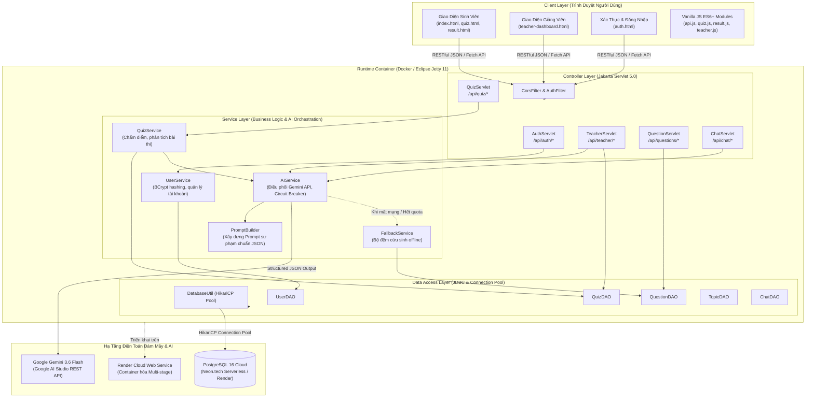

# 🎓 Hệ Thống Học Tập Thông Minh Tích Hợp AI (Intelligent LMS)

> **Đồ Án Cuối Kỳ — Môn Công Nghệ Phần Mềm (CNPM - CK)**  
> Nền tảng LMS hiện đại kết hợp Trí tuệ Nhân tạo thế hệ mới (**Google Gemini 3.6 Flash**), ứng dụng các lý thuyết sư phạm thực nghiệm: **Confidence Tagging** (Gắn nhãn độ tự tin), **Pedagogical Misconception Detection** (Chẩn đoán 4 nhóm lỗ hổng tư duy), **Adaptive Remediation Engine** (Động cơ củng cố kiến thức thích ứng) và **Teacher AI Co-Pilot Studio** (Studio trợ lý soạn đề & bài tập thông minh cho giảng viên).

---

## 🏛️ 1. Kiến Trúc Hệ Thống & Sự Liên Kết Công Nghệ (Architecture & Interconnections)

Hệ thống được thiết kế theo kiến trúc phân tầng chuẩn doanh nghiệp (**Layered Architecture / MVC - Service - DAO**), tối ưu hóa hiệu năng, tính mở rộng và khả năng phục hồi (Resilience):



---

## 🛠️ 2. Bảng Tổng Hợp Công Nghệ & Vai Trò (Tech Stack Specification)

| Thành Phần (Layer) | Công Nghệ Sử Dụng | Phiên Bản | Vai Trò & Lý Do Lựa Chọn |
|---|---|---|---|
| **Core Platform** | **Java (JDK)** | 17 LTS / 21 LTS | Nền tảng hướng đối tượng mạnh mẽ, an toàn kiểu dữ liệu, bảo mật bộ nhớ và hiệu năng xử lý cao. |
| **Web Server / Servlet Engine** | **Eclipse Jetty** | 11.0.24 | Nhẹ hơn Tomcat rất nhiều, thời gian khởi động < 2 giây, tương thích hoàn hảo với Java 17/21 và Jakarta EE 9. |
| **Servlet Specification** | **Jakarta Servlet & Filter** | 5.0.0 (`jakarta.*`) | Định tuyến RESTful API, kiểm soát phiên đăng nhập (`HttpSession`), lọc CORS và phân quyền vai trò (`AuthFilter`). |
| **Cơ Sở Dữ Liệu (Database)** | **PostgreSQL** | 16 (Neon.tech / Render) | CSDL quan hệ chuẩn ACID, lưu trữ JSON linh hoạt, điện toán Serverless trên Cloud, tự động co giãn kết nối. |
| **Connection Pooling** | **HikariCP** | 5.1.0 | Thư viện quản lý kết nối CSDL nhanh nhất thế giới Java, hạn chế quá tải tài nguyên và chống nghẽn kết nối. |
| **Trí Tuệ Nhân Tạo (Generative AI)** | **Google Gemini** | `gemini-3.6-flash` | Tốc độ suy luận tính bằng mili-giây, thông minh vượt trội, hỗ trợ sinh JSON có cấu trúc (`ResponseSchema`). |
| **Bảo Mật Mật Khẩu** | **jBCrypt** | 0.4.3 | Mã hóa mật khẩu một chiều với thuật toán Blowfish (Cost 12), chống tấn công vét cạn (Brute-force) và Rainbow table. |
| **Xử Lý JSON** | **Google Gson** | 2.10.1 | Chuyển đổi hai chiều POJO $\leftrightarrow$ JSON, cấu hình TypeAdapter cho `LocalDateTime` và định dạng UTF-8 chuẩn. |
| **Đóng Gói & Triển Khai (DevOps)** | **Docker (Multi-stage)** | Alpine Linux | Đóng gói tự động từ source code (`maven:3.9.6-alpine`) sang runtime image (`jetty:11-jre17-alpine`) siêu nhẹ (~180MB). |
| **Frontend UI / Styling** | **Vanilla JS, HTML5, CSS3, Bootstrap** | 5.3.3 | Không dùng framework nặng (React/Angular) để đảm bảo tốc độ tải trang cực nhanh (< 500ms), dễ bảo trì và mở rộng. |
| **Icons & Trực Quan Hóa** | **FontAwesome 6, SweetAlert2, Highlight.js, Marked.js, Canvas-Confetti** | Latest CDN | Hiển thị mã nguồn tô màu cú pháp chuẩn (One Dark), popup thông báo hiện đại và hiệu ứng pháo hoa củng cố thành tích. |

---

## ⚙️ 3. Nguyên Lý Hoạt Động Cốt Lõi (Core Operating Principles)

### 1. Nguyên Lý Gắn Nhãn Tự Tin (Confidence Tagging - ADR-009)
* **Vấn đề sư phạm:** Sinh viên làm trắc nghiệm thường có yếu tố may rủi (đoán mò). Nếu đoán bừa trúng đáp án đúng, các LMS truyền thống sẽ bỏ qua, khiến lỗ hổng kiến thức bị che giấu.
* **Giải pháp của hệ thống:**
  - Ở mỗi câu hỏi, sinh viên chủ động chọn: 🟢 **Chắc chắn (Certain)** hoặc 🟡 **Đoán mò (Guess)**.
  - Khi sinh viên chọn ĐÚNG nhưng với tâm thế **ĐOÁN MÒ**, thuật toán sẽ kích hoạt Gemini AI để tạo lời khuyên củng cố chuyên sâu, giải thích **tại sao đáp án đó đúng** và nguyên lý cốt lõi, giúp sinh viên thực sự làm chủ kiến thức thay vì dựa vào vận may.

### 2. Nguyên Lý Chẩn Đoán 4 Nhóm Lỗ Hổng Tư Duy (Pedagogical Misconceptions)
Hệ thống không chỉ chấm "Đúng/Sai" mà phân tích sâu bản chất nguyên nhân lỗi sai vào 4 nhóm nhận thức:
1. **`syntax_swap` (Nhầm lẫn cú pháp):** Nhầm lẫn toán tử (`==` vs `.equals()`), đặc tả ngôn ngữ, khai báo biến, thứ tự tham số.
2. **`boundary_blindness` (Mù điều kiện biên):** Bỏ quên trường hợp mảng rỗng, chỉ mục vượt quá giới hạn mảng (`IndexOutOfBounds`), kiểm tra giá trị `null` hoặc điều kiện dừng đệ quy.
3. **`mental_model_gap` (Lỗ hổng mô hình tư duy):** Hiểu sai cơ chế hướng đối tượng (OOP), đa hình, tham chiếu bộ nhớ Heap vs Stack, luồng vòng đời đối tượng.
4. **`logic_flaw` (Lỗi logic điều kiện):** Sai sót trong biểu thức Boolean phức tạp, phân nhánh `if-else` lồng nhau, điều kiện lặp vô tận.

### 3. Động Cơ Phục Hồi Kiến Thức Thích Ứng (Adaptive Remediation Engine)
* Sau khi nộp bài, mỗi câu làm sai hoặc đoán mò đều sinh ra một **Thẻ Bài Học Củng Cố Cá Nhân Hóa (AI Remedial Lesson)**.
* Sinh viên có thể nhấn nút **"Làm Bài Tập Phục Hồi"**: Hệ thống khởi tạo ngay một **Mini-Quiz 3 câu hỏi thích ứng** xoay quanh chính lỗ hổng vừa mắc phải.
* Khi hoàn thành tốt, hệ thống bắn hiệu ứng pháo hoa **Confetti** rực rỡ và cấp huy hiệu **"ĐÃ PHỤC HỒI KIẾN THỨC"**, đánh dấu sinh viên đã xóa bỏ thành công lỗ hổng tư duy đó.

### 4. Cơ Chế Bộ Đệm Dự Phòng Ngoại Tuyến (Dual Fallback & Smart FAQ Buffer - ADR-008)
* Hệ thống ứng dụng mô hình thiết kế **Circuit Breaker**:
  - `Ưu tiên 1`: Gọi **Gemini 3.6 Flash** với Structured JSON Schema.
  - `Ưu tiên 2 (Tự động chuyển tiếp)`: Nếu model 3.6 quá tải, hệ thống tự chuyển tiếp sang **Gemini 3.8 Flash**.
  - `Ưu tiên 3 (Cứu sinh ngoại tuyến)`: Nếu không có Internet hoặc hết hạn mức API, `FallbackService` tự động trích xuất các phân tích có sẵn trong CSDL và trả về ngay lập tức. **Người dùng không bao giờ gặp màn hình trắng hoặc lỗi 500!**

### 5. Studio Soạn Đề Tự Động & Trợ Lý Co-Pilot Dành Cho Giảng Viên (Teacher AI Co-Pilot)
* Giảng viên có toàn quyền:
  - Chọn chủ đề, mức độ khó (Dễ / Trung bình / Khó) và nhóm lỗ hổng tư duy mục tiêu.
  - Gemini AI tự động sinh bộ câu hỏi trắc nghiệm chuẩn sư phạm theo **Thang đo nhận thức Bloom (Bloom's Taxonomy)**.
  - Xem trước định dạng code chuẩn xác, tùy biến nội dung và **Import 1-Click** vào ngân hàng đề CSDL PostgreSQL.
  - Khung chat **AI Co-Pilot Sư Phạm** hỗ trợ giảng viên thiết kế kế hoạch bài giảng và ra đề thi phân hóa.

---

## 🔄 4. Sự Liên Kết & Luồng Dữ Liệu Thực Tế (Data Flow Walkthrough)

### 📌 Luồng 1: Sinh Viên Thi & Nhận Bài Học Thích Ứng
1. **Làm bài (`quiz.html`):** Sinh viên chọn đáp án + gắn thẻ độ tự tin (`CERTAIN` / `GUESS`). Tiến độ được `quiz.js` tự động lưu trữ phòng sự cố mất điện/reload (`Autosave LocalStorage`).
2. **Nộp bài (`POST /api/quiz/submit`):**
   - `QuizServlet` tiếp nhận danh sách đáp án, xác thực session người dùng.
   - `QuizService` lưu các câu trả lời vào bảng `user_answers` và cập nhật điểm số vào `quiz_sessions`.
   - `QuizService` lọc các câu sai hoặc đoán mò $\rightarrow$ chuyển qua `PromptBuilder` để đóng gói ngữ cảnh sư phạm $\rightarrow$ gửi đến `AIService`.
   - `AIService` gọi Gemini API bằng phương thức `generateContent` với schema JSON ép kiểu nghiêm ngặt.
   - Kết quả trả về được lưu trữ vào bảng `remedial_lessons`.
3. **Phân tích kết quả (`result.html`):** Hiển thị trực quan bảng điểm, danh sách bài học củng cố, phân tích nhận thức và nút kích hoạt Mini-Quiz phục hồi kiến thức.

### 📌 Luồng 2: Giảng Viên Soạn Đề Bằng AI Studio
1. Giảng viên mở `teacher-dashboard.html`, chọn Tab **"Trợ Lý AI Soạn Đề & Bài Tập"**.
2. Thiết lập cấu hình yêu cầu $\rightarrow$ gửi `POST /api/teacher/ai/generate`.
3. `TeacherServlet` kiểm tra phân quyền `TEACHER`/`ADMIN` $\rightarrow$ chuyển sang `AIService.generateQuestionsForTeacher(...)`.
4. Gemini AI sinh danh sách câu hỏi cấu trúc JSON gồm: nội dung Markdown, các phương án A/B/C/D, đáp án đúng, giải thích sư phạm, thẻ lỗ hổng tư duy mục tiêu.
5. Giao diện hiển thị danh sách câu hỏi trực quan $\rightarrow$ Giảng viên nhấn **"Lưu Vào Ngân Hàng Đề"** $\rightarrow$ gọi `QuestionDAO.createQuestion()` ghi thẳng vào CSDL PostgreSQL.

---

## 🚀 5. Hướng Dẫn Cài Đặt & Khởi Chạy

### Cách 1: Khởi Chạy Siêu Tốc Bằng Docker (Khuyên Dùng)

```bash
# 1. Đóng gói Docker container
docker build -t lms-ai:latest .

# 2. Khởi chạy container gắn kèm biến môi trường
docker run -d -p 8080:8080 --env-file .env --name lms-app lms-ai:latest

# 3. Mở trình duyệt truy cập:
# http://localhost:8080/auth.html
```

---

### Cách 2: Chạy Trực Tiếp Bằng Maven Wrapper (Local)

#### Bước 1: Chuẩn Bị Môi Trường
- **JDK:** Phiên bản **Java 17 LTS hoặc Java 21 LTS** (Khuyên dùng Java 17).
- Không cần cài sẵn Maven (dự án đã có sẵn `mvnw.cmd`).

#### Bước 2: Cấu Hình Biến Môi Trường (`.env`)
Tạo file `.env` từ `.env.example` với các thông số kết nối CSDL Neon.tech PostgreSQL:
```ini
# CSDL PostgreSQL Cloud (Neon.tech / Render)
DB_URL=jdbc:postgresql://ep-mute-queen-b3xtkksd-pooler.c-4.ap-southeast-1.aws.neon.tech/lms_db?sslmode=require
DB_USERNAME=lms_db_owner
DB_PASSWORD=npg_r4vyIfJa9tSX
DB_POOL_SIZE=10

# Khóa Google Gemini API (Model thế hệ mới)
GEMINI_API_KEY=your_gemini_api_key_here
GEMINI_MODEL=gemini-3.6-flash

# Cổng lắng nghe
PORT=8080
```

> 💡 **TÍNH NĂNG AUTO-MIGRATION & AUTO-SEED:**  
> Lớp `DatabaseUtil` tích hợp cơ chế tự động dò tìm cấu trúc bảng. Nếu CSDL trống, hệ thống sẽ **tự động chạy `schema.sql`** và nạp 10 câu hỏi mẫu chất lượng cao mà bạn không cần phải cấu hình thủ công!

#### Bước 3: Khởi Động Máy Chủ
```powershell
# Trên Windows:
.\mvnw.cmd jetty:run

# Trên Linux / macOS:
./mvnw jetty:run
```

Truy cập: **`http://localhost:8080/auth.html`**

---

## 🔑 6. Danh Sách Tài Khoản Thử Nghiệm

| Vai Trò | Tên Đăng Nhập | Mật Khẩu | Điểm Đến | Đặc Quyền & Tính Năng Nổi Bật |
|:---:|:---:|:---:|:---:|---|
| 👩‍🏫 **Giảng Viên** | `giangvien01` | `demo123` | **Teacher Dashboard**<br>(`teacher-dashboard.html`) | • 4 Thẻ KPI thời gian thực.<br>• Quản lý ngân hàng câu hỏi (Thêm/Sửa/Xóa, Tìm kiếm realtime, Phân trang).<br>• AI Pedagogical Insight (Thống kê 4 nhóm lỗi sai).<br>• Studio Trợ Lý AI Soạn Đề & Khung Chat Co-Pilot. |
| 👨‍🎓 **Sinh Viên** | `sinhvien01` | `demo123` | **Trang Chủ Sinh Viên**<br>(`index.html`) | • Làm bài thi trắc nghiệm + Confidence Tagging.<br>• Tự động lưu bài dở dang (Autosave).<br>• Phân tích kết quả + Bài tập thích ứng (Mini-Quiz).<br>• Trò chuyện với Trợ Giảng AI 3 nhân cách. |
| 🛡️ **Quản Trị Viên** | `admin` | `demo123` | **Teacher Dashboard** | Toàn quyền kiểm soát hệ thống và dữ liệu. |

---

## 📂 7. Cấu Trúc Mã Nguồn Dự Án (Project Structure)

```
Hệ thống học tập thông minh/
├── Dockerfile                         # Multi-stage Docker packaging (Maven Build -> Jetty 11 Runtime)
├── .dockerignore                      # Loại trừ các file rác khi build image
├── pom.xml                            # Quản lý dependency (Jetty 11, PostgreSQL, Gson, BCrypt...)
├── export_codebase.ps1                # Script tự động xuất toàn bộ mã nguồn ra FULL_CODEBASE.md
├── FULL_CODEBASE.md                   # File tổng hợp toàn bộ 47 file mã nguồn của dự án
├── PROJECT_STATE.md                   # Sổ tay ghi chép tiến độ kỹ thuật giữa các phiên
├── README.md                          # Tài liệu kiến trúc và hướng dẫn vận hành toàn diện
├── src/
│   └── main/
│       ├── java/com/lms/
│       │   ├── model/                 # POJO Models (User, Topic, Question, QuizSession, UserAnswer...)
│       │   ├── dao/                   # Data Access Objects (DatabaseUtil, UserDAO, QuizDAO, QuestionDAO...)
│       │   ├── service/               # Nghiệp vụ lõi (AIService, QuizService, UserService, PromptBuilder...)
│       │   ├── servlet/               # REST Controllers (AuthServlet, QuizServlet, TeacherServlet...)
│       │   ├── filter/                # Bộ lọc an ninh & phân quyền (CorsFilter, AuthFilter)
│       │   └── util/                  # Tiện ích bổ trợ (ConfigLoader, JsonHelper)
│       ├── resources/
│       │   └── db/schema.sql          # Kịch bản CSDL PostgreSQL (DDL, Indexes & Initial Data)
│       └── webapp/
│           ├── css/app.css            # Hệ thống CSS Design Tokens, Glassmorphism & Animations
│           ├── js/                    # Mã JavaScript hướng module (api.js, quiz.js, teacher.js...)
│           ├── auth.html              # Màn hình Đăng nhập & Đăng ký (Toggle Password Eyes)
│           ├── index.html             # Cổng thông tin môn học & chọn chủ đề ôn luyện
│           ├── quiz.html              # Màn hình thi trắc nghiệm & Gắn nhãn tự tin
│           ├── result.html            # Báo cáo kết quả & Bài tập phục hồi thích ứng
│           ├── teacher-dashboard.html # Bảng điều khiển giảng viên & AI Soạn đề Studio
│           └── history.html           # Lịch sử làm bài & theo dõi tiến bộ học tập
```

---

## 👥 8. Thông Tin Đồ Án
- **Môn học:** Công Nghệ Phần Mềm (CNPM) — Học kỳ Cuối
- **Phiên bản:** 1.0-SNAPSHOT (Production Cloud Deployed on Render)
- **Bản quyền:** Đồ Án Nhóm Phát Triển LMS Thông Minh 2026.
