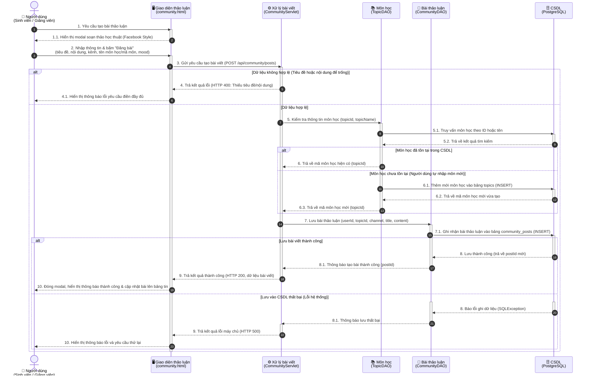
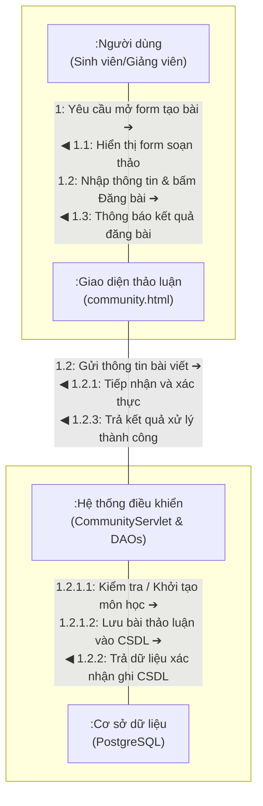
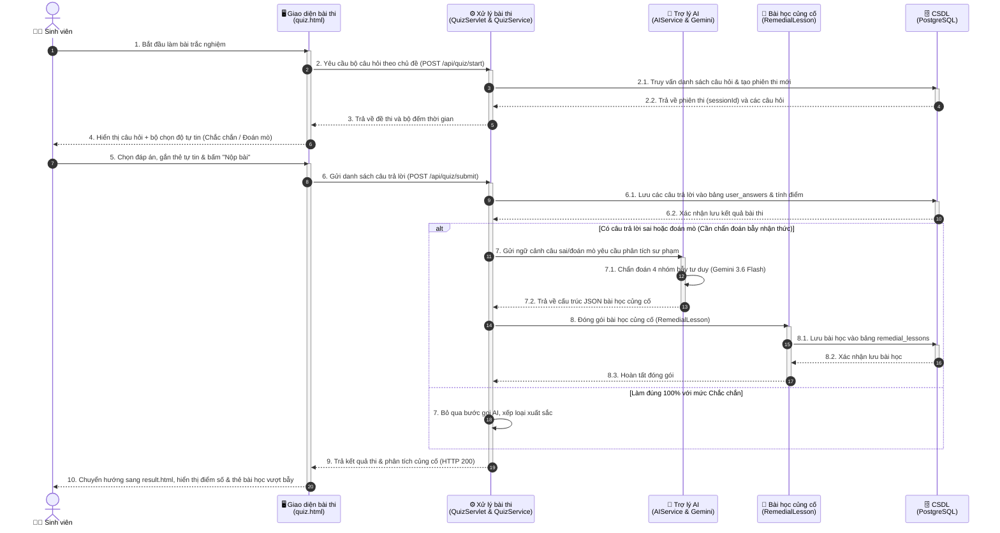
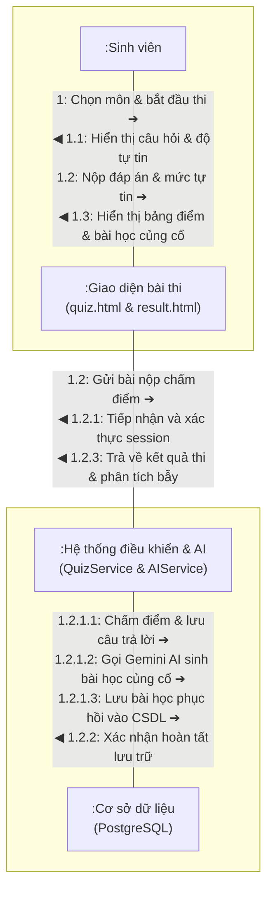
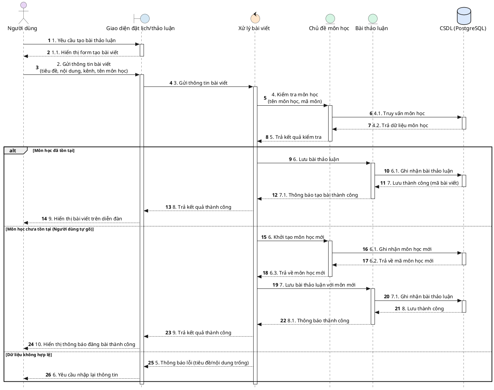
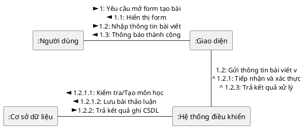

# 📐 TÀI LIỆU THIẾT KẾ HỆ THỐNG: BIỂU ĐỒ TUẦN TỰ & BIỂU ĐỒ CỘNG TÁC
> **Dự án:** Hệ Thống Học Tập Thông Minh Tích Hợp AI (Intelligent LMS)  
> **Học phần:** Công Nghệ Phần Mềm Cuối Kỳ (CNPM - CK)  
> **Quy chuẩn thiết kế:** Mô hình phân tích BCE (Boundary - Control - Entity) & UML 2.5 chuẩn hóa.

---

## 📑 MỤC LỤC
1. [Nghiệp Vụ 1: Tạo Bài Viết Thảo Luận Học Tập & Tự Động Định Danh Môn Học](#1-nghiệp-vụ-1-tạo-bài-viết-thảo-luận-học-tập--tự-động-định-danh-môn-học)
   - [1.1. Biểu đồ tuần tự (Sequence Diagram)](#11-biểu-đồ-tuần-tự---tạo-bài-viết-thảo-luận)
   - [1.2. Biểu đồ cộng tác (Collaboration Diagram)](#12-biểu-đồ-cộng-tác---tạo-bài-viết-thảo-luận)
2. [Nghiệp Vụ 2: Làm Bài Ôn Tập Trắc Nghiệm & Chẩn Đoán Bẫy Tư Duy AI](#2-nghiệp-vụ-2-làm-bài-ôn-tập-trắc-nghiệm--chẩn-đoán-bẫy-tư-duy-ai)
   - [2.1. Biểu đồ tuần tự (Sequence Diagram)](#21-biểu-đồ-tuần-tự---làm-bài-thi--chẩn-đoán-bẫy-tư-duy)
   - [2.2. Biểu đồ cộng tác (Collaboration Diagram)](#22-biểu-đồ-cộng-tác---làm-bài-thi--chẩn-đoán-bẫy-tư-duy)
3. [Mã Nguồn PlantUML Chuẩn Form Báo Cáo](#3-mã-nguồn-plantuml-chuẩn-form-báo-cáo)

---

# 1. NGHIỆP VỤ 1: TẠO BÀI VIẾT THẢO LUẬN HỌC TẬP & TỰ ĐỘNG ĐỊNH DANH MÔN HỌC

### 📌 Mô tả nghiệp vụ:
Người học (Sinh viên / Giảng viên) mở khung soạn thảo phong cách cộng đồng học thuật, nhập tiêu đề, nội dung (kèm khối code, mẹo né bẫy, trắc nghiệm mini, trích dẫn tài liệu) và chọn hoặc tự gõ tên môn học bất kỳ. Hệ thống tự động xác thực, liên kết hoặc khởi tạo môn học mới vào CSDL nếu chưa có và đăng tải bài viết lên diễn đàn.

---

## 1.1. Biểu Đồ Tuần Tự - Tạo Bài Viết Thảo Luận
*(Vẽ theo chuẩn phân tích BCE: Actor $\rightarrow$ Boundary $\rightarrow$ Control $\rightarrow$ Entity $\rightarrow$ Database)*



---

## 1.2. Biểu Đồ Cộng Tác - Tạo Bài Viết Thảo Luận
*(Thiết kế chuẩn cấu trúc 4 đỉnh liên kết với các thông điệp có hướng và số thứ tự phân cấp y hệt Form Hình 2)*

### Sơ đồ luồng cộng tác (Mermaid Graph):



### Bản vẽ ký hiệu hình học trực quan (ASCII Art Layout y hệt Form Hình 2):

```
+--------------------+        1.1: Hiển thị form (◀)        +--------------------+
|                    | <----------------------------------  |                    |
|    :Người dùng     |                                      |     :Giao diện     |
| (Sinh viên/G.Viên) |  --------------------------------->  |  (community.html)  |
|                    |     1: Yêu cầu mở form tạo bài (➔)    |                    |
+--------------------+   1.2: Nhập thông tin bài viết (➔)   +--------------------+
                                1.3: Thông báo thành công (◀)          |         ▲
                                                                       |         |
                                         1.2: Gửi thông tin bài viết (▼)         | 1.2.1: Tiếp nhận & kiểm tra (▲)
                                                                       |         | 1.2.3: Trả kết quả xử lý (▲)
                                                                       ▼         |
+--------------------+    1.2.1.1: Kiểm tra/Tạo môn học (◀) +--------------------+
|                    | <----------------------------------  |                    |
|   :Cơ sở dữ liệu   |    1.2.1.2: Lưu bài thảo luận (◀)    | :Hệ thống điều khiển|
|    (PostgreSQL)    |                                      | (CommunityServlet  |
|                    |  --------------------------------->  |  TopicDAO, PostDAO)|
+--------------------+   1.2.2: Trả kết quả ghi CSDL (➔)    +--------------------+
```

---

# 2. NGHIỆP VỤ 2: LÀM BÀI ÔN TẬP TRẮC NGHIỆP & CHẨN ĐOÁN BẪY TƯ DUY AI

### 📌 Mô tả nghiệp vụ:
Sinh viên chọn bài ôn tập, trả lời các câu hỏi và gắn nhãn mức độ tự tin (`CERTAIN` / `GUESS`). Khi nộp bài, hệ thống chấm điểm, lưu lịch sử và kích hoạt Google Gemini AI chẩn đoán 4 nhóm lỗ hổng nhận thức (`syntax_swap`, `boundary_blindness`, `mental_model_gap`, `logic_flaw`), sau đó sinh bài học phục hồi kiến thức thích ứng.

---

## 2.1. Biểu Đồ Tuần Tự - Làm Bài Thi & Chẩn Đoán Bẫy Tư Duy
*(Vẽ theo chuẩn phân tích BCE + AI Engine)*



---

## 2.2. Biểu Đồ Cộng Tác - Làm Bài Thi & Chẩn Đoán Bẫy Tư Duy

### Sơ đồ luồng cộng tác (Mermaid Graph):



### Bản vẽ ký hiệu hình học trực quan (ASCII Art Layout):

```
+--------------------+  1.1: Hiển thị đề thi & chọn tự tin (◀)  +--------------------+
|                    | <---------------------------------------  |                    |
|    :Sinh viên      |                                           |     :Giao diện     |
|                    |  -------------------------------------->  | (quiz.html/result) |
|                    |    1: Chọn đề thi & bắt đầu làm bài (➔)   |                    |
+--------------------+    1.2: Nộp bài & mức độ tự tin (➔)       +--------------------+
                               1.3: Hiển thị điểm & bài học AI (◀)         |         ▲
                                                                           |         |
                                             1.2: Gửi danh sách đáp án (▼) |         | 1.2.1: Chấm điểm bài nộp (▲)
                                                                           |         | 1.2.3: Trả kết quả & bài học (▲)
                                                                           ▼         |
+--------------------+    1.2.1.1: Ghi nhận user_answers (◀)     +--------------------+
|                    | <---------------------------------------  |                    |
|   :Cơ sở dữ liệu   |    1.2.1.2: Gọi AI phân tích bẫy tư duy   | :Hệ thống điều khiển|
|    (PostgreSQL)    |    1.2.1.3: Ghi nhận remedial_lessons (◀) |   & Trợ lý AI      |
|                    |  -------------------------------------->  | (QuizService,      |
+--------------------+    1.2.2: Xác nhận lưu trữ hoàn tất (➔)   |  AIService, Gemini)|
                                                                 +--------------------+
```

---

# 3. MÃ NGUỒN PLANTUML CHUẨN FORM BÁO CÁO

> 💡 **Hướng dẫn sử dụng:** Bạn có thể copy trực tiếp đoạn mã dưới đây vào trang [PlantText](https://www.planttext.com/) hoặc công cụ Visual Studio Code / StarUML để xuất ra file ảnh PNG / PDF chất lượng cao có đầy đủ các biểu tượng BCE đặc trưng (Actor, Boundary, Control, Entity, Database).

### 3.1. PlantUML - Biểu Đồ Tuần Tự Tạo Bài Thảo Luận:


### 3.2. PlantUML - Biểu Đồ Cộng Tác Tạo Bài Thảo Luận:

